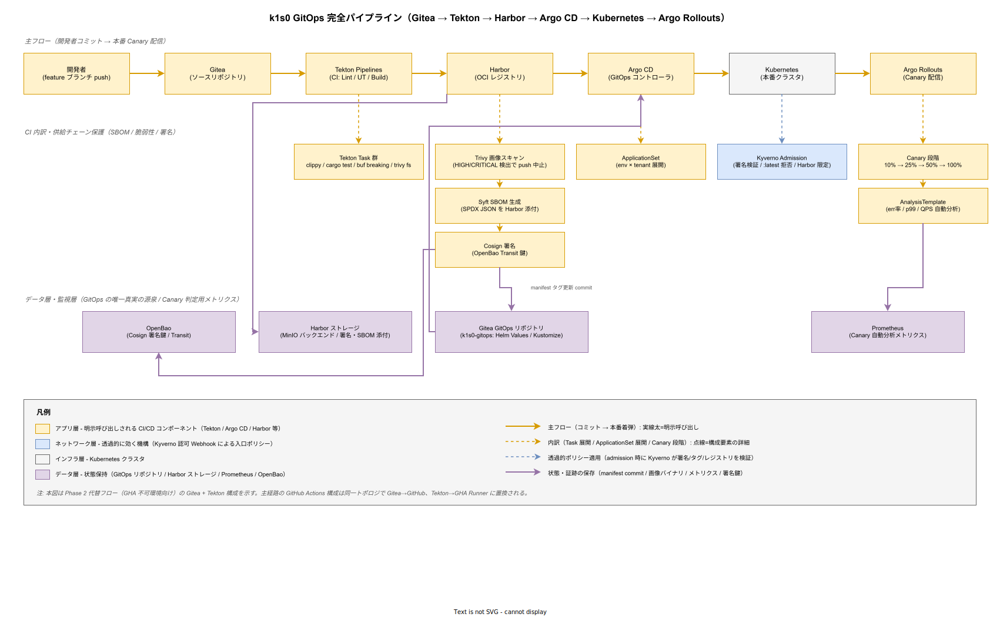

# 01. CI/CD 方式

本ファイルは k1s0 の CI（Continuous Integration）と CD（Continuous Delivery）の構成方式を定める。対象は GitHub Actions（self-hosted runner）での PR / main ビルド、コンテナビルドと脆弱性スキャン、Harbor レジストリ運用、Argo CD による GitOps デリバリ、Argo Rollouts による Canary 配布（Phase 2）、Cosign 署名検証（Phase 2）、Renovate による依存更新の 7 領域である。

## 本ファイルの位置付け

開発者体験の中心に CI/CD がある。CI/CD が遅い・壊れやすい・属人的である状態では、10 分ルール（Golden Path DX-GP-003）も DORA Four Keys も達成できない。逆に、CI/CD が予測可能で高速で自動化されていれば、開発者はビジネスロジックに集中でき、運用チームはリリース判断を機械化できる。

本設計は構想設計 ADR-CICD-001（GitHub Actions + self-hosted runner 採用）、ADR-CICD-002（Argo CD GitOps 採用）、ADR-CICD-003（Harbor + Trivy による脆弱性管理）を前提として、PR 5 分 / main 10 分のパイプライン時間予算を確実に守る設計に落とす。対応要件は DX-CICD-001〜006、NFR-SEC-004（イメージ署名）、NFR-SUP-003（サプライチェーン）、DX-MET-001（Lead Time 目標 1h 以内）である。

## 全体構造

CI/CD は以下の流れで組み立てる。開発者が feature ブランチへコミット → PR を main 向けに作成 → GitHub Actions が PR パイプラインを実行 → レビュー承認 + CI 緑で main へマージ → main パイプラインがビルド・スキャン・レジストリ push・GitOps マニフェスト更新 → Argo CD がマニフェスト差分を検知 → Kubernetes へ反映 → Argo Rollouts が Canary 戦略で段階配布、の 7 ステップである。

アーキテクチャ上重要なのは「ビルド成果物（イメージ + 署名）は Harbor が唯一の真実の源泉、デプロイ定義（Kubernetes マニフェスト + Helm Values）は Git が唯一の真実の源泉」という役割分離である。GitOps では Kubernetes クラスタ上の実態と Git の記述が乖離した場合、Git を優先するルールとし、緊急時でも kubectl 直接操作は原則禁止する。

Self-hosted runner は Kubernetes の Pod として動作させる。GitHub Actions の runner コントローラ（actions-runner-controller）を導入し、PR が発生したら Pod を動的に起動し、ジョブ完了で破棄する。これによりジョブ間の状態汚染が構造的に発生しない。runner Pod のコンテナイメージには Kaniko（Dockerless ビルド）、Trivy（FS / image スキャン）、crane（レジストリ操作）、argocd CLI（同期トリガ）、buf CLI（Protobuf 検査）、cosign（Phase 2 署名）を同梱する。

### GitOps 完全パイプラインの俯瞰

以下の図は k1s0 の GitOps パイプラインを、ソース → CI → レジストリ → GitOps → ランタイムの 5 段階で俯瞰したものである。主経路（橙の太実線）は開発者コミットが本番 Canary 着弾に至るまでの必須経路を示し、この経路のどの段階が詰まっても Lead Time 1 時間予算（DX-MET-001）が破綻するため、各ノードの時間予算と責務を設計で固定している。ソースリポジトリと CI エンジンは Phase 1a〜1c の GHA を主経路とし、GHA 到達不可の顧客環境向けに Gitea + Tekton Pipelines を代替として Phase 2 以降で提供する（ADR-CICD-001 / 構想設計 04_CICDと配信）。本図は代替フロー側の構成要素名で統一して描画しているが、トポロジと役割分担は GHA 経路と同一である。

供給チェーン保護層（Trivy 画像スキャン / Syft SBOM 生成 / Cosign 署名）は Harbor の下にぶら下がる形で配置しており、これらは単なるログ出力ではなく「CRITICAL 検出で push 中止」「署名なしイメージは Kyverno が admission 段階で拒否」という硬性ゲートとして機能する。cosign の署名鍵は OpenBao Transit エンジンに保護され、CI runner は短期トークンで署名権限を取得する。GitOps リポジトリが「デプロイ定義の唯一真実の源泉」、Harbor が「ビルド成果物の唯一真実の源泉」という 2 点への真実の集約が、本パイプラインの核心設計である。

Canary 配信層では Argo Rollouts が 10% → 25% → 50% → 100% の 4 段階で段階的にトラフィックを切り替え、各段階で AnalysisTemplate が Prometheus メトリクス（エラー率 / p99 レイテンシ / QPS）を自動判定する。分析失敗時は旧版 100% へ自動ロールバックし、人手介入を必要としない。Kyverno 入口ポリシー（ネットワーク層）はアプリ層のツール（Argo CD / Argo Rollouts）が透過的に依存する機構であり、アプリ層が誤って非署名・:latest タグ・非 Harbor レジストリを持ち込んでもクラスタ境界で拒否される多重防御を構成する。

## PR パイプライン（5 分以内）

PR 時に実行するジョブは以下 5 種類とし、並列化で 5 分以内に収める。Lint、Unit Test、Protobuf Breaking Check、統合テスト（testcontainers）、FS スキャン（Trivy）である。

Lint は言語別に実行する。Rust は `cargo clippy --all-targets -- -D warnings`（警告をエラー扱い）、Go は `golangci-lint run --timeout=2m`、TypeScript は `eslint . --max-warnings=0`、Helm チャートは `helm lint` と `kubeconform` による Kubernetes スキーマ検証。合計所要時間は並列実行で 60 秒以内を目標とする。

Unit Test は `cargo test --all-features`（Rust）、`go test -race -cover ./...`（Go、Race Detector ON）、`pnpm test -- --coverage`（TypeScript）を並列実行する。カバレッジ閾値は 80%（宣言的閾値設定）とし、下回るとジョブ失敗する。カバレッジレポートは Codecov 相当の自己ホスト UI（Phase 1c 以降は Backstage プラグイン）で集約する。

Protobuf Breaking Check は `buf breaking --against '.git#branch=main'` で main との breaking 差分を検出する。tier1 内部の .proto ファイル変更で後方互換を壊した場合に CI を失敗させ、安易な破壊変更を構造的に防止する。詳細は [../20_ソフトウェア方式設計/03_内部インタフェース方式設計/01_Protobuf契約管理方式.md](../20_ソフトウェア方式設計/03_内部インタフェース方式設計/01_Protobuf契約管理方式.md) で定義する。

統合テストは testcontainers で Valkey / Kafka / PostgreSQL / OpenBao の実コンテナを起動し、tier1 API の主要シナリオを E2E で通す。並列実行で 3 分以内を目標とする。テストの詳細は [05_テスト戦略方式.md](05_テスト戦略方式.md) で定義する。

FS スキャンは `trivy fs --severity HIGH,CRITICAL --exit-code 1 .` でソースコードリポジトリ内の依存関係ファイル（go.mod / Cargo.lock / package-lock.json）を静的解析する。CRITICAL 検出で CI 失敗、HIGH 検出で警告を PR コメントに残す。これによりマージ前に脆弱な依存を検出する。

## main パイプライン（10 分以内）

main にマージされた時点で実行するパイプラインは以下の 6 ジョブで構成し、逐次または並列化して 10 分以内に収める。コンテナビルド（Kaniko）、イメージスキャン（Trivy）、Harbor push、SBOM 生成（Syft）、マニフェスト更新（GitOps リポジトリ）、Argo CD 同期トリガ、である。

コンテナビルドは Kaniko で実行する。Kaniko は Docker デーモンを必要とせず、Kubernetes Pod 内で安全にビルドできる。ビルドキャッシュはレジストリ上のキャッシュリポジトリ（`harbor.k1s0.internal/cache/<service>`）に保存し、レイヤ再利用で平均ビルド時間を 5 分から 2 分に短縮する。Multi-stage Dockerfile を原則とし、最終イメージは distroless 系ベースで最小化する。

イメージスキャンは `trivy image --severity HIGH,CRITICAL --exit-code 1 <image>` で実行する。CRITICAL 検出で push を中止し、HIGH 検出で Slack / Teams へ警告を飛ばしつつ push は通す。脆弱性ベースは Trivy 内蔵の NVD / GitHub Advisory / Red Hat Security Advisories を使う。閉域運用のため、脆弱性 DB の更新はミラーリポジトリ経由で日次同期する。

SBOM 生成は `syft <image> -o spdx-json` で SPDX 形式の SBOM を生成し、Harbor にアーティファクトとして添付する。サプライチェーン攻撃が発生した際の影響範囲特定（どのイメージに問題の依存が含まれるか）を即座に行うためである。四半期ごとに全 SBOM を集約し、ライセンスレポートを出力する（詳細は [../75_事業運用方式設計/07_OSSライセンス運用方式.md](../75_事業運用方式設計/07_OSSライセンス運用方式.md)）。

マニフェスト更新は GitOps リポジトリ（`k1s0-gitops`）のイメージタグを新ビルドに書き換える PR を自動作成する。dev 環境は自動マージ、staging / prod は手動レビューを必須とする。書き換え対象は Helm Values の `image.tag` または Kustomize の `images.newTag` で、Renovate 相当の専用ボット（k1s0-bot）が PR 本文に変更差分・Trivy レポート・SBOM 差分を貼る。

## Argo CD 構成

Argo CD は GitOps の実行エンジンとして配置する。構成は以下の通りとする。Argo CD Server + Repo Server + Application Controller の 3 種類を Kubernetes クラスタに常駐させ、GitOps リポジトリを監視する。同期間隔は 3 分間隔のポーリング + Webhook トリガ（プッシュ即時）とする。

ApplicationSet CRD を使い、環境（dev / staging / prod）× テナント（tenant-a / tenant-b / ...）の組み合わせで Application オブジェクトを自動生成する。Git リポジトリ内のディレクトリ構造は `envs/<env>/<tenant>/<service>/` とし、ApplicationSet のジェネレータが全組み合わせを展開する。これにより手動で Application を書く作業が不要になり、新規テナント追加も Git コミット 1 本で完結する。

Sync Wave による依存制御で、Namespace → ConfigMap / Secret → Deployment → Service → Ingress の順で段階的に同期する。Sync Wave の数値は `argocd.argoproj.io/sync-wave: <数値>` アノテーションで指定し、依存を壊さない順序で反映する。Sync Policy は dev 環境で `automated: { prune: true, selfHeal: true }`、staging / prod では `automated: null`（手動同期）とする。本番への不意の変更流入を防ぐ意図である。

## Argo Rollouts（Phase 2）

Phase 1a〜1c は Deployment による全 Pod 一斉置換だが、Phase 2 から Argo Rollouts の Canary 戦略を導入する。Canary は 10% → 25% → 50% → 100% の 4 段階で、各段階で 5 分の待機と自動分析（Prometheus メトリクス）を挟む。分析失敗時は自動ロールバックする。

Canary 分析の指標は以下 3 種類とする。第 1 にエラー率（5xx 応答率 < 0.1%）、第 2 に p99 レイテンシ（ベースラインから 20% 増以内）、第 3 にリクエスト量（ベースラインの 80% 以上、ヘルスチェック代替）、である。指標は Prometheus からクエリし、AnalysisTemplate CRD で定義する。3 指標のいずれかが閾値超過で Canary を中断し、旧版 100% に戻す。

Canary 中の業務トラフィック分割は Istio Ambient の TrafficSplit で実施する（Phase 2 から Istio Ambient 採用）。詳細は [../20_ソフトウェア方式設計/01_コンポーネント方式設計/05_サービスメッシュ方式.md](../20_ソフトウェア方式設計/01_コンポーネント方式設計/05_サービスメッシュ方式.md) で定義する。

## 品質ゲートと署名検証

レジストリへの push とクラスタへの pull の両面で品質ゲートを設ける。Harbor 側では Project レベルの設定で「Severity CRITICAL のイメージは pull を拒否する」を有効化する（Phase 1c）。これによりスキャン漏れのイメージが本番へ流れない。Harbor プロジェクトは tier1 / tier2 / tier3 の 3 階層で切り分け、それぞれ別の CRITICAL 閾値（tier1 は 0 件、tier2 は 0 件、tier3 は 3 件まで許容）とする。

Kubernetes 側では Kyverno の ClusterPolicy で 3 種類のルールを強制する。第 1 に「`harbor.k1s0.internal` 以外のレジストリからの pull を拒否」（外部レジストリ経由の攻撃防止）、第 2 に「`:latest` タグの使用を拒否」（タグ不動性の確保）、第 3 に「Cosign 署名付きイメージのみ pull 許可」（Phase 2、サプライチェーン攻撃防止）、である。Kyverno ポリシーの詳細は [../50_非機能方式設計/05_セキュリティ方式設計.md](../50_非機能方式設計/05_セキュリティ方式設計.md) で扱う。

Cosign 署名は Phase 2 で導入する。main パイプラインの Harbor push 後に `cosign sign --key=<openbao-ref> <image>` で署名し、Kubernetes 側で `cosign verify --key=<public-key> <image>` を Kyverno が pull 時に強制する。署名鍵は OpenBao Transit エンジンで保護し、CI の runner Pod は短期トークンで OpenBao から署名権限を取得する。詳細は [../50_非機能方式設計/05_セキュリティ方式設計.md](../50_非機能方式設計/05_セキュリティ方式設計.md) を参照する。

## Renovate による依存更新

依存関係の陳腐化はセキュリティと開発者体験の両面で悪影響を及ぼす。Renovate を自己ホストで常駐させ、以下のルールで自動化する。対象ファイルは go.mod / Cargo.toml / NuGet .csproj / package.json / Dockerfile FROM 行 / Helm Chart.yaml / Kubernetes マニフェストの image タグ、の 7 種類である。

更新頻度は週次（月曜朝）とし、PR は以下の分類で自動マージ可否を決める。patch バージョンアップ（semver の第 3 桁）は CI 緑で自動マージ、minor バージョンアップは PR 作成のみで人間レビュー必須、major バージョンアップは PR 作成 + アーキテクトレビュー必須、とする。Renovate の設定は `renovate.json` で宣言し、Git 管理する。

脆弱性対応の緊急 PR は Renovate の `vulnerabilityAlerts` で、patch / minor / major を問わず即時 PR を作成する。脆弱性 PR は Slack / Teams の `#security` チャンネルへ通知し、24 時間以内の対処を SLO とする（NFR-SEC-007）。

## パイプライン時間予算

全パイプラインの時間予算を以下で固定し、予算超過は CI の改善課題として扱う。

| パイプライン | 目標 | 限界 | 超過時の対応 |
| --- | --- | --- | --- |
| PR（Lint/UT/Breaking/Integration/FS スキャン） | 5 分 | 7 分 | キャッシュ/並列化見直し |
| main（Build/Image スキャン/Push/SBOM/Manifest/Sync） | 10 分 | 15 分 | Kaniko キャッシュ・runner 増設 |
| Argo CD 同期 | 3 分 | 5 分 | Sync Wave 見直し |
| Argo Rollouts Canary（Phase 2） | 30 分 | 45 分 | 分析指標の閾値見直し |
| GitOps total（commit → prod 着） | 60 分 | 90 分 | 段階別所要時間の計測 |

Lead Time 目標 1 時間（DX-MET-001）はこのパイプライン時間予算と、人間のレビュー時間（平均 15 分）の合計で達成する。PR 5 分 + レビュー 15 分 + main 10 分 + Argo CD 3 分 + Rollouts 30 分 = 63 分、予算超過 3 分は Phase 2 で Canary 戦略を短縮して吸収する。

## 設計 ID 一覧

| 設計 ID | 設計項目 | 確定フェーズ | 対応要件 |
| --- | --- | --- | --- |
| DS-DEVX-CICD-001 | GitHub Actions self-hosted runner 方式 | Phase 1a | DX-CICD-001 |
| DS-DEVX-CICD-002 | PR パイプライン 5 ジョブ（5 分以内） | Phase 1a | DX-CICD-002 |
| DS-DEVX-CICD-003 | main パイプライン 6 ジョブ（10 分以内） | Phase 1a | DX-CICD-002 |
| DS-DEVX-CICD-004 | Argo CD + ApplicationSet 構成 | Phase 1a | DX-CICD-003 |
| DS-DEVX-CICD-005 | Argo Rollouts Canary 戦略（Phase 2） | Phase 2 | DX-CICD-004 |
| DS-DEVX-CICD-006 | Harbor + Trivy 品質ゲート | Phase 1b | DX-CICD-005 / NFR-SEC-004 |
| DS-DEVX-CICD-007 | Kyverno イメージポリシー | Phase 1c | NFR-SEC-004 |
| DS-DEVX-CICD-008 | Cosign 署名検証（Phase 2） | Phase 2 | NFR-SUP-003 |
| DS-DEVX-CICD-009 | SBOM（Syft）生成とライセンスレポート | Phase 1b | NFR-SUP-003 |
| DS-DEVX-CICD-010 | Renovate 週次依存更新 | Phase 1b | DX-CICD-006 |
| DS-DEVX-CICD-011 | パイプライン時間予算 5/10/30 分 | Phase 1a | DX-MET-001 |

## 対応要件一覧

本ファイルは要件定義書 50_開発者体験 DX-CICD-001〜006（CI/CD 基本要件）と DX-MET-001（Lead Time 目標）に直接対応する。30_非機能要件 NFR-SEC-004（イメージ署名）、NFR-SUP-003（サプライチェーン）、NFR-SEC-007（脆弱性対応 SLO）とも連動する。構想設計 ADR-CICD-001〜003（GitHub Actions / Argo CD / Harbor 採用）を前提とする。Golden Path 10 分ルール DX-GP-003 の実現基盤として位置付けられ、ゴールデンパスの CI 初回 3 分の内訳は本ファイルの PR パイプライン時間予算を根拠としている。
