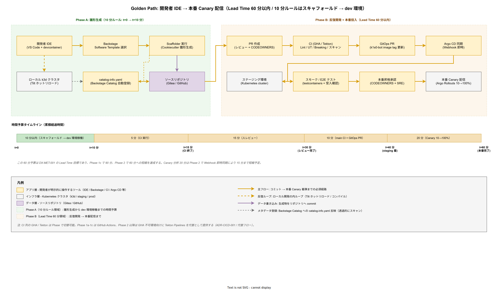

# 06. ゴールデンパス方式

本ファイルは k1s0 の最重要企画コミットである「Golden Path 10 分ルール」（DX-GP-003）の具体設計を定める。対象は 10 分以内の時間予算内訳、標準テンプレート 5 種類、雛形生成物の構成、逸脱防止（非標準テンプレート利用の抑制）、テンプレート進化（後方互換と migrate コマンド）、の 5 領域である。

## 本ファイルの位置付け

Golden Path とは「開発者が標準に従えば最短・最安全・最品質で目的に到達できる道」を指す。k1s0 では企画書で「Backstage Template 実行から本番稼働まで 10 分以内」を約束しており、この 10 分の達成が採用検討通過時の主要アピールである。この数値を設計として機械的に担保することが本ファイルの使命である。

10 分ルールが守られることは、単なる時間短縮以上の意味を持つ。第 1 に、開発者が標準テンプレート以外を選ぶ動機（「自作の方が楽」）を構造的に消せる。第 2 に、tier1 の横断的関心事（認証・監査・ログ・暗号）が雛形に組み込まれ、誤った実装の余地が減る。第 3 に、オンボーディングが短縮され、新規協力者のキャッチアップ 2 週間目標（企画書の「バス係数 2」）が現実化する。

本設計は構想設計 ADR-BS-001（Backstage 採用）と ADR-CICD-002（Argo CD GitOps）を前提として、10 分の内訳を step 別に配分し、各 step の時間予算を守る設計を個別具体化する。対応要件は DX-GP-001〜006、DX-BS-003（Software Templates）、DX-CICD-001〜004、DX-LD-001〜007 である。

### IDE から本番 Canary 着弾までの全景

以下の図は Golden Path の全景を、開発者 IDE からの着手から本番 Canary 着弾までの 2 段階構造で俯瞰したものである。左側（緑帯）が 10 分ルール領域（DX-GP-003）であり、Backstage での雛形選択 → Scaffolder 生成 → ソースリポジトリ commit → ローカル k3d での動作確認 → Backstage Catalog への自動登録までが 10 分の時間予算に収まる。右側（橙帯）は Lead Time 60 分領域（DX-MET-001）であり、PR 作成 → CI → GitOps PR → Argo CD 同期 → ステージング → スモークテスト → 本番昇格承認 → Canary 配信までが 60 分の累積予算で進む。この 2 つの時間ルールは独立した指標でありながら Golden Path 上で連続した 1 本の経路を構成し、どちらかが破綻すれば開発者体験の約束全体が崩れる関係性にある。

10 分ルール領域では「開発者 IDE は Backstage Template 選択から離れずに済む」「Scaffolder が生成した雛形は Gitea / GitHub にそのまま push され Tilt で k3d に即 bring up できる」「catalog-info.yaml が自動生成されることで Backstage Catalog への登録が手動作業にならない」の 3 点が時間予算を守る構造的仕掛けである。Catalog 未登録サービスは 採用後の運用拡大時 の Kyverno ポリシーで本番デプロイが拒否される（DX-GP-005）ため、この段階でのメタデータ登録漏れは後工程で必ず検出される二重網も効いている。

Lead Time 60 分領域はさらに t=15 分（CI 終了）・t=30 分（レビュー完了）・t=40 分（staging 着弾）・t=60 分（本番完了）の 4 つの中間マイルストーンに分解されている。CI 5 分 + 人間レビュー 15 分 + main CI 10 分 + Canary 配信 20 分 + 承認オーバヘッド 10 分の配分で、リリース時点 では 90 分、採用後の運用拡大時 で 60 分への段階的短縮を計画する。Canary 20 分は 採用後の運用拡大時 で Argo CD の Webhook 即時同期と Sync Wave 最適化により 15 分に短縮する余地を残す。

## 10 分の時間予算配分

10 分を 7 step に配分し、各 step の時間予算を以下で固定する。

| Step | 内容 | 時間予算 | 技術的実現 |
| --- | --- | --- | --- |
| 1 | Backstage でテンプレート選択 | 30 秒 | Backstage UI 検索 + 一覧表示 |
| 2 | 雛形パラメータ入力 + 生成 | 1 分 | Backstage Scaffolder + Cookiecutter |
| 3 | GitHub リポジトリ作成 + 初期 push | 30 秒 | Backstage GitHub Integration |
| 4 | CI 初回ビルド（Lint + UT + Build） | 3 分 | GitHub Actions self-hosted runner |
| 5 | GitOps リポジトリ PR + 自動マージ | 1 分 | Renovate 相当の k1s0-bot |
| 6 | Argo CD 同期 + dev 環境デプロイ | 2 分 | Argo CD ApplicationSet |
| 7 | 動作確認（ヘルスチェック + サンプル API） | 2 分 | 自動ヘルスチェック + UI ガイド |
| **合計** |  | **10 分** |  |

各 step の時間予算は経験則でなく技術的根拠を持つ。Step 4 の 3 分は [01_CI_CD方式.md](01_CI_CD方式.md) の PR パイプライン 5 分予算のうち、雛形の最小構成（UT + Build のみ、結合テストなし）で 3 分に収まる水準である。Step 6 の 2 分は Argo CD のポーリング間隔（3 分）より短いため、Webhook トリガで即時同期を起こす必要がある。

この予算配分は リリース時点 で計測・固定し、採用後の運用拡大時 で Canary 戦略の追加による予算超過を避けるため Step 6 を 1 分に短縮（Webhook + Sync Wave 最適化）する計画である。

## 標準テンプレート 5 種類

k1s0 で提供する標準テンプレートは以下 5 種類とする。各テンプレートの対象業務・技術スタック・雛形生成物を明確化し、開発者の選択肢を絞る。

第 1 は tier2 Microservice Go テンプレートである。新規業務サービスの開発を対象とし、Go + Dapr Go SDK + gRPC + PostgreSQL の構成で生成する。tier1 の 11 API を呼び出す SDK クライアントをサンプルコードとして埋め込む。

第 2 は tier2 Microservice C# テンプレートである。既存 .NET Framework 資産を持つチーム向けに .NET 8 で提供する。Dapr .NET SDK + gRPC + Entity Framework Core の構成とし、ClickOnce / MSIX による tier3 配信との連携サンプルを含む。

第 3 は tier3 Web SPA React テンプレートである。業務画面の開発を対象とし、React + Vite + TypeScript + k1s0 SDK for JavaScript（リリース時点 で整備）の構成とする。Keycloak 認証のセットアップ済み、tier1 API の型定義済みである。

第 4 は tier3 Native MAUI テンプレートである。既存 Windows Forms / WPF のネイティブ業務アプリを .NET MAUI で再実装する向きに提供する。MSIX 配信 + k1s0 SDK for .NET の構成とする。

第 5 はバッチジョブテンプレートである。定期バッチ / データ処理を対象とし、Go + k1s0 Workflow API + Kubernetes CronJob の構成とする。Temporal Workflow（採用後の運用拡大時）への移行パスも雛形に用意する。

各テンプレートには以下の共通生成物が含まれる。

1. GitHub リポジトリ（ブランチ保護設定済み）
2. `.github/workflows/ci.yaml`（CI 定義、PR 時 5 分 / main 時 10 分予算）
3. `Dockerfile`（Multi-stage、distroless ベース）
4. `Tiltfile`（ローカル開発用）
5. `deploy/` 配下の Helm Chart + Kubernetes マニフェスト
6. tier1 SDK 呼び出し雛形コード
7. `catalog-info.yaml`（Backstage Catalog 登録）
8. `docs/` 配下の 5 種類雛形（index / api / runbook / adr / getting-started）
9. `.devcontainer/` 設定（VS Code Remote Container）
10. `.gitignore` / `.editorconfig` / `LICENSE`（Apache-2.0）

## 雛形生成物の設計原則

雛形は「そのまま動く最小 + 拡張可能な構造」の 2 条件を満たす設計とする。開発者が雛形生成後に 1 行もコードを書かずにビルド・デプロイ・動作確認まで到達できる「Hello, World 完走」が必須である。同時に、業務ロジックを後から追加した時点で既存の tier1 SDK 呼び出し層・観測層・認証層を壊さない構造とする。

雛形に含める tier1 SDK 呼び出しサンプルは以下を標準とする。Service Invoke（他サービス呼び出し 1 箇所）、State（Get/Set 1 箇所ずつ）、PubSub（Publish + Subscribe 1 トピック）、Secrets（取得 1 箇所）、Log / Telemetry / Audit（横断的に自動埋め込み）の 6 種類である。残り 5 API（Binding / Workflow / Decision / Audit-Pii / Feature）はコメントアウトで配置し、必要時に有効化する。

サンプル業務は「Echo API」（ユーザから受け取った文字列を PubSub 経由でエコーバック）で統一する。この単純シナリオは 10 分ルールの動作確認（Step 7）で 1 分以内に疎通確認できる。開発者はこのエコーを自身の業務ロジックに置き換えることで開発を始められる。

## 逸脱防止の仕組み

Golden Path は「推奨」でなく「標準」として機能させるため、逸脱を抑制する仕組みを設計に組み込む。硬性（禁止）と軟性（勧告）の 2 段階で運用する。

硬性（禁止）側の仕組みは以下の通りとする。第 1 に、Kyverno ポリシーで「Backstage Catalog に登録されていないサービスの Kubernetes デプロイを拒否」する（採用後の運用拡大時）。第 2 に、`harbor.k1s0.internal` 以外のレジストリからの pull を拒否する。第 3 に、Kubernetes Namespace の作成を Platform チームのみに制限する。これらは開発者がテンプレートを使わず独自構成で立ち上げる経路を技術的に閉鎖する。

軟性（勧告）側の仕組みは以下の通りとする。第 1 に、非標準テンプレートを選ぶ場合は PR に「非標準選択の理由」を記述し、アーキテクトのレビュー承認を得る（GitHub CODEOWNERS）。第 2 に、月次 Product Council で非標準採用数をレポートし、過度な増加があれば標準テンプレートに機能追加する。第 3 に、DORA 4 指標を非標準採用サービスで別集計し、標準採用サービスとのパフォーマンス差を可視化する。

逸脱そのものを禁じない理由は、標準が新業務パターンに追従できない時期があるためである。非標準の試行を許容しつつ、試行の成果が一定の成熟度に達したら標準テンプレートに昇格させる「標準進化サイクル」を四半期ペースで回す。

## テンプレート進化と後方互換

テンプレートは固定でなく、四半期ごとに更新する。更新の種類は以下 3 パターンとする。

第 1 はマイナー更新で、依存ライブラリのバージョンアップ、ドキュメント改善、CI 設定の改良など。既存リポジトリへの影響なしで、新規作成リポジトリのみに適用する。

第 2 は互換拡張で、新しい tier1 API の呼び出し雛形追加、新しい観測指標の追加など。既存リポジトリには `k1s0 migrate` コマンドで差分適用する選択肢を提供する。

第 3 はメジャー更新で、言語バージョン（Go 1.22 → 1.23）、主要フレームワーク（React 18 → 19）の更新など。既存リポジトリへの適用は `k1s0 migrate --major` で対話的に差分を示し、開発者が採用可否を判断する。

`k1s0 migrate` コマンドは `cookiecutter-rewrite` 相当のツールで、雛形の差分を既存リポジトリに安全に適用する。適用は Git の新ブランチに行い、PR として作成する。開発者は差分をレビューしてマージするかどうかを選べる。この設計により「雛形の更新が既存サービスを壊さない」保証を構造的に持つ。

雛形の後方互換は原則 2 四半期（6 か月）維持する。3 四半期目に deprecated マークを表示し、4 四半期目に削除する。deprecated マークは Backstage のテンプレート一覧で警告表示され、非推奨テンプレートの新規採用を抑制する。

## 10 分ルールの計測

10 分ルールの達成は四半期ごとに計測する。計測方法は以下の通りとする。Platform チームのメンバーが標準テンプレート 5 種類それぞれについて、新規リポジトリ作成 → 動作確認までの経過時間を計測し、平均値を算出する。計測は本番と同一構成の dev 環境で実施する。

10 分超過が発生したテンプレート・step は改善タスクとして次四半期までに対処する。改善タスクの優先順位は「超過時間 × 年間採用回数」で算出し、影響の大きい項目から着手する。

リリース時点 達成目標は「10 分以内」、採用後の運用拡大時 達成目標は「7 分以内」とする。採用後の運用拡大時 の短縮は Argo CD Webhook 即時同期、Kubernetes イメージプルのローカルキャッシュ（Harbor Proxy）、雛形生成のバックグラウンド実行（Backstage の非同期 Scaffolder）で実現する。

## 設計 ID 一覧

| 設計 ID | 設計項目 | 確定段階 | 対応要件 |
| --- | --- | --- | --- |
| DS-DEVX-GP-001 | 10 分ルール 7 step 時間予算 | リリース時点 | DX-GP-003 |
| DS-DEVX-GP-002 | 標準テンプレート 5 種類 | リリース時点 | DX-GP-001 / DX-BS-003 |
| DS-DEVX-GP-003 | 雛形生成物 10 種類の標準化 | リリース時点 | DX-GP-001 |
| DS-DEVX-GP-004 | Echo API サンプル業務 | リリース時点 | DX-GP-002 |
| DS-DEVX-GP-005 | 硬性逸脱防止（Kyverno ポリシー） | 採用後の運用拡大時 | DX-GP-004 |
| DS-DEVX-GP-006 | 軟性逸脱防止（アーキテクトレビュー） | リリース時点 | DX-GP-004 |
| DS-DEVX-GP-007 | テンプレート進化 3 パターン | 採用後の運用拡大時 | DX-GP-005 |
| DS-DEVX-GP-008 | `k1s0 migrate` コマンド | 採用後の運用拡大時 | DX-GP-005 |
| DS-DEVX-GP-009 | 後方互換 2 四半期原則 | 採用後の運用拡大時 | DX-GP-006 |
| DS-DEVX-GP-010 | 四半期 10 分ルール計測 | リリース時点 | DX-GP-003 |
| DS-DEVX-GP-011 | 採用後の運用拡大時 7 分短縮目標 | 採用後の運用拡大時 | DX-GP-003 |

## 対応要件一覧

本ファイルは要件定義書 50_開発者体験 DX-GP-001〜006（Golden Path）に直接対応する。DX-BS-003（Software Templates）、DX-CICD-001〜004（CI/CD）、DX-LD-001〜007（ローカル開発）、DX-TEST-001〜008（テスト戦略）、DX-MET-001〜006（DevEx 指標）と密接に連動する。構想設計 ADR-BS-001（Backstage 採用）、ADR-CICD-001〜003（GitHub Actions + Argo CD + Harbor）、ADR-TIER1-001（Dapr + ZEN Engine 構成）を前提とする。本ファイルは企画書の最重要コミット「Backstage Template 実行から本番稼働まで 10 分以内」を機械的に達成可能な設計として具体化する役割を持ち、全開発者体験設計の最上位目標として位置付けられる。
