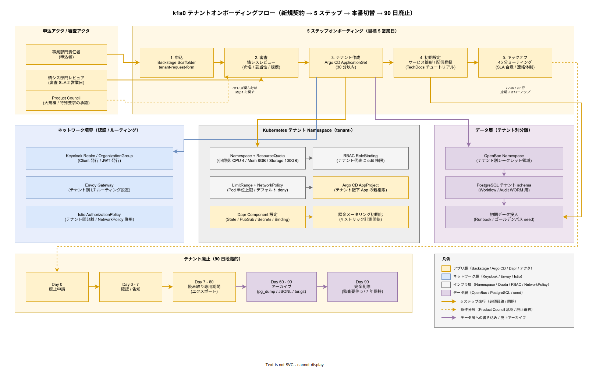

# 03. テナントオンボーディング方式

本章は k1s0 にテナントを新規収容する際の申込から廃止までのライフサイクル全体を設計する。企画書で約束した「tier2 / tier3 開発者の生産性向上」と「運用 2 名体制」は、テナント収容を自動化・標準化しなければ実現できない。本章はこの自動化・標準化の設計図である。

## 本章の位置付け

k1s0 の収容対象はテナント単位（事業ドメイン × アプリ群）で区切られる。中規模（3,000 名）で想定するテナント数は Phase 1c で 5〜10 テナント、Phase 2 以降で 20〜50 テナント、最終形で 100 テナント規模となる。テナント収容を属人オペレーションに任せると、収容 1 件あたり 2〜3 日の稼働が発生し、運用 2 名体制の工数を大半占有してしまう。本章の自動化で 1 件あたり実作業 1 営業日以内に短縮することが目標となる。

オンボーディングは技術作業（Namespace 作成 / RBAC 設定 / Realm 作成 / Quota 設定 / Argo CD Application 生成）だけでなく、業務作業（SLA 合意 / 契約締結 / 請求設定）と教育作業（キックオフ / 資料提供 / 初期相談窓口）の 3 側面を同時に進める必要がある。3 側面の待ち時間を最小化するよう並行化する設計が本章の中核となる。

## オンボーディング全体フロー

### フロー俯瞰図

以下の図は、新規テナント契約から 5 ステップのオンボーディング、本番切替、そして 90 日段階的廃止までの一連のライフサイクルを俯瞰する。上段の 5 ステップ（申込 → 審査 → テナント作成 → 初期設定 → キックオフ）は申込アクタと審査アクタが直接関与する業務プロセスであり、目標 5 営業日以内に完走させる。中段はテナント作成ステップから自動派生するネットワーク境界設定・Kubernetes Namespace・データ層準備の 3 系統であり、Argo CD ApplicationSet によって 30 分以内に並行プロビジョニングされる。

この図で最も重要な読み方は「5 ステップの水平進行は人手の業務時間を使う経路」「テナント作成から下方向に派生する矢印は自動化でカバーする経路」の 2 軸を分離して見ることである。人手経路を短縮する工夫（Backstage Scaffolder での申込フォーム統一、審査 SLA 2 営業日、キックオフ 45 分）と、自動化経路を堅牢化する工夫（ApplicationSet の宣言管理、リトライ 3 回、失敗時アラート）は別種の設計判断であり、混同しない。

下段の 90 日廃止フローは上段のオンボーディング完了後に初めて発動する逆向きの経路であり、即時廃止を禁じる設計意図を「Day 0 → Day 7 → Day 60 → Day 90 の 4 ゲート」として視覚化している。読み取り専用期間（53 日）とアーカイブ期間（30 日）の時間幅は、誤廃止リスクとデータエクスポート実作業時間を両立させるために確保している。

### 5 ステップモデル

オンボーディングは次の 5 ステップで構成する。(1) 申込（Backstage Scaffolder 経由）、(2) 審査（情シス部門レビュー）、(3) テナント作成（自動化パイプライン）、(4) 初期設定（テンプレート配置）、(5) キックオフミーティング（45 分）。5 ステップを 5 営業日以内に完了することを目標とする。5 ステップ前後の待ち時間は明示的な SLO として測定し、5 営業日を超える場合は Product Council エスカレーションとする。

5 ステップは 2 種類のテナントタイプ（新規 / 移行）でフローが分岐する。新規テナントは白紙状態からの立ち上げで審査期間が短く、移行テナント（既存 .NET Framework アプリからの移行）はデータ移行とレガシー資産棚卸が追加され審査期間が延びる。第 3 種類として「パイロット」テナントをサポートし、本番利用前の評価期間（30 日）を提供する。

### 申込

申込は Backstage Scaffolder のテナント申込テンプレート（`tenant-request-form`）で実施する。申込者は事業部門の責任者またはその委任者とし、Keycloak で認証された状態で申込フォームを開く。申込フォームで収集する情報は次の通りとする。テナント名（ASCII・半角英数・ハイフン）、表示名（日本語可）、事業ドメイン、責任者（メールアドレス + 所属）、代替連絡先（2 名以上）、想定規模（小規模 / 中規模 / 大規模）、利用開始希望日、移行有無（新規 / 移行）、パイロット有無、想定利用 API（tier1 公開 11 API から選択）、想定トラフィック（RPS・データ量）、SLA 要望、特殊要求（セキュリティ・コンプライアンス要件）。

申込完了で `tenant-request-<id>` issue が Backstage 上で起票され、情シス部門のレビュー待ちとなる。

### 審査

審査は情シス部門の指名レビュアが実施する。審査観点は次の 5 項目とする。(1) テナント名の命名規則適合、(2) 事業妥当性（稟議通過可否）、(3) 想定リソース規模の妥当性（過剰リクエストでないか）、(4) セキュリティ要件の実現可能性、(5) コンプライアンス要件（個人情報保護 / J-SOX / 電帳法）の適合。審査 SLA は 2 営業日以内とし、疑義がある場合は申込者に RFC（追加情報要求）を返す。

審査完了後、情シス責任者が Backstage 上で `approved` ラベルを付与し、後続ステップ（テナント作成）が自動起動する。大規模テナント（予算 1,000 万円相当超）や特殊要求テナントは Product Council の承認を追加で要する。

### テナント作成

テナント作成は Argo CD の ApplicationSet 機能で自動化する。承認ラベル付与をトリガとして、事前に用意されたテンプレートから以下のリソースを自動生成する。(1) Kubernetes Namespace（`tenant-<id>`）、(2) NetworkPolicy（デフォルト deny、必要な出入口のみ allow）、(3) ResourceQuota（CPU / Memory / Storage の上限）、(4) LimitRange（Pod 単位の上限）、(5) RBAC RoleBinding（テナント代表者への edit 権限）、(6) Keycloak Realm（または既存 Realm への OrganizationGroup 追加）、(7) Keycloak Client（tier1 API 呼び出し用）、(8) OpenBao Namespace（テナント別シークレット領域）、(9) Dapr Component（State / PubSub / Secrets / Binding の関連付け）、(10) Istio AuthorizationPolicy（テナント間分離）、(11) Argo CD AppProject（テナント内 Application の親権限）、(12) 課金メータリング初期設定（[06_課金メータリング方式.md](06_課金メータリング方式.md) の 4 基本メトリック計測開始）。

これらを 30 分以内にプロビジョニングすることを目標とする。プロビジョニング中の状態は Backstage 上で可視化し、失敗時は自動リトライ（3 回）後、情シス部門へアラートを上げる。

### 初期設定

テナント作成後、テナント代表者に tier2 / tier3 向けの初期設定テンプレートを提供する。tier2 開発者向けには「k1s0 サービススケルトン」（Rust / Go の 2 言語、tier1 API 呼び出し済み雛形）を Backstage Scaffolder で生成可能とする。tier3 アプリ向けには配信ポータルへの初回アプリ登録ウィザードを提供し、ClickOnce / MSIX / 単体 EXE / Web アプリの 4 形態から選択させる。

ゴールデンパス（tier1 の主要 API を呼び出すサンプルアプリ）を 30 分以内にデプロイ完了させるためのチュートリアルを TechDocs で提供する。テナント代表者がチュートリアルを完走することを Phase 1c 以降の必須条件とする。

### キックオフミーティング

キックオフミーティングは 45 分のオンライン会議（Zoom / Teams）で実施する。参加者はテナント代表者（必須）、tier2 / tier3 開発リーダー（推奨）、情シス担当（必須 1 名）、運用担当（必須 1 名）の 4 ロールとする。議題は (1) tier1 API 概要説明（10 分）、(2) SLA / SLO 合意（10 分）、(3) 運用連絡体制確認（5 分）、(4) 初回インシデント時の対応手順確認（5 分）、(5) 初期質問対応（10 分）、(6) 次回チェックポイント日程調整（5 分）の 6 項目とする。

キックオフ後 7 日、30 日、90 日の 3 チェックポイントで定期フォローアップを実施する。フォローアップは 15 分オンライン会議で、利用状況・疑問点・要望を収集する。

## テナント種別と分岐フロー

### 新規テナント

新規テナントは白紙からの立ち上げのため、審査期間が短く（2 営業日）、初期設定が標準テンプレートのままで進む。新規テナントの多くは Phase 2 以降、事業部門が k1s0 を活用した新規ビジネス立ち上げ時に発生する。新規テナントは初期規模が小さい場合が多く、ResourceQuota は「小規模（CPU 4 コア / Memory 8GB / Storage 100GB）」から開始する。

### 移行テナント

移行テナントは既存 .NET Framework アプリからの移行のため、データ移行（PostgreSQL / SQL Server → PostgreSQL）、レガシー資産棚卸、並行稼働期間設定が追加される。審査期間が 5 営業日、初期設定が 10 営業日に延びる。

移行テナントは制約 9（レガシー共存）に基づき、既存 .NET Framework 資産を捨てずに ClickOnce / MSIX ラップして配信する選択肢を提供する。強制移行ではなく自発的移行を促す設計とし、並行稼働期間（最大 90 日）を許容する。移行詳細は [../60_移行方式設計/](../60_移行方式設計/) 章を参照する。

### パイロットテナント

パイロットテナントは本番利用前の評価期間（30 日）を提供する。パイロット期間中は課金メータリングは計測のみ（請求なし）、SLA は ベストエフォート、ResourceQuota は最小規模（CPU 2 コア / Memory 4GB / Storage 20GB）とする。パイロット期間終了後、本番テナントへの昇格または廃止の判断を 7 日以内に実施する。

パイロットテナントは「まず試したい」事業部門の受け皿として機能し、本格導入の敷居を下げる。Phase 2 以降で展開する。

## テナント廃止

テナント廃止は 90 日の段階的廃止フローで実施する。即時廃止はデータ消失リスクが高いため原則禁止とする。90 日の段階は以下の通りとする。

Day 0: 廃止申請（テナント代表者または情シス部門）。Day 0〜Day 7: 廃止確認（代表者への確認、Backstage Announcement 告知）。Day 7〜Day 60: 読み取り専用期間（書き込みは停止、読み取りのみ可能、データエクスポート期間）。Day 60〜Day 90: アーカイブ期間（テナント全リソースをバックアップストレージへ退避、復元可能）。Day 90: 完全削除（アーカイブ保持期間は監査要件に応じて 5 年または 7 年）。

アーカイブのフォーマットは PostgreSQL dump（`pg_dump --format=custom`）、Kafka topic のオフセット付き JSONL、S3 互換ストレージの tar.gz、Keycloak Realm エクスポート JSON、の 4 形式を保管する。アーカイブからの復元手順は Runbook として整備し、年 1 回の復元訓練を実施する。

## 自動化とツール

### Backstage Scaffolder テンプレート

オンボーディングで使用するテンプレートは `backstage-templates` リポジトリで管理する。主要テンプレートは以下 5 種類とする。(1) `tenant-request-form`（新規テナント申込）、(2) `tenant-migration-form`（移行テナント申込）、(3) `tenant-pilot-form`（パイロット申込）、(4) `tenant-decommission-form`（廃止申込）、(5) `tier2-service-skeleton`（tier2 サービス雛形）。各テンプレートは Phase 1c までに整備する。

テンプレートは YAML で記述し、バリデーションは JSON Schema で実装する。PR テンプレートの変更は Product Council 承認を経る。テンプレートのテストは Backstage の `e2e` テストで Phase 1c 以降に毎週実行する。

### Argo CD ApplicationSet

テナント別 Kubernetes リソースは ApplicationSet で宣言的に管理する。申込承認 → テナント ID 付与 → ApplicationSet の `generators` にテナント ID 追加 → Argo CD が Application を自動生成 → 各テナントリソースをプロビジョニング、の流れで自動化する。ApplicationSet の YAML は `infra/argocd-applicationsets/tenants/` に配置し、GitOps で管理する。

### 監視と SLO

オンボーディング SLO は「申込から 5 営業日以内にキックオフ完了 95%」を目標とする。SLO 違反は Grafana ダッシュボードで可視化し、違反件数は月次 Product Council で報告する。オンボーディング各ステップの所要時間（申込 → 審査、審査 → 作成、作成 → 初期設定、初期設定 → キックオフ）を個別に計測し、ボトルネック特定に活用する。

## 対応要件一覧

本章は以下の要件定義 60_事業契約 テナントオンボーディング系要件と 1:1 対応する。

- BC-ONB-001: 5 ステップオンボーディングフロー（申込 / 審査 / 作成 / 初期設定 / キックオフ）。対応設計 ID: `DS-BUS-ONB-001`。
- BC-ONB-002: テナント種別（新規 / 移行 / パイロット）別フロー。対応設計 ID: `DS-BUS-ONB-002`。
- BC-ONB-003: Backstage Scaffolder テンプレートでの申込自動化。対応設計 ID: `DS-BUS-ONB-003`。
- BC-ONB-004: Argo CD ApplicationSet でのテナントリソース自動プロビジョニング。対応設計 ID: `DS-BUS-ONB-004`。
- BC-ONB-005: 90 日段階的廃止フロー（読み取り専用 / アーカイブ / 完全削除）。対応設計 ID: `DS-BUS-ONB-005`。
- BC-ONB-006: オンボーディング SLO（5 営業日以内 95%）と月次報告。対応設計 ID: `DS-BUS-ONB-006`。
