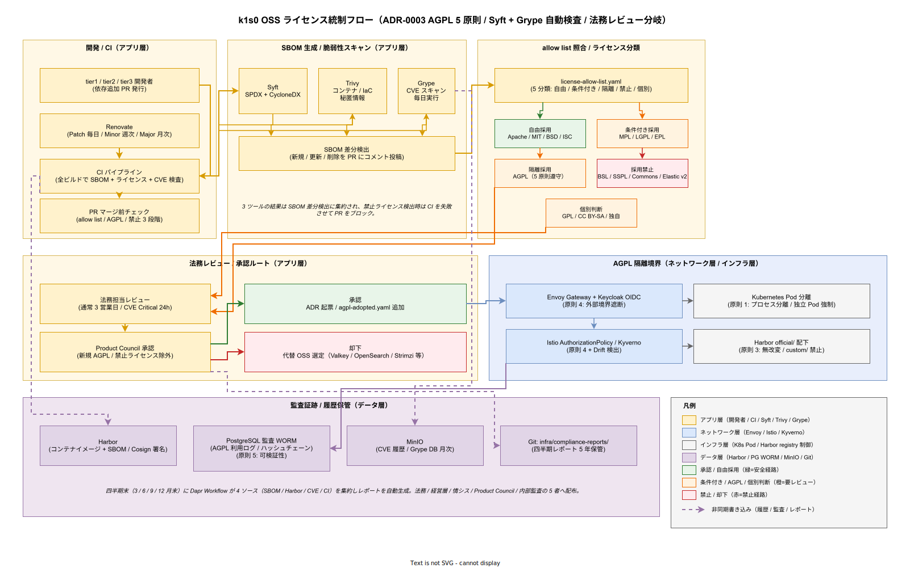

# 07. OSS ライセンス運用方式

本章は k1s0 が採用する OSS のライセンス遵守を運用プロセスとして組み込む方式を定める。企画書で約束した「OSS 4 半期ライセンスレポート自動生成」「AGPL 5 原則」「OSS セルフマネージド運用」を実現するための中核章である。構想設計 ADR-0003（AGPL 運用）と制約 7（法務制約）に準拠する。

## 本章の位置付け

k1s0 は OSS を基盤とするプラットフォーム製品のため、OSS ライセンス違反は製品そのものの存続を脅かすリスクである。特に AGPL-3.0 の遵守を誤れば、採用した OSS の条項によりソースコード公開義務が発生し、JTC 情シス向けの閉域運用が不可能となる。BSL / SSPL / Commons Clause の混入は商用利用の法的リスクを直接生じさせる。

本章はこれらのリスクを「検出 → 分類 → 判定 → 対応 → 報告 → 保管」の 6 段階で運用する方式を定める。自動化を最大化し、人手介入は法務判断と新規 AGPL 採用時の ADR 起票に限定する。四半期ライセンスレポートを Phase 1c から運用化することで、経営層への説明責任を自動的に果たす構造を作る。

### 統制フロー俯瞰図

以下の図は、開発者の依存追加 PR から始まり、CI での SBOM 生成・ライセンス分類・法務レビュー・承認を経て AGPL 隔離境界に到達し、最終的に監査証跡として保管されるまでの統制フローを俯瞰する。読み手は左から右への 3 列構成（開発・CI / SBOM 生成 / ライセンス分類）を「検出フェーズ」、中段 2 列（法務レビュー / AGPL 隔離境界）を「判定・隔離フェーズ」、下段の 4 コンポーネント（Harbor / PostgreSQL WORM / MinIO / Git リポジトリ）を「報告・保管フェーズ」として読むと、ADR-0003 で定めた 6 段階運用が 1 枚で追える。

色分けの意味は 2 層ある。第 1 層はレイヤ記法規約に基づく責務レイヤ（暖色=アプリ層 / 寒色=ネットワーク層 / 中性灰=インフラ層 / 薄紫=データ層）であり、AGPL 隔離境界がネットワーク層とインフラ層を跨ぐ 4 ポリシーで構成されることが色で示される。第 2 層は意思決定結果の状態色（緑=自由採用 / 橙=要レビュー / 赤=禁止）であり、allow list の 5 分類ボックスに直接埋め込んでいる。この 2 層を同時に読むと「どのライセンスが」「どの層の隔離メカニズムで」対応されるかが一目で分かる。

特に AGPL 採用時は、法務レビュー → Product Council 承認 → `agpl-adopted.yaml` 追加という 3 ステップ（緑色の承認経路）を経た後に初めて、ネットワーク層とインフラ層の 4 つの隔離ポリシー（Envoy Gateway / Istio AuthorizationPolicy / Kubernetes Pod 分離 / Harbor official/ 配下）が整合するよう設計されている。いずれか 1 つでも設定漏れがあれば AGPL 5 原則が崩れるため、CI で 4 ポリシーをまとめて検査する構造を図で示している。

## SBOM 自動生成

### SBOM 形式

SBOM（Software Bill of Materials）は SPDX 2.3（JSON 形式）と CycloneDX 1.5（JSON 形式）の両形式で生成する。両形式生成する理由は、SPDX が法務監査で広く使われ、CycloneDX が脆弱性管理（Grype 等）での標準であり、用途が異なるためである。両形式は同一スキャン結果から自動生成する。

### スキャンツール

SBOM 生成は Syft（`anchore/syft`）を採用する。Syft は Apache 2.0 ライセンスで、コンテナイメージ・OS パッケージ・言語別パッケージ（Cargo / Go modules / npm / Maven 等）を横断スキャンする。tier1 は Rust（Cargo）と Go（modules）の 2 言語、tier3 は .NET（NuGet）・React（npm）・Python（pip、Phase 2）をスキャン対象とする。

Syft は CI の全ビルドで起動し、ビルドアーティファクト（コンテナイメージ）に SBOM ファイルを添付する。SBOM は Harbor レジストリにイメージと同時に保管し、Cosign で署名（Phase 2 以降）する。

### 差分検出

SBOM は前回ビルドとの差分を自動比較する。新規追加された OSS、バージョンアップされた OSS、削除された OSS の 3 カテゴリに分類し、PR に差分コメントを自動投稿する。PR 作成者は差分を確認し、ライセンス的に問題がないかをチェックする。

PR マージ前の自動チェックは「allow list 照合」「AGPL 検出」「BSL / SSPL / Commons Clause 検出」の 3 段階で実施する。いずれかで警告が出た場合、PR マージがブロックされ法務レビューに回る。

## ライセンス分類

### allow list

採用可能な OSS ライセンスは以下の allow list に限定する。

**自由採用**: Apache 2.0 / MIT / BSD-2-Clause / BSD-3-Clause / ISC / Unlicense / CC0 / Public Domain。これらは商用利用・再配布・改変に制約が少なく、帰属表示を守れば問題ない。

**条件付き採用**: MPL 2.0（ファイル単位コピーレフト、改変ファイルのみソース公開義務）/ LGPL 2.1 / LGPL 3.0（動的リンクのみ許容、静的リンクは不可）/ EPL 2.0（モジュール境界で切り離し、改変モジュールは EPL 維持）。これらは条件を満たせば採用可能だが、技術的分離の担保が必要である。

**隔離採用**: AGPL 3.0（5 原則遵守が必須）。後述の AGPL 5 原則を全項目満たすことを条件とする。

**採用禁止**: BSL（Business Source License、MongoDB / Redis 等） / SSPL（Server Side Public License、MongoDB 4.x 以降） / Commons Clause / Confluent Community License / Elastic License（v2）。これらは商用プラットフォームへの組込が法的リスクとなるため禁止する。

**個別判断**: GPL 2.0 / GPL 3.0 / CC BY-SA / CC BY-NC / 独自ライセンス。個別に法務レビューで判定する。

### 自動照合

allow list 照合は CI の全ビルドで実施する。Syft の SBOM から抽出したライセンスを allow list と照合し、禁止ライセンスの検出時はビルドを失敗とする。個別判断ライセンスは警告のみ出し、手動レビューに回す。

allow list は `infra/compliance/license-allow-list.yaml` で管理し、変更は Product Council 承認を経る。変更履歴は ADR として記録する。

## AGPL 5 原則

構想設計 ADR-0003 で確定した AGPL 5 原則を遵守する技術証跡を運用で担保する。対象 OSS は Grafana / Loki / Tempo / Pyroscope / MinIO / Renovate の 6 種類（Phase 1b 以降採用）とする。

### 原則 1: プロセス分離

AGPL OSS は独立 Pod として稼働させ、tier1 自作コードと同一プロセス空間を共有しない。具体検証として、Kubernetes の Pod Spec を CI で検査し、AGPL コンテナと tier1 自作コンテナが同一 Pod に同居していないことを自動検出する。

### 原則 2: ライブラリリンクなし

AGPL OSS のライブラリを tier1 自作コードにリンクしない。具体検証として、Cargo.toml / go.mod を CI で検査し、AGPL ライセンスのクレートが dependencies に含まれていないことを自動検出する。AGPL OSS への通信は HTTP API 経由のみ許容する。

### 原則 3: 無改変利用

AGPL OSS のソースコードを改変しない。具体検証として、採用する OSS イメージは公式リリースイメージのみ使用し、社内ビルドイメージを作らない。Harbor に格納する AGPL OSS イメージは `official/` 配下に分離し、`custom/` 配下への格納を禁止する。

### 原則 4: 外部境界遮断

AGPL OSS の外部公開は Envoy Gateway + Keycloak OIDC で遮断する。具体検証として、Istio AuthorizationPolicy で AGPL OSS Pod への ingress を tier1 内部からのみ許可し、社外 IP からのアクセスを遮断する。設定の Drift 検出には Kyverno / OPA Gatekeeper を使用する。

### 原則 5: 監査ログ可検証性

AGPL OSS の利用状況（誰が・いつ・どの機能を使ったか）は改ざん防止ログとして記録する。具体検証として、Envoy Gateway のアクセスログを PostgreSQL に保管し、ハッシュチェーンで改ざん防止を担保する（[../50_非機能方式設計/07_データ保護プライバシー方式設計.md](../50_非機能方式設計/07_データ保護プライバシー方式設計.md) と連動）。

### 新規 AGPL 採用時のプロセス

新規 AGPL OSS を採用する際、以下のプロセスを必須とする。(1) `review:legal` ラベル付き ADR を起票し、法務担当のレビューを受ける。(2) 5 原則を全項目満たす技術証跡を ADR に記載する。(3) Product Council 承認を経る。(4) 承認後、`infra/compliance/agpl-adopted.yaml` に追加する。このファイルは CI で監視され、未承認の AGPL 採用を検出して PR ブロックする。

## 禁止ライセンス検出

BSL / SSPL / Commons Clause / Confluent Community License / Elastic License v2 の混入を CI で自動検出する。検出時はビルドを失敗とし、Slack に警告を発報する。誤検出の場合は allow list に個別除外（`exclude-id`）を追加するが、除外は Product Council 承認を要する。

特に注意すべきパッケージは MongoDB、Redis（7.0 以降の特定バージョン）、Elasticsearch（7.11 以降）、Apache Kafka の Confluent 派生版の 4 種類である。これらは代替 OSS（Valkey、OpenSearch、Strimzi ベースの Apache Kafka）を採用することで制約 1 を満たしている。

## 四半期ライセンスレポート

### レポート構成

四半期ライセンスレポートは以下 6 セクションで構成する。(1) サマリ（採用 OSS 総数・ライセンス分類別件数・前四半期比）、(2) 新規追加 OSS（該当期間に新規採用した OSS 一覧）、(3) バージョンアップ（ライセンス変更の可能性がある更新一覧）、(4) 削除された OSS、(5) CVE 対応状況（CVSS 7.0 以上の脆弱性と対応）、(6) AGPL 外部公開経路確認（5 原則の遵守状況）。

### 自動生成

レポートは四半期末（3 月末 / 6 月末 / 9 月末 / 12 月末）に自動生成する。生成ジョブは Dapr Workflow で実装し、Syft の SBOM 履歴・Harbor の OSS イメージ履歴・Grype の CVE 履歴・CI のライセンスチェック履歴の 4 ソースを集約する。生成後は `infra/compliance-reports/<yyyy-qn>.md` に Git commit される。

### 配布先

レポートは以下 5 者に配布する。(1) 法務部門、(2) 経営層、(3) 情シス責任者、(4) Product Council、(5) 監査担当（内部監査室）。配布はメールと Backstage Announcement の両方を用いる。配布後、Product Council で確認会議を開催し、リスク事項を洗い出す。

### 5 年保管

四半期レポートは `infra/compliance-reports` リポジトリに 5 年保管する。保管期限は企画書で約束した「稟議通過済み 5 年 TCO」に合わせ、任期中の監査対応に備える。5 年経過後は会計監査の保管要件（7 年）にさらに 2 年分延長する。

## CVE 対応

### スキャンツール

依存 OSS の CVE は Grype（`anchore/grype`）で毎日スキャンする。Grype は Anchore の脆弱性 DB（NVD + GitHub Security Advisories + Ruby Advisory Database 等を統合）を使用する。スキャン対象は本番稼働中の全コンテナイメージ・Harbor のすべてのイメージとする。

### 優先度と対応期限

CVE は CVSS Base Score で優先度を分類する。Critical（9.0 以上）: 48 時間以内にパッチ適用または回避策適用。High（7.0〜8.9）: 7 日以内。Medium（4.0〜6.9）: 30 日以内。Low（0.1〜3.9）: 次回定期リリース時に対応。Critical / High は Phase 1c 時点から運用義務とし、Medium / Low は Phase 2 以降で強化する。

### 対応フロー

CVE 検出 → Slack 通知（担当者 + 情シス責任者） → 影響評価（該当 OSS が k1s0 で使用されているか・脆弱性の攻撃経路が k1s0 構成で成立するか） → パッチ検討（パッチありなら適用、パッチなしなら回避策検討） → リリース → 対応記録、の 6 段階で進める。各段階の時刻を記録し、SLA 遵守を監視する。

## Renovate 自動更新

### Renovate 運用

OSS 自動更新には Renovate を採用する。Renovate は AGPL-3.0 のため、原則 8 に基づき独立 Pod として運用する。Renovate は依存パッケージの新バージョンを検出し、自動 PR を発行する。PR には更新内容・リリースノートへのリンク・破壊的変更の有無が含まれる。

### 更新頻度

Renovate の更新 PR 発行頻度は以下とする。Patch リリース（セキュリティ修正含む）: 毎日。Minor リリース: 週次。Major リリース: 月次。セキュリティ修正を含む PR は最優先でマージされるよう設定する。

### マージポリシー

Patch / Minor の自動マージは CI テスト成功 + E2E テスト成功 + ライセンスチェック成功の 3 条件を満たす場合のみ許容する。Major 更新は手動レビューを必須とする。AGPL OSS の更新は法務レビューを経る。

## 法務レビュー

新規 AGPL 採用時、禁止ライセンス検出時、CVE Critical 検出時、四半期レポート確認時の 4 タイミングで法務レビューを実施する。法務レビューの所要時間は通常 3 営業日、緊急（CVE Critical）は 24 時間以内とする。法務担当の指定は Product Council で決定し、年次見直しを行う。

法務判断の記録は ADR として残し、同一パッケージの次回判断時の参考にする。判断が揺れる場合は外部法律事務所への照会を検討する（Phase 2 以降で予算化）。

## 対応要件一覧

本章は以下の要件定義 60_事業契約 OSS ライセンス系要件と 1:1 対応する。

- BC-LIC-001: SBOM 自動生成（Syft、SPDX + CycloneDX）の CI 組込。対応設計 ID: `DS-BUS-LIC-001`。
- BC-LIC-002: ライセンス allow list（自由 / 条件付き / 隔離 / 禁止 / 個別判断）と自動照合。対応設計 ID: `DS-BUS-LIC-002`。
- BC-LIC-003: AGPL 5 原則の技術証跡による遵守。対応設計 ID: `DS-BUS-LIC-003`。
- BC-LIC-004: 四半期ライセンスレポート自動生成（6 セクション）と 5 者配布。対応設計 ID: `DS-BUS-LIC-004`。
- BC-LIC-005: CVE 対応（Grype、優先度別 SLA 48h / 7d / 30d）。対応設計 ID: `DS-BUS-LIC-005`。
- BC-LIC-006: Renovate による自動更新（Patch 毎日 / Minor 週次 / Major 月次）。対応設計 ID: `DS-BUS-LIC-006`。
- BC-LIC-007: 法務レビュー運用と ADR 記録、5 年保管。対応設計 ID: `DS-BUS-LIC-007`。
