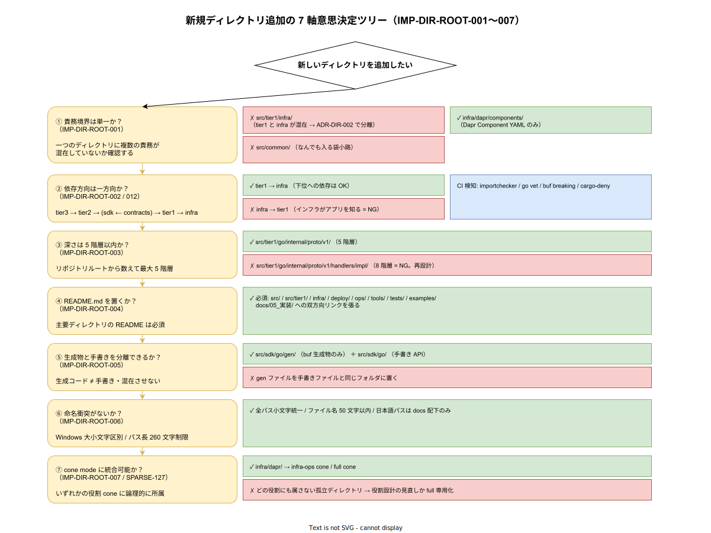

# 01. ディレクトリ設計原則

本ファイルは k1s0 モノレポのディレクトリ配置を決める際に常に参照する 7 軸の設計原則を定義する。新規ディレクトリ追加や既存配置変更が発生した際、本原則との整合を確認することで、場当たり的な配置を防ぐ。



## 原則が必要な理由

モノレポは「1 つのリポジトリに全資産を入れる」構造であるため、放置すると資産の所有権・依存方向・スパースチェックアウト適用範囲が不明瞭になる。放置の結果として発生する典型的な破綻は以下である。

- tier1 チームが所有しないはずの Kafka 設定を tier1 配下に置き続け、tier2 / tier3 のインフラ変更 PR が tier1 レビュー待ちで詰まる
- 契約（`.proto`）が特定 tier の所有物として扱われ、横断変更のレビュー担当が不在化する
- 新規ディレクトリが `tools/` / `scripts/` / `bin/` / `utils/` のように意味の重なる命名で増殖し、参加者ごとに「どこに置くか」の認識がずれる
- スパースチェックアウト cone を定義する際、役割と ディレクトリの対応が取れず、cone 定義が巨大化

本原則は、これらの破綻を構造レベルで回避するために設けた 7 軸である。

## 原則 1: 責務境界をディレクトリ階層で表現する（IMP-DIR-ROOT-001）

**ディレクトリ階層は責務境界である。所有権の異なる資産を同じ階層に混ぜない。**

`tier1 実装` と `Kafka 設定` と `Runbook` は別々の所有権と変更サイクルを持つ。これらを同じディレクトリに混ぜると CODEOWNERS で path-pattern を切れなくなり、責任分界が壊れる。本原則は `src/tier1/` `infra/data/kafka/` `ops/runbooks/` のように責務ごとに階層を分離することを要求する。

具体的な帰結として、以下を固定する。

- ソースコード（Rust / Go / C# / TS）は `src/` 配下
- クラスタ素構成（Kubernetes YAML / Helm）は `infra/` 配下
- GitOps 配信定義（ArgoCD / Kustomize）は `deploy/` 配下
- 運用手順（Runbook / Chaos / DR）は `ops/` 配下
- 横断ツール（CLI / CI helper）は `tools/` 配下
- テスト資産（E2E / Contract / Integration）は `tests/` 配下
- サンプル実装は `examples/` 配下
- vendored OSS は `third_party/` 配下
- 設計文書は `docs/` 配下

## 原則 2: 依存方向を一方向化し、階層に反映する（IMP-DIR-ROOT-002）

**依存方向は tier3 → tier2 → (sdk ← contracts) → tier1 → infra の単方向とする。逆方向の依存を禁止する。**

概要設計 [../../04_概要設計/20_ソフトウェア方式設計/01_コンポーネント方式設計/05_モジュール依存関係.md](../../../04_概要設計/20_ソフトウェア方式設計/01_コンポーネント方式設計/05_モジュール依存関係.md) で論理的な依存方向は確定している。本原則は同じ方向をディレクトリ階層・ビルド設定・CI の path-filter の 3 層で強制する。

- Rust workspace の `Cargo.toml` は tier3 → tier1 の方向のみ `path` 依存を許容
- Go module の `go.mod` は tier ごとに分離し、replace 指示で単方向性を検証
- pnpm workspace の `pnpm-workspace.yaml` で依存可能レンジを明示
- CI で逆方向 import を検出する lint を必須化（Go: `go-mod-tidy` + 独自 linter、Rust: `cargo-deny` + 独自 CI）

## 原則 3: 最大階層深度は 5 階層まで（IMP-DIR-ROOT-003）

**Windows の長パス制限（260 文字）と可読性のバランスから、ディレクトリ深度は最大 5 階層までとする。**

6 階層以上になるケースはほぼすべて責務分割の失敗である。サブディレクトリを増やす前に責務の再分析を行い、既存階層への吸収または新規独立階層への昇格を検討する。

例外として以下は深度制限の対象外とする。

- Node.js の `node_modules/` 配下（ツール管理下）
- Cargo / Go の `target/` / `bin/` の生成物
- buf の `gen/` 配下の生成コード

## 原則 4: すべてのディレクトリは単一の ReadMe を持つ（IMP-DIR-ROOT-004）

**主要ディレクトリには必ず `README.md` を配置し、そのディレクトリの目的・構成・責任者・関連 IMP-DIR ID を記載する。**

READ MORE の不足は「このディレクトリは何か」を口伝で伝承する状態を生む。本原則は `src/` / `src/contracts/` / `src/tier1/` / `src/sdk/` / `src/tier2/` / `src/tier3/` / `src/platform/` / `infra/` / `deploy/` / `ops/` / `tools/` / `tests/` / `examples/` / `third_party/` の 14 箇所に最低限 `README.md` を置くことを要求する。

各 `README.md` の必須項目は以下の 5 点。

- ディレクトリの目的（1-2 段落）
- サブディレクトリ構成と各々の役割
- 対応する docs/05_実装/00_ディレクトリ設計/ のパス
- CODEOWNERS に基づく責任チーム
- 参照すべき主要 IMP-DIR ID / DS-SW-COMP ID

## 原則 5: 生成物は別ディレクトリ、ソースと混ぜない（IMP-DIR-ROOT-005）

**`buf generate` / `cargo build` / `go build` / `pnpm build` の生成物はソースと同じディレクトリに混ぜない。**

tier1 の Protobuf 生成コードは例外として commit するが（DS-SW-COMP-122 準拠）、commit する生成コードも `internal/proto/v1/` 等の明示的なサブディレクトリに置く。生成物であることは `// Code generated by protoc. DO NOT EDIT.` ヘッダで明示する。

ビルド中間成果物（`target/` / `node_modules/` / `bin/` / `obj/`）は `.gitignore` で確実に除外する。

## 原則 6: 名前の衝突を避ける（IMP-DIR-ROOT-006）

**同じ意味を指すディレクトリ名を複数作らない。類似の命名を使い分けない。**

以下の命名を予約し、類似名（`scripts/` / `utils/` / `helpers/` / `bin/` / `misc/`）の新設を禁止する。

- `tools/` : 横断ツール
- `tests/` : tier 横断テスト
- `examples/` : 動作する最小実装例
- `third_party/` : vendored OSS

サービス / クレート固有のテストやツールは各サービスディレクトリ内部に `tests/` / `scripts/` を置くことは許容する（原則 1 で責務境界は保たれる）。

## 原則 7: スパースチェックアウト cone との整合（IMP-DIR-ROOT-007）

**新規ディレクトリ追加時は、該当 cone 定義ファイル（`.sparse-checkout/roles/*.txt`）への追記要否を同 PR で判定する。**

9 種類の役割別 cone 定義（`tier1-rust-dev` / `tier1-go-dev` / `tier2-dev` / `tier3-web-dev` / `tier3-native-dev` / `platform-cli-dev` / `infra-ops` / `docs-writer` / `full`）は [ADR-DIR-003](../../../02_構想設計/adr/ADR-DIR-003-sparse-checkout-cone-mode.md) で定義した。新規ディレクトリはいずれかの cone に属するよう、PR レビュー時点で所属先を決定する。

cone に属さないディレクトリが生まれた場合、以下のいずれかを選択する。

- 既存 cone に追記
- `full.txt` のみに含まれる「全員参照」資産として扱う
- 新 cone を定義して ADR 改訂

## 図表

```
[ディレクトリ設計 7 軸]
  1. 責務境界の階層化
  2. 依存方向の一方向化
  3. 最大 5 階層
  4. README.md 必須
  5. 生成物分離
  6. 命名衝突回避
  7. cone 整合
```

詳細な意思決定ツリーは [img/7軸意思決定ツリー.drawio](img/7軸意思決定ツリー.drawio) （Phase B 完了時点で svg 作成）を参照。

## 対応 IMP-DIR ID

本ファイルで採番する原則レベル ID は以下とする。

- `IMP-DIR-ROOT-001` : 責務境界をディレクトリ階層で表現
- `IMP-DIR-ROOT-002` : 依存方向の一方向化
- `IMP-DIR-ROOT-003` : 最大階層深度 5
- `IMP-DIR-ROOT-004` : 全ディレクトリに README.md
- `IMP-DIR-ROOT-005` : 生成物とソースの分離
- `IMP-DIR-ROOT-006` : 命名衝突回避
- `IMP-DIR-ROOT-007` : スパースチェックアウト cone 整合

## 対応 DS-SW-COMP / ADR / 要件

- DS-SW-COMP-119（モジュール依存方向）/ DS-SW-COMP-120（tier1 トップレベル構成、ADR-DIR-001/002 により改訂）
- ADR-DIR-001 / ADR-DIR-002 / ADR-DIR-003
- NFR-C-NOP-001（2 名運用）/ NFR-C-NOP-002（可視性）/ DX-CICD-\* / DX-MET-\*
