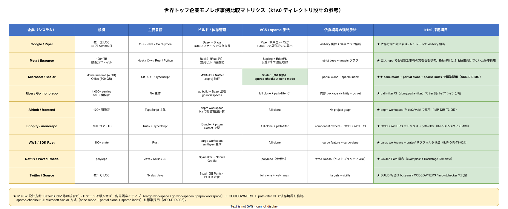

# 02. 世界トップ企業事例比較

本ファイルは k1s0 モノレポのディレクトリ設計を決めるにあたり参照した世界トップ企業のモノレポ事例を散文で整理する。事例比較は「他社がこうしているから真似る」ためではなく、**どの規模・どの人員・どの制約に対応した判断だったのか**を文脈ごと理解するために行う。

## 本ファイルの目的

k1s0 は 2 名運用を前提とする JTC（NFR-C-NOP-001）であり、Google / Meta のような 10000 人超の開発者数は想定外である。一方で 10 年保守を目指すため、小規模時点の判断が将来の大規模化を阻害しないことが重要となる。本ファイルでは 9 社の事例を、規模・採用スタック・スパースチェックアウト対応・特筆点の 4 観点で俯瞰し、k1s0 に取り入れる判断と取り入れない判断を明示する。

## 事例サマリ

### Google（Piper + CitC + Bazel）

Google は Piper という独自モノレポを運用し、ソース行数は 20 億行規模、開発者数は約 25000 人、1 日のコミット数は数万件に達する。CitC（Clients in the Cloud）という仮想ファイルシステムでローカル作業を行い、Bazel で選択的にビルドする。Piper そのものは Subversion 派生で Git ではないが、現在は別途 Git-on-Piper の仕組みで Git 互換の表面を提供している。

k1s0 に取り入れるべき知見は、**契約（Protobuf）を集約配置する方針** と **所有権を OWNERS ファイルで path-pattern ベースに管理する方針** の 2 点。k1s0 では `src/contracts/` の昇格（ADR-DIR-001）と CODEOWNERS（`.github/CODEOWNERS`）の path-pattern 運用として反映する。

取り入れない判断は、Piper / Bazel そのものの採用。規模が 10000 倍異なり、運用負荷が 2 名では破綻する。k1s0 では Git + path-filter + Cargo workspace + go.mod + pnpm workspace で代替する。

### Meta（fbsource / Sapling / Buck2 / EdenFS）

Meta は fbsource という単一モノレポを運用し、ソース行数は数億行、開発者数は約 20000 人。Mercurial 系の Sapling と仮想ファイルシステム EdenFS で Working Set の on-demand 取得を行い、Buck2 で選択的にビルドする。Sapling は 2022 年にオープンソース化され、Git リポジトリに対しても動作する。

k1s0 に取り入れるべき知見は、**仮想ファイルシステムで全ファイルの即時取得を避ける思想**。ただし EdenFS 自体は Linux のみサポートで Windows / Mac で制限があるため、k1s0 では Git 公式の partial clone + sparse index で同等効果を得る（ADR-DIR-003）。

取り入れない判断は、Sapling / Buck2 の採用。2 名運用で扱える OSS スタックを増やすリスクが大きい。

### Microsoft（.NET VMR + Scalar + VFS for Git）

Microsoft は .NET の全ソースを `dotnet/dotnet` という Virtual Mono-Repo（VMR）に集約している。Scalar（旧 VFS for Git）は Git の仮想ファイルシステム拡張で、Windows Server 規模の巨大リポジトリを扱える。2024 年に Scalar の機能は Git 本体の sparse index + partial clone に統合された。

k1s0 に取り入れるべき知見は、**Git 本体の sparse index に吸収された機能は公式標準として使える** という事実。k1s0 は Scalar や VFS for Git そのものは使わず、Git 2.37+ の sparse index + partial clone を標準運用とする（ADR-DIR-003）。これにより OSS スタックを増やさずに同等効果を得る。

### Uber（Go monorepo + Bazel）

Uber は Go のマイクロサービスを単一モノレポで運用し、ソース行数は 1 億行超、Go サービス数は数千、開発者数は約 5000 人。Bazel でビルドし、コード生成と依存管理を自動化している。公開事例では、Go monorepo のスケール課題（go.mod の単一化困難、IDE 応答性劣化）を sparse checkout と Bazel の組み合わせで解決している。

k1s0 に取り入れるべき知見は、**Go module を tier 単位で分離する戦略**。Uber は巨大な単一 go.mod を断念し、複数 go.mod に分離した。k1s0 では `src/tier1/go/` / `src/tier2/go/` / `src/sdk/go/` を独立 go.mod として管理する方針を取る。

取り入れない判断は、Bazel の採用。k1s0 の規模では cargo / go / pnpm の各ネイティブビルドで十分対応できる。Bazel 学習コストは 2 名運用では回収困難。

### Airbnb（マルチ言語モノレポ + Nx）

Airbnb は Rails / Python / TypeScript / Kotlin / Swift を含むマルチ言語モノレポを運用し、開発者数は約 2000 人。Nx を部分的に採用し、TypeScript 側のビルドキャッシュと依存グラフ分析に活用している。

k1s0 に取り入れるべき知見は、**マルチ言語を同居させる際のルートレイアウト**。Airbnb は `frontend/` / `backend/` / `mobile/` のようにトップレベルで言語を分けていない。代わりにサービスドメイン単位で `services/<service-name>/` を切り、各サービス内に言語特有のサブディレクトリを置いている。

k1s0 は tier ベース（tier1 / tier2 / tier3）でトップレベルを切る方針を取るが、その内部はサービス単位ではなく言語単位（`tier1/go/` / `tier1/rust/`）で切る。これは tier1 の内部言語不可視（ADR-TIER1-003）が tier 単位でのビルド独立性を要求するためである。

### Shopify（Ruby + TypeScript モノレポ）

Shopify は Ruby + TypeScript を中心としたモノレポを運用し、開発者数は約 2500 人。sorbet（Ruby の型チェック）とカスタム CI gatekeeper でマージ保護を行っている。pnpm workspaces を TypeScript 側で採用している。

k1s0 に取り入れるべき知見は、**pnpm workspace の採用と workspace filter による選択的ビルド**。k1s0 の `src/tier3/web/` は pnpm workspace を採用し、`--filter` フラグで変更されたパッケージのみビルドする。

### AWS SDK for Rust

AWS は `awslabs/aws-sdk-rust` というモノレポで 300+ の AWS サービス向け Rust クライアント SDK を管理する。Cargo workspace で 300 以上の crate を単一 workspace にまとめ、`[workspace.dependencies]` で外部 crate バージョンを集約している。

k1s0 に取り入れるべき知見は、**Cargo workspace での `[workspace.dependencies]` 集約**。k1s0 の `src/tier1/rust/Cargo.toml` はこの方式を採用済み（DS-SW-COMP-130）。加えて `src/sdk/rust/` も同様の workspace として管理する。

### Netflix（Paved Roads + Titus）

Netflix は「Paved Road」という社内プラットフォーム戦略で、ゴールデンパスを強く奨励している。マイクロサービスは別リポジトリだが、共通ライブラリ / ツール / Spinnaker 定義は集中リポジトリで管理する。Titus はコンテナ実行基盤。

k1s0 に取り入れるべき知見は、**Golden Path の思想**。k1s0 は `examples/` に tier2 / tier3 の最小実装例を「動作する実稼働版」として置く方針を取る（IMP-DIR-COMM-\*）。開発者が Golden Path をコピーして新サービスを立ち上げる運用パターンは Netflix 方式に準拠する。

### Twitter（Source + Bazel）

Twitter は Source という単一モノレポで Scala / Java / Python / Rust を管理していた（Elon Musk 買収後の構成は非公開）。Bazel でビルドし、Git LFS を広範囲に利用していた。

k1s0 に取り入れるべき知見は、**LFS 判定の遅延**。Twitter は初期に LFS を積極採用した結果、後年の運用負荷に直面した。k1s0 では Phase 1c 段階で LFS 判定を行う（ADR-DIR-004 として将来起票）方針を取り、Phase 0 時点では LFS を使わない。

## 比較マトリクス

本節の比較は散文を補足するインデックスである。詳細は上記各節と [img/世界トップ企業事例比較マトリクス.drawio](img/世界トップ企業事例比較マトリクス.drawio) を参照。

| 企業 | 開発者数 | ビルドツール | VCS / VFS | k1s0 への適用 |
|---|---|---|---|---|
| Google | 約 25000 | Bazel | Piper + CitC | 契約集約 / OWNERS path-pattern |
| Meta | 約 20000 | Buck2 | Sapling + EdenFS | 仮想 FS 思想（Git 標準で代替） |
| Microsoft | 数千〜数万 | MSBuild / dotnet | Git + Scalar | sparse index + partial clone（標準化部分を採用） |
| Uber | 約 5000 | Bazel | Git | Go module 分離戦略 |
| Airbnb | 約 2000 | Nx（部分） | Git | サービスドメイン単位の一部思想 |
| Shopify | 約 2500 | pnpm / sorbet | Git | pnpm workspace + filter |
| AWS SDK Rust | 約 200 | Cargo | Git | workspace.dependencies 集約 |
| Netflix | 約 3000 | Gradle / 独自 | Git | Paved Road / Golden Path |
| Twitter | 約 2000 | Bazel | Git + LFS | LFS 判定の遅延 |
| **k1s0（目標）** | **2 → 10** | **cargo / go / pnpm / dotnet** | **Git + sparse index + partial clone** | 上記各社から部分採用 |

## 比較から導いた結論

k1s0 の規模は上記 9 社のいずれよりも小さい（2 名 → 10 名）。したがって以下の 3 点が決定的に重要。

1. **OSS スタックを増やさない**: Bazel / Buck2 / EdenFS / Scalar は採用しない。Git 公式機能 + cargo / go / pnpm / dotnet のネイティブビルドで構成
2. **大規模時の成長経路を妨げない**: 契約集約・依存方向一方向化・CODEOWNERS path-pattern は Google / Uber 方式を採用し、規模拡大時にスムーズに Bazel / Buck2 / Sapling に移行可能な構造とする
3. **スパースチェックアウトは Day 1 から**: 2 名時点で必要性は薄いが、Phase 1c / Phase 2 で必須化する前提で Day 1 から習慣化

## 対応 IMP-DIR ID

本ファイルで採番する IMP-DIR ID はなし（事例整理であり具体配置判断は各レイアウト章）。

## 対応 ADR

- ADR-DIR-001 / ADR-DIR-002 / ADR-DIR-003

## 参考文献

- Potvin, R. and Levenberg, J. "Why Google Stores Billions of Lines of Code in a Single Repository", CACM, July 2016
- Grosskurth, A. "Inside Facebook's Monorepo", FOSDEM 2022
- Microsoft: "What is Scalar?", [github.com/microsoft/scalar](https://github.com/microsoft/scalar)
- Uber Engineering: "The Go Monorepo: Lessons from 10 Years of Scale"
- Shopify Engineering Blog: "Building an Internal Developer Platform"
- AWS Labs: [github.com/awslabs/aws-sdk-rust](https://github.com/awslabs/aws-sdk-rust)
- Netflix TechBlog: "Paved Paths at Netflix"
- Sapling SCM: [sapling-scm.com](https://sapling-scm.com)
- Buck2: [buck2.build](https://buck2.build)
