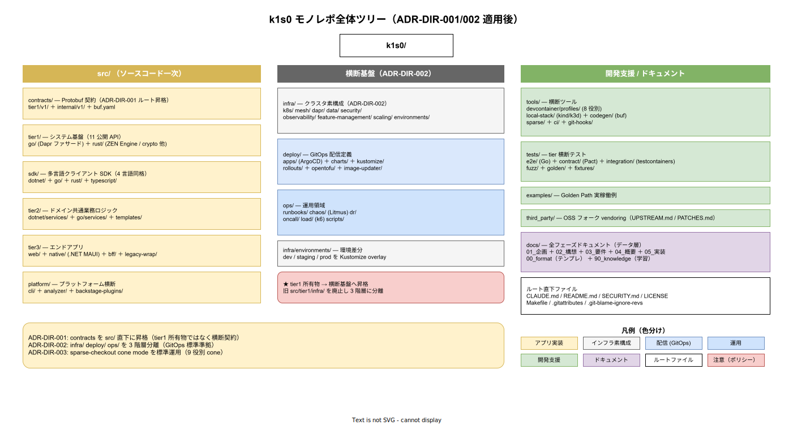

# 02. src 配下の層別分割

本ファイルは `src/` ディレクトリ配下を 6 つの層に分割する方針を確定する。6 層は `contracts` / `tier1` / `sdk` / `tier2` / `tier3` / `platform` で、各層の責務境界と依存方向は [05_依存方向ルール.md](05_依存方向ルール.md) で詳述する。



## 層別分割が必要な理由

k1s0 は tier1 / tier2 / tier3 の 3 層アーキテクチャを基本とするが、実装リポジトリの物理配置ではこれに加えて以下の 3 要素を考慮する必要がある。

- **contracts** : tier1 / tier2 / tier3 / SDK 横断の契約は tier1 所有物ではなく独立資産（[ADR-DIR-001](../../../02_構想設計/adr/ADR-DIR-001-contracts-elevation.md)）
- **sdk** : tier1 公開 API の多言語クライアントライブラリは tier1 実装と独立に配布される
- **platform** : 雛形 CLI・analyzer・Backstage プラグインは tier1/2/3 のどれにも属さないメタ資産

これらを tier1 / tier2 / tier3 の 3 層に押し込むと、CODEOWNERS の path-pattern と責任チームの対応が取れず、依存方向の一方向化も崩れる。本ファイルは 6 層に明示的に分割する。

## src/ の 6 層構造

```text
src/
├── contracts/          # Protobuf 契約の単一の真実
├── tier1/              # tier1 システム基盤層（Go + Rust）
├── sdk/                # 多言語クライアント SDK（C# / Go / TS / Rust）
├── tier2/              # ドメイン共通業務ロジック（.NET + Go）
├── tier3/              # エンドアプリ（Web / MAUI / BFF / Legacy wrap）
└── platform/           # 雛形 CLI / analyzer / Backstage プラグイン
```

## 各層の役割

### contracts

**役割**: Protobuf 契約ファイル（`.proto`）の一元管理。buf module 境界を `src/contracts/` 直下に置く。

**内部構造**:

```text
src/contracts/
├── buf.yaml
├── buf.gen.yaml
├── buf.lock
├── tier1/
│   └── v1/             # tier1 公開 11 API
└── internal/
    └── v1/             # tier1 内部 gRPC（facade → rust）
```

**所有権**: `@k1s0/contract-reviewers`

**対応**: [20_tier1レイアウト/02_contracts配置.md](../20_tier1レイアウト/02_contracts配置.md)

### tier1

**役割**: tier1 公開 11 API の Go ファサード + Rust 自作領域。

**内部構造**:

```text
src/tier1/
├── go/                 # Dapr ファサード 3 Pod（DS-SW-COMP-124）
└── rust/               # 自作 3 Pod（DS-SW-COMP-129）
```

**所有権**: `@k1s0/tier1-rust` + `@k1s0/tier1-go`

**対応**: [20_tier1レイアウト/](../20_tier1レイアウト/)

### sdk

**役割**: tier1 公開 11 API の多言語クライアントライブラリ。

**内部構造**:

```text
src/sdk/
├── dotnet/             # C# NuGet
├── go/                 # Go module（独立）
├── typescript/         # npm workspace package
└── rust/               # Rust crate（採用後の運用拡大時 骨組み）
```

**所有権**: `@k1s0/sdk-team`

**依存方向**: `src/contracts/tier1/v1/*.proto` を入力として buf generate の生成物を保持する

**対応**: [20_tier1レイアウト/05_SDK配置.md](../20_tier1レイアウト/05_SDK配置.md)

### tier2

**役割**: ドメイン共通業務ロジック。採用側組織の業務の実装例やテンプレートを含む。

**内部構造**:

```text
src/tier2/
├── dotnet/
│   └── services/       # C# ドメインサービス
├── go/
│   └── services/       # Go ドメインサービス
└── templates/          # 雛形 CLI 参照用サービステンプレ
```

**所有権**: `@k1s0/tier2-dev`

**依存方向**: SDK（`src/sdk/dotnet/` / `src/sdk/go/`）経由で tier1 にアクセス

**対応**: [30_tier2レイアウト/](../30_tier2レイアウト/)

### tier3

**役割**: エンドアプリ。Web / MAUI / BFF / Legacy ラッパー。

**内部構造**:

```text
src/tier3/
├── web/                # React + TS + pnpm workspace
├── native/             # .NET MAUI
├── bff/                # Backend For Frontend
└── legacy-wrap/        # .NET Framework ラッパー（ADR-MIG-001）
```

**所有権**: `@k1s0/tier3-web` + `@k1s0/tier3-native`

**依存方向**: SDK（`src/sdk/typescript/` / `src/sdk/dotnet/` / `src/sdk/go/`）を介して tier2 または tier1 にアクセス

**対応**: [40_tier3レイアウト/](../40_tier3レイアウト/)

### platform

**役割**: 雛形 CLI、analyzer（Roslyn / go-linter）、Backstage プラグイン。tier1/2/3 のいずれにも属さないメタ資産。

**内部構造**:

```text
src/platform/
├── cli/                    # Rust 製 k1s0 CLI（雛形生成・configマイグレーション）
├── analyzer/               # Roslyn / go-linter プラグイン
└── backstage-plugins/      # Backstage ポータル用プラグイン
```

**所有権**: `@k1s0/platform-team`

**依存方向**: contracts / tier1 SDK を参照することはあるが、逆参照はなし。cli は tier2 / tier3 の scaffolding に templates/ を参照

**対応**: [70_共通資産/](../70_共通資産/) および本章。platform 配下は リリース時点で 最小実装 / 拡張、採用後の運用拡大時 で Backstage 統合。

## src/ 配下に置かないもの

以下は `src/` 配下には配置しない。

- **Kubernetes マニフェスト**: → `infra/`
- **ArgoCD Application / Kustomize overlays**: → `deploy/`
- **Runbook / Chaos スクリプト**: → `ops/`
- **CI helper / codegen ツール**: → `tools/`
- **E2E / Contract / Integration テスト**: → `tests/`
- **サンプル実装**: → `examples/`
- **vendored OSS**: → `third_party/`
- **設計文書**: → `docs/`

理由は責務境界の明確化（IMP-DIR-ROOT-001）と生成物とソースの分離（IMP-DIR-ROOT-005）に基づく。

## 層ごとの導入タイミング

| 層 | リリース時点 | リリース時点 | リリース時点 | リリース時点 | 採用後の運用拡大時 |
|---|---|---|---|---|---|
| contracts | 構造のみ | tier1 v1 全 11 API | internal v1 追加 | 契約 breaking 管理強化 | tier2/3 独自契約追加 |
| tier1 | 構造のみ | go + rust 全 6 Pod 実装 | HA 化 | 品質確保 | 拡張 |
| sdk | 構造のみ | C# + TS 最小実装 | Go 追加 | Rust 骨組み | 4 言語完成度向上 |
| tier2 | 構造のみ | テンプレのみ | 採用側組織の業務サービス 2-3 個 | 拡張 | 拡張 |
| tier3 | 構造のみ | 配信ポータル最小 | Web + BFF 本格運用 | MAUI + Legacy-wrap | 拡張 |
| platform | 構造のみ | CLI 最小 | analyzer | Backstage プラグイン骨組み | Backstage 本格運用 |

## 対応 IMP-DIR ID

- IMP-DIR-ROOT-009（src 配下の層別分割）

## 対応 ADR / DS-SW-COMP / 要件

- ADR-DIR-001（contracts 昇格）
- ADR-TIER1-001（Go + Rust ハイブリッド）/ ADR-TIER1-002（Protobuf）/ ADR-TIER1-003（内部言語不可視）
- DS-SW-COMP-120（改訂後）/ DS-SW-COMP-124 / DS-SW-COMP-129
- FR-\* / NFR-C-NOP-002 / DX-GP-\*
