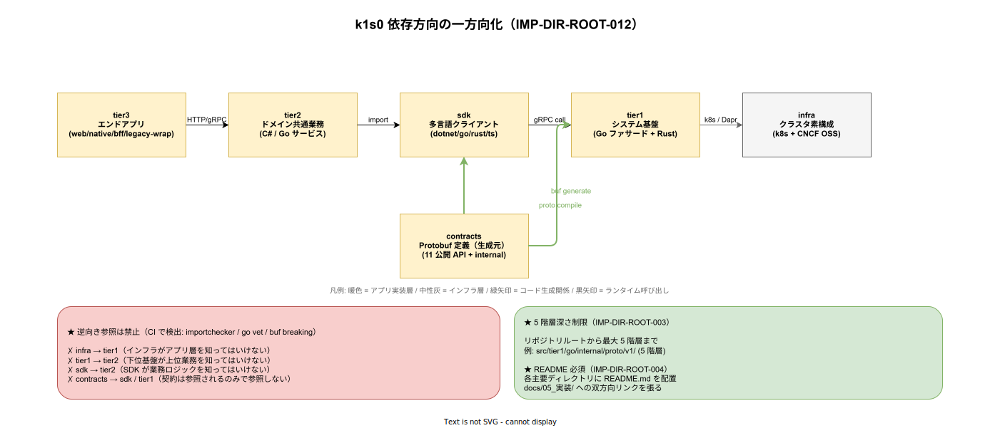

# 05. 依存方向ルール

本ファイルは `src/` 配下の 6 層（contracts / tier1 / sdk / tier2 / tier3 / platform）と横断ディレクトリ（infra / deploy / ops）の間の依存方向を一方向化するルールを固定する。物理配置レベルで依存方向を強制することで、論理設計 [../../../04_概要設計/20_ソフトウェア方式設計/01_コンポーネント方式設計/05_モジュール依存関係.md](../../../04_概要設計/20_ソフトウェア方式設計/01_コンポーネント方式設計/05_モジュール依存関係.md) を裏切るコードが CI で検出される状態を作る。



## 依存方向一方向化が必要な理由

依存が双方向（循環）になると、以下の破綻が発生する。

- あるモジュールのバグ修正が「上位」「下位」の両方に波及し、変更のリスク評価が困難になる
- ビルド順序の決定が不可能となり、並列ビルドの効率が落ちる
- テスト対象を絞れず、1 つの小変更でもフル E2E テストが必要になる
- 将来の OSS 置換 / 言語切替で、依存先を独立に刷新できなくなる

本ファイルは論理レベルの一方向性を、ビルドツール設定・ディレクトリ構造・CI lint の 3 層で強制する。

## 許容される依存方向

以下の矢印方向のみ許容する。

```
[tier3]  ─→  [tier2]  ─→  [sdk]  ─→  [contracts]
                         ↗
                    [tier1]  ─→  [contracts]
                         ↓
                     [infra]

[platform]  ─→  [contracts] / [tier1] (参照のみ、依存ではない場合あり)
```

### 矢印の意味

- `A ─→ B` : A は B に依存する。A は B の公開シンボルを参照してよい
- 逆方向は禁止（`B ─→ A` は許容されない）

### 具体的なルール

- **tier3** は tier2 と sdk に依存する。tier1 / contracts / infra / ops を直接参照してはいけない
- **tier2** は sdk に依存する。tier1 / contracts / infra / tier3 を直接参照してはいけない
- **sdk** は contracts に依存する。tier1 / tier2 / tier3 / infra を参照してはいけない
- **tier1** は contracts に依存する。sdk / tier2 / tier3 を参照してはいけない。infra の Dapr Components を参照するが、これは実行時の Sidecar 連携であり、コード依存ではない
- **contracts** は独立。どのレイヤーも参照しない
- **platform** は contracts / tier1 を参照できる（雛形 CLI が tier1 の公開 API スキーマを scaffolding 時に参照するため）。platform から tier2 / tier3 への参照は templates を介する間接参照のみ
- **infra** は宣言的 YAML のため、コード依存ではなく実行時連携。Kubernetes Service 経由で Pod にアクセスする構造のみ
- **deploy** は宣言的 YAML。infra を参照し、image tag を通じて src/ のビルド成果物に紐付く
- **ops** は infra / deploy の状態に対する運用手順。宣言的 YAML ではなくスクリプトと Markdown

## ビルドツールでの強制

### Rust workspace

`src/tier1/rust/Cargo.toml` の `[workspace]` `members` は以下のみ列挙する。

```toml
[workspace]
members = [
  "crates/audit",
  "crates/decision",
  "crates/pii",
  "crates/common",
  "crates/proto-gen",
  "crates/otel-util",
  "crates/policy",
]
```

`src/sdk/rust/Cargo.toml` は独立 workspace で、tier1 Rust の crates を `path` 依存では参照しない。sdk と tier1 は contracts の buf generate 出力経由で間接的に連携する。

`crates/*/Cargo.toml` 内で、tier1 外部のディレクトリを `path` 依存にすることは禁止。外部参照は `[workspace.dependencies]` 経由の crates.io / BSR 依存のみ。

### Go module

Go は tier ごとに独立 go.mod を持つ。

- `src/tier1/go/go.mod` : module `github.com/k1s0/k1s0/src/tier1/go`
- `src/sdk/go/go.mod` : module `github.com/k1s0/k1s0/src/sdk/go`
- `src/tier2/go/go.mod` : module `github.com/k1s0/k1s0/src/tier2/go`
- `src/tier3/bff/go.mod` : module `github.com/k1s0/k1s0/src/tier3/bff`

`replace` 指示は使わない（依存方向違反を招く可能性）。各 go.mod は `src/sdk/go/` / `src/contracts/` 生成の Go 型のみ import し、他 tier の internal は参照しない。

### pnpm workspace

`src/tier3/web/pnpm-workspace.yaml` で tier3 Web の workspace を宣言する。

```yaml
packages:
  - 'apps/*'
  - 'packages/*'
```

`src/sdk/typescript/` は別 workspace として扱い、`pnpm-workspace.yaml` では `apps/*` / `packages/*` のみ含む。SDK は npm publish 経由で tier3 Web が参照する（monorepo 内で publish 不要時は `pnpm link` で参照、ただし CI では publish 経路を通すのが原則）。

### .NET ソリューション

`src/tier2/dotnet/` と `src/tier3/native/` と `src/sdk/dotnet/` はそれぞれ独立 `.sln` を持つ。

- `src/tier2/dotnet/Tier2.sln`
- `src/tier3/native/Tier3Native.sln`
- `src/sdk/dotnet/Sdk.sln`

相互の `<ProjectReference>` は禁止。代わりに SDK を NuGet package として publish し、tier2 / tier3 は NuGet 経由で参照する。

## CI lint での強制

以下の 3 種類の lint を CI で必須化する。

### Rust: cargo-deny + 自作 linter

`cargo deny check` で `bans` セクションを使い、禁止 crate を定義する。加えて自作 Rust linter（`tools/ci/rust-dep-check/`）で `src/tier1/rust/crates/*/Cargo.toml` の `[dependencies]` に `src/sdk/rust/` や `src/tier2/` 配下の path 依存が混入していないかを検証する。

### Go: 独自 linter

自作 Go linter（`tools/ci/go-dep-check/`）で、`import` 宣言の prefix が依存方向ルールに従っていることを検証する。たとえば `src/tier1/go/` の .go ファイルが `github.com/k1s0/k1s0/src/tier2/` を import している場合、lint エラーとする。

### TypeScript: eslint-plugin-boundaries

`src/tier3/web/` と `src/sdk/typescript/` で `eslint-plugin-boundaries`（または `eslint-plugin-import`）を使い、import 先のディレクトリが許容された依存方向内であることを検証する。

## CI 上の path-filter との対応

CI の path-filter は依存方向ルールとは別軸で「何が変わったか」を検出する。両者の対応は以下。

- `src/contracts/**` 変更 → contracts ビルド + tier1 / sdk / tier2 / tier3 の全再ビルド
- `src/tier1/go/**` 変更 → tier1 Go ビルドのみ（tier2 / tier3 は sdk を介するため、直接の再ビルド不要）
- `src/tier1/rust/**` 変更 → tier1 Rust ビルドのみ
- `src/sdk/**` 変更 → sdk ビルド + tier2 / tier3 の再ビルド
- `src/tier2/**` 変更 → tier2 ビルドのみ
- `src/tier3/**` 変更 → tier3 ビルドのみ
- `infra/**` 変更 → ArgoCD sync（該当 Application のみ）
- `deploy/**` 変更 → ArgoCD ApplicationSet 再評価

## 違反検出の運用フロー

依存方向違反が CI で検出された場合、以下の順で対応する。

1. 違反を起こした PR は即座にブロック（マージ不可）
2. 違反の内容を PR comment で機械的に出力（`tools/ci/dep-check/` がコメント投稿）
3. 違反修正方法を 3 つの選択肢で提示:
   - **選択肢 A**: 正しい方向に依存を書き換える（推奨）
   - **選択肢 B**: 違反先のシンボルを contracts または sdk 経由で公開し直す
   - **選択肢 C**: 依存方向ルールそのものを ADR 起票で変更する（極めて重い）
4. どの選択肢を取るかは PR 著者が PR comment で宣言し、アーキテクチャ評議会（`@k1s0/arch-council`）がレビュー

## 対応 IMP-DIR ID

- IMP-DIR-ROOT-002（依存方向の一方向化、原則）
- IMP-DIR-ROOT-009（src 配下の層別分割）の依存面

## 対応 ADR / DS-SW-COMP / 要件

- ADR-DIR-001 / ADR-DIR-002
- DS-SW-COMP-119（モジュール依存関係）
- NFR-C-NOP-002（可視性）/ DX-CICD-\*
