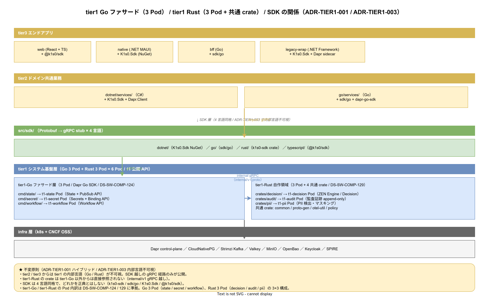

# 01. tier1 全体配置

本ファイルは `src/tier1/` 配下のトップレベル構成を確定する。概要設計 DS-SW-COMP-120 の改訂後構成を物理配置レベルに落とし込み、ADR-DIR-001（contracts 昇格）と ADR-DIR-002（infra 分離）の帰結を明示する。



## 改訂前後の対比

### DS-SW-COMP-120 改訂前（旧）

```
src/tier1/
├── contracts/        # Protobuf .proto 一元配置
├── go/               # Go module（Dapr ファサード層）
├── rust/             # Cargo workspace（自作領域）
└── infra/            # Kubernetes / Dapr / Helm
```

### DS-SW-COMP-120 改訂後（新）

```
src/tier1/
├── go/               # Go module（Dapr ファサード層）
└── rust/             # Cargo workspace（自作領域）

# contracts は src/contracts/（ルート昇格）
# infra は infra/（ルート昇格）
```

## tier1 配下の 2 サブディレクトリ

### src/tier1/go/

Dapr ファサード 3 Pod（State / Secret / Workflow）の Go 実装。DS-SW-COMP-124 の Go project layout を継承する。

**Pod 構成**（リリース時点）:

- `cmd/state/` : t1-state Pod（Dapr State Building Block をラップ）
- `cmd/secret/` : t1-secret Pod（Dapr Secrets Building Block をラップ）
- `cmd/workflow/` : t1-workflow Pod（Dapr Workflow Building Block をラップ）

**依存方向**: `src/contracts/` → `src/tier1/go/`

**所有権**: `@k1s0/tier1-go`

**詳細**: [03_go_module配置.md](03_go_module配置.md)

### src/tier1/rust/

自作 3 Pod（Decision / Audit / PII）と tier1 共通 crate の Rust 実装。DS-SW-COMP-129 の Cargo workspace layout を継承する。

**Pod 構成**（リリース時点）:

- `crates/decision/` : t1-decision Pod（ZEN Engine によるルール評価）
- `crates/audit/` : t1-audit Pod（監査証跡、append-only）
- `crates/pii/` : t1-pii Pod（PII 検出・マスキング）

**共通 crate**:

- `crates/common/` : k1s0-common（横断 utility）
- `crates/proto-gen/` : buf generate の Rust 出力
- `crates/otel-util/` : OpenTelemetry 連携
- `crates/policy/` : Policy Enforcer

**依存方向**: `src/contracts/` → `src/tier1/rust/crates/proto-gen/` → 他 crate

**所有権**: `@k1s0/tier1-rust`

**詳細**: [04_rust_workspace配置.md](04_rust_workspace配置.md)

## tier1 配下に置かないもの

以下は tier1 配下から外してルートに昇格した。

- **contracts**: `src/contracts/` へ昇格（ADR-DIR-001）
- **infra**: `infra/` へ昇格（ADR-DIR-002）
- **Dapr Components**: `infra/dapr/components/` に配置（ADR-DIR-002）
- **Helm charts**: `deploy/charts/tier1/` に配置（ADR-DIR-002）
- **Kubernetes マニフェスト**: `infra/k8s/` または `deploy/kustomize/base/tier1/` に配置
- **Runbook**: `ops/runbooks/tier1/` に配置

## Pod 単位のビルド独立性

tier1 の 6 Pod（Go 3 Pod + Rust 3 Pod）は独立にビルド・デプロイ可能。具体的な帰結。

- Go 3 Pod は `src/tier1/go/` の go.mod 内で `cmd/state/` `cmd/secret/` `cmd/workflow/` それぞれに `main.go` を持ち、`go build ./cmd/<pod>/` で個別ビルド可能
- Rust 3 Pod は `src/tier1/rust/crates/decision/` `crates/audit/` `crates/pii/` それぞれが独立の bin crate で、`cargo build -p <crate-name>` で個別ビルド可能
- CI の path-filter で変更検出を個別ディレクトリ単位で行い、影響 Pod のみ再ビルド

## Container image 構成

6 Pod それぞれが独立 Container image を持つ。

- `ghcr.io/k1s0/t1-state:<tag>` / `ghcr.io/k1s0/t1-secret:<tag>` / `ghcr.io/k1s0/t1-workflow:<tag>` : Go 3 Pod（DS-SW-COMP-128）
- `ghcr.io/k1s0/t1-decision:<tag>` / `ghcr.io/k1s0/t1-audit:<tag>` / `ghcr.io/k1s0/t1-pii:<tag>` : Rust 3 Pod（DS-SW-COMP-134）

image tag は `<semver>-<git-commit-hash>` 形式（DS-SW-COMP-128 / 134）。

## スパースチェックアウト cone との関係

- `tier1-rust-dev` cone : `src/contracts/` + `src/tier1/rust/` + `docs/`
- `tier1-go-dev` cone : `src/contracts/` + `src/tier1/go/` + `docs/`

Go 担当者と Rust 担当者の役割が明確に分離される。両方を兼任するケースは `full` cone または複数 cone の union を選ぶ運用。

## 対応 IMP-DIR ID

- IMP-DIR-T1-021（tier1 全体配置）

## 対応 ADR / DS-SW-COMP / 要件

- ADR-DIR-001（contracts 昇格）/ ADR-DIR-002（infra 分離）
- ADR-TIER1-001（Go+Rust ハイブリッド）/ ADR-TIER1-003（内部言語不可視）
- DS-SW-COMP-120（改訂後）
- NFR-C-NOP-002 / DX-CICD-\* / DX-GP-\*
