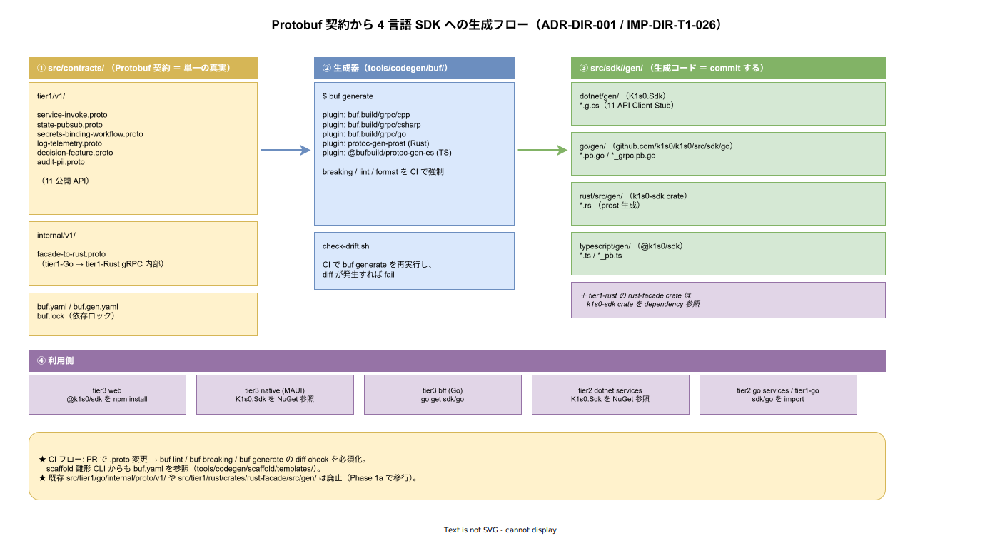

# 02. contracts 配置

本ファイルは `src/contracts/` の内部構造を確定する。ADR-DIR-001 の決定により `src/tier1/contracts/` から `src/contracts/` に昇格した配置の詳細を規定する。DS-SW-COMP-121（改訂後）の物理表現である。



## 昇格の背景

ADR-DIR-001 で論じた通り、契約は tier1 所有物ではなく tier1 / tier2 / tier3 / SDK 横断の共有資産である。Phase 1a 時点では tier1 公開 11 API のみだが、Phase 1b 以降で tier2 / tier3 が独自 Protobuf を持つケース、および tier1 内部通信（facade → rust）が Protobuf 化されるケースを見越して、ディレクトリ階層に「公開 / 内部」の区別を明示する。

## src/contracts/ の内部構造

```
src/contracts/
├── README.md
├── buf.yaml              # buf モジュール設定
├── buf.gen.go.yaml       # 生成設定（Go 向け: tier1 サーバー + SDK）
├── buf.gen.rust.yaml     # 生成設定（Rust 向け: tier1 サーバー + SDK）
├── buf.gen.ts.yaml       # 生成設定（TypeScript 向け: SDK のみ）
├── buf.gen.csharp.yaml   # 生成設定（C# 向け: SDK のみ）
├── buf.lock              # 依存 lock
├── tier1/
│   └── v1/               # tier1 公開 11 API
│       ├── state.proto
│       ├── pubsub.proto
│       ├── serviceinvoke.proto
│       ├── secrets.proto
│       ├── binding.proto
│       ├── workflow.proto
│       ├── log.proto
│       ├── telemetry.proto
│       ├── decision.proto
│       ├── audit.proto
│       └── feature.proto
└── internal/
    └── v1/               # tier1 内部 gRPC（facade → rust）
        ├── common.proto
        ├── errors.proto
        └── pii.proto
```

## tier1/v1/ と internal/v1/ の分離

### tier1/v1/ の役割

tier1 が tier2 / tier3 / SDK / 外部システムに公開する 11 API の契約。FR-\* 要件（Service Invoke / State / PubSub / Secrets / Binding / Workflow / Log / Telemetry / Decision / Audit-Pii / Feature）に 1:1 対応する。

SDK はこの配下の .proto のみを buf generate の入力とする。tier2 / tier3 は SDK を介してアクセスするため、`tier1/v1/` を直接見ることはない。

### internal/v1/ の役割

tier1 内部の Go ファサード層 と Rust 自作領域 の間で通信する gRPC 契約。外部非公開。

`pii.proto` は tier1 内部の PII Pod と Audit Pod の間で使う gRPC 契約。`common.proto` / `errors.proto` は tier1 内部の横断型。

### 分離の帰結

- SDK の buf generate 対象は `src/contracts/tier1/v1/` 配下のみ
- tier1 Go + Rust の buf generate 対象は `src/contracts/tier1/v1/` + `src/contracts/internal/v1/` 両方
- 外部に公開してはいけない契約が誤って SDK に混入するリスクを構造的に排除

## buf module 境界戦略

`src/contracts/` は **単一 buf module** として管理する（サブディレクトリごとに buf module を分割しない）。module 内で package 分離（`k1s0.tier1.v1` と `k1s0.tier1.internal.v1`）によって「公開 / 内部」の論理境界を表現する。

### 単一 module の根拠

- **breaking check の一貫性**: `buf breaking` は module 単位で差分検出する。複数 module に分けると internal → tier1 間の型参照の breaking を跨ぎ検出できず、「internal 側を壊したら公開側も壊れる」事故を見逃す
- **import 解決の単純さ**: 同 module 内なら相対 import が `import "k1s0/tier1/internal/v1/pii.proto"` で済む。複数 module だと BSR (Buf Schema Registry) への登録 + `deps:` 指定が必要になり、tier1 専用契約のために社外 BSR を経由する設計上の歪みが生じる
- **buf generate の並列性**: 単一 module 配下で複数 plugin を実行するほうが、`buf generate --path` による tier1 / internal / SDK ごとの出力分岐が扱いやすい

### package 命名の明示

公開 / 内部の境界は **package 命名** で強制する。

- `src/contracts/tier1/v1/*.proto`: `package k1s0.tier1.v1;`
- `src/contracts/internal/v1/*.proto`: `package k1s0.tier1.internal.v1;`

SDK 用 `buf generate` は `include_types: ["k1s0.tier1.v1.*"]` で `internal` package を除外する。tier1 実装用 `buf generate` は両方を入力にする。この `include_types` による分岐が 1 module 体制の要。

### Phase 2 以降の module 分割判断

tier2 / tier3 が独自 Protobuf を持つ段階で再評価する。具体的には以下の 2 条件を両方満たしたら module 分割の ADR を起票する。

1. tier2 / tier3 契約の breaking 頻度が tier1 契約の 2 倍超
2. BSR 公開（OSS 化 / 外部連携）が必要な module が出現

## buf.yaml の推奨サンプル

```yaml
version: v2
modules:
  - path: .                    # src/contracts/ 全体を 1 module として扱う
lint:
  use:
    - STANDARD
  except:
    - PACKAGE_VERSION_SUFFIX   # v1 命名を許容
    - FIELD_NOT_REQUIRED       # proto3 の required 非推奨に従う
breaking:
  use:
    - FILE
deps:
  - buf.build/googleapis/googleapis
```

## buf.gen.*.yaml の推奨サンプル

`src/contracts/buf.gen.*.yaml` の単一原典を **2 ファイルに分離** する。SDK に internal package を絶対に混入させないため、plugin セットと `include_types` を yaml 単位で切り分ける。

- `buf.gen.tier1.yaml`: tier1 内部実装用（公開 + internal の両方を生成）
- `buf.gen.sdk.yaml`: SDK 公開用（公開 package のみを生成）

1 yaml で `include_types` を切り替える方式は buf v2 の `inputs:` がファイル単位の filter である関係で plugin 毎の分岐ができず、SDK と tier1 実装が同じ入力を共有してしまうため採用しない。

### `src/contracts/buf.gen.tier1.yaml`（tier1 内部実装用）

```yaml
version: v2
plugins:
  # Go 生成 → src/tier1/go/internal/proto/tier1/v1/（proto package `k1s0.tier1.v1` が階層を決める）
  - remote: buf.build/protocolbuffers/go
    out: ../tier1/go/internal/proto
    opt: paths=source_relative
  - remote: buf.build/grpc/go
    out: ../tier1/go/internal/proto
    opt: paths=source_relative

  # Rust 生成（prost + tonic）→ src/tier1/rust/crates/proto-gen/src/tier1/v1/
  - remote: buf.build/community/neoeinstein-prost
    out: ../tier1/rust/crates/proto-gen/src
  - remote: buf.build/community/neoeinstein-tonic
    out: ../tier1/rust/crates/proto-gen/src

inputs:
  - directory: .
    # tier1 実装は公開 + internal の両方を必要とする
    include_types:
      - k1s0.tier1.v1.*
      - k1s0.tier1.internal.v1.*
```

### `src/contracts/buf.gen.sdk.yaml`（SDK 公開用）

```yaml
version: v2
plugins:
  # C# SDK 生成 → src/sdk/dotnet/generated/
  - remote: buf.build/protocolbuffers/csharp
    out: ../sdk/dotnet/generated
  - remote: buf.build/grpc/csharp
    out: ../sdk/dotnet/generated

  # TypeScript SDK 生成 → src/sdk/typescript/packages/proto/src/
  - remote: buf.build/connectrpc/es
    out: ../sdk/typescript/packages/proto/src

  # Go SDK 生成 → src/sdk/go/proto/tier1/v1/
  - remote: buf.build/protocolbuffers/go
    out: ../sdk/go/proto
    opt: paths=source_relative
  - remote: buf.build/grpc/go
    out: ../sdk/go/proto
    opt: paths=source_relative

  # Rust SDK 生成（Phase 2） → src/sdk/rust/crates/k1s0-sdk-proto/src/gen/v1/
  - remote: buf.build/community/neoeinstein-prost
    out: ../sdk/rust/crates/k1s0-sdk-proto/src/gen
  - remote: buf.build/community/neoeinstein-tonic
    out: ../sdk/rust/crates/k1s0-sdk-proto/src/gen

inputs:
  - directory: .
    # SDK は公開 package のみ。internal を混入させない（設計上の一線）
    include_types:
      - k1s0.tier1.v1.*
```

### 実行フロー

`tools/codegen/buf/gen.sh` は両 yaml を順に呼び出す。

```bash
cd src/contracts
buf generate --template buf.gen.tier1.yaml
buf generate --template buf.gen.sdk.yaml
```

`buf generate` を 2 回呼ぶコストは軽微。分離により SDK レビューで internal の漏れを構造的に排除できる利点が上回る。

上記は雛形。Phase 1a の実装時にパスと plugin バージョンを確定する。

## 生成物の git commit 方針

生成物は git commit する（DS-SW-COMP-122 継承）。ただし以下の明示的ルールを適用。

- 生成ファイルは `// Code generated by protoc. DO NOT EDIT.` ヘッダを持つ
- 手動編集禁止。`.gitattributes` で `linguist-generated=true`
- CI で `buf generate` 後の diff が 0 であることを検証（drift 検出）
- 生成ディレクトリ（`internal/proto/tier1/v1/` / `crates/proto-gen/src/tier1/v1/` / `dotnet/generated/` / `typescript/packages/proto/src/` / `go/proto/tier1/v1/` / `rust/crates/k1s0-sdk-proto/src/gen/v1/`）は cone 定義に含めて全開発者に見える状態を保つ

## 契約変更時のレビューフロー

契約の変更は以下の順で行う。

1. 契約変更 PR を起票（`src/contracts/` 配下の `.proto` のみ変更）
2. CODEOWNERS により `@k1s0/contract-reviewers` の approval が必須
3. `buf breaking` で FILE 単位の破壊的変更チェック → 警告のみ、マージはブロックしない（major version の正当な breaking はあるため）
4. 破壊的変更がある場合、同 PR で `/v1/` から `/v2/` への分岐を同時作成
5. 契約 PR がマージされると、CI で全言語の buf generate が実行され、その成果物を次の PR（実装 PR）で commit
6. 実装 PR は tier1 Go / Rust / SDK 各担当の approval 必須

## CODEOWNERS

```
/src/contracts/                                 @k1s0/contract-reviewers
/src/contracts/buf.yaml                         @k1s0/contract-reviewers @k1s0/arch-council
/src/contracts/buf.gen.yaml                     @k1s0/contract-reviewers @k1s0/platform-team
/src/contracts/tier1/                           @k1s0/contract-reviewers @k1s0/tier1-rust @k1s0/tier1-go
/src/contracts/internal/                        @k1s0/contract-reviewers @k1s0/tier1-rust @k1s0/tier1-go
```

`@k1s0/contract-reviewers` を `internal/` にも関与させる意図は、外部公開契約と同一の Protobuf スタイルガイド（命名規則 / package 規約 / reserved 番号 / breaking change 判定）を内部契約にも一貫適用するため。`internal/` は外部公開しないが、以下のリスクが実際にあり、それを `contract-reviewers` の目で防ぐ。

- tier1 内部 gRPC の wire 互換を壊した場合、Go facade Pod と Rust 自作 Pod の deploy 順序次第で live incident になる
- 将来 `internal/` の型を `tier1/v1/` に昇格する判断が発生した際、命名規則が不統一だと PR が大きく膨らむ
- `internal/` の message が外部契約 `tier1/v1/` から import されると、一部が事実上公開契約の一部として露出する

approval の動線としては、tier1-rust / tier1-go が主レビュア（実装の影響範囲を評価）、contract-reviewers が補助レビュア（契約の文法・規約を評価）として機能する。

## スパースチェックアウト cone との関係

`src/contracts/` はほぼ全 cone に含まれる。

- `tier1-rust-dev` / `tier1-go-dev` / `tier2-dev` / `tier3-web-dev`（SDK 経由で間接参照だが、デバッグ時に直接見ることもある） / `tier3-native-dev` / `platform-cli-dev` / `docs-writer` / `full` の 8 cone で含まれる
- `infra-ops` のみ除外（infra 担当は契約を見ない）

## 対応 IMP-DIR ID

- IMP-DIR-T1-022（src/contracts/ 配置）

## 対応 ADR / DS-SW-COMP / 要件

- ADR-DIR-001（contracts 昇格）
- ADR-TIER1-002（Protobuf）
- DS-SW-COMP-121（改訂後）/ DS-SW-COMP-122 / DS-SW-COMP-123
- FR-\*（11 API 全般）/ DX-CICD-\*
