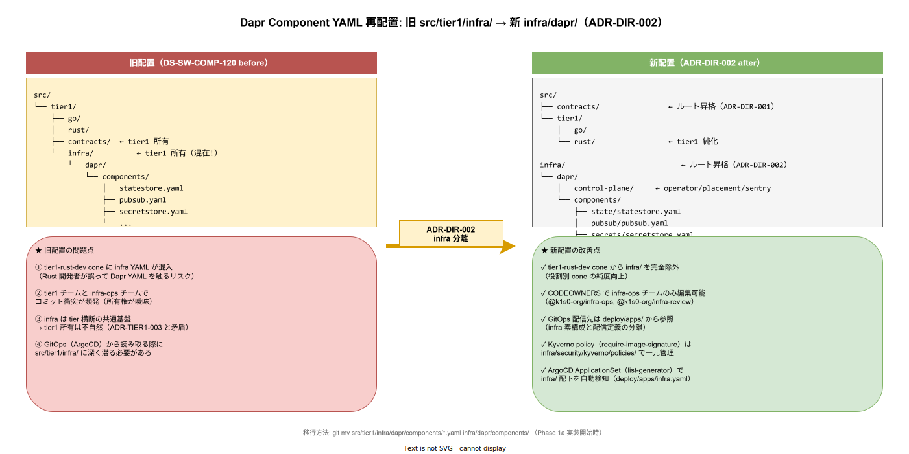

# 04. Dapr Component 配置

本ファイルは `infra/dapr/` 配下の配置を確定する。旧 DS-SW-COMP-120 で `src/tier1/infra/dapr/` に配置されていた Dapr Control Plane と Dapr Component CRD を、ADR-DIR-002 に従い `infra/dapr/` に移設した状態を規定する。



## 旧配置との関係

改訂前は `src/tier1/infra/dapr/` に Dapr 関連資産が集まっていたが、実装者（tier1-rust-dev / tier1-go-dev）が編集する場所ではなく、インフラ運用者が管理する領域のため、ルート `infra/` に昇格した。これにより以下の改善を得る。

- `tier1-rust-dev` / `tier1-go-dev` スパースチェックアウトに Dapr YAML が混入しない
- GitOps 運用の配信対象が `infra/` と `deploy/` に明確分離される
- Dapr 構成変更のレビュアーを `@k1s0/sre-ops` に絞れる

## レイアウト

```text
infra/dapr/
├── README.md
├── control-plane/
│   ├── values.yaml                 # dapr-system Helm chart values
│   ├── crd/
│   │   └── dapr-crds.yaml          # dapr.io CRD 定義（operator 展開前に先行適用）
│   ├── operator/
│   │   └── deployment.yaml
│   ├── placement/
│   │   └── statefulset.yaml
│   ├── sentry/                     # mTLS 用 CA
│   │   ├── values.yaml
│   │   └── ca-bundle-secret.yaml
│   ├── injector/                   # sidecar-injector webhook
│   │   └── deployment.yaml
│   └── scheduler/                  # Dapr Workflow scheduler
│       └── statefulset.yaml
├── components/
│   ├── state/
│   │   ├── postgres.yaml           # state.postgresql
│   │   └── redis-cache.yaml        # state.valkey（キャッシュ）
│   ├── pubsub/
│   │   └── kafka.yaml              # pubsub.kafka
│   ├── secrets/
│   │   └── vault.yaml              # secretstores.hashicorp.vault
│   ├── binding/
│   │   ├── s3-inbound.yaml         # bindings.aws.s3（MinIO）
│   │   └── smtp-outbound.yaml      # bindings.smtp
│   ├── configuration/
│   │   └── default.yaml            # Dapr Configuration（tracing / mtls）
│   └── workflow/
│       └── temporal.yaml           # workflow.temporal（運用蓄積後）
└── subscriptions/
    ├── audit-pii.yaml              # tier1 AuditPii API 受信先
    └── feature.yaml
```

## control-plane/ の構造

Dapr Control Plane は 5 components（operator / placement / sentry / injector / scheduler）で構成される。これらは `k1s0-dapr` namespace に配置。

- **operator**: CRD watcher、Component の reconcile
- **placement**: Actor placement（採用後の運用拡大時のステートフル ID 割当）
- **sentry**: mTLS CA、短命証明書発行
- **injector**: Pod annotation を見て Dapr sidecar を自動注入する admission webhook
- **scheduler**: Workflow API の scheduler（運用蓄積後）

Helm chart `dapr/dapr` の values.yaml を `control-plane/values.yaml` に配置。

```yaml
# control-plane/values.yaml
global:
  ha:
    enabled: true                   # 各 control-plane を 3 replica
    replicaCount: 3
  mtls:
    enabled: true                   # mTLS 強制
    workloadCertTTL: 24h
  logAsJson: true
  tag: 1.14.0
operator:
  watchInterval: 30s
sentry:
  tls:
    issuer:
      certPath: /tls/ca.crt
      keyPath: /tls/ca.key
injector:
  sidecarRunAsNonRoot: true
```

## components/ の 6 カテゴリ

### state/

tier1 State API の backing store。

- `postgres.yaml`: 主要 state（state.postgresql）、CloudNativePG の Cluster を参照
- `redis-cache.yaml`: キャッシュ用 state（state.valkey）、短時間 TTL データ向け

複数 store を用意することで、アプリが `metadata.stateStore: postgres` / `redis-cache` を指定して使い分けられる。

### pubsub/

tier1 PubSub API の backing store。Kafka 1 択。

```yaml
# components/pubsub/kafka.yaml
apiVersion: dapr.io/v1alpha1
kind: Component
metadata:
  name: kafka-pubsub
  namespace: k1s0-tier1
spec:
  type: pubsub.kafka
  version: v1
  metadata:
    - name: brokers
      value: kafka-kafka-bootstrap.k1s0-data.svc.cluster.local:9092
    - name: authType
      value: mtls
    - name: consumerID
      value: "k1s0-{{.appId}}"
```

### secrets/

tier1 Secrets API の backing store。OpenBao（Vault fork）を採用。

### binding/

tier1 Binding API の binding 先。S3（MinIO）、SMTP、HTTP Webhook 等。

### configuration/

Dapr の tracing / mtls / feature flag 設定。

### workflow/

運用蓄積後で Temporal との統合を予定。採用初期 では使用しない。

## subscriptions/ の役割

tier1 AuditPii API / Feature API が PubSub 経由でイベントを受信する際の Subscription CRD 定義。

```yaml
# subscriptions/audit-pii.yaml
apiVersion: dapr.io/v2alpha1
kind: Subscription
metadata:
  name: audit-pii-subscription
  namespace: k1s0-tier1
spec:
  topic: audit-events
  pubsubname: kafka-pubsub
  routes:
    default: /v1/audit/ingest
scopes:
  - tier1-audit-pii
```

## Component の環境差分

ADR-DIR-002 の infra / deploy 分離原則に従い、環境差分（dev / staging / prod で backing store 接続先が異なる）は **infra レイヤ内で完結** させる。具体的には以下の階層を取る。

```text
infra/
├── dapr/
│   └── components/                     # 型定義 + prod ベース値（base）
│       ├── state-store.yaml
│       ├── secret-store.yaml
│       └── ...
└── environments/
    ├── dev/
    │   └── dapr-components-overlay/    # dev 差分 patch
    │       └── state-store.patch.yaml
    ├── staging/
    │   └── dapr-components-overlay/
    └── prod/
        └── dapr-components-overlay/    # 空（base と一致）
```

`infra/environments/<env>/dapr-components-overlay/` は Kustomize patch として記述し、`infra/dapr/components/` を base に `kustomize build` で最終 YAML を生成する。生成結果を ArgoCD が引く `deploy/apps/application-sets/infra.yaml` で参照する。

この配置により以下が成立する。

- **infra-ops 役割の所有範囲が明確**: Dapr Component の型・環境差分の両方が `infra/` 配下。PR レビュー担当が一元化
- **deploy/ は配信定義のみ**: `deploy/apps/` の ApplicationSet が `infra/environments/<env>/` を参照する片方向関係
- **スパースチェックアウトの一貫性**: `infra-ops` cone に `infra/` を入れるだけで Dapr Component 関連が全て揃う

## 対応 IMP-DIR ID

- IMP-DIR-INFRA-074（Dapr Component 配置）

## 対応 ADR / DS-SW-COMP / 要件

- ADR-DIR-002（infra 分離）
- ADR-CNCF-005（Dapr 採用）
- DS-SW-COMP-122（Dapr Component）の配置先移行
- FR-\*（tier1 公開 API は Dapr Component で backing store を切り替え）
