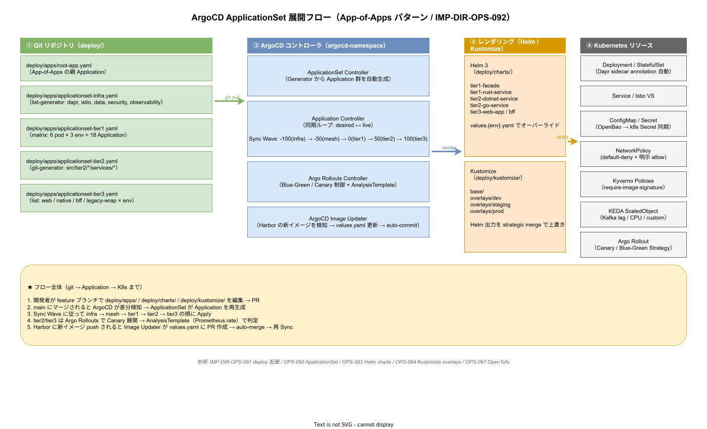

# 02. ArgoCD ApplicationSet 配置

本ファイルは `deploy/apps/` 配下の ArgoCD Application / ApplicationSet 配置を確定する。App-of-Apps パターンで全配信を 1 ルート Application から展開する。



## App-of-Apps パターンの採用理由

ArgoCD では 100 個超の Application を運用することが珍しくない。個別管理は煩雑になるため、以下の階層を採用する。

1. **ルート Application**（`apps/app-of-apps.yaml`）: 1 個、ArgoCD 初期化時に手動で apply
2. **ApplicationSet**（`apps/application-sets/*.yaml`）: カテゴリ毎（infra / tier1 / tier2 / tier3 / ops）、ルートから展開
3. **個別 Application**: ApplicationSet が生成する（git-generator / list-generator で）

この階層により、新 tier1 サービス追加時も ApplicationSet が自動検知する。

## レイアウト詳細

```text
deploy/apps/
├── README.md
├── app-of-apps.yaml            # 最上位 Application
├── application-sets/
│   ├── infra.yaml              # infra/environments/<env>/ 全体
│   ├── tier1.yaml              # src/tier1/go + src/tier1/rust の 6 Pod
│   ├── tier2.yaml              # src/tier2/dotnet/services/ + src/tier2/go/services/
│   ├── tier3.yaml              # src/tier3/web/apps/ + src/tier3/bff + native は image 配布外
│   └── ops.yaml                # ops/chaos/ 等の Runbook 起動定義
└── projects/
    ├── k1s0-platform.yaml      # AppProject 定義
    └── rbac.yaml               # SSO 連携 RBAC
```

## app-of-apps.yaml

ArgoCD が最初に Sync するルート。子 ApplicationSet 群を inspect する。

```yaml
# apps/app-of-apps.yaml
apiVersion: argoproj.io/v1alpha1
kind: Application
metadata:
  name: app-of-apps
  namespace: argocd
spec:
  project: k1s0-platform
  source:
    repoURL: https://github.com/k1s0/k1s0.git
    targetRevision: HEAD
    path: deploy/apps/application-sets
    directory:
      recurse: true
  destination:
    server: https://kubernetes.default.svc
    namespace: argocd
  syncPolicy:
    automated:
      prune: true
      selfHeal: true
```

## ApplicationSet の generator 戦略

### infra.yaml（list-generator）

環境を固定（dev / staging / prod）するため list-generator を使う。

```yaml
apiVersion: argoproj.io/v1alpha1
kind: ApplicationSet
metadata:
  name: infra
  namespace: argocd
spec:
  generators:
    - list:
        elements:
          - env: dev
            cluster: https://dev.k1s0.internal
          - env: staging
            cluster: https://staging.k1s0.internal
          - env: prod
            cluster: https://prod.k1s0.internal
  template:
    metadata:
      name: infra-{{env}}
    spec:
      project: k1s0-platform
      source:
        repoURL: https://github.com/k1s0/k1s0.git
        targetRevision: HEAD
        path: infra/environments/{{env}}
      destination:
        server: "{{cluster}}"
        namespace: ""
```

### tier1.yaml / tier2.yaml / tier3.yaml（git-generator）

新サービス追加を自動検知するため git-generator を使う。

```yaml
apiVersion: argoproj.io/v1alpha1
kind: ApplicationSet
metadata:
  name: tier2
  namespace: argocd
spec:
  generators:
    - matrix:
        generators:
          - git:
              repoURL: https://github.com/k1s0/k1s0.git
              revision: HEAD
              directories:
                - path: deploy/charts/tier2-*/
          - list:
              elements:
                - env: dev
                - env: staging
                - env: prod
  template:
    metadata:
      name: "{{path.basename}}-{{env}}"
    spec:
      project: k1s0-platform
      source:
        repoURL: https://github.com/k1s0/k1s0.git
        targetRevision: HEAD
        path: "{{path}}"
        helm:
          valueFiles:
            - values.yaml
            - values-{{env}}.yaml
```

`values-{{env}}.yaml` は同じ chart 配下に配置する（`deploy/charts/<chart>/values-<env>.yaml`）。`../` で他ディレクトリを参照せず、chart のパッケージ境界を保つ。詳細は [03_Helm_charts配置.md](03_Helm_charts配置.md) 参照。

matrix generator で「新サービス追加」「環境展開」の 2 次元を自動生成する。

## AppProject の RBAC

`projects/k1s0-platform.yaml` で operation の権限境界を規定する。

```yaml
apiVersion: argoproj.io/v1alpha1
kind: AppProject
metadata:
  name: k1s0-platform
  namespace: argocd
spec:
  description: k1s0 全体プロジェクト
  sourceRepos:
    - https://github.com/k1s0/k1s0.git
  destinations:
    - namespace: '*'
      server: https://dev.k1s0.internal
    - namespace: '*'
      server: https://staging.k1s0.internal
    - namespace: '*'
      server: https://prod.k1s0.internal
  clusterResourceWhitelist:
    - group: '*'
      kind: '*'
  roles:
    - name: admin
      policies:
        - p, proj:k1s0-platform:admin, applications, *, k1s0-platform/*, allow
      groups:
        - k1s0:sre-ops
    - name: developer
      policies:
        - p, proj:k1s0-platform:developer, applications, get, k1s0-platform/*, allow
        - p, proj:k1s0-platform:developer, applications, sync, k1s0-platform/tier2-*-dev, allow
      groups:
        - k1s0:tier2-dev
        - k1s0:tier3-web
```

SRE は全環境 admin、開発者は dev 環境の担当サービスのみ Sync 可能。

## Sync Wave

ApplicationSet で `annotations: argocd.argoproj.io/sync-wave` を設定、依存順に展開する。全 Application が Wave 指定を持つことを必須とし、未指定 Application を CI で検出する（`tools/ci/validate-sync-wave.sh`）。

| Wave | 対象 | 根拠 |
|---|---|---|
| -10 | `infra/k8s/bootstrap`（CNI / CoreDNS / cert-manager CRD） | 他の Pod が起動するための最下層 |
| -9 | `infra/dapr/operator`（Dapr Helm: Operator / Sentry / Sidecar Injector / Placement / Scheduler） / `infra/mesh/istio-cni`（Istio CNI + istio-system 基盤） | Component / DaprSidecar / VirtualService / Gateway などの CRD をクラスタに登録する最初の段階。Component CR や PeerAuthentication を書く前にここで CRD が無いと Sync が失敗する |
| -7 | `infra/security/cert-manager` / `infra/security/spire` | 他 security / mesh の TLS 証明書前提 |
| -5 | `infra/mesh/istio-control`（Istio Ambient: istiod / ztunnel） / `infra/dapr/components`（Dapr Component CR 宣言） / `infra/security/keycloak` / `infra/security/openbao` / `infra/security/kyverno` | mTLS / Policy の基盤。Component CR はこの段階で Operator に登録されるが、実接続確認は Wave 10 時点 |
| -3 | `infra/observability`（LGTM + Pyroscope + OTel Collector） | tier1 起動時に観測パイプが揃っている状態 |
| 0 | `infra/data`（CloudNativePG / Kafka / Valkey / MinIO） / `infra/feature-management`（flagd） / `infra/scaling`（KEDA） | 状態保持層が先 |
| 5 | `deploy/rollouts`（Argo Rollouts AnalysisTemplate） / `deploy/image-updater` | アプリ配信基盤 |
| 10 | tier1（facade Pod 6 個 + Rust Pod 3 個） | ドメイン層の土台。Dapr sidecar が initContainer 段階で Component（state/pubsub/secret）への接続を verify する |
| 20 | tier2（dotnet services + go services） | tier1 公開 API が揃っている前提 |
| 30 | tier3（web / bff / native / legacy-wrap） | tier2 ドメインサービス前提 |
| 40 | `ops/chaos`（LitmusChaos） / `ops/runbooks`（Runbook サーバ） / `deploy/apps/application-sets/ops.yaml` が参照する Backstage | アプリ起動後の運用ツール |

起動順序を明示的に制御し、初回 bootstrap で「Operator 未起動時に Component CR を apply して CRD 認識失敗」「tier1 より前に Chaos agent が展開されて擬似障害」等の事故を防ぐ。既存 Application の Wave 変更は ADR-CICD-002（ArgoCD）改訂を伴う。

### Operator と CR の 2 段階分離

Kubernetes の Operator パターンでは「Operator 起動＋ CRD 登録」と「CR（カスタムリソース）宣言」の 2 段階を同一 Wave で扱うと、ApplicationSet 展開の並列性により CR が CRD より先に apply されて Sync が失敗する。これを防ぐため k1s0 では Dapr / Istio について以下の分離を徹底する。

- **Wave -9**: Operator 本体＋ CRD のみインストール（`infra/dapr/operator/`、`infra/mesh/istio-cni/`）
- **Wave -5**: CR 宣言（`infra/dapr/components/`、`infra/mesh/istio-control/` の AuthorizationPolicy 等）

この分離を物理ディレクトリで強制する配置規約は [../50_infraレイアウト/04_Dapr_Component配置.md](../50_infraレイアウト/04_Dapr_Component配置.md) と `03_サービスメッシュ配置.md` に規定する。

### backing store との接続タイミング

Wave -5 で宣言された Dapr Component CR は Operator に登録されるが、この時点で backing store（Postgres / Kafka / Valkey / MinIO）が Ready である保証はない。実際の Component 接続確認はアプリ Pod が Dapr sidecar と共に起動する Wave 10 時点。Wave 0（`infra/data`）の readiness が満たされない場合は、ArgoCD の `PreSync` Hook Job で Wave 0 対象の Ready 状態を polling 検証するパターンを追加する（`deploy/charts/predeploy-hooks/` に Chart 化、リリース時点 で整備）。

## 対応 IMP-DIR ID

- IMP-DIR-OPS-092（ArgoCD ApplicationSet 配置）

## 対応 ADR / DS-SW-COMP / 要件

- ADR-CICD-001（GitOps）
- ADR-CICD-002（ArgoCD）
- DX-CICD-\* / NFR-C-NOP-\*
