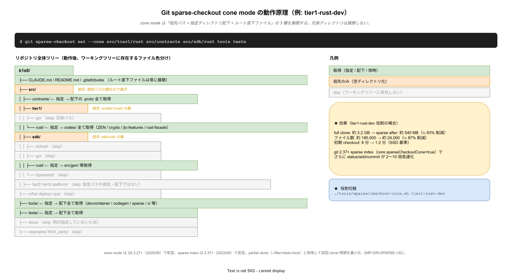

# 01. cone mode 設計原則

本ファイルは Git sparse-checkout の cone mode を採用する設計原則を規定する。ADR-DIR-003 で決定した背景と、運用時のガードレールを明示する。



## cone mode とは

Git 2.27 で正式導入された sparse-checkout のモード。従来の「任意 glob 指定」と比較して以下の差がある。

- **任意 pattern mode**（従来）: `.git/info/sparse-checkout` にワイルドカード patterns を書く。Git が毎回評価、遅い
- **cone mode**: ディレクトリ単位で include / exclude を管理、tree の「cone 型」を維持。高速評価が可能

k1s0 では cone mode 一択。任意 pattern mode は禁止する（評価コストが大規模リポジトリでは現実的でない）。

## cone の構造と制約

cone mode の制約:

1. **ディレクトリ単位のみ**: 個別ファイルは指定不可（例外: ルート直下のファイルは常に含まれる）
2. **パス末尾 `/**` 不要**: `src/tier1/rust` と指定するだけで配下全体が含まれる
3. **親ディレクトリ自動包含**: `src/tier1/rust/crypto` を指定すれば `src/tier1/` `src/` は自動的に含まれる（ただしディレクトリエントリのみで中身は展開されない）

この制約は、大規模リポジトリでの性能を保証するためのトレードオフ。

## 採用理由（Microsoft Scalar 事例）

Microsoft は .NET runtime monorepo（dotnet/runtime）を VFS / Scalar + sparse-checkout で運用する。GitHub 上で 7 万ファイル超の巨大リポジトリを、各開発者が自分の担当領域だけワーキングセット化する方式。

- 参考: Microsoft Scalar（VFS for Git の後継）
- 参考: GitHub Engineering「Git's database internals IV: distributed synchronisation」
- 参考: Git 公式ドキュメント `git-sparse-checkout(1)`

k1s0 のモノレポは Phase 1c で 50 万行超を予測、Microsoft Scalar 方式を先取り採用する。

## k1s0 における cone 設計原則

### 原則 1: tier 境界を cone 境界に合わせる

tier1 / tier2 / tier3 / infra / ops / docs の各境界は cone の include / exclude 境界と一致させる。例:

- tier1 Rust 開発者: `src/tier1/rust/` `src/contracts/` `src/sdk/rust/` `docs/` を include
- tier1 Go 開発者: `src/tier1/go/` `src/contracts/` `src/sdk/go/` `docs/` を include

実装者は自分の tier だけを見ればよい状態を作る。

### 原則 2: 必須ディレクトリを全 role に含める

以下は全 role で必ず include される:

- ルート直下ファイル（LICENSE / README / CLAUDE.md / .gitattributes 等）: cone mode の仕様上、必ず含まれる
- `.github/`: CI workflow、PR template。どの開発者も触る可能性
- `.devcontainer/`: Dev Container 設定
- `docs/00_format/` `docs/99_壁打ち/`: 全員参照
- `tools/sparse/`: 自己参照（役割切替用 CLI）

### 原則 3: contracts / sdk は related tier とセットで include

`src/contracts/` の変更は tier1 / sdk / 全消費者に影響するため、tier1 / tier2 / tier3 全 role に include する。ただし BFF / MAUI のように SDK 経由で利用する側は `src/contracts/` は含めない（SDK のみ）。

### 原則 4: infra / deploy / ops は専用 role に限定

`infra/` `deploy/` `ops/` はインフラ運用専用 role（`infra-ops`）のみ include する。実装者 role では除外。実装者が infra YAML を誤編集する事故を物理的に防ぐ。

### 原則 5: full role を常に許可

全ディレクトリ include の `full` role を必ず用意。以下のケースでは full が必要:

- アーキテクト・ガバナンス担当（全体俯瞰）
- CI pipeline（ジョブ種別毎に絞るよりは full + path-filter の方が運用簡潔）
- 長期メンテナンス時（複数 tier 横断のリファクタ等）

### 原則 6: cone 定義は Git 管理

`.sparse-checkout/roles/*.txt` として全 role 定義をリポジトリに commit。変更は PR レビュー必須。ローカルで無断の pattern 追加は禁止。

## sparse index（Git 2.37+）との併用

sparse index は cone mode と組み合わせることで、`.git/index` のサイズを数分の 1〜10 分の 1 に縮小する。k1s0 は Git 2.40+ を前提とする。

```bash
git sparse-checkout init --cone
git config core.sparseCheckoutCone true
git update-index --split-index  # 旧式、不要
git sparse-checkout reapply --sparse-index
```

sparse index により `git status` 時間が 1.5 秒 → 0.2 秒に短縮（Microsoft 報告ベンチマーク）。

## partial clone との併用

blob:none 指定で clone 時に blob を取得しない partial clone を併用する。必要な blob は checkout 時に on-demand で fetch される。

```bash
git clone --filter=blob:none --sparse https://github.com/k1s0/k1s0.git
cd k1s0
git sparse-checkout init --cone
git sparse-checkout set --stdin < .sparse-checkout/roles/tier1-rust-dev.txt
```

初回 clone 時間は 5 倍以上短縮、ディスク使用量も大幅削減。

## ガードレール

- cone 定義変更は `@k1s0/arch-council` の承認必須
- 役割未対応のディレクトリ追加は、既存 role の cone 更新を PR で同時に提案する必要がある
- Phase 1c で cone mode の必須化可否を再評価（full cone 使用率が 20% 以下になったら必須化を検討）

## 対応 IMP-DIR ID

- IMP-DIR-SPARSE-126（cone mode 設計原則）

## 対応 ADR / 要件

- ADR-DIR-003
- DX-GP-\*
