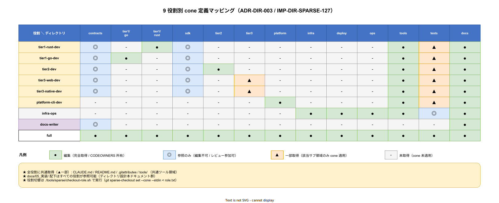

# 02. 役割別 cone 定義

本ファイルは k1s0 で採用する 10 役割の cone 定義全文を掲載する。これらは `.sparse-checkout/roles/` 配下に対応する `.txt` ファイルとして配置される。



## 役割一覧

| 役割 | ファイル | 用途 |
|---|---|---|
| tier1-rust-dev | `tier1-rust-dev.txt` | tier1 Rust 自作領域開発者 |
| tier1-go-dev | `tier1-go-dev.txt` | tier1 Go Dapr facade 開発者 |
| tier2-dev | `tier2-dev.txt` | tier2 ドメインサービス開発者 |
| tier3-web-dev | `tier3-web-dev.txt` | tier3 Web 開発者 |
| tier3-native-dev | `tier3-native-dev.txt` | tier3 MAUI Native 開発者 |
| platform-cli-dev | `platform-cli-dev.txt` | k1s0 CLI / Backstage プラグイン開発者 |
| sdk-dev | `sdk-dev.txt` | SDK 4 言語同格の横断開発者 |
| infra-ops | `infra-ops.txt` | インフラ運用・SRE |
| docs-writer | `docs-writer.txt` | ドキュメント作成者 |
| full | `full.txt` | アーキテクト・全体俯瞰 |

## tier1-rust-dev.txt

```
# tier1 Rust 自作領域開発者向け cone
# 対象: src/tier1/rust/ + 関連 SDK + contracts + docs + tools
/docs/
/src/contracts/
/src/tier1/rust/
/src/sdk/rust/
/src/platform/cli/
/tools/codegen/buf/
/tools/sparse/
/tools/devcontainer/profiles/tier1-rust-dev/
/tests/fuzz/rust/
/tests/contract/
/examples/tier1-rust-service/
/.github/
/.devcontainer/
```

## tier1-go-dev.txt

```
# tier1 Go Dapr facade 開発者向け cone
# 対象: src/tier1/go/ + 関連 SDK + contracts + docs + tools
/docs/
/src/contracts/
/src/tier1/go/
/src/sdk/go/
/tools/codegen/buf/
/tools/sparse/
/tools/devcontainer/profiles/tier1-go-dev/
/tests/contract/
/tests/integration/go/
/examples/tier1-go-facade/
/.github/
/.devcontainer/
```

## tier2-dev.txt

```
# tier2 ドメインサービス開発者向け cone
# 対象: src/tier2/ 全体 + SDK（Go/.NET） + contracts + docs + tools
/docs/
/src/contracts/
/src/tier2/
/src/sdk/go/
/src/sdk/dotnet/
/tools/codegen/
/tools/sparse/
/tools/devcontainer/profiles/tier2-dev/
/tests/contract/
/tests/integration/
/examples/tier2-dotnet-service/
/examples/tier2-go-service/
/.github/
/.devcontainer/
```

## tier3-web-dev.txt

```
# tier3 Web 開発者向け cone
# 対象: src/tier3/web/ + src/tier3/bff/ + TypeScript SDK + Go SDK（BFF 用） + docs
/docs/
/src/sdk/typescript/
/src/sdk/go/
/src/tier3/web/
/src/tier3/bff/
/tools/codegen/openapi/
/tools/codegen/buf/
/tools/sparse/
/tools/devcontainer/profiles/tier3-web-dev/
/tests/e2e/
/examples/tier3-web-portal/
/examples/tier3-bff-graphql/
/.github/
/.devcontainer/
```

注 1: `src/sdk/typescript/` は Web frontend から、`src/sdk/go/` は BFF から tier1/tier2 にアクセスするため両方を cone に含める。依存方向 `tier3 → (sdk ← contracts)` に従い BFF は sdk/go を import する前提で設計されている（`40_tier3レイアウト/04_bff配置.md`）。

注 2: `src/contracts/` は tier3-web は直接触らない（SDK 経由で BFF を使う）。ただし BFF 開発時に Protobuf を見たくなる場面があるため、Phase 1c でサブ役割 `tier3-web-bff-dev` を分離するかを再評価。

注 3: BFF 側で SDK 公開 API の改修が必要になった場合は、tier3-web-dev から sdk-dev 兼任に切り替える運用とする。切替手順は `04_役割切替運用.md` に記載。

## tier3-native-dev.txt

```
# tier3 Native (.NET MAUI) 開発者向け cone
# 対象: src/tier3/native/ + src/tier3/legacy-wrap/ + .NET SDK + docs
/docs/
/src/sdk/dotnet/
/src/tier3/native/
/src/tier3/legacy-wrap/
/tools/codegen/buf/
/tools/sparse/
/tools/devcontainer/profiles/tier3-native-dev/
/tests/e2e/
/examples/tier3-native-maui/
/.github/
/.devcontainer/
```

## platform-cli-dev.txt

```
# k1s0 CLI / Backstage プラグイン開発者向け cone
# 対象: src/platform/ 全体 + codegen + tools
/docs/
/src/contracts/
/src/platform/
/src/sdk/rust/
/tools/codegen/
/tools/sparse/
/tools/devcontainer/profiles/platform-cli-dev/
/tests/golden/
/examples/
/.github/
/.devcontainer/
```

## sdk-dev.txt

```
# SDK 4 言語同格開発者向け cone
# 対象: src/sdk/ 全言語 + contracts + codegen 関連 + 契約テスト
/docs/
/src/contracts/
/src/sdk/
/tools/codegen/
/tools/sparse/
/tools/devcontainer/profiles/sdk-dev/
/tests/contract/
/examples/
/.github/
/.devcontainer/
```

注: sdk-dev は tier1/tier2/tier3 のいずれにも属さず、SDK を「公開 API の Protobuf → 4 言語の gRPC stub 翻訳」として独立管理する横断役割。tier3-web や tier2-dev が SDK 変更の影響を受ける場合でも、SDK 自体の配布版数上げと契約テスト通過は sdk-dev が担う。Phase 1a-1b で 1 人が sdk-dev と他役割を兼任する運用を想定し、Phase 2 で独立化を再評価する。

cone に `src/contracts/` を含めているのは Protobuf を読み取って codegen を再実行するため。ただし contracts の .proto 変更は [ADR-DIR-001](../../../02_構想設計/adr/ADR-DIR-001-contracts-elevation.md) に従いアーキテクチャ評議会（`@k1s0/arch-council`）の承認が必要で、sdk-dev は codegen と SDK 側 API 露出の整合を担当する境界にある。

## infra-ops.txt

```
# インフラ運用・SRE 向け cone
# 対象: infra/ + deploy/ + ops/ + docs + tools + tests/integration
/docs/
/infra/
/deploy/
/ops/
/tools/ci/
/tools/local-stack/
/tools/sparse/
/tools/devcontainer/profiles/infra-ops/
/tests/integration/
/.github/
/.devcontainer/
```

## docs-writer.txt

```
# ドキュメント作成者向け cone
# 対象: docs/ + 最小ツール
/docs/
/tools/sparse/
/tools/devcontainer/profiles/docs-writer/
/CLAUDE.md
/.github/
/.devcontainer/
```

## full.txt

```
# 全体俯瞰（アーキテクト・ガバナンス）向け cone
# 対象: リポジトリ全体
/*
```

cone mode で `/*` を指定することで全ディレクトリが include される。実質的に sparse-checkout 無効化と同等だが、sparse-checkout init --cone を既に行った状態で `/*` を set すれば切替えが sparse-checkout reapply で完結する利点がある。

## 複数役割兼任の推奨

開発者が複数 tier を兼任する場合、以下のように複数 role を合成する。

```bash
# tier1 Rust + tier2 開発を兼任する場合
cat .sparse-checkout/roles/tier1-rust-dev.txt \
    .sparse-checkout/roles/tier2-dev.txt \
    | sort -u > /tmp/merged-role.txt
git sparse-checkout set --stdin < /tmp/merged-role.txt
```

`tools/sparse/checkout-role.sh` はこのマージを `-m` オプションでサポートする。

## 対応 IMP-DIR ID

- IMP-DIR-SPARSE-127（役割別 cone 定義）

## 対応 ADR / 要件

- ADR-DIR-003
