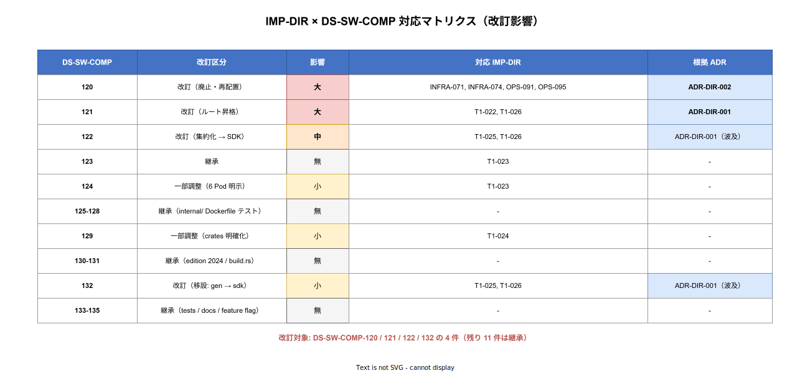

# 02. DS-SW-COMP-120-135 との対応

本ファイルは既存 `DS-SW-COMP-120〜135`（`docs/04_概要設計/20_ソフトウェア方式設計/01_コンポーネント方式設計/06_パッケージ構成_Rust_Go.md`）と、新設 `IMP-DIR-*` ID の対応を明示する。改訂影響のある DS-SW-COMP 各 ID について、新旧の差分と移行方針を記述する。

## DS-SW-COMP-120（改訂あり、影響大）

### 旧定義

`src/tier1/infra/` に Dapr Component YAML 等を集約する配置。

### 新定義（ADR-DIR-002）

`src/tier1/infra/` を廃止。ルート `infra/` に昇格し、以下 3 階層に分離:

- `infra/`: クラスタ素構成
- `deploy/`: GitOps 配信定義
- `ops/`: 運用領域（Runbook / Chaos / DR）

### 対応 IMP-DIR ID

- IMP-DIR-INFRA-071（infra 全体配置）
- IMP-DIR-INFRA-074（Dapr Component 配置）
- IMP-DIR-OPS-091（deploy 配置）
- IMP-DIR-OPS-095（ops 配置）

### 移行方針

旧 `src/tier1/infra/dapr/components/*.yaml` は新 `infra/dapr/components/*.yaml` に移設。tier1 実装者の cone から除外され、`infra-ops` role のみが編集可能となる。

## DS-SW-COMP-121（改訂あり、影響大）

### 旧定義

`src/tier1/contracts/` に Protobuf 契約を配置、buf module 境界は tier1 所有。

### 新定義（ADR-DIR-001）

`src/contracts/` にルート昇格。tier1 / tier2 / tier3 / SDK の共有資産として扱う。buf module 境界は `src/contracts/` 直下。

- `src/contracts/tier1/v1/`: tier1 公開 11 API
- `src/contracts/internal/v1/`: tier1 内部 gRPC（facade→rust）
- 採用後の運用拡大時 で `src/contracts/tier2/v1/`（tier2 ドメイン契約を公開する場合）を検討

### 対応 IMP-DIR ID

- IMP-DIR-T1-022（contracts 配置）
- IMP-DIR-T1-026（生成コードの扱い）

### 移行方針

旧 `src/tier1/contracts/` の .proto ファイル群を `src/contracts/tier1/v1/` に移動。buf.yaml は `src/contracts/` 直下に配置。生成コード出力先は言語毎に `src/sdk/go/proto/tier1/v1/` / `src/sdk/rust/crates/k1s0-sdk-proto/src/gen/v1/` / `src/sdk/dotnet/src/K1s0.Sdk.Proto/Generated/` / `src/sdk/typescript/packages/proto/src/` に変更。

## DS-SW-COMP-122（改訂あり、影響中）

### 旧定義

生成コードは commit するが、配置先は tier1 内部のみ（`src/tier1/go/internal/proto/v1/` 等）。SDK は 運用蓄積後の別論点として未整理。

### 新定義

`src/contracts/` を唯一の契約源として、tier1 内部 (`src/tier1/go/internal/proto/tier1/v1/` / `src/tier1/rust/crates/proto-gen/src/`（flat）) と SDK (`src/sdk/go/proto/tier1/v1/` / `src/sdk/rust/crates/k1s0-sdk-proto/src/gen/v1/` / `src/sdk/dotnet/src/K1s0.Sdk.Proto/Generated/` / `src/sdk/typescript/packages/proto/src/`) を **4 言語独立の buf.gen.<lang>.yaml で並行生成** する。各 yaml は `buf generate --template` で個別実行され、commit される。依存方向 `tier3 → tier2 → (sdk ← contracts) → tier1 → infra` に従い tier1 は SDK に依存せず、SDK も tier1 に依存しない。

同一性は `tools/ci/validate-proto-parity.sh` で diff 検査し、差分があれば CI を fail させる（詳細は `20_tier1レイアウト/06_生成コードの扱い.md`）。

### 対応 IMP-DIR ID

- IMP-DIR-T1-025（SDK 配置）
- IMP-DIR-T1-026（生成コードの扱い）

### 移行方針

- 旧 `src/tier1/go/internal/proto/v1/` は **配置を維持**（tier1 内部の自己完結性を保持）
- 追加で `src/sdk/go/proto/`・`src/sdk/rust/crates/k1s0-sdk-proto/src/gen/`・`src/sdk/dotnet/src/K1s0.Sdk.Proto/Generated/`・`src/sdk/typescript/packages/proto/src/` を独立生成系として新設
- tier2 / tier3 / BFF は SDK 側（`src/sdk/go/proto` 等）を import。tier1 は import しない

## DS-SW-COMP-123（継承、変更なし）

### 定義

`src/tier1/go/` module path `github.com/k1s0/k1s0/src/tier1/go`、go.mod ルート配置。

### 対応 IMP-DIR ID

- IMP-DIR-T1-023（Go module 配置）

## DS-SW-COMP-124（継承、一部調整）

### 旧定義

Go facade のエントリポイント `cmd/` と internal/ 配置。

### 新定義

旧と同様だが、cmd/ 配下に 11 公開 API 対応の facade 6 Pod のエントリポイント（`service-invoke/` `state-pubsub/` `secrets-binding-workflow/` `log-telemetry/` `decision-feature/` `audit-pii/`）を明示する構造を確定。

### 対応 IMP-DIR ID

- IMP-DIR-T1-023（Go module 配置）

## DS-SW-COMP-125（継承）

### 定義

`src/tier1/go/internal/` 配下に facade 共通の業務ロジック（resilience / telemetry / auth 等）を配置する方針。Go の internal 機構でパッケージ境界を強制する。

### 対応 IMP-DIR ID

- IMP-DIR-T1-023（Go module 配置）

## DS-SW-COMP-126（一部調整：contracts 昇格後の参照元変更）

### 旧定義

生成元契約は `src/tier1/contracts/`、生成コード配置は `src/tier1/go/internal/proto/v1/`。

### 新定義

生成元契約のみ `src/contracts/` に昇格（ADR-DIR-001）。tier1 Go 内部の配置 `src/tier1/go/internal/proto/v1/` は **継承** し、`buf generate` の入力パスのみが変更される。

### 対応 IMP-DIR ID

- IMP-DIR-T1-023（Go module 配置）
- IMP-DIR-T1-026（生成コードの扱い）

## DS-SW-COMP-127（継承）

### 定義

tier1 Go facade Pod の Dockerfile は multi-stage で distroless ベース。`src/tier1/go/cmd/<pod>/Dockerfile` に配置。

### 対応 IMP-DIR ID

- IMP-DIR-T1-023（Go module 配置）

## DS-SW-COMP-128（継承）

### 定義

tier1 Go のテスト配置は標準の `_test.go`（同一パッケージ内 unit test）+ `tests/` 配下の integration test の 2 階層構造。

### 対応 IMP-DIR ID

- IMP-DIR-T1-023（Go module 配置）

## DS-SW-COMP-129（継承、一部調整）

### 旧定義

`src/tier1/rust/` Cargo workspace 配置、`Cargo.toml` workspace ルート、`crates/*/` 構造。

### 新定義

旧と同様。crates を以下に明確化:

- `crates/zen/`: ZEN Engine 統合
- `crates/crypto/`: crypto primitives
- `crates/jtc-features/`: 採用側組織の固有機能
- `crates/rust-facade/`: tier1-go facade からの gRPC 受信

### 対応 IMP-DIR ID

- IMP-DIR-T1-024（Rust workspace 配置）

## DS-SW-COMP-130-131（継承、変更なし）

Rust workspace の edition 2024、build.rs による proto 生成方針は継承。

## DS-SW-COMP-132（改訂あり、影響小）

### 旧定義

Rust 生成コード出力先は `src/tier1/rust/crates/rust-facade/src/gen/` に単一集約。

### 新定義

tier1 内部の生成先を `src/tier1/rust/crates/proto-gen/src/` に移し、rust-facade / decision / audit / pii の各 crate は `proto-gen` crate を path dependency として参照する。SDK 用の Rust 生成物は独立に `src/sdk/rust/crates/k1s0-sdk-proto/src/gen/` に出力され、tier1 はこれに依存しない（依存方向 `sdk ← contracts → tier1` を堅持）。

### 対応 IMP-DIR ID

- IMP-DIR-T1-024（Rust workspace 配置）
- IMP-DIR-T1-025（SDK 配置）
- IMP-DIR-T1-026（生成コードの扱い）

## DS-SW-COMP-133-135（継承、変更なし）

Rust workspace のテスト・ドキュメント・feature flag 方針は継承。

## 影響区分の定義

「大/中/小」では本プラン適用時のレビュー優先度・移行作業量を判別できないため、影響を 4 段階に細分化する。各 DS-SW-COMP ID は以下のいずれか 1 つに分類される。

- **改訂（破壊的変更）**: 旧定義のディレクトリ・ID・概念を **廃止または別概念に置換** する。新旧の差分が ADR を要し、既存 src/ ファイルの物理移動を伴う。レビューはアーキ評議会必須
- **直接影響（互換調整）**: 旧定義は維持されるが、参照先パス・モジュール境界・生成出力先のいずれかが **本プラン由来で書き換わる**。物理移動は限定的、CI 設定の更新が必要。レビューは tier 担当 + アーキ 1 名
- **二次影響（明示化のみ）**: 旧定義に変更はないが、本プランで新たな下位構造（crate 名・Pod 名・サブパッケージ等）を **明示化する**。既存実装に影響なし。レビューは tier 担当のみ
- **構造調整（参照元のみ更新）**: 旧定義は完全継承だが、buf 入力パス変更等の **間接的なビルド系更新** が発生。コード自体は無変更。レビューは tier 担当のみ
- **継承（変更なし）**: 旧定義をそのまま採用。本プランの記述は確認のみ。レビュー不要

## 改訂影響の集約

| DS-SW-COMP ID | 区分 | 影響詳細 | レビュー粒度 | 新 IMP-DIR ID |
|---|---|---|---|---|
| 120 | 改訂 | `src/tier1/infra/` 廃止・3 階層分離（infra/deploy/ops）。物理移動 + cone 再定義 | アーキ評議会 | INFRA-071, INFRA-074, OPS-091, OPS-095 |
| 121 | 改訂 | `src/tier1/contracts/` を `src/contracts/` に昇格。buf module 境界変更 | アーキ評議会 | T1-022, T1-026 |
| 122 | 改訂 | tier1 内部生成 + SDK 生成の 2 系統並行に転換 | アーキ評議会 | T1-025, T1-026 |
| 123 | 継承 | Go module path 既定維持 | 不要 | T1-023 |
| 124 | 二次影響 | facade 6 Pod のエントリポイント `cmd/<pod>/` を明示化 | tier1 担当 | T1-023 |
| 125 | 継承 | `internal/` 配置原則は不変 | 不要 | T1-023 |
| 126 | 構造調整 | buf 入力元のみ `src/tier1/contracts/` → `src/contracts/` に変更 | tier1 担当 | T1-023, T1-026 |
| 127 | 継承 | Dockerfile 配置原則は不変 | 不要 | T1-023 |
| 128 | 継承 | テスト配置 2 階層構造は不変 | 不要 | T1-023 |
| 129 | 二次影響 | crates の責務（zen / crypto / jtc-features / rust-facade）を明示化 | tier1 担当 | T1-024 |
| 130 | 継承 | edition 2024 維持 | 不要 | T1-024 |
| 131 | 継承 | build.rs 方針継承 | 不要 | T1-024 |
| 132 | 直接影響 | rust-facade 内集約 → `proto-gen` crate 新設、SDK 系も独立 | tier1 担当 + アーキ | T1-024, T1-025, T1-026 |
| 133 | 継承 | テスト方針継承 | 不要 | T1-024 |
| 134 | 継承 | ドキュメント方針継承 | 不要 | T1-024 |
| 135 | 継承 | feature flag 方針継承 | 不要 | T1-024 |

### 集計

| 区分 | 件数 | DS-SW-COMP ID |
|---|---|---|
| 改訂 | 3 | 120, 121, 122 |
| 直接影響 | 1 | 132 |
| 二次影響 | 2 | 124, 129 |
| 構造調整 | 1 | 126 |
| 継承 | 9 | 123, 125, 127, 128, 130, 131, 133, 134, 135 |

本プラン適用で物理移動・ADR 起票・cone 再定義を要するのは「改訂」3 件のみ。「直接影響」1 件は CI 設定（buf.gen yaml の split など）の更新で吸収する。残り 12 件は文書同期のみで完了する。
