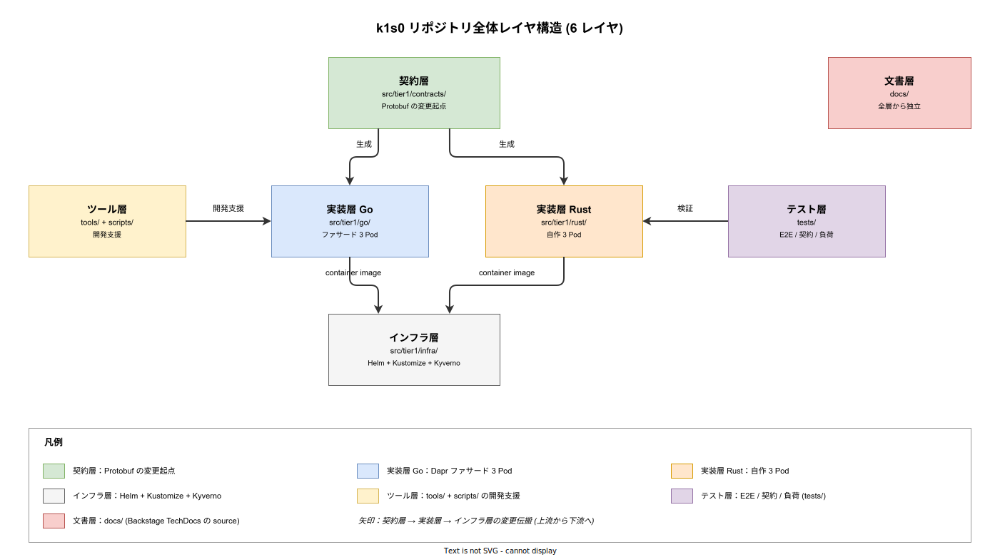

# 00. ディレクトリ設計

本カテゴリは k1s0 の **実装フェーズ初日に開発者が git 上に生成する全ディレクトリとファイルの配置**を方式として固定化する。[../../04_概要設計/](../../04_概要設計/) でコンポーネント分割・モジュール依存関係・パッケージ構成が方式レベルで確定したのを受け、本章はそれを Phase 1a のコミット粒度まで分解し、「どの作業者が、どのファイルパスに、何を書き始めるか」を曖昧さなく確定させる層である。

## 本カテゴリの位置付け

概要設計書は `src/tier1/` の 4 サブディレクトリ（`contracts/` / `go/` / `rust/` / `infra/`）までを方式として確定し、Go module / Cargo workspace / Protobuf 生成コード・container image・CI 選択ビルドの大枠を [04_概要設計/20_ソフトウェア方式設計/01_コンポーネント方式設計/06_パッケージ構成_Rust_Go.md](../../04_概要設計/20_ソフトウェア方式設計/01_コンポーネント方式設計/06_パッケージ構成_Rust_Go.md) で採番済みである。本章は **概要設計の「構造」を実装フェーズの「配置」に翻訳するブリッジ文書**であり、以下の未確定領域を埋める。

- リポジトリルート直下のディレクトリ配置（`src/` / `tests/` / `tools/` / `scripts/` / `.github/` / `.devcontainer/` / 設定ファイル群）
- 概要設計で `internal/state/` と宣言した Go サブパッケージを **`internal/pods/state/` と `internal/shared/` の 2 階層に分けたうえで**、Pod 側を `handler/` / `service/` / `domain/` / `repository/` の 4 層まで分解した配置
- 概要設計で `crates/decision/` と宣言した Rust crate を **`crates/pods/decision/` / `crates/shared/<共有 crate>/` / `crates/sdk/k1s0-sdk/` の 3 分類に分けたうえで**、crate 内部を `src/domain/` / `src/service/` / `src/adapter/` / `tests/` / `benches/` / `examples/` まで分解した配置
- `src/tier1/infra/` を **`delivery/` / `runtime/` / `governance/` / `platform/` の 4 カテゴリに再編したうえで**、Helm chart / Kustomize overlay / Dapr Components / Argo Rollouts / Kyverno ポリシー / Operator / backends の詳細配置
- リポジトリ全体の E2E / 契約テスト / 負荷試験シナリオ / フィクスチャの配置
- `.github/workflows/` 配下の実際のワークフローファイル分割と、`tools/` `scripts/` `.devcontainer/` 配下の具体ファイル（`tools/backstage-templates/` は `tier2/` / `tier3/` の 2 階層で変種別に分類）
- 全ファイル共通のファイル命名規約・1 ファイル行数上限・生成ファイル規約・test ファイル隣接規則

概要設計が「何がどこに存在する」を決めたのに対し、本章は「何がどのファイル名で、どのディレクトリに、どの順序で生成されるか」を決める。本章が曖昧なまま Phase 1a に入ると、開発者ごとに `service/` と `usecase/`、`handler/` と `http/`、`adapter/` と `infrastructure/` がバラバラに命名され、300 行制限を超えた時にどう分割するかの判断も人任せになる。結果として結合テストで組み合わせ爆発が発生し、2 名運用（NFR-C-NOP-001）が成立しない。本章はその発散を Phase 0 〜 1a 境界で構造的に排除する役割を担う。

## 概要設計との役割分担

構想設計・要件定義・概要設計・本章の 4 層の役割分担を明確にする。

- **要件定義（03）**: tier1 が何を約束するか（API 契約・NFR）
- **構想設計（02）**: なぜその OSS・言語構成を選ぶか（ADR）
- **概要設計（04）**: tier1 ソフトウェアの方式（コンポーネント境界・依存方向・パッケージ階層・build target）
- **ディレクトリ設計（05/00、本章）**: 方式をファイルパスまで分解した配置（ルート構造・サブパッケージ分割・命名規約）

概要設計で採番された `DS-SW-COMP-120 〜 139`（パッケージ構成）は本章の上流基準であり、本章の設計 ID（`DS-IMPL-DIR-*`）は全て上記の下流として紐付く。概要設計の方式に変更があれば本章も改訂し、逆に本章で配置の不備が発見されれば、概要設計側に差分を ADR として戻す。

## IPA 共通フレーム 2013 との対応

本章は共通フレーム 2013 の明示アクティビティには含まれない。ソフトウェア詳細設計（7.1.3）が本来の下流だが、k1s0 は Phase 1a で実装着手するため、詳細設計を省略して「概要設計の方式 → 実装ディレクトリ配置」に直結する経路をとる。この経路は大手 JTC 基準では異例だが、tier1 は業務 UI 重視の設計書（画面設計・帳票設計）が存在せず、代わりに「Protobuf 契約 + Rust/Go ソース + Kubernetes マニフェスト」が詳細仕様そのものになるため、詳細設計の中間成果物を作ると冗長性と乖離リスクが増える。本章は詳細設計が担うべき「実装前の配置固定」の役割を代替する。

## 設計 ID 体系

本章で採番する設計 ID は `DS-IMPL-DIR-*` とする。採番範囲は以下のとおり。01〜08 章は tier1 内部（contracts / Go / Rust / infra）の詳細と横断規約を、09〜11 章は tier1 を束ねた bounded context 境界と tier2 / tier3 配置を扱う。

- `DS-IMPL-DIR-001` 〜 `DS-IMPL-DIR-020`: リポジトリルート構成（[01_リポジトリルート構成.md](01_リポジトリルート構成.md)）
- `DS-IMPL-DIR-021` 〜 `DS-IMPL-DIR-040`: contracts 詳細構成（[02_contracts詳細構成.md](02_contracts詳細構成.md)）
- `DS-IMPL-DIR-041` 〜 `DS-IMPL-DIR-080`: Go モジュール詳細構成（[03_Goモジュール詳細構成.md](03_Goモジュール詳細構成.md)）
- `DS-IMPL-DIR-081` 〜 `DS-IMPL-DIR-120`: Rust ワークスペース詳細構成（[04_Rustワークスペース詳細構成.md](04_Rustワークスペース詳細構成.md)）
- `DS-IMPL-DIR-121` 〜 `DS-IMPL-DIR-160`: infra 詳細構成（[05_infra詳細構成.md](05_infra詳細構成.md)）
- `DS-IMPL-DIR-161` 〜 `DS-IMPL-DIR-180`: テストとフィクスチャ配置（[06_テストとフィクスチャ配置.md](06_テストとフィクスチャ配置.md)）
- `DS-IMPL-DIR-181` 〜 `DS-IMPL-DIR-200`: 開発ツールと CI/CD 配置（[07_開発ツールとCICD配置.md](07_開発ツールとCICD配置.md)）
- `DS-IMPL-DIR-201` 〜 `DS-IMPL-DIR-220`: 命名規約と配置ルール（[08_命名規約と配置ルール.md](08_命名規約と配置ルール.md)）
- `DS-IMPL-DIR-221` 〜 `DS-IMPL-DIR-240`: tier1 全体配置と SDK 境界（[09_tier1全体配置とSDK境界.md](09_tier1全体配置とSDK境界.md)）
- `DS-IMPL-DIR-241` 〜 `DS-IMPL-DIR-260`: tier2 サービス配置とテンプレート（[10_tier2サービス配置とテンプレート.md](10_tier2サービス配置とテンプレート.md)）
- `DS-IMPL-DIR-261` 〜 `DS-IMPL-DIR-280`: tier3 アプリ配置とテンプレート（[11_tier3アプリ配置とテンプレート.md](11_tier3アプリ配置とテンプレート.md)）

各 ID は対応する概要設計 ID（主に `DS-SW-COMP-120 〜 139` および `DS-DEVX-*`）と、要件定義 ID（主に `DX-CICD-*` / `DX-LD-*` / `NFR-C-NOP-*`）を明記する。

## リポジトリ全体レイヤ構造

k1s0 のリポジトリは「契約層・実装層・インフラ層・テスト層・ツール層・文書層」の 6 レイヤで構成する。各レイヤは責務が異なり、変更頻度・レビュー体制・オーナーシップが独立する。下図は各レイヤの配置と、レイヤ間の変更伝搬の流れを示す。

図の読み方は以下のとおり。契約層（`src/tier1/contracts/`）は全ての起点で、`.proto` 変更は Go / Rust 両実装層へ生成コードを伝搬させる。実装層（`src/tier1/go/` / `src/tier1/rust/`）は契約層の下流で、互いに直接依存せず、内部 gRPC 経由でのみ通信する。インフラ層（`src/tier1/infra/`）は実装層の成果物（container image）を Kubernetes 上に配置するためのマニフェストで、実装層とは非同期に変更され得る。テスト層（`tests/`）は実装層に対する E2E・契約検証で、`src/` 配下には置かない（実装と同じ import path から分離して CI ビルド時間を短縮するため）。ツール層（`tools/` / `scripts/`）は開発者支援で、CI から参照されるが成果物には含まれない。文書層（`docs/`）は全層から独立し、Backstage TechDocs の source となる。

本レイヤ構造は **tier1 の内部を描いたもの**である。tier2 ドメインサービスと tier3 エンドユーザアプリは本 repo に含まれず、各サービス / アプリが Backstage Software Template から生成される独立 GitHub repo で開発される（[09 章 DS-IMPL-DIR-222](09_tier1全体配置とSDK境界.md)）。tier1 から tier2 / tier3 への公開点は `src/tier1/contracts/sdk-out/` で生成される言語別 SDK とその内部レジストリ経由の配布 1 点に限定され、tier2 / tier3 が tier1 の internal パッケージを直接 import することは物理的・技術的に不可能にしている（[ADR-TIER1-003](../../02_構想設計/adr/ADR-TIER1-003-language-opacity.md)）。tier2 / tier3 repo 側の Template ソース（`tools/backstage-templates/`）は本 repo 内に配置され、Template 改訂は本 repo の PR レビューで一元管理する。

## 格納ファイル一覧

本カテゴリは以下のファイルで構成する。読み順は番号順で、概念の抽象度が高いものから具体配置に降りる構造とする。

### 01_リポジトリルート構成.md

リポジトリ root 直下のディレクトリ配置を確定する。`docs/` / `src/` / `tests/` / `tools/` / `scripts/` / `.github/` / `.devcontainer/` の 7 ディレクトリと、ルート直下の 8 種類の設定ファイル（`README.md` / `CLAUDE.md` / `LICENSE` / `.editorconfig` / `.gitignore` / `.gitattributes` / `.mise.toml` / `CODEOWNERS`）の配置と所有権を固定化する。

### 02_contracts詳細構成.md

`src/tier1/contracts/` 配下の詳細ファイル配置を確定する。`buf.yaml` / `buf.gen.yaml` / `buf.lock` / `v1/*.proto` / `v1/common/*.proto` / `v1/errors/*.proto` のファイル命名規約、`proto-gen/` ディレクトリでの生成コード出力先、`buf breaking` による破壊的変更検出ワークフローとの連携を実装視点で詳細化する。

### 03_Goモジュール詳細構成.md

`src/tier1/go/` 配下の詳細ファイル配置を確定する。`cmd/<pod>/main.go` の骨格、`internal/pods/<pod>/` 配下を `handler/` / `service/` / `domain/` / `repository/` の 4 層に分割する方針、`internal/shared/dapr/` の Dapr Go SDK ラッパの配置、`internal/shared/common/` / `internal/shared/policy/` / `internal/shared/otel/` / `internal/shared/proto/v1/` の共通ライブラリ配置（`pods/<pod>/` は Pod チーム自走、`shared/` はアーキテクト必須の 2 軸分離）、`test/` と `integrationtest/` の分離、Go Workspace（`go.work`）の扱いを実装視点で詳細化する。

### 04_Rustワークスペース詳細構成.md

`src/tier1/rust/` 配下の詳細ファイル配置を確定する。`crates/pods/<pod>/` / `crates/shared/<crate>/` / `crates/sdk/k1s0-sdk/` の 3 分類による workspace 編成、各 crate 内部の `src/domain/` / `src/service/` / `src/adapter/` / `src/grpc/` の 4 層分割、`Cargo.toml` の `[workspace.dependencies]` 集約方針、`tests/` と `benches/` と `examples/` の責務境界、`sqlx migrate` のマイグレーションファイル配置（AUDIT crate）、`build.rs` の配置と `OUT_DIR` の扱い、`rust-toolchain.toml` / `.cargo/config.toml` の内容を実装視点で詳細化する。Pod 間の直接 path 依存を禁止し `pods → shared/sdk` の単方向に限定する静的検査（`tools/check-rust-deps/`）もここで確定する。

### 05_infra詳細構成.md

`src/tier1/infra/` 配下の詳細ファイル配置を確定する。配下は `delivery/` / `runtime/` / `governance/` / `platform/` の 4 カテゴリで、`delivery/helm/` の Helm Chart 構造と `delivery/kustomize/{base,overlays/<env>}/` の overlay 戦略、`delivery/rollouts/` の Argo Rollouts マニフェスト、`runtime/components/` の Dapr State Store / PubSub / Secret Store / Binding / Workflow 定義と `runtime/configuration/` / `runtime/subscriptions/`、`governance/policies/` の Kyverno ClusterPolicy と `governance/namespaces/`、`platform/operators/` の Strimzi / CloudNativePG / OpenBao Operator 等、`platform/backends/` の Postgres / Valkey / MinIO / OpenBao backend CR を実装視点で詳細化する。4 カテゴリ分割によって CODEOWNERS・CI path filter が「配信／ランタイム設定／統治／プラットフォーム」で自然に分かれる。

### 06_テストとフィクスチャ配置.md

リポジトリ root の `tests/` 配下の詳細ファイル配置を確定する。`tests/e2e/` の E2E シナリオ、`tests/contract/` の Consumer-Driven Contract（Pact）定義、`tests/load/` の k6 / Locust 負荷試験シナリオ、`tests/fixtures/` のテストデータ、`tests/golden/` のゴールデンファイルの役割分担と、`src/tier1/*/tests/` の crate/package 内部テストとの境界を実装視点で詳細化する。

### 07_開発ツールとCICD配置.md

`tools/` / `scripts/` / `.github/workflows/` / `.devcontainer/` 配下の詳細ファイル配置を確定する。`tools/` の Go / Rust 製補助ツール、`scripts/` のシェルスクリプト、`.github/workflows/` の PR / main / release / nightly の 4 系統ワークフロー分割、`.devcontainer/devcontainer.json` と `.devcontainer/Dockerfile` の構成、`CODEOWNERS` の所有権割当を実装視点で詳細化する。

### 08_命名規約と配置ルール.md

全ファイル横断のファイル命名規約と配置ルールを確定する。ファイル命名（snake_case / kebab-case の使い分け）、ソース行数上限（概要設計の 300 行原則と source code の実運用上限）、生成ファイルマーカー（`// Code generated. DO NOT EDIT.`）、テストファイル命名（`*_test.go` / `tests/*.rs`）、モジュール名の階層命名規則、配置変更時の ADR 起票条件を実装視点で詳細化する。

### 09_tier1全体配置とSDK境界.md

02〜05 章が分担して詳細化した tier1 内部 4 サブ領域（contracts / go / rust / infra）を**ひとつの bounded context として束ねた視点**で再構成し、tier1 の外縁（tier2 / tier3 への公開点）を方式として固定する。tier1 monorepo と tier2 / tier3 polyrepo の分離、公開 SDK の生成物配置（`src/tier1/contracts/sdk-out/`）、Go / C# / TypeScript / Rust / Java / Python 各言語 SDK の wrapper 層配置、SDK バージョニングと tier1 release の同期、配布レジストリ（Phase 1a: ghcr.io、Phase 1b 以降: Nexus placeholder）、互換性保証期間を確定する。

### 10_tier2サービス配置とテンプレート.md

tier2 ドメインサービスの**リポジトリ配置と内部構造**を方式として固定する。tier2 は各サービス 1 repo の独立 GitHub repo として Backstage Software Template から生成される。Template 自身のソース（k1s0 repo 内の `tools/backstage-templates/tier2/go/` / `tier2/csharp/`）と、生成される tier2 repo の骨格（Go / C# 対応、CI 6 段、CODEOWNERS、Dockerfile、SDK 消費、Dapr 未露出、GitOps 配信、禁止改変リスト）を Phase 1b パイロット着手前に確定する。

### 11_tier3アプリ配置とテンプレート.md

tier3 エンドユーザアプリの**リポジトリ配置と内部構造**を方式として固定する。tier3 は Web App（TypeScript + Next.js）・Mobile App（C# + .NET MAUI）・BFF（TypeScript + Fastify）の 3 バリエーションを想定し、それぞれが独立 repo として Backstage Software Template から生成される。Template ソース（`tools/backstage-templates/tier3/webapp-typescript/` / `tier3/mobile-maui/` / `tier3/bff-typescript/` の 3 サブディレクトリ）、生成 repo の骨格、OIDC + Keycloak 認証フロー、i18n とアクセシビリティ骨格、配信経路（Web: MinIO + CDN、Mobile: App Store / Play Store、BFF: Kubernetes GitOps）を Phase 1b〜2 の本格展開に備えて整備する。

## 執筆方針

- 各ファイルは冒頭で上流の概要設計 ID（`DS-SW-COMP-*`）と対応要件 ID を明示する。
- 設計 ID の採番は `DS-IMPL-DIR-*` で連番とし、飛び番を作らない。飛び番が必要な場合は ADR で理由を残す。
- 300 行制限は docs の例外規定で緩和されるが、可読性のため目安 400 行以内を原則とする。それを超える場合はサブディレクトリへの分割を検討する。
- ファイルパスを記述する際は、ルート基準のフルパス（`src/tier1/go/cmd/state/main.go`）と、章内相対パス（`cmd/state/main.go`）を場合により使い分ける。曖昧な場合はフルパスを優先する。
- コードブロック内のディレクトリツリー表記（`tree` 形式）は許容する。これはアスキー図ではなくファイルシステムの直接表現であり、[../../00_format/](../../00_format/) の規約と矛盾しない。
- 各ファイルが採番する設計 ID は冒頭の「設計 ID 一覧と採番方針」節で通番範囲を宣言し、章末の「設計 ID 一覧」表で全件を要約する。
- 図は本カテゴリ直下の [img/](img/) に集約し、drawio + SVG の両方を git 管理する。drawio レイヤ記法規約（アプリ層=暖色 / ネットワーク層=寒色 / インフラ層=中性灰 / データ層=薄紫）に従う。

## 他カテゴリとの関係

本章は以下のカテゴリと相互参照する。

- **上流**: [../../04_概要設計/20_ソフトウェア方式設計/01_コンポーネント方式設計/06_パッケージ構成_Rust_Go.md](../../04_概要設計/20_ソフトウェア方式設計/01_コンポーネント方式設計/06_パッケージ構成_Rust_Go.md) が本章の上流基準。
- **上流**: [../../04_概要設計/20_ソフトウェア方式設計/01_コンポーネント方式設計/05_モジュール依存関係.md](../../04_概要設計/20_ソフトウェア方式設計/01_コンポーネント方式設計/05_モジュール依存関係.md) の依存方向ルールは本章のサブパッケージ分割の制約条件。
- **横断**: [../../04_概要設計/70_開発者体験方式設計/01_CI_CD方式.md](../../04_概要設計/70_開発者体験方式設計/01_CI_CD方式.md) と [../../04_概要設計/70_開発者体験方式設計/02_ローカル開発環境方式.md](../../04_概要設計/70_開発者体験方式設計/02_ローカル開発環境方式.md) は本章の `.github/workflows/` / `.devcontainer/` 配置の前提。
- **横断**: [../../04_概要設計/55_運用ライフサイクル方式設計/03_環境構成管理方式.md](../../04_概要設計/55_運用ライフサイクル方式設計/03_環境構成管理方式.md) は本章の `src/tier1/infra/` 配下の環境別 overlay の前提。
- **下流**: 本章で確定したディレクトリは Phase 1a のコミット第 1 弾で実体化され、以降は本章の改訂 → ファイル移動 PR の順で変更する。

## 設計 ID 検証結果と置換待ち項目

本章は概要設計（`DS-SW-COMP-*`）・構想設計 ADR・要件定義 ID から下流として採番するため、上流の Phase 割当・OSS 選定・チーム定義と齟齬を起こさないよう、章横断の検証を実施した。Phase 1a 着手前に Phase 1b に移る段階で再度確認する。

**CODEOWNERS チーム名の整合**: [01 章 DS-IMPL-DIR-018](01_リポジトリルート構成.md) で canonical 8 チーム（`tier1-architects` / `product-owners` / `api-leads` / `tier1-go-team` / `tier1-rust-team` / `infra-team` / `devex-team` / `security-team`）を定義し、[06 章 DS-IMPL-DIR-178](06_テストとフィクスチャ配置.md) および [07 章 DS-IMPL-DIR-199](07_開発ツールとCICD配置.md) はこの 8 チーム以外のチーム名を使っていない。Pod 単位のチーム（`state-team` / `audit-team` 等）や業務単位のチーム（`api-owners` / `platform-team` 等）は意図的に使わず、言語チーム + 横断チームの粒度で固定する。

**Phase 割当の上流整合**: Kafka と Valkey は [04_概要設計/10_システム方式設計/04_データベース方式設計.md](../../04_概要設計/10_システム方式設計/04_データベース方式設計.md) および ADR-DATA-002/004 で Phase 2 導入と確定しており、本章 [05 章 DS-IMPL-DIR-146/149](05_infra詳細構成.md) は Phase 2 に揃えた。Phase 1a では `backends/kafka/` `backends/valkey/` は README スケルトンのみ配置し、CR 本体は Phase 2 で追加する。一方、Postgres（CloudNativePG）/ OpenBao / External Secrets は Phase 1b 導入という上流決定に従う。

**placeholder 扱いの明示**: コンテナレジストリの FQDN `harbor.k1s0.internal` は JTC 稟議通過後の実 FQDN 確定までの placeholder として本章内で統一使用しており、[08 章 DS-IMPL-DIR-213](08_命名規約と配置ルール.md) で置換手順（ADR 起票 → `sed` 一括置換 → 旧 FQDN を Kyverno policy の audit モードで監視 → 1 sprint 後に参照削除）を定めた。Phase 1a 期間中は `ghcr.io/k1s0/` を既定レジストリとする。

**テンプレート参照の整合**: [08 章 DS-IMPL-DIR-218](08_命名規約と配置ルール.md) の ADR テンプレート参照は、既存の [docs/00_format/ADR-xxxx.md](../../00_format/ADR-xxxx.md) と、`docs/02_構想設計/adr/` 配下の 26 件の既存 ADR（`ADR-0001`〜`ADR-0003`、`ADR-TIER1-001`〜`ADR-MIG-002`）の運用実績に基づくカテゴリ付き命名（`ADR-<CATEGORY>-<NNN>-<title>.md`）に揃えた。

**tier1 / tier2 / tier3 の個別カバレッジ**: 当初は 02〜05 章で tier1 内部の 4 サブ領域（contracts / go / rust / infra）のみを扱い、tier1 全体を束ねる視点、および tier2 / tier3 の配置設計が欠落していた。その欠落を 09 章（tier1 bounded context と SDK 境界）・10 章（tier2 Backstage Template と生成 repo 骨格）・11 章（tier3 Web/Mobile/BFF 3 バリエーションの Template と生成 repo 骨格）で埋めた。tier2 / tier3 は k1s0 monorepo に含めず各サービス / アプリ 1 repo の polyrepo 方針で、Backstage Software Template から生成する運用を Phase 1a から Template ソース整備として開始する。

**Phase 1a 初期レビューを受けた階層深化**: 2026-04 の初期レビューで「全体的にフォルダ階層が浅い」という指摘を受け、03 / 04 / 05 / 07 章の実体階層を 1 段深くする改訂を入れた。Go `internal/` は `pods/<pod>/` と `shared/<topic>/` の 2 系統、Rust `crates/` は `pods/<crate>/` / `shared/<crate>/` / `sdk/<crate>/` の 3 系統、infra は `delivery/` / `runtime/` / `governance/` / `platform/` の 4 カテゴリ、`tools/backstage-templates/` は `tier2/` / `tier3/` の 2 階層に再編した。共通意図は「変更頻度が高く Pod 自走できる領域（`pods/`）」と「変更頻度は低いが横断影響が大きい領域（`shared/` / `governance/` / `sdk/`）」を物理配置で分離し、CODEOWNERS の path filter とレビュー必須度を二段階に最適化することにある。この深化によって Pod 追加のコストが線形に収まり、Phase 2 の tier2 / tier3 言語変種追加（Python / MAUI 等）も既存階層の下にスロットを追加するだけで済む。

**未解決の検証項目**（Phase 1b 着手前に解消）: (a) 03 章・04 章・05 章は目安 400 行を超えている（03 章: ~550 行、04 章: ~650 行、05 章: ~700 行）が、内容の論理分割が可能なサブディレクトリ（例: `03_Go/01_cmd.md` / `03_Go/02_internal.md` / ...）への再編は Phase 1a 着手時点では読み手が章番号を追いやすいことを優先して見送った。Phase 1b 以降で章数が増えて視認性が落ちた時点で再編する。(b) Go 4 層依存方向図と CI 4 系統フロー図の drawio は本章未掲載で、読者は散文と個別章の tree 図から依存関係を再構成する必要がある。Phase 1b で追加を検討する。(c) tier2 / tier3 の Backstage Template ソース配置（`tools/backstage-templates/tier2/go/` など）は本章で設計 ID を確定したが、実際の skeleton ファイルは Phase 1b 初頭の実装タスクとして別途コミットする。Phase 1b 末までに Template ソース実体の初版を用意する。

## 改訂と合意プロセス

本章の改訂は以下の手順で行う。(1) 配置変更の動機を issue で起票、(2) 影響範囲（変更を要する Pod・CI ワークフロー・ドキュメント）を調査、(3) 変更が Go module path や Cargo workspace 構成に及ぶ場合は ADR を起票（概要設計 `DS-SW-COMP-138` の手続に従う）、(4) PR で本章の該当 `DS-IMPL-DIR-*` を更新し、同 PR で実体のファイル移動を行う、(5) Phase 1b 以降の 2 名運用を破綻させる大規模変更（全 Pod の再ビルド必須など）は四半期に 1 回以下に頻度を制限する。改訂履歴は本章内の個別ファイル末尾に記録せず、git log を一次情報源とする。
