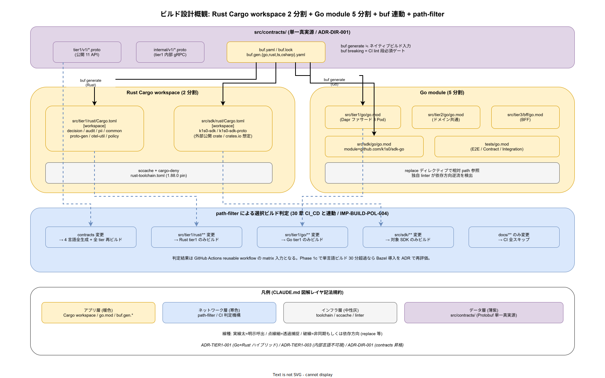

# 01. ビルド設計原則

本ファイルは k1s0 モノレポの 4 言語並行ビルド（Cargo workspace / 複数 go.mod / pnpm workspace / dotnet sln）を運用する際に常に参照する 7 軸のビルド設計原則を定義する。新規クレート追加・go.mod 分離・pnpm workspace への package 追加・sln への csproj 登録が発生した際、本原則との整合を確認することで、場当たり的な配置や Bazel 早期導入を防ぐ。



## 原則が必要な理由

k1s0 は ADR-TIER1-001（Go + Rust ハイブリッド）と ADR-TIER1-003（内部言語不可視）により、tier1 内部だけで 2 言語が並走する。加えて tier2 は C# / Go、tier3 は TypeScript / C# / Go、SDK は 4 言語同時配布という構造になっており、ビルド機構も自然と 4 つに増える。ここで「統一ビルドツールを入れたい」という誘惑は常に存在するが、2 名運用の初期フェーズで Bazel を導入すると学習コストが稟議を通過した予算の多くを食い潰す。

放置した場合に発生する典型的な破綻は以下である。

- tier3 の TypeScript 変更で tier1 の Rust クレート全てがリビルドされ、CI 時間が 30 分を超える
- Cargo workspace の境界を張らず、tier1 内部ユーティリティの変更が SDK の Rust 版を不要にリビルドする
- 生成物（Protobuf 由来コード）を commit するかどうかの判断がクレートごとにバラけ、手修正ドリフトが混入する
- 依存方向逆流（tier1 が tier2 を参照するなど）が `Cargo.toml` / `go.mod` レベルで検出されず、CI 実行後にビルド失敗で初めて気付く
- ビルド時間が悪化しても SLI が無いため、Bazel 導入の定量的判断ができない

本原則は、これらの破綻を構造レベルで回避し、かつ Phase 1c 時点で Bazel 再評価が正しく行える計測点を設けるための 7 軸である。

## 原則 1: 言語ネイティブビルドを優先する（IMP-BUILD-POL-001）

**Cargo / go build / pnpm / dotnet の各言語ネイティブビルド機構を第一選択とし、Bazel / Buck2 / Pants 等の統一ビルドツールは Phase 0 / 1a では採用しない。**

構想設計 `00_ディレクトリ設計/00_設計方針/02_世界トップ企業事例比較.md` で確定したとおり、Google / Meta / Uber 規模では Bazel / Buck2 が選択ビルドのほぼ唯一解だが、k1s0 は 2 名運用から始まる。Bazel は BUILD ファイル・`rules_rust` / `rules_go` / `rules_nodejs` の習熟コストが 2 人月以上かかることが各社事例で報告されており、Phase 0 で投資すると機能提供が後退する。

Phase 1c のビルド時間計測（原則 6）で単言語ビルドが 30 分を超えた場合に限り、当該言語について Bazel 導入を新 ADR で再評価する。それ以外のタイミングで Bazel を導入する提案は、本原則により却下される。

## 原則 2: ワークスペース境界 = tier 境界（IMP-BUILD-POL-002）

**Cargo workspace / go.mod / pnpm workspace / dotnet sln の境界は tier 境界と一致させる。tier を跨ぐワークスペースを作らない。**

tier1 / tier2 / tier3 は所有者・リリースサイクル・互換性責務が異なる。これを同じワークスペースに入れると、tier3 の package 追加が tier1 の `Cargo.lock` を書き換えてしまい、tier1 のリリースブランチに tier3 の変更が混入する。

具体的な帰結として、以下を固定する。

- Rust: `src/tier1/rust/Cargo.toml`（workspace）/ `src/sdk/rust/Cargo.toml`（別 workspace）/ `src/platform/Cargo.toml`（別 workspace）の 3 分割
- Go: `src/tier1/go/go.mod` / `src/tier2/go/services/<svc>/go.mod`（サービス単位）/ `src/sdk/go/go.mod` / `src/tier3/bff/go.mod` / `tests/e2e/go.mod` の複数分離
- TypeScript: `src/tier3/web/pnpm-workspace.yaml` / `src/sdk/typescript/package.json`（独立 package）
- .NET: `src/tier2/dotnet/Tier2.sln` / `src/tier3/native/Native.sln` / `src/sdk/dotnet/Sdk.sln` の 3 分割

tier 境界を越える依存は契約（`src/contracts/`）経由の SDK 越しのみとし、直接参照は原則 3 で拒否する。

## 原則 3: 依存方向逆流は lint で拒否する（IMP-BUILD-POL-003）

**ビルド設定レベルで逆方向依存を静的に検出し、CI で PR を拒否する。ランタイムエラーまで持ち越さない。**

IMP-DIR-ROOT-002 で定めた一方向依存（tier3 → tier2 → (sdk ← contracts) → tier1 → infra）を、ビルド設定の 3 層で強制する。ディレクトリ階層だけでは `../../../tier1/...` の相対参照で容易に逆流が起きるため、ビルド設定側で追加ゲートを敷く。

- Rust: `cargo-deny` の `[bans]` で tier3 → tier1 の直接 path 依存を禁止。`[workspace.dependencies]` で公開 API のみ再エクスポート
- Go: 独自 linter（`tools/ci/go-layer-check`）で `import` の tier 属性を判定。`replace` 指示で SDK 経由のみ許容
- TypeScript: `eslint-plugin-boundaries` で `src/tier3/` からの `src/tier1/` 直接 import を禁止
- .NET: `Directory.Build.props` で `ProjectReference` の階層制約を宣言

lint 違反は CI の 7 段ステージの lint 段で拒否され、`30_CI_CD設計/` の quality gate に組み込まれる。

## 原則 4: 選択ビルドは path-filter で判定する（IMP-BUILD-POL-004）

**全ビルドを禁止する。変更ファイルから影響範囲を決定し、影響下のビルドのみ実行する。**

Bazel 不採用の下で選択ビルドを成立させる鍵は path-filter の設計にある。GitHub Actions の `dorny/paths-filter` を reusable workflow 内で呼び、変更パスから tier / 言語 / ワークスペースを判定して、対応するビルドジョブのみをトリガーする。

path-filter の責務分担は以下とする。詳細ルールは `50_選択ビルド判定/` で定義する。

- 第 1 段: tier 判定（tier1 / tier2 / tier3 / sdk / platform / infra / docs のいずれか）
- 第 2 段: 言語判定（Rust / Go / TS / C# / YAML / md のいずれか）
- 第 3 段: ワークスペース判定（当該言語内のどの workspace / module / sln が影響を受けるか）
- 第 4 段: 契約変更の横断伝播判定（`src/contracts/` 変更は SDK 4 言語と tier1 サーバー全てを巻き込む）

契約変更だけは例外的に全 SDK ビルドを強制する。ここで選択ビルドを効かせると、契約と実装の不整合が検出されずに残存する。

## 原則 5: キャッシュは 3 層で階層化する（IMP-BUILD-POL-005）

**ローカル（開発者端末）/ CI（GitHub Actions cache）/ リモート（sccache / Turbo）の 3 層で独立して稼働させ、いずれか 1 層が失効してもビルドが成立する設計とする。**

単一キャッシュに集約すると失効時の影響範囲が全開発者に波及する。3 層独立化により、CI キャッシュが失効してもローカルは生き残る。

- 第 1 層（ローカル）: Cargo target dir / Go build cache（`$GOCACHE`） / pnpm store / NuGet cache。開発者端末の SSD に 1 週間以上滞留
- 第 2 層（CI）: GitHub Actions `actions/cache` で lockfile ハッシュをキーにした PR 間共有。Phase 0 時点の主力
- 第 3 層（リモート）: sccache（Rust / C/C++） / Turbo Remote Cache（TypeScript）を Phase 1a で導入。self-hosted runner 間で共有

Go は公式のリモートキャッシュが無いため第 2 層止まり、dotnet も同様。これは Phase 1a 終了時に再評価する。

## 原則 6: ビルド時間は SLI として計測する（IMP-BUILD-POL-006）

**4 言語それぞれのクリーンビルド時間とインクリメンタルビルド時間を CI で計測し、`95_DXメトリクス/` に公開する。30 分を超えた言語は新 ADR で対応策を起票する。**

計測が無いと Bazel 再評価の判断基準が感覚論になる。本原則は Phase 0 から計測点を設置し、Phase 1c での判断を可能にする。

計測対象は以下とする。

- 各言語の PR ビルド p50 / p95（クリーンビルド相当）
- 各言語のインクリメンタルビルド p50 / p95（lockfile 未変更時）
- CI キャッシュヒット率
- リモートキャッシュ導入後の compile 再利用率（sccache stats）

閾値超過時の対応は (a) 並列度調整、(b) リモートキャッシュ追加、(c) Bazel 導入 ADR 起票、の順で検討する。

## 原則 7: 生成物は commit するが明示的に分離する（IMP-BUILD-POL-007）

**Protobuf / OpenAPI の生成コードは commit する（IMP-DIR-ROOT-005 および DS-SW-COMP-122 準拠）。ただし生成物は `gen/` サブディレクトリに隔離し、`// Code generated. DO NOT EDIT.` ヘッダで明示する。**

生成物を commit しない方針は「pull 直後に build が通らない」という開発者体験の破綻を招く。一方、ソースと生成物を同じディレクトリに混ぜると `grep` の結果が生成物で汚染される。本原則は両者の中間を取り、「commit する、しかし隔離する」とする。

- Rust: `src/tier1/rust/<crate>/src/gen/` 配下
- Go: `src/tier1/go/<module>/gen/` 配下
- TypeScript: `src/sdk/typescript/src/gen/` 配下
- C#: `src/sdk/dotnet/K1s0.Sdk.Grpc/Generated/` 配下

`.editorconfig` で `gen/` 配下をフォーマッタ対象外とする。生成器のバージョンと生成日時はファイル先頭コメントに記録する（コード生成設計 `20_コード生成設計/` と整合）。

## 図表

```
[ビルド設計 7 軸]
  1. 言語ネイティブ優先
  2. ワークスペース = tier 境界
  3. 依存逆流の lint 拒否
  4. path-filter 選択ビルド
  5. 3 層キャッシュ階層
  6. ビルド時間 SLI
  7. 生成物 commit & 隔離
```

詳細なビルド設計概観は [../img/10_ビルド設計概観.drawio](../img/10_ビルド設計概観.drawio) を参照。

## 対応 IMP-BUILD ID

本ファイルで採番する原則レベル ID は以下とする。

- `IMP-BUILD-POL-001` : 言語ネイティブビルド優先（Bazel 不採用）
- `IMP-BUILD-POL-002` : ワークスペース境界 = tier 境界
- `IMP-BUILD-POL-003` : 依存方向逆流の lint 拒否
- `IMP-BUILD-POL-004` : path-filter による選択ビルド
- `IMP-BUILD-POL-005` : 3 層キャッシュ階層
- `IMP-BUILD-POL-006` : ビルド時間 SLI 計測
- `IMP-BUILD-POL-007` : 生成物 commit と隔離

## 対応 ADR / DS-SW-COMP / NFR

- ADR-TIER1-001（Go + Rust ハイブリッド）/ ADR-TIER1-002（Protobuf gRPC）/ ADR-TIER1-003（内部言語不可視）/ ADR-DIR-001（contracts 昇格）
- DS-SW-COMP-120 / 121 / 122 / 129 / 130（tier1 Go / Rust / SDK 生成 / 配置）
- NFR-B-PERF-001（性能基盤）/ NFR-C-NOP-004（ビルド所要時間運用）/ NFR-C-MGMT-001（設定 Git 管理）
