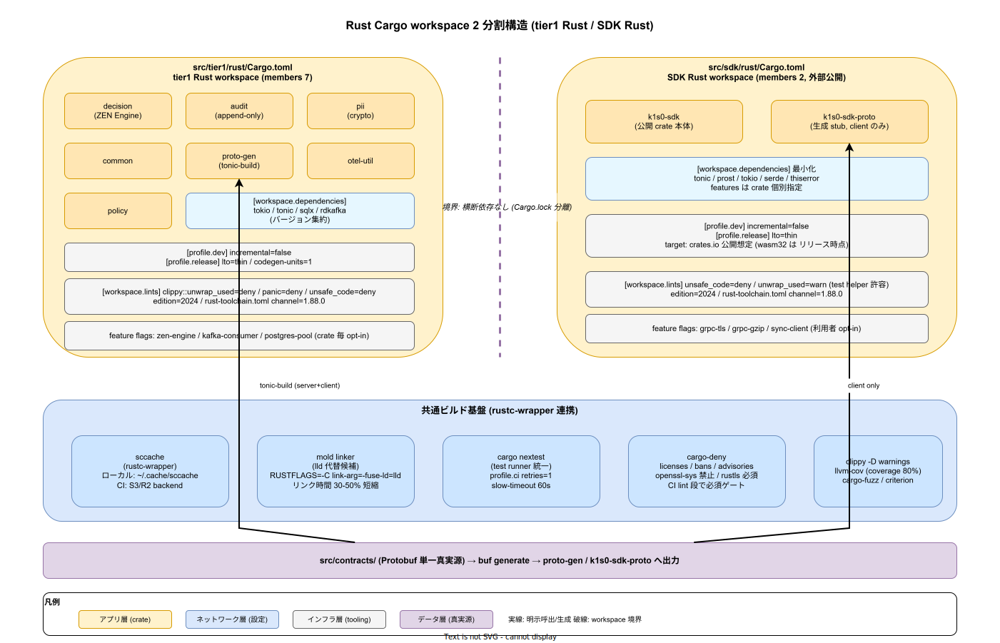

# 01. Rust Cargo workspace

本ファイルは k1s0 における Rust ビルドの単位を確定する。ADR-TIER1-001（Go + Rust ハイブリッド）により tier1 内部は自作領域が Rust、ADR-TIER1-003（内部言語不可視）により SDK Rust は tier2 / tier3 から見える唯一の Rust 面となる。両者は所有権もリリースサイクルも異なるため、Cargo workspace を **2 つに分離** して運用する。本ファイルはその境界・`[workspace.dependencies]` 集約・toolchain 固定・sccache 連携・cargo-deny 設定・lint / test 運用を物理配置レベルで規定する。



`00_ディレクトリ設計/20_tier1レイアウト/04_rust_workspace配置.md` は tier1 Rust の crate 内部構造を確定済である。本ファイルはその上位層、つまり「どの単位で Cargo workspace を切るか」と「どうビルド時間を維持するか」を固定する役割を持つ。`02_世界トップ企業事例比較.md` で参照した AWS SDK for Rust の `[workspace.dependencies]` 集約方式と Rust Foundation の toolchain 固定方式を引き継ぎ、2 名運用で破綻しない最小構成を選ぶ。

## 2 workspace 分割の境界

tier1 Rust と SDK Rust は物理的に近接した Rust コードだが、build / release / 依存方針のすべてが異なる。tier1 Rust は Pod として自社クラスタで 10 年稼働する実行バイナリを作るのが目的で、ランタイム依存（tokio / tonic / sqlx / rdkafka）を内部 crate で共有しつつ最終的に 3 バイナリ（decision / audit / pii）を吐き出す。SDK Rust は `src/sdk/rust/` 配下で tier2 / tier3 が依存する外部公開 crate（`k1s0-sdk`）を提供し、`crates.io` 公開も視野に入るため依存を最小化したい。この 2 者を同じ workspace に入れると、tier1 側のヘビー依存（rdkafka の librdkafka C ライブラリ、sqlx のマクロ展開）が SDK Rust のビルドにも伝搬し、ダウンストリームの tier2 / tier3 開発者の `cargo build` を遅くする。

したがって境界は以下で固定する。`src/tier1/rust/Cargo.toml` が tier1 Rust の single workspace、`src/sdk/rust/Cargo.toml` が SDK Rust の single workspace。両者の間に横断依存は無く、共通の型は `src/contracts/` の Protobuf 経由で `tonic-build` により別々に生成される。platform CLI（`src/platform/`）は ADR-DIR-001 で独立昇格しており Phase 1b の別 workspace として扱う（本ファイルでは tier1 と SDK の 2 分割を確定）。

この境界は IMP-BUILD-POL-002（ワークスペース境界 = tier 境界）の具体適用であり、tier1 と SDK の間で Cargo.lock の書き換え事故を構造的に防ぐ。

## `[workspace.dependencies]` の集約方針

2 つの workspace それぞれで `[workspace.dependencies]` によるバージョン集約を行う。tier1 Rust 側は 6 crate（decision / audit / pii / common / proto-gen / otel-util / policy、計 7 crate）が依存する外部 crate のバージョンを workspace 直下の `Cargo.toml` に列挙し、各 crate の `Cargo.toml` では `tokio.workspace = true` 形式で参照する。AWS SDK for Rust が `aws-sdk-rust/sdk/Cargo.toml` で採用する方式と同じで、バージョン不整合による diamond dependency 問題を構造的に排除する。

集約対象とする依存は以下の基準で選ぶ。複数 crate から参照される外部依存は無条件に集約する。単一 crate のみが使う依存（例: decision crate のみが使う `zen-engine`）は `[workspace.dependencies]` に列挙するか否かを判断し、将来の横展開を想定するなら集約、crate ローカル完結なら crate 直下の `[dependencies]` に書く。この線引きは crate 追加 PR のレビュー基準として `00_方針/01_ビルド設計原則.md` IMP-BUILD-POL-005（キャッシュ階層化）と連動する。

SDK Rust 側は外部公開性が高いため集約は最小化する。`tonic` / `prost` / `tokio` / `serde` / `thiserror` 程度に留め、crate の version / features を SDK 利用者が上書きできる余地を残す。`[workspace.dependencies]` で features を pin しすぎると利用者が「tokio の追加 feature を有効化できない」状況に陥るため、features は各 crate の `[dependencies]` で個別指定する。

## rust-toolchain.toml による toolchain 固定

2 workspace それぞれが `rust-toolchain.toml` を持ち、rustc の minor バージョンを明示的に固定する。`00_ディレクトリ設計/20_tier1レイアウト/04_rust_workspace配置.md` では `stable 1.85+` と記述しているが、本ファイルではビルド再現性の観点から **`stable 1.88.0`** のように patch レベルまで pin する運用とする（Phase 1a 着手時点で最新の stable patch 版を選ぶ）。

```toml
# src/tier1/rust/rust-toolchain.toml
[toolchain]
channel = "1.88.0"
components = ["rustfmt", "clippy", "rust-src"]
targets = ["x86_64-unknown-linux-gnu", "aarch64-unknown-linux-gnu"]
profile = "minimal"
```

SDK Rust 側は同じ channel を指定するが、`targets` には crates.io 公開を見越して `wasm32-unknown-unknown` 等の追加ターゲットを含める判断を Phase 1b で行う。toolchain 差分が PR で発生した場合は ADR-TIER1-001 の追補で根拠を記録する。

edition は両 workspace とも **2024** で揃える。Rust 2024 edition は `let-else` / `impl Trait in associated types` 等の構文改善と、unsafe 境界の厳格化を含み、tier1 Rust の crypto / audit crate（unsafe 禁止ポリシー）と整合する。

## sccache による 2 層キャッシュ連携

IMP-BUILD-POL-005（3 層キャッシュ階層）を Rust で具体実装する。ローカル（開発者端末）と CI リモートの 2 層で sccache を稼働させる。開発者端末では `~/.cache/sccache` に local storage、CI では GitHub Actions cache 経由で sccache のオブジェクトストレージ（Phase 1a で S3 / R2 相当を選定）に接続する。

`.cargo/config.toml` で rustc wrapper を sccache に向ける。

```toml
# src/tier1/rust/.cargo/config.toml
[build]
rustc-wrapper = "sccache"
incremental = false  # sccache と incremental は排他。sccache を優先

[target.x86_64-unknown-linux-gnu]
linker = "clang"
rustflags = ["-C", "link-arg=-fuse-ld=lld"]
```

`incremental = false` は sccache と incremental ビルドの排他関係による。incremental を有効化すると rustc が生成する `.rmeta` が session-local になり sccache ヒット率が下がる。2 名運用の初期はキャッシュヒット率を優先する判断。ローカル開発でインクリメンタル性を重視したい場合は `CARGO_PROFILE_DEV_INCREMENTAL=true` を環境変数で上書きする。

CI ではさらに `actions/cache` を重ねる。キャッシュキーは `Cargo.lock` のハッシュ + rust-toolchain.toml のチャネル文字列で、PR 間共有を成立させる。sccache stats は CI ログに吐き、`95_DXメトリクス/` の compile 再利用率に集計する（IMP-BUILD-POL-006）。

## cargo-deny による license / ban / advisory 強制

`cargo-deny` を両 workspace に導入し、ライセンス遵守（NFR-E-NW-003）と脆弱性 advisory を必須ゲートとする。`deny.toml` を workspace root に配置し、CI の lint 段で `cargo deny check` を実行する。

許容ライセンスは以下で固定する。`MIT` / `Apache-2.0` / `Apache-2.0 WITH LLVM-exception` / `BSD-2-Clause` / `BSD-3-Clause` / `ISC` / `Unlicense` / `CC0-1.0` / `MPL-2.0`。禁止ライセンスは `AGPL-3.0` / `BUSL-1.1` / `SSPL-1.0` / `GPL-3.0` / `LGPL-3.0`。MPL-2.0 は条件付きで許容するが、fork 改変を行う場合は `third_party/<crate>/UPSTREAM.md` での開示を要求する。

```toml
# src/tier1/rust/deny.toml
[licenses]
unlicensed = "deny"
allow = [
  "MIT", "Apache-2.0", "Apache-2.0 WITH LLVM-exception",
  "BSD-2-Clause", "BSD-3-Clause", "ISC", "Unlicense", "CC0-1.0", "MPL-2.0",
]
deny = ["AGPL-3.0", "BUSL-1.1", "SSPL-1.0", "GPL-3.0", "LGPL-3.0"]
confidence-threshold = 0.93

[bans]
multiple-versions = "warn"
wildcards = "deny"
deny = [
  # OpenSSL 直接依存禁止（rustls を使う）
  { name = "openssl-sys" },
]

[advisories]
vulnerability = "deny"
unmaintained = "warn"
yanked = "deny"
ignore = []
```

`multiple-versions = "warn"` に留める理由は、2 名運用初期に diamond dependency 解消コストを完全無視するのは現実的でないため。Phase 1a 終了時に `"deny"` へ昇格する ADR を起票する運用。

## clippy lint 運用と独自 deny lint

clippy は両 workspace の CI lint 段で `-D warnings` を付けて実行し、警告を全てエラー扱いにする。`clippy::pedantic` までは採用せず、`clippy::all` + 独自 deny lint を基本セットとする。独自 deny lint は IMP-BUILD-POL-003（逆流拒否）とは別軸で、panic / unwrap / expect 経路を静的に拒否する。

```toml
# src/tier1/rust/Cargo.toml の [workspace.lints] セクション
[workspace.lints.rust]
unsafe_code = "deny"                  # tier1 Rust は unsafe 全面禁止
missing_debug_implementations = "warn"

[workspace.lints.clippy]
all = { level = "deny", priority = -1 }
unwrap_used = "deny"
expect_used = "deny"
panic = "deny"
todo = "warn"
unimplemented = "warn"
dbg_macro = "deny"
```

SDK Rust 側は `unsafe_code = "deny"` を維持しつつ、`unwrap_used` は `"warn"` に緩める。SDK は利用者のコードパスに埋め込まれるため、ライブラリ側で `unwrap` が混入する余地自体を減らすことは必要だが、公開 API の test helper 等では許容したいケースがある。

clippy 違反の抑制は `#[allow(clippy::xxx)]` を関数単位で付与し、PR 本文で根拠を説明する運用。workspace / crate 単位の `allow` は ADR 必須。

## cargo nextest によるテスト運用

`cargo test` は使わず `cargo nextest run` に統一する。両 workspace の CI test 段で nextest を呼び、単体テストの並列実行とテストタイムアウト強制を得る。nextest の `default-timeout = 60s` を設定し、無限ループするテストによる CI ハングを防ぐ。integration test は `nextest run --profile ci` で serial 実行（testcontainers 起動のリソース競合回避）。

```toml
# src/tier1/rust/.config/nextest.toml
[profile.default]
retries = 0
slow-timeout = { period = "30s", terminate-after = 2 }
leak-timeout = "500ms"

[profile.ci]
retries = 1
fail-fast = false
slow-timeout = { period = "60s", terminate-after = 3 }
test-threads = "num-cpus"
```

`cargo llvm-cov` はカバレッジ計測用に別途呼び、80% を Phase 1c 目標とする（`04_rust_workspace配置.md` 継承）。fuzz は `cargo-fuzz`、benchmark は `criterion` を使う。

## ディレクトリ配置まとめ

2 workspace の物理配置は以下で確定する。

| path | 役割 | members 数 |
|---|---|---|
| `src/tier1/rust/Cargo.toml` | tier1 自作領域 workspace | 7（decision / audit / pii / common / proto-gen / otel-util / policy） |
| `src/sdk/rust/Cargo.toml` | SDK Rust workspace | Phase 1a 時点で 2（k1s0-sdk 本体、k1s0-sdk-proto 生成物） |
| `src/tier1/rust/deny.toml` | tier1 用 cargo-deny 設定 | — |
| `src/sdk/rust/deny.toml` | SDK 用 cargo-deny 設定 | — |
| `src/tier1/rust/rust-toolchain.toml` | tier1 toolchain pin | — |
| `src/sdk/rust/rust-toolchain.toml` | SDK toolchain pin | — |
| `src/tier1/rust/.cargo/config.toml` | rustc-wrapper = sccache | — |
| `src/sdk/rust/.cargo/config.toml` | rustc-wrapper = sccache | — |

platform CLI の workspace は Phase 1b で `src/platform/Cargo.toml` として追加され、Scaffold CLI は `20_コード生成設計/30_Scaffold_CLI/01_Scaffold_CLI設計.md` で詳細化する。

## 対応 IMP-BUILD ID

- `IMP-BUILD-CW-010` : tier1 Rust と SDK Rust の 2 workspace 分割
- `IMP-BUILD-CW-011` : `[workspace.dependencies]` による外部 crate バージョン集約
- `IMP-BUILD-CW-012` : rust-toolchain.toml による stable patch レベル固定と edition 2024 統一
- `IMP-BUILD-CW-013` : sccache ローカル + CI リモートの 2 層キャッシュ
- `IMP-BUILD-CW-014` : cargo-deny による license / ban / advisory 強制
- `IMP-BUILD-CW-015` : clippy `-D warnings` + 独自 deny lint（unwrap / panic 禁止）
- `IMP-BUILD-CW-016` : cargo nextest による並列テスト + タイムアウト強制
- `IMP-BUILD-CW-017` : tier1 Rust の unsafe 全面禁止と SDK Rust の unwrap 警告緩和

## 対応 ADR / DS-SW-COMP / NFR

- ADR-TIER1-001（Go + Rust ハイブリッド）/ ADR-TIER1-002（Protobuf gRPC）/ ADR-0003（依存管理）
- DS-SW-COMP-003（Dapr / Rust 二分）/ 129（tier1 Rust workspace）/ 130（SDK 生成）/ 132（platform / scaffold）
- NFR-B-PERF-001（p99 < 500ms の性能基盤）/ NFR-E-NW-003（ライセンス遵守）/ NFR-H-INT-002（改ざん検知・成果物完整性）/ NFR-C-NOP-004（ビルド所要時間運用）
