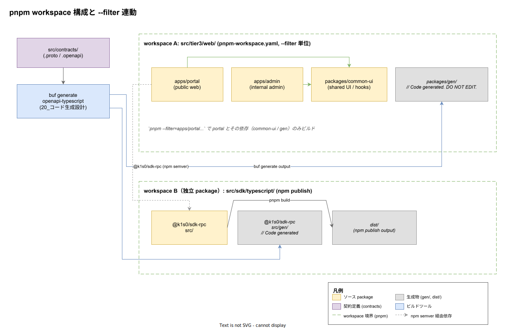

# 01. TypeScript pnpm workspace

本ファイルは k1s0 における TypeScript ビルド境界、つまり **tier3 web の pnpm workspace** と **SDK TypeScript の独立 package** をどう分離して運用するかを実装段階確定版として定義する。Rust（[10_Rust_Cargo_workspace](../10_Rust_Cargo_workspace/01_Rust_Cargo_workspace.md)）・Go（[20_Go_module分離戦略](../20_Go_module分離戦略/01_Go_module分離戦略.md)）と同じく、原則 [IMP-BUILD-POL-002](../00_方針/01_ビルド設計原則.md)（ワークスペース境界 = tier 境界）と [IMP-BUILD-POL-003](../00_方針/01_ビルド設計原則.md)（依存方向逆流の lint 拒否）を TypeScript 側で具体化する位置付けとなる。



## なぜ単一 package を選ばないか

tier3 web は portal（外部公開ポータル）・admin（内部運用画面）・common-ui（共通 UI ライブラリ）が**同じリリース単位**で動くため、pnpm workspace で内部 package を 1 リポジトリに束ねるのが合理的である。一方で SDK TypeScript は **採用側組織が npm 経由で依存する外部公開ライブラリ**であり、tier3 とは所有権・リリースサイクル・互換性責務（semver 厳守）が決定的に異なる。これを 1 つの巨大 workspace に押し込むと、tier3 web の package 追加で SDK の `pnpm-lock.yaml` が書き換わり、**SDK の semver patch リリースに tier3 の意図しない依存変更が混入する**事故が起きる。

過去の他社事例として、Shopify が UI 共通ライブラリと顧客向け SDK を同じ Yarn workspace に入れた結果、共通ライブラリの devDependency 追加で SDK のバンドルサイズが 30% 増し、SDK 利用者から大量のバグ報告が上がった事例がある（公開ポストモーテム 2021）。本章はその轍を踏まないため、**`src/tier3/web/` と `src/sdk/typescript/` を別々のビルド単位として完全分離**する。

加えて以下も避けるべき破綻として明示する。

- 単一 workspace により tier3 専用 devDependency（Storybook / Playwright 等）が SDK の `node_modules` に混入し、SDK 配布時のサイズが膨らむ
- `pnpm install` が tier3 / SDK 双方の依存解決を同時に行うため、片方の lockfile 失敗が他方のビルドを止める
- tier3 が SDK を相対 path import（`../../sdk/typescript/src/...`）で参照し始め、原則 [IMP-BUILD-POL-003](../00_方針/01_ビルド設計原則.md) の逆流検出が efectiv ではなくなる

## workspace A: tier3 web の pnpm workspace

`src/tier3/web/` 配下は `pnpm-workspace.yaml` を 1 つ持ち、その配下に複数の package を配置する。リリース時点 時点では `apps/portal` のみが本格実装対象だが、admin と common-ui の構造は最初から確定して採番しておくことで、後から package を追加するたびに workspace 構造を見直す手間を排除する。

```yaml
# src/tier3/web/pnpm-workspace.yaml
packages:
  - "apps/*"
  - "packages/*"
```

`apps/*` は最終的にユーザーへ配信される SPA / SSR アプリ（portal, admin）を配置し、`packages/*` には共有 UI ライブラリ（common-ui）と契約由来の生成物（gen/）を配置する。両者をディレクトリで分離するのは、**「リリース対象（apps）」と「内部依存先（packages）」を pnpm の glob パターンレベルで識別可能にする**ためで、これにより `pnpm --filter "./apps/*"` のような選択ビルドで「リリース対象のみビルド」が表現できる。

各 package の `package.json` で `private: true` を tier3 側に強制する（npm に誤って publish しないため）。

```json
// src/tier3/web/apps/portal/package.json
{
  "name": "@k1s0-internal/portal",
  "private": true,
  "version": "0.0.0",
  "dependencies": {
    "@k1s0-internal/common-ui": "workspace:*",
    "@k1s0-internal/gen": "workspace:*",
    "@k1s0/sdk-rpc": "^1.0.0"
  }
}
```

ここで重要なのは `@k1s0-internal/common-ui` が `workspace:*` プロトコルで内部参照されている一方、`@k1s0/sdk-rpc` は **`^1.0.0` の semver 範囲指定で npm registry 経由依存**として宣言されている点である。同じ monorepo 内に存在する SDK でも、tier3 からの参照は必ず公開 npm 経由とすることで、原則 [IMP-BUILD-POL-002](../00_方針/01_ビルド設計原則.md) の workspace 境界が semver 互換性ゲートとして機能する。

## workspace B: SDK TypeScript の独立 package

`src/sdk/typescript/` は単一の `package.json` を持ち、pnpm workspace を**形成しない**。これにより SDK は完結した 1 配布単位として扱われ、`pnpm publish` で npm registry に直接登録できる。

```json
// src/sdk/typescript/package.json
{
  "name": "@k1s0/sdk-rpc",
  "version": "1.0.0",
  "main": "dist/index.js",
  "types": "dist/index.d.ts",
  "files": ["dist", "README.md"],
  "scripts": {
    "build": "tsc -p tsconfig.build.json",
    "prepublishOnly": "pnpm build"
  },
  "dependencies": {
    "@bufbuild/protobuf": "^2.0.0"
  }
}
```

`files` フィールドで `dist/` のみ npm publish 対象とすることで、`src/` や `src/gen/` といったソース・生成物がそのまま外部に配布されるのを防ぐ。これは [IMP-BUILD-POL-007](../00_方針/01_ビルド設計原則.md)（生成物 commit と隔離）と整合し、リポジトリ内では生成物を commit しつつ、配布時は生成物の中間状態が外部から見えない構造を維持する。

SDK 側に独自の `tsconfig.build.json` を持たせ、tier3 で使う `tsconfig.json`（dev 向け）と分離する。dev 向けは型推論の高速化を優先（`noEmit: true` 等）、build 向けは ESM / CJS 両出力 + `.d.ts` 生成を厳格化する。

## pnpm-workspace.yaml と --filter 運用

選択ビルドは `pnpm --filter` の引数解釈に統一する。原則 [IMP-BUILD-POL-004](../00_方針/01_ビルド設計原則.md) の path-filter 第 3 段（ワークスペース判定）が tier3 web 側の影響範囲を「どの apps / packages が変更されたか」まで絞り込んだ上で、CI ジョブが対応する `pnpm --filter` を起動する。

| filter 表現 | 影響範囲 | ユースケース |
|---|---|---|
| `--filter=@k1s0-internal/portal...` | portal とその依存（common-ui / gen）を transitive に含む | portal 単体の変更 |
| `--filter="./apps/*"` | apps 配下全 package（admin / portal）+ 各依存 | リリース対象一括ビルド |
| `--filter=@k1s0-internal/common-ui` | common-ui のみ | 共有 UI の単体テスト |
| `--filter=@k1s0-internal/portal^...` | portal が依存する package のみ（portal 自身は除外） | 依存先のキャッシュ事前生成 |

`--filter=...` の末尾 3 点（`...`）は「依存方向に展開」を意味し、`...^` で「逆向き（依存元に展開）」となる。CI 内では path-filter 出力を直接 `--filter` 引数にマッピングするため、filter 文法の表現力がそのまま選択ビルドの精度に直結する。

ただし**契約変更（`src/contracts/` 配下の `.proto` / `.openapi`）はこの選択ビルドの対象外**とし、契約変更時は workspace A / B の両方で `pnpm --filter '*'` を強制する。これは原則 [IMP-BUILD-POL-004](../00_方針/01_ビルド設計原則.md) の最後段「契約変更の横断伝播判定」と整合する。

## eslint-plugin-boundaries による依存方向逆流の lint

ディレクトリ階層と `package.json` の依存宣言だけでは、TypeScript の自由な import 構文により逆流を完全に防げない。具体的には、tier3 のコードから `import { ... } from "../../../tier1/go/..."` のような相対 path import が物理的には可能で、ビルド設定上は `tsc` を通してしまう。これを防ぐため `eslint-plugin-boundaries` を CI の lint 段で必ず通す。

```jsonc
// src/tier3/web/.eslintrc.json
{
  "plugins": ["boundaries"],
  "settings": {
    "boundaries/elements": [
      { "type": "tier3-app",   "pattern": "apps/*" },
      { "type": "tier3-pkg",   "pattern": "packages/*" },
      { "type": "sdk-rpc",     "pattern": "node_modules/@k1s0/sdk-rpc" },
      { "type": "forbidden",   "pattern": "**/tier1/**" },
      { "type": "forbidden",   "pattern": "**/tier2/**" }
    ]
  },
  "rules": {
    "boundaries/element-types": ["error", {
      "default": "disallow",
      "rules": [
        { "from": "tier3-app", "allow": ["tier3-pkg", "sdk-rpc"] },
        { "from": "tier3-pkg", "allow": ["tier3-pkg"] }
      ]
    }]
  }
}
```

`forbidden` タイプを定義しておくことで、tier1 / tier2 の物理 path に対する import が静的に検出される。`from: "tier3-app"` の `allow` リストに `forbidden` を含めないため、相対 path で tier1 を直接参照する PR は CI lint で拒否される。lint 結果は `30_CI_CD設計/` の quality gate に組み込まれる。

## キャッシュ層と Turbo Remote Cache

原則 [IMP-BUILD-POL-005](../00_方針/01_ビルド設計原則.md)（3 層キャッシュ階層）の TypeScript 側適用として、以下の 3 層を独立稼働させる。

| 層 | 実体 | キー | 用途 |
|---|---|---|---|
| 第 1 層: ローカル | `~/.local/share/pnpm/store/v3/`（pnpm store） + `node_modules/.cache/` | lockfile ハッシュ + content hash | 開発者端末の差分インストール高速化 |
| 第 2 層: CI | GitHub Actions `actions/cache@v4` で `pnpm store` と `.turbo/` を保存 | `pnpm-lock.yaml` ハッシュ | PR 間共有、リリース時点の主力 |
| 第 3 層: リモート | Turbo Remote Cache（self-hosted、または Turborepo の vercel.com 経由） | task ハッシュ（input file + 環境変数） | self-hosted runner 間 / 開発者・CI 間共有 |

第 1 層の pnpm store は `pnpm install` 時のハードリンク機構により `node_modules` を実体としてコピーせず参照を張るため、複数 workspace で同じ依存を共有してもディスク使用量は増えない。これは Yarn の従来 `node_modules` 配置とは挙動が異なるため、開発者向けセットアップ手順（[`50_開発者体験設計/`](../../50_開発者体験設計/)）で明記する。

第 3 層の Turbo Remote Cache はリリース時点 までは導入を保留し、第 2 層の GitHub Actions cache で運用する。リリース時点 で `pnpm build` の p95 が 5 分を超えた場合に Turbo Remote Cache 導入を新 ADR で起票する（原則 [IMP-BUILD-POL-006](../00_方針/01_ビルド設計原則.md) のビルド時間 SLI 計測に基づく判断）。

## 生成物の隔離（gen/）

原則 [IMP-BUILD-POL-007](../00_方針/01_ビルド設計原則.md) を TypeScript 側で具体化すると以下になる。

- tier3 web 側: `src/tier3/web/packages/gen/` を独立 package とし、`@k1s0-internal/gen` 名で内部公開する。`package.json` の `scripts.build` は走らせず、ソースは `// Code generated. DO NOT EDIT.` ヘッダ付きのまま `apps/*` から import される。
- SDK TS 側: `src/sdk/typescript/src/gen/` 配下に配置し、`tsconfig.build.json` でビルド対象に含める。生成物のヘッダコメント・生成器バージョン・生成日時は [`20_コード生成設計/`](../../20_コード生成設計/) で規定するメタ形式に従う。

`.editorconfig` で `**/gen/**` をフォーマッタ対象外とする宣言を tier3 / SDK 双方の `.editorconfig` に書く。これは IDE の自動整形が生成物を「修正済みファイル」として扱わないようにするための実務的措置で、これが無いと `pre-commit` の prettier が生成物を勝手に書き換えて差分が常に出続ける状態になる。

```ini
# src/tier3/web/.editorconfig
[**/gen/**]
charset = unset
indent_style = unset
indent_size = unset
end_of_line = unset
trim_trailing_whitespace = false
insert_final_newline = false
```

## ディレクトリ配置まとめ

| path | 種別 | 役割 |
|---|---|---|
| `src/tier3/web/pnpm-workspace.yaml` | workspace 宣言 | tier3 web の package 集合を定義（`apps/*` + `packages/*`） |
| `src/tier3/web/apps/portal/` | package | 外部公開ポータル SPA / SSR |
| `src/tier3/web/apps/admin/` | package | 内部運用画面（リリース時点 着手） |
| `src/tier3/web/packages/common-ui/` | package | 共有 UI コンポーネント / hooks |
| `src/tier3/web/packages/gen/` | package（生成物隔離） | contracts 由来の TS バインディング、`@k1s0-internal/gen` |
| `src/tier3/web/.eslintrc.json` | lint 設定 | `eslint-plugin-boundaries` による逆流検出 |
| `src/sdk/typescript/package.json` | 独立 package | npm 配布用 SDK 本体、`@k1s0/sdk-rpc` |
| `src/sdk/typescript/src/` | ソース | SDK 公開 API 実装 |
| `src/sdk/typescript/src/gen/` | 生成物隔離 | contracts 由来の TS バインディング、`dist/` に同梱 |
| `src/sdk/typescript/tsconfig.build.json` | ビルド設定 | npm publish 用 tsc 設定（ESM / CJS 両出力） |

## 対応 IMP-BUILD ID

本ファイルで採番する実装 ID は以下とする（接頭辞 `TP` = TypeScript Pnpm）。

- `IMP-BUILD-TP-030` : tier3 web の単一 pnpm workspace と SDK TS の独立 package という 2 ビルド単位分離
- `IMP-BUILD-TP-031` : `apps/*` / `packages/*` の glob 分離による「リリース対象 / 内部依存先」識別
- `IMP-BUILD-TP-032` : `workspace:*` プロトコルによる内部参照、SDK は npm semver 経由参照の強制
- `IMP-BUILD-TP-033` : SDK の `files` フィールド限定による生成物・ソース非配布
- `IMP-BUILD-TP-034` : `pnpm --filter` を選択ビルドの統一表記とし、契約変更時は全 workspace 再ビルドを強制
- `IMP-BUILD-TP-035` : `eslint-plugin-boundaries` による tier 跨ぎ import の lint 段拒否
- `IMP-BUILD-TP-036` : pnpm store / GitHub Actions cache / Turbo Remote Cache の 3 層独立稼働（リモートはリリース時点 ADR 起票）
- `IMP-BUILD-TP-037` : `**/gen/**` のフォーマッタ・lint 除外による生成物ドリフト防止

## 対応 ADR / DS-SW-COMP / NFR

- ADR: [ADR-TIER1-002](../../../02_構想設計/adr/ADR-TIER1-002-protobuf-grpc.md)（Protobuf gRPC 契約）/ [ADR-TIER1-003](../../../02_構想設計/adr/ADR-TIER1-003-language-opacity.md)（内部言語不可視 → SDK 越し参照の根拠）/ [ADR-DIR-001](../../../02_構想設計/adr/ADR-DIR-001-contracts-elevation.md)（contracts 昇格）
- DS-SW-COMP: DS-SW-COMP-122（contracts → 4 言語生成）/ DS-SW-COMP-129 / 130（SDK 配置と利用境界）
- NFR: [NFR-B-PERF-001](../../../03_要件定義/30_非機能要件/B_性能拡張性.md)（性能基盤としての p99 < 500ms）/ [NFR-C-NOP-004](../../../03_要件定義/30_非機能要件/C_運用保守性.md)（ビルド所要時間運用）/ [NFR-C-MGMT-001](../../../03_要件定義/30_非機能要件/C_運用保守性.md)（設定 Git 管理）

## 関連章 / 参照

- [00_方針/01_ビルド設計原則.md](../00_方針/01_ビルド設計原則.md) — 本章が具体化する 7 軸
- [10_Rust_Cargo_workspace/01_Rust_Cargo_workspace.md](../10_Rust_Cargo_workspace/01_Rust_Cargo_workspace.md) — Rust 側の同等構造
- [20_Go_module分離戦略/01_Go_module分離戦略.md](../20_Go_module分離戦略/01_Go_module分離戦略.md) — Go 側の同等構造
- [40_dotnet_sln境界/](../40_dotnet_sln境界/) — .NET 側の同等構造（リリース時点 着手）
- [50_選択ビルド判定/](../50_選択ビルド判定/) — path-filter から `--filter` 引数への変換ルール
- [60_キャッシュ戦略/](../60_キャッシュ戦略/) — 3 層キャッシュの横断詳細
- [20_コード生成設計/](../../20_コード生成設計/) — `gen/` 配下の生成器・ヘッダ規約
