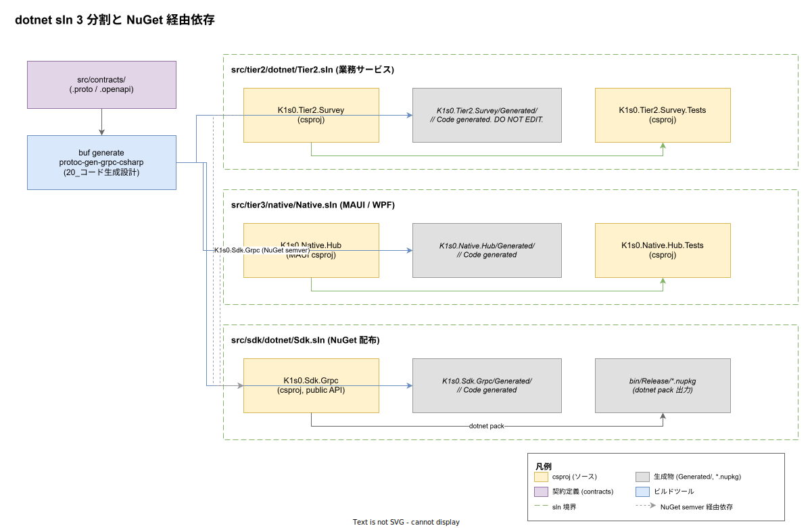

# 01. dotnet sln 境界

本ファイルは k1s0 における .NET ビルド境界、すなわち **`Tier2.sln` / `Native.sln` / `Sdk.sln` の 3 sln 分割**と、それらの間に流れる依存・生成物・配布物の経路を実装段階確定版として定義する。Rust（[10_Rust_Cargo_workspace](../10_Rust_Cargo_workspace/01_Rust_Cargo_workspace.md)）・Go（[20_Go_module分離戦略](../20_Go_module分離戦略/01_Go_module分離戦略.md)）・TypeScript（[30_TypeScript_pnpm_workspace](../30_TypeScript_pnpm_workspace/01_TypeScript_pnpm_workspace.md)）と同じく、原則 [IMP-BUILD-POL-002](../00_方針/01_ビルド設計原則.md)（ワークスペース境界 = tier 境界）と [IMP-BUILD-POL-003](../00_方針/01_ビルド設計原則.md)（依存方向逆流の lint 拒否）を .NET 側で具体化する位置付けとなる。



## なぜ単一 sln を選ばないか

`dotnet build` は sln（ソリューション）単位でビルドを走らせるが、`dotnet new sln` で全 csproj を 1 つに束ねるのは技術的には可能である。しかし k1s0 の構造においては以下の 3 つの破綻が連鎖的に起きるため、単一 sln は最初から却下する。

第一に、Tier2（業務サービス）・Native（MAUI / WPF アプリ）・Sdk（外部配布ライブラリ）は所有権・リリースサイクル・互換性責務がそれぞれ異なる。Sdk は採用側組織が NuGet 経由で依存する **semver 厳守の外部配布物**である一方、Tier2 は内部運用される業務サービスで semver の制約が緩い。これらを 1 sln に入れると、Tier2 の patch リリースで `<PackageReference>` のバージョン幅が暗黙に広がり、Sdk の semver 互換性ゲートが事実上崩れる。

第二に、Visual Studio / Rider などの IDE は sln を開く際に**全 csproj をロードして解析する**ため、csproj 数の増加とともに起動時間とメモリ使用量が指数的に悪化する。Avalonia や Uno Platform のような OSS でも 50+ csproj の単一 sln は IDE 起動 2〜5 分が報告されており、開発者体験の劣化は実装着手前から避けるべき判断対象である。

第三に、MAUI csproj は `net8.0-android` / `net8.0-ios` / `net8.0-maccatalyst` などの **複数 TFM（Target Framework Moniker）** を内包し、ビルド対象 OS の workload インストールに依存する。これを Sdk のような pure managed csproj と同一 sln に入れると、Sdk のビルドにすら MAUI workload が要求され、CI の dotnet 環境が肥大化する。

## 3 sln 分割の境界（Tier2 / Native / Sdk）

3 sln は以下のように物理配置と責務を完全分離する。

| sln | path | 主 csproj | 配布形態 | 主 TFM |
|---|---|---|---|---|
| `Tier2.sln` | `src/tier2/dotnet/` | `K1s0.Tier2.Survey` | コンテナ（kubernetes Pod） | `net8.0` |
| `Native.sln` | `src/tier3/native/` | `K1s0.Native.Hub` | MSIX / IPA / APK | `net8.0-windows`, `net8.0-android`, `net8.0-ios`, `net8.0-maccatalyst` |
| `Sdk.sln` | `src/sdk/dotnet/` | `K1s0.Sdk.Grpc` | NuGet パッケージ | `netstandard2.1`, `net8.0` |

各 sln は配下に複数 csproj を持ちうる（例: `K1s0.Tier2.Survey.Tests`、`K1s0.Sdk.Grpc.Internal` 等）が、**sln を跨ぐ csproj 参照は禁止**とする。Sdk への依存が必要な場合は必ず NuGet 経由で `<PackageReference Include="K1s0.Sdk.Grpc" Version="1.0.0" />` を使う。これは TypeScript 章で `@k1s0/sdk-rpc` を `workspace:*` ではなく semver 範囲で参照する設計と整合する。

各 sln 直下には以下の 4 ファイルを必ず置く。

```text
src/tier2/dotnet/
├── Tier2.sln
├── Directory.Build.props        # 横断制約（後述）
├── Directory.Packages.props     # CPM (Central Package Management)
└── nuget.config                 # 取得先 feed の固定
```

`Directory.Packages.props` で **CPM（Central Package Management）** を有効化し、各 csproj の `<PackageReference>` から `Version` 属性を排除する。これにより同一 sln 内の NuGet バージョン揃え漏れが構造的に防がれる（同じ依存を csproj A は 8.0.0、B は 8.0.1 にしてしまう事故）。

## ProjectReference と PackageReference の使い分け

`<ProjectReference>` は同一 sln 内の csproj 直接参照、`<PackageReference>` は NuGet 経由参照である。両者の使い分けは原則 [IMP-BUILD-POL-002](../00_方針/01_ビルド設計原則.md)（境界 = tier 境界）から自動的に決まる。

| 関係 | 参照方式 | 例 |
|---|---|---|
| 同一 sln 内の本体 → テスト | `<ProjectReference>` | `K1s0.Tier2.Survey.Tests` → `K1s0.Tier2.Survey` |
| 同一 sln 内の複数 csproj | `<ProjectReference>` | `K1s0.Sdk.Grpc.Internal` → `K1s0.Sdk.Grpc` |
| sln 跨ぎ（Tier2 → Sdk） | `<PackageReference>` | `K1s0.Tier2.Survey` → `K1s0.Sdk.Grpc` (NuGet) |
| sln 跨ぎ（Native → Sdk） | `<PackageReference>` | `K1s0.Native.Hub` → `K1s0.Sdk.Grpc` (NuGet) |
| OSS / 外部依存 | `<PackageReference>` | `Grpc.AspNetCore`, `Microsoft.Extensions.*` |

sln 跨ぎを `<ProjectReference>` で書くのは技術的には可能だが、**禁則とする**。理由は 2 つある。1 つは Sdk の semver gate を素通ししてしまうこと、もう 1 つは Sdk に対する変更が Tier2 / Native のビルドキャッシュを毎回無効化してしまい選択ビルドが効かなくなることである。

この禁則は次節の `Directory.Build.props` 横断制約で機械的に検出する。

## Directory.Build.props による横断制約

`Directory.Build.props` は MSBuild が **同一ディレクトリ以下の全 csproj に自動適用する暗黙のプロパティファイル**で、本ファイルは sln ごとの規約を一箇所に集約する。

```xml
<!-- src/tier2/dotnet/Directory.Build.props -->
<Project>
  <PropertyGroup>
    <TargetFramework>net8.0</TargetFramework>
    <ImplicitUsings>enable</ImplicitUsings>
    <Nullable>enable</Nullable>
    <TreatWarningsAsErrors>true</TreatWarningsAsErrors>
    <EnforceCodeStyleInBuild>true</EnforceCodeStyleInBuild>
    <ManagePackageVersionsCentrally>true</ManagePackageVersionsCentrally>
  </PropertyGroup>

  <ItemGroup>
    <!-- sln 跨ぎ ProjectReference を MSBuild レベルで拒否 -->
    <ProjectReference Update="@(ProjectReference)"
                      Condition="!$([System.String]::Copy('%(FullPath)').StartsWith('$(MSBuildThisFileDirectory)'))">
      <IsForbidden>true</IsForbidden>
    </ProjectReference>
  </ItemGroup>

  <Target Name="RejectCrossSlnReferences" BeforeTargets="ResolveProjectReferences">
    <Error Condition="'%(ProjectReference.IsForbidden)' == 'true'"
           Text="Cross-sln ProjectReference is forbidden: %(ProjectReference.FullPath). Use PackageReference instead." />
  </Target>
</Project>
```

`Directory.Build.props` の解決位置は MSBuild 起動時に親ディレクトリを再帰的に遡って最初に見つかったものが採用されるため、`src/tier2/dotnet/Directory.Build.props` は同 sln 配下の全 csproj に自動適用される。`Directory.Build.targets` を併用すると `BeforeTargets` のフックも書けるため、上記の `RejectCrossSlnReferences` ターゲットで sln 境界を MSBuild ビルド時に検証できる。

`<TreatWarningsAsErrors>true</TreatWarningsAsErrors>` と `<EnforceCodeStyleInBuild>true</EnforceCodeStyleInBuild>` は Roslyn analyzer 由来の lint 違反を CI で確実に拒否する。`<ImplicitUsings>` と `<Nullable>` は C# 12 + .NET 8 のモダン既定を sln 横断で揃え、csproj ごとの設定ドリフトを防ぐ。

## 選択ビルドと dotnet 単位

`dotnet build Tier2.sln` のように sln を引数に渡すと、配下の全 csproj がビルドされる。これは 1 sln あたり数〜十数 csproj に収まる本構成では実用的に十分高速だが、PR の変更規模に応じてさらに絞るため、原則 [IMP-BUILD-POL-004](../00_方針/01_ビルド設計原則.md) の path-filter は次の表に従って sln 単位の判定を出力する。

| 変更パス | 起動 sln | 連鎖ビルド |
|---|---|---|
| `src/tier2/dotnet/**` | `Tier2.sln` のみ | なし |
| `src/tier3/native/**` | `Native.sln` のみ | なし |
| `src/sdk/dotnet/**` | `Sdk.sln` のみ | （NuGet 公開後）Tier2 / Native の semver 範囲再評価 |
| `src/contracts/**` | `Tier2.sln` + `Native.sln` + `Sdk.sln` 全部 | 契約変更時の横断強制 |

契約変更時に 3 sln 全ビルドを強制するのは TypeScript 章と同様で、原則 [IMP-BUILD-POL-004](../00_方針/01_ビルド設計原則.md) 最後段「契約変更の横断伝播判定」と整合する。

なお `dotnet build` は単一 csproj を引数に取ることもできるため（`dotnet build path/to/Foo.csproj`）、PR 内で 1 csproj しか変更されていない場合に限り csproj 単位の指定でさらに高速化する余地はある。これは リリース時点 ではなくビルド時間 SLI（原則 [IMP-BUILD-POL-006](../00_方針/01_ビルド設計原則.md)）の観測結果次第で判断する。

## 生成物の隔離（Generated/）

原則 [IMP-BUILD-POL-007](../00_方針/01_ビルド設計原則.md) を .NET 側で具体化すると以下になる。

各 csproj の直下に `Generated/` フォルダを置き、`buf generate` の出力先とする。csproj の既定動作では `**/*.cs` が暗黙に `Compile` 対象に含まれるため、生成物は何もしなくてもビルドに参加するが、IDE の解析対象から除外したい場合は次のように明示する。

```xml
<!-- K1s0.Sdk.Grpc.csproj -->
<ItemGroup>
  <!-- Generated/ は MSBuild Compile に含めるが、analyzer から除外 -->
  <Compile Update="Generated/**/*.cs">
    <Visible>false</Visible>
    <DependentUpon>$(ProjectName)</DependentUpon>
  </Compile>
  <!-- analyzer 警告抑止 -->
  <AdditionalFiles Remove="Generated/**/*.cs" />
</ItemGroup>
```

`<Visible>false</Visible>` は IDE のソリューションエクスプローラから生成物を隠す。これは生成物を「修正対象」としてレビュアー / IDE が誤って扱うのを防ぐ実務的措置である。

`.editorconfig` で `Generated/` 配下を analyzer 対象外とする宣言も同時に行う。

```ini
# src/sdk/dotnet/.editorconfig
[**/Generated/**]
generated_code = true
dotnet_analyzer_diagnostic.severity = none
```

`generated_code = true` は Roslyn の規約で、analyzer 全般がそのファイルを「自動生成コード」として扱い、警告を抑止する。

## キャッシュ層

原則 [IMP-BUILD-POL-005](../00_方針/01_ビルド設計原則.md)（3 層キャッシュ階層）の .NET 側適用は、現状 2 層止まりである。NuGet には公式のリモートキャッシュ機構（sccache / Turbo Remote Cache のような分散層）が無いため、第 3 層は導入を保留する。

| 層 | 実体 | キー | 用途 |
|---|---|---|---|
| 第 1 層: ローカル | `~/.nuget/packages/`（NuGet HTTP cache） + `obj/` | `packages.lock.json` ハッシュ + project file ハッシュ | 開発者端末の差分復元 |
| 第 2 層: CI | GitHub Actions `actions/cache@v4` で `~/.nuget/packages/` と `obj/` を保存 | `Directory.Packages.props` ハッシュ | PR 間共有、リリース時点の主力 |
| 第 3 層: リモート | （現状なし） | — | リリース時点 で再評価。BuildXL / NuGet Server の自前運用は ROI が薄い |

`packages.lock.json` の commit を全 csproj で必須化する（`<RestorePackagesWithLockFile>true</RestorePackagesWithLockFile>`）。これにより `dotnet restore --locked-mode` で依存解決の決定論性が保証され、第 1 層・第 2 層キャッシュのキー設計が安定する。

## ディレクトリ配置まとめ

| path | 種別 | 役割 |
|---|---|---|
| `src/tier2/dotnet/Tier2.sln` | sln | 業務サービス用、`net8.0` Pod 化対象 |
| `src/tier2/dotnet/Directory.Build.props` | MSBuild 規約 | 横断 TFM / Nullable / 警告 / sln 跨ぎ拒否 |
| `src/tier2/dotnet/Directory.Packages.props` | CPM | NuGet バージョン中央管理 |
| `src/tier2/dotnet/K1s0.Tier2.Survey/` | csproj | Tier2 業務サービス本体 |
| `src/tier2/dotnet/K1s0.Tier2.Survey/Generated/` | 生成物隔離 | contracts 由来の C# バインディング |
| `src/tier3/native/Native.sln` | sln | MAUI / WPF アプリ用、複数 TFM |
| `src/tier3/native/Directory.Build.props` | MSBuild 規約 | MAUI 用 TFM 追加 + sln 跨ぎ拒否 |
| `src/tier3/native/K1s0.Native.Hub/` | csproj | クロスプラットフォーム ネイティブアプリ |
| `src/sdk/dotnet/Sdk.sln` | sln | NuGet 配布用 SDK、`netstandard2.1` + `net8.0` 多重 TFM |
| `src/sdk/dotnet/Directory.Build.props` | MSBuild 規約 | semver 厳守設定 + `dotnet pack` メタデータ |
| `src/sdk/dotnet/K1s0.Sdk.Grpc/` | csproj | SDK 公開 API 本体 |
| `src/sdk/dotnet/K1s0.Sdk.Grpc/Generated/` | 生成物隔離 | contracts 由来、`*.nupkg` に同梱 |
| `nuget.config` | 取得先 | 全 sln 共通の NuGet feed 固定 |

## 対応 IMP-BUILD ID

本ファイルで採番する実装 ID は以下とする（接頭辞 `DS` = Dotnet Sln）。

- `IMP-BUILD-DS-040` : Tier2 / Native / Sdk の 3 sln 分割と sln 跨ぎ csproj 参照の禁止
- `IMP-BUILD-DS-041` : ProjectReference（同一 sln 内）と PackageReference（sln 跨ぎ）の使い分け強制
- `IMP-BUILD-DS-042` : `Directory.Build.props` による sln 横断制約（Nullable / 警告昇格 / sln 跨ぎ MSBuild ターゲット拒否）
- `IMP-BUILD-DS-043` : `Directory.Packages.props` による CPM（Central Package Management）強制
- `IMP-BUILD-DS-044` : 各 csproj 直下 `Generated/` への生成物隔離と `generated_code = true` 宣言
- `IMP-BUILD-DS-045` : `packages.lock.json` の必須化（`RestorePackagesWithLockFile` + `--locked-mode`）
- `IMP-BUILD-DS-046` : NuGet HTTP cache + GitHub Actions cache の 2 層運用、第 3 層は リリース時点 ADR 起票
- `IMP-BUILD-DS-047` : Sdk の `dotnet pack` による NuGet 配布形式と `<IsPackable>` 制御

## 対応 ADR / DS-SW-COMP / NFR

- ADR: [ADR-TIER1-002](../../../02_構想設計/adr/ADR-TIER1-002-protobuf-grpc.md)（Protobuf gRPC 契約）/ [ADR-TIER1-003](../../../02_構想設計/adr/ADR-TIER1-003-language-opacity.md)（内部言語不可視 → SDK 越し参照の根拠）/ [ADR-DIR-001](../../../02_構想設計/adr/ADR-DIR-001-contracts-elevation.md)（contracts 昇格）
- DS-SW-COMP: DS-SW-COMP-122（contracts → 4 言語生成）/ DS-SW-COMP-129 / 130（SDK 配置と利用境界）
- NFR: [NFR-B-PERF-001](../../../03_要件定義/30_非機能要件/B_性能拡張性.md)（性能基盤としての p99 < 500ms）/ [NFR-C-NOP-004](../../../03_要件定義/30_非機能要件/C_運用保守性.md)（ビルド所要時間運用）/ [NFR-C-MGMT-001](../../../03_要件定義/30_非機能要件/C_運用保守性.md)（設定 Git 管理）

## 関連章 / 参照

- [00_方針/01_ビルド設計原則.md](../00_方針/01_ビルド設計原則.md) — 本章が具体化する 7 軸
- [10_Rust_Cargo_workspace/01_Rust_Cargo_workspace.md](../10_Rust_Cargo_workspace/01_Rust_Cargo_workspace.md) — Rust 側の同等構造
- [20_Go_module分離戦略/01_Go_module分離戦略.md](../20_Go_module分離戦略/01_Go_module分離戦略.md) — Go 側の同等構造
- [30_TypeScript_pnpm_workspace/01_TypeScript_pnpm_workspace.md](../30_TypeScript_pnpm_workspace/01_TypeScript_pnpm_workspace.md) — TypeScript 側の同等構造
- [50_選択ビルド判定/](../50_選択ビルド判定/) — path-filter から sln 起動への変換ルール
- [60_キャッシュ戦略/](../60_キャッシュ戦略/) — 3 層キャッシュの横断詳細
- [20_コード生成設計/](../../20_コード生成設計/) — `Generated/` 配下の生成器・ヘッダ規約
- [80_サプライチェーン設計/](../../80_サプライチェーン設計/) — `*.nupkg` の cosign / SBOM 連携
