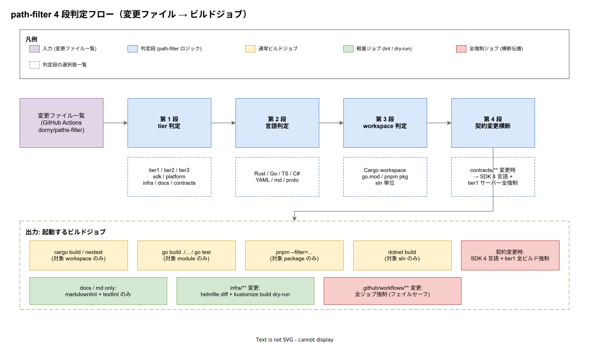

# 01. 選択ビルド判定（path-filter）

本ファイルは k1s0 モノレポにおける**選択ビルドの判定ロジック**、すなわち PR 内の変更ファイル一覧を入力として、どの言語のどの workspace / module / sln / package がビルド対象になるかを決定する 4 段の path-filter を実装段階確定版として定義する。Bazel / Buck2 を採用しない方針（[IMP-BUILD-POL-001](../00_方針/01_ビルド設計原則.md)）の下で**全ビルドを禁じ、変更影響範囲のみを再ビルドする**ための具体的なファイル変換ルールを規定する。本章の出力は [10_Rust_Cargo_workspace](../10_Rust_Cargo_workspace/01_Rust_Cargo_workspace.md) / [20_Go_module分離戦略](../20_Go_module分離戦略/01_Go_module分離戦略.md) / [30_TypeScript_pnpm_workspace](../30_TypeScript_pnpm_workspace/01_TypeScript_pnpm_workspace.md) / [40_dotnet_sln境界](../40_dotnet_sln境界/01_dotnet_sln境界.md) の各ビルドジョブを起動する [`30_CI_CD設計/`](../../30_CI_CD設計/) の reusable workflow が直接消費する。



## なぜ 4 段に分けるか

path-filter のロジックを 1 段の巨大な `paths-filter` 設定にまとめる方がファイル数は減る。しかしその構造は以下の理由で破綻する。

1 つは**変更検知のブラックボックス化**である。「`src/tier3/web/apps/portal/src/Foo.tsx` の変更でなぜ tier1 Rust ビルドが走らなかったのか」を後追い調査する時、1 段ロジックでは正規表現の優先順位を読み解くしかない。4 段に分けて各段の出力をログに残せば、第何段で「対象外」と判定されたかが可観測になり、誤判定の root cause analysis が容易になる。

もう 1 つは**契約変更の特殊扱いを構造化**できる点である。`src/contracts/**` の変更は他のどの tier 変更とも性質が異なり、SDK 4 言語と tier1 サーバー全てを巻き込む横断伝播が必要になる（[IMP-BUILD-POL-004](../00_方針/01_ビルド設計原則.md) 第 4 段）。これを第 1〜3 段の通常フローに混ぜると条件分岐が爆発するため、第 4 段として独立させて先取りで全ビルドを強制する設計とする。

加えて、各段のロジックは以下のように責務が明確に異なるため、保守時の影響範囲も段単位に閉じる。

- 第 1 段（tier 判定）は `src/` 配下の物理ディレクトリ規約のみに依存
- 第 2 段（言語判定）は拡張子のみに依存
- 第 3 段（workspace 判定）は各言語のビルド機構（Cargo workspace / go.mod / pnpm-workspace.yaml / sln）の境界定義に依存
- 第 4 段（契約横断）は `src/contracts/**` ディレクトリのみに依存

## 第 1 段: tier 判定

変更ファイルの先頭ディレクトリ階層から、所属する tier を判定する。出力は `tier1` / `tier2` / `tier3` / `sdk` / `platform` / `infra` / `docs` / `contracts` / `tools` / `tests` / `ops` / `deploy` のいずれか、もしくは複数の集合とする。

```yaml
# .github/path-filter.yml — 第 1 段抜粋
filters:
  tier1:
    - "src/tier1/**"
  tier2:
    - "src/tier2/**"
  tier3:
    - "src/tier3/**"
  sdk:
    - "src/sdk/**"
  platform:
    - "src/platform/**"
  infra:
    - "infra/**"
    - "deploy/**"
  contracts:
    - "src/contracts/**"
  docs:
    - "docs/**"
  workflow_self:
    - ".github/workflows/**"
    - ".github/path-filter.yml"
```

`workflow_self` は path-filter 設定自身や CI workflow の変更を検知する**フェイルセーフ用の特殊フィルタ**である。ここに変更があった場合は第 4 段のロジックを bypass して全ジョブ強制ビルドへ即座に分岐する（path-filter のバグで誤って軽量ジョブのみが走るリスクを排除する）。

## 第 2 段: 言語判定

第 1 段で特定された tier 配下のファイルについて、拡張子から言語を判定する。tier1 のように複数言語が同居するディレクトリでは、同じ tier 出力に複数の言語タグが立つ。

```yaml
# .github/path-filter.yml — 第 2 段抜粋
filters:
  rust:
    - "**/*.rs"
    - "**/Cargo.toml"
    - "**/Cargo.lock"
    - "**/rust-toolchain.toml"
  go:
    - "**/*.go"
    - "**/go.mod"
    - "**/go.sum"
  ts:
    - "**/*.ts"
    - "**/*.tsx"
    - "**/package.json"
    - "**/pnpm-lock.yaml"
    - "**/tsconfig*.json"
  csharp:
    - "**/*.cs"
    - "**/*.csproj"
    - "**/*.sln"
    - "**/Directory.Build.props"
    - "**/Directory.Packages.props"
    - "**/packages.lock.json"
  proto:
    - "**/*.proto"
    - "**/buf.yaml"
    - "**/buf.gen.yaml"
  yaml:
    - "**/*.yaml"
    - "**/*.yml"
  md:
    - "**/*.md"
```

lockfile（`Cargo.lock` / `go.sum` / `pnpm-lock.yaml` / `packages.lock.json`）も対応言語のフィルタに含める。これは依存関係の更新も「該当言語の再ビルドが必要な変更」として扱うためで、Renovate PR の自動マージ判断（[`40_依存管理設計/`](../../40_依存管理設計/)）の前提条件となる。

## 第 3 段: workspace 判定

第 1〜2 段で「tier3 + ts」のように粗い粒度まで絞り込まれた変更を、各言語のビルド機構が認識する単位（Cargo workspace / go.mod / pnpm package / sln）まで降ろす。判定ロジックは言語ごとに異なる。

| 言語 | 判定単位 | 判定ロジック |
|---|---|---|
| Rust | Cargo workspace（3 分割: tier1 / sdk / platform） | 変更ファイル path の最初の 3 階層から workspace 識別、Cargo.lock 変更時は workspace 全体 |
| Go | go.mod 単位（5 分離: tier1 go / tier2 go / sdk go / bff / tests） | 変更ファイル直近の `go.mod` を遡って探索、見つかった `go.mod` の所属 module を起動 |
| TypeScript | pnpm package（apps/_+ packages/_）または独立 package（SDK） | `apps/<name>` / `packages/<name>` のディレクトリ識別、`pnpm-lock.yaml` 変更時は workspace 全体 |
| C# | sln 単位（3 分割: Tier2 / Native / Sdk） | `src/tier2/dotnet/` → Tier2.sln、`src/tier3/native/` → Native.sln、`src/sdk/dotnet/` → Sdk.sln |

第 3 段の出力は具体的な**ビルドコマンド引数**として表現される。例えば「`apps/portal/src/Foo.tsx` を変更」なら `pnpm --filter=@k1s0-internal/portal...` が生成され、reusable workflow にそのまま渡される。これにより CI 実行時の選択ビルドコマンドが path-filter の生成物として完全に決定論的になる。

判定ロジックの実体は `tools/ci/path-filter/` 配下のスクリプト（Go 製）として実装し、`.github/path-filter.yml` の YAML 出力をパースして引数文字列を組み立てる。スクリプト本体は単体テストの対象とし、新規 workspace 追加時はテストケース追加を必須とする（[`50_開発者体験設計/`](../../50_開発者体験設計/) の Golden Path 経由）。

## 第 4 段: 契約変更の横断伝播

`src/contracts/**` の変更は SDK 4 言語と tier1 サーバー全てに伝播するため、第 1〜3 段の選択ロジックを bypass して**強制的に全 SDK + tier1 サーバー全ビルド**を起動する。

```yaml
filters:
  contracts_changed:
    - "src/contracts/**"
```

`contracts_changed: true` が立った時の起動ジョブは以下とする。

- `cargo build -p k1s0-tier1-rust` ＋全 Rust SDK ビルド
- `go build ./...` を tier1 go module 全体 ＋全 Go SDK ビルド
- `pnpm --filter @k1s0/sdk-rpc build` ＋ tier3 web 配下の全 package
- `dotnet build Sdk.sln` ＋ Tier2.sln / Native.sln 全部

これは原則 [IMP-BUILD-POL-004](../00_方針/01_ビルド設計原則.md) の「契約と実装の不整合が検出されずに残存する」を防ぐ最重要ゲートで、契約変更の PR は意図的にビルド時間が長くなることを許容する。代わりに、契約変更を含まない PR はこのゲートに引っかからないため、日常開発の選択ビルド効率は維持される。

## ドキュメント / インフラ等の特殊扱い

実用上、path-filter は通常ビルドに加えて以下の特殊ジョブも起動する。これらは「重いビルドを走らせると無駄」「軽量ジョブを走らせないと品質が保てない」のいずれかを満たす。

| 変更パターン | 起動ジョブ | 重さ |
|---|---|---|
| `docs/**` のみ（コード変更なし） | `markdownlint` + `textlint` のみ | 軽量（数十秒） |
| `infra/**` または `deploy/**` のみ | `helmfile diff` + `kustomize build --dry-run` | 軽量〜中（1-2 分） |
| `tools/**` のみ | 該当 tool のテスト | 中 |
| `.github/workflows/**` 変更 | **全ジョブ強制実行** | 重（フェイルセーフ） |
| `tools/ci/path-filter/**` 変更 | path-filter 単体テスト + **全ジョブ強制実行** | 重（自己テスト） |

`.github/workflows/**` 変更時の全強制実行は path-filter の冪等性を担保するための運用上のセーフティネットで、リリース時点 で多少のコストになっても削らない方針とする。

## ディレクトリ配置まとめ

| path | 種別 | 役割 |
|---|---|---|
| `.github/path-filter.yml` | 設定 | dorny/paths-filter v3 用のフィルタ宣言（4 段すべての filter） |
| `.github/workflows/_build.yml` | reusable workflow | path-filter 出力を消費して各言語ビルドを起動 |
| `tools/ci/path-filter/` | Go ツール | YAML 出力を解釈してビルドコマンド引数を組み立てる |
| `tools/ci/path-filter/testdata/` | テスト | 変更ファイルパターン → 出力の golden test |
| `.github/workflows/_path-filter-self-test.yml` | CI ジョブ | path-filter 自身の単体テスト + golden test 検証 |

## 対応 IMP-BUILD ID

本ファイルで採番する実装 ID は以下とする（接頭辞 `PF` = Path Filter）。

- `IMP-BUILD-PF-050` : 4 段 path-filter による選択ビルド判定の全体構造
- `IMP-BUILD-PF-051` : 第 1 段 tier 判定（`src/<tier>/**` パターンマッチ）
- `IMP-BUILD-PF-052` : 第 2 段 言語判定（拡張子 + lockfile による言語タグ）
- `IMP-BUILD-PF-053` : 第 3 段 workspace 判定（各言語のビルド機構単位への射影）
- `IMP-BUILD-PF-054` : 第 4 段 契約変更横断（SDK 4 言語 + tier1 全ビルド強制）
- `IMP-BUILD-PF-055` : `dorny/paths-filter` + `tools/ci/path-filter/` Go スクリプトによる reusable workflow 化
- `IMP-BUILD-PF-056` : フェイルセーフ条件（`.github/workflows/**` / path-filter 自身の変更）の全強制ビルド
- `IMP-BUILD-PF-057` : `docs` / `infra` / `tools` 単独変更時の軽量ジョブのみ起動

## 対応 ADR / DS-SW-COMP / NFR

- ADR: [ADR-DIR-001](../../../02_構想設計/adr/ADR-DIR-001-contracts-elevation.md)（contracts 昇格 → 第 4 段の根拠）/ [ADR-DIR-003](../../../02_構想設計/adr/ADR-DIR-003-sparse-checkout-cone-mode.md)（sparse cone → 第 1 段の tier 判定の前提）/ [ADR-CICD-001](../../../02_構想設計/adr/ADR-CICD-001-argocd.md)（CI 構成）
- DS-SW-COMP: DS-SW-COMP-122（contracts → 4 言語生成 → 第 4 段）
- NFR: [NFR-B-PERF-001](../../../03_要件定義/30_非機能要件/B_性能拡張性.md)（性能基盤）/ [NFR-C-NOP-004](../../../03_要件定義/30_非機能要件/C_運用保守性.md)（ビルド所要時間運用、選択ビルドの直接効果）/ [NFR-C-MGMT-001](../../../03_要件定義/30_非機能要件/C_運用保守性.md)（設定 Git 管理）

## 関連章 / 参照

- [00_方針/01_ビルド設計原則.md](../00_方針/01_ビルド設計原則.md) — 原則 4（path-filter による選択ビルド）の上位定義
- [10_Rust_Cargo_workspace/01_Rust_Cargo_workspace.md](../10_Rust_Cargo_workspace/01_Rust_Cargo_workspace.md) — Rust 側の workspace 構成（第 3 段の入力）
- [20_Go_module分離戦略/01_Go_module分離戦略.md](../20_Go_module分離戦略/01_Go_module分離戦略.md) — Go 側の module 構成（第 3 段の入力）
- [30_TypeScript_pnpm_workspace/01_TypeScript_pnpm_workspace.md](../30_TypeScript_pnpm_workspace/01_TypeScript_pnpm_workspace.md) — TS 側の package 構成（第 3 段の入力）
- [40_dotnet_sln境界/01_dotnet_sln境界.md](../40_dotnet_sln境界/01_dotnet_sln境界.md) — .NET 側の sln 構成（第 3 段の入力）
- [60_キャッシュ戦略/](../60_キャッシュ戦略/) — 選択ビルド + キャッシュの相乗効果
- [30_CI_CD設計/](../../30_CI_CD設計/) — path-filter 出力を消費する reusable workflow
- [40_依存管理設計/](../../40_依存管理設計/) — Renovate PR の自動マージ判断との連携
