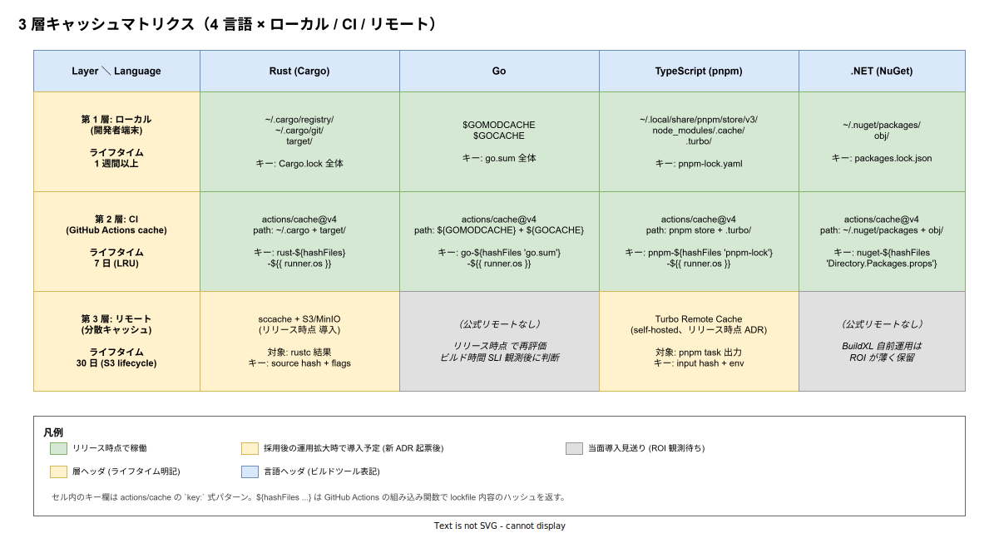

# 01. キャッシュ戦略

本ファイルは k1s0 モノレポにおける**ビルドキャッシュの 3 層階層**（ローカル / CI / リモート）を 4 言語横断で具体化する。原則 [IMP-BUILD-POL-005](../00_方針/01_ビルド設計原則.md) を物理層と稼働段階まで降ろし、各言語のキャッシュ実体・キー設計・ライフタイム・失効時挙動を実装段階確定版として固定する。各言語章（[Rust](../10_Rust_Cargo_workspace/01_Rust_Cargo_workspace.md) / [Go](../20_Go_module分離戦略/01_Go_module分離戦略.md) / [TypeScript](../30_TypeScript_pnpm_workspace/01_TypeScript_pnpm_workspace.md) / [.NET](../40_dotnet_sln境界/01_dotnet_sln境界.md)）でも個別に触れているが、**3 層独立稼働の整合性は本章で一元的に保証する**。



## なぜ 3 層を独立稼働させるか

「キャッシュは 1 つあれば十分」という直感は、4 言語並行ビルドかつ自宅 / オフィス / CI / リモート worker と多様な実行環境を持つ k1s0 では破綻する。単一キャッシュ集約には次のリスクがある。

第一に、**失効時の影響範囲が全開発者に波及する**。例えば CI のリモートキャッシュサーバが障害で空になった場合、全ビルドが「コールド」状態に戻り、全開発者・全 PR のビルド時間が同時に悪化する。リリース時点 直後の小規模運用でこれが起きると、数少ない開発者の手戻り時間が直撃して開発が止まる。

第二に、**層ごとに最適なキャッシュ媒体・キー設計が異なる**ため、同一実装で全層を賄うとどこかで妥協が生じる。ローカルは「同一マシン内の高速 SSD」、CI は「クラウドのオブジェクトストレージ + LRU」、リモートは「組織横断の分散ストア + コンテンツアドレッシング」と、最適解の物理層が異なる。

第三に、**3 層を直列に検索する**ことで、上位層がヒットした時点で下位層への問い合わせを打ち切れるため、正常時の latency を最小化できる。一方、失効時は次の層へフォールバックするため、ビルド成功率は単一層よりも高い。

3 層独立化の代償は「同じ依存を 3 箇所に保持するストレージ重複」だが、ビルドキャッシュは秘匿性の低い派生物であり、ストレージ単価より時間単価の方が圧倒的に高いため、トレードオフは独立化に有利に働く。

## 第 1 層: ローカル（開発者端末）

各言語のネイティブキャッシュをそのまま活用する。OS の SSD に最低 1 週間滞留させる前提で、開発者がブランチ切り替え 1 回ごとに依存解決から始まる事態を防ぐ。

| 言語 | キャッシュ実体 | キーの基本単位 |
|---|---|---|
| Rust | `~/.cargo/registry/`（依存物）+ `~/.cargo/git/`（git 依存）+ `target/`（コンパイル成果） | `Cargo.lock` 全体 |
| Go | `$GOMODCACHE`（依存物、既定 `~/go/pkg/mod/`）+ `$GOCACHE`（コンパイル成果、既定 `~/.cache/go-build/`） | `go.sum` 全体 |
| TypeScript | `~/.local/share/pnpm/store/v3/`（pnpm store）+ `node_modules/.cache/`（webpack / vite キャッシュ）+ `.turbo/` | `pnpm-lock.yaml` |
| .NET | `~/.nuget/packages/`（NuGet HTTP cache）+ `obj/`（MSBuild 中間生成） | `packages.lock.json` |

容量管理の方針は各言語ごとに異なる。

- Rust: `cargo cache --autoclean` を週次で走らせ、未使用の registry エントリを除去。`target/` は `cargo nextest` の `--cache-dir` が肥大化しやすいため、開発者向けセットアップで `incremental=false` と `target` の月次 prune を案内する（[`50_開発者体験設計/`](../../50_開発者体験設計/)）。
- Go: `$GOMODCACHE` は読み取り専用の構造で安全だが、`$GOCACHE` は最大 50GB を超える事例があるため `go env -w GOCACHE_LIMIT=20GB` 相当の運用を案内する（Go 1.23+ の `GOCACHEPROG` 機能で外部制御可）。
- TypeScript: pnpm store は重複排除済みで容量効率が良いが、`node_modules/.cache/` は webpack / vite が無制限に書き込むため、CI の clean step で削除する。
- .NET: `~/.nuget/packages/` は dotnet 9+ で `dotnet nuget locals all --clear` が用意されている。`obj/` は IDE 依存だが Visual Studio 起動時に肥大化しやすく、定期 clean を案内する。

## 第 2 層: CI（GitHub Actions cache）

リリース時点 における主力キャッシュ層。`actions/cache@v4` で各言語の依存解決物 + コンパイル中間成果を PR 間で共有する。GitHub の組織あたり 10 GB 制限（リポジトリ単位は 5 GB）を意識して、cache key はファイル単位ではなく lockfile ハッシュで集約する。

```yaml
# .github/workflows/_build.yml — Rust 例
- uses: actions/cache@v4
  with:
    path: |
      ~/.cargo/registry
      ~/.cargo/git
      target
    key: rust-${{ runner.os }}-${{ hashFiles('**/Cargo.lock') }}
    restore-keys: |
      rust-${{ runner.os }}-
```

`restore-keys` を `key` の prefix で指定することで、lockfile が変更された PR でも前回の partial キャッシュが再利用される。これは Cargo / Go / pnpm / NuGet いずれも追加依存のみのケースでは大きな高速化要因となる。

各言語のキー設計は以下に統一する。

| 言語 | actions/cache key | restore-keys (prefix) |
|---|---|---|
| Rust | `rust-${{ runner.os }}-${{ hashFiles('**/Cargo.lock') }}` | `rust-${{ runner.os }}-` |
| Go | `go-${{ runner.os }}-${{ hashFiles('**/go.sum') }}` | `go-${{ runner.os }}-` |
| TypeScript | `pnpm-${{ runner.os }}-${{ hashFiles('**/pnpm-lock.yaml') }}` | `pnpm-${{ runner.os }}-` |
| .NET | `nuget-${{ runner.os }}-${{ hashFiles('**/Directory.Packages.props', '**/packages.lock.json') }}` | `nuget-${{ runner.os }}-` |

`runner.os` をキーに含めるのは、Linux / Windows / macOS で生成されるバイナリ・パスが異なるため。同一 OS 内では PR 間でキャッシュが共有される。

GitHub Actions cache は **7 日間アクセスがないと自動削除**される LRU 仕様で、これは k1s0 の PR 流量（リリース時点 で日次 5〜10 PR 想定）では十分にホット維持できる。リリース時点 で PR 流量が増え、ストレージ上限（5 GB / repo）に近づいた場合は cache の `path:` から `target/` を外す等の調整を行う。

## 第 3 層: リモート（分散キャッシュ）

第 1〜2 層が PR 単位 / 開発者単位の閉じたキャッシュであるのに対し、第 3 層は**組織横断の分散キャッシュ**として機能する。リリース時点では未稼働で、ビルド時間 SLI（[IMP-BUILD-POL-006](../00_方針/01_ビルド設計原則.md)）の観測結果次第で導入時期と対象言語を決定する。

| 言語 | リモートキャッシュ候補 | 導入判断基準 |
|---|---|---|
| Rust | sccache + S3 / MinIO バックエンド | クリーンビルド p95 が 10 分超で導入 ADR 起票 |
| Go | （公式リモートキャッシュなし） | リリース時点 で再評価。当面 `go build` の並列度向上で対応 |
| TypeScript | Turbo Remote Cache（self-hosted）or Vercel 提供 | `pnpm build` p95 が 5 分超で導入 ADR 起票 |
| .NET | （現状なし、BuildXL は ROI 薄） | 当面導入見送り |

第 3 層の特徴は **コンテンツアドレッシング**にある。`actions/cache` の lockfile ハッシュキーは粗く、依存が 1 つ変わるだけでキャッシュ全体が無効化されるが、sccache や Turbo はソースファイルとコンパイラフラグの組み合わせを SHA256 化したコンテンツアドレスでキャッシュエントリを管理する。これにより**部分的な再利用**が成立し、特に Rust の rustc compile artifact のように 1 ファイル変更で全クレートが再コンパイルされる構造に対して劇的な効果がある。

第 3 層導入時の運用上の注意は次の 2 点。

- **キャッシュ汚染対策**: コンテンツアドレッシングは非決定論的ビルド要因（実行時刻 / 環境変数 / 絶対パス）でキーが破壊される。`SOURCE_DATE_EPOCH` を CI 側で固定し、`-C debug-assertions=off` 等のフラグも全開発者で揃える。
- **アクセス制御**: リモートキャッシュは「ビルド成果物の置き場」であり、悪意のある書き込みでサプライチェーン攻撃が成立しうる。S3 / MinIO の書き込みは GitHub Actions の OIDC トークンに限定し、開発者からは読み取り専用とする（[`80_サプライチェーン設計/`](../../80_サプライチェーン設計/) と整合）。

## キャッシュキー設計の一般則

3 層共通でキー設計には以下の原則を適用する。

1. **lockfile ハッシュを基底にする**: `Cargo.lock` / `go.sum` / `pnpm-lock.yaml` / `packages.lock.json` のいずれも、依存解決の決定論性を保証するファイル。これがキャッシュキーの第一要素となる。
2. **OS / アーキテクチャをキーに含める**: 生成バイナリのフォーマットが異なるため、`runner.os` ＋ 必要に応じて `runner.arch` をキー後段に含める。
3. **コンパイラバージョンをキーに含める**: Rust は `rust-toolchain.toml`、.NET は `global.json` の SHA をキーに混ぜる。Go と pnpm は CI の setup action 経由で固定するため不要。
4. **環境変数の影響範囲を明示**: `RUSTFLAGS` / `GOFLAGS` / `NODE_OPTIONS` のような環境変数を変更した PR ではキャッシュを無効化する。これは reusable workflow 側で `${{ env.* }}` をキーに混ぜることで対応する。

これらの原則に外れたキャッシュエントリは「壊れたキャッシュ」として扱い、`gh cache delete` で手動削除できる運用を [`50_開発者体験設計/`](../../50_開発者体験設計/) で案内する。

## キャッシュヒット率の SLI 化

原則 [IMP-BUILD-POL-006](../00_方針/01_ビルド設計原則.md)（ビルド時間 SLI）と連動して、キャッシュヒット率を以下の指標で計測し [`95_DXメトリクス/`](../../95_DXメトリクス/) に公開する。

- **第 2 層ヒット率**: `actions/cache` の `cache-hit` 出力を集計、PR 単位で算出
- **第 3 層ヒット率**: sccache `--show-stats` の compile cache hit 比率、PR 単位で算出
- **キャッシュサイズ推移**: 各言語の cache `path:` 合計サイズの週次トレンド
- **キャッシュ復元時間**: `actions/cache` の `Post Cache` ステップ所要時間

リリース時点 時点での目標値は仮設定として、第 2 層ヒット率 70% 以上 / 第 3 層（導入後）50% 以上を置く。実測値が連続して下回った場合はキー設計の見直しを ADR 起票で検討する。

## キャッシュ失効時の挙動

3 層独立稼働の効果が最も問われるのが、**いずれかの層が失効した時の影響範囲**である。

| 失効箇所 | 影響範囲 | 復旧経路 |
|---|---|---|
| ローカル（個別開発者） | その開発者のみ。次回ビルドで第 1 層を再生成 | 自動。lockfile ハッシュ一致で第 2 層から partial 復元可能 |
| CI（GitHub Actions cache） | 全 PR が「コールド」状態でビルド | 自動。第 3 層導入後はそこから復元、未導入時は完全ビルド |
| リモート（sccache / Turbo） | リモート対象言語の compile artifact が再生成。CI / ローカルは生存 | 自動。バックエンド S3 / MinIO の障害復旧後に再蓄積 |
| 全層同時 | 全ビルドが完全クリーン | リスク低。全層同時失効は GitHub / S3 / 開発者端末の同時障害が必要 |

特に第 3 層は「ヒットすれば速い、ミスしても第 2 層が機能する」というフェイルセーフ設計が成立する。これが 3 層独立化の最大の恩恵で、リモートキャッシュを導入する際にも既存の第 2 層を残置する運用方針を取る。

## ディレクトリ配置まとめ

| path | 種別 | 役割 |
|---|---|---|
| `.github/workflows/_cache.yml` | reusable workflow | 4 言語の `actions/cache` 設定を集約、各ビルドジョブから呼び出される |
| `.github/workflows/_build.yml` | reusable workflow | path-filter 出力 → 言語別ビルド + `_cache.yml` の `uses:` |
| `tools/ci/cache-stats/` | Go ツール | キャッシュヒット率を `95_DXメトリクス/` 形式に集計 |
| `infra/cache/sccache.tf` | Terraform | リリース時点 で sccache + S3/MinIO バックエンド構築 |
| `infra/cache/turbo-remote.tf` | Terraform | リリース時点 で Turbo Remote Cache 構築（新 ADR 起票後） |
| `docs/40_運用ライフサイクル/runbooks/cache-invalidation.md` | Runbook | 壊れたキャッシュの手動削除手順（リリース時点 着手） |

## 対応 IMP-BUILD ID

本ファイルで採番する実装 ID は以下とする（接頭辞 `CS` = Cache Strategy）。

- `IMP-BUILD-CS-060` : 3 層独立稼働の全体設計（ローカル / CI / リモート）
- `IMP-BUILD-CS-061` : 第 1 層ローカルキャッシュの言語別実体と容量管理
- `IMP-BUILD-CS-062` : 第 2 層 CI キャッシュ（GitHub Actions cache）のキー設計統一
- `IMP-BUILD-CS-063` : 第 3 層リモートキャッシュ（sccache / Turbo Remote Cache）の段階導入と判断基準
- `IMP-BUILD-CS-064` : キャッシュキーの基底（lockfile ハッシュ + OS + コンパイラ ver + env）
- `IMP-BUILD-CS-065` : キャッシュヒット率の SLI 計測と `95_DXメトリクス/` 公開
- `IMP-BUILD-CS-066` : 各層失効時の影響範囲と自動復旧経路
- `IMP-BUILD-CS-067` : 第 3 層リモートキャッシュのアクセス制御（書き込みは OIDC 限定、サプライチェーン整合）

## 対応 ADR / DS-SW-COMP / NFR

- ADR: [ADR-CICD-001](../../../02_構想設計/adr/ADR-CICD-001-argocd.md)（CI 構成）/ [ADR-SUP-001](../../../02_構想設計/adr/ADR-SUP-001-slsa-staged-adoption.md)（SLSA 段階導入 → 第 3 層書き込み制御）
- DS-SW-COMP: DS-SW-COMP-122（contracts → 4 言語生成 → 契約変更時のキャッシュ整合）
- NFR: [NFR-B-PERF-001](../../../03_要件定義/30_非機能要件/B_性能拡張性.md)（性能基盤）/ [NFR-C-NOP-004](../../../03_要件定義/30_非機能要件/C_運用保守性.md)（ビルド所要時間運用、キャッシュの直接効果）/ [NFR-C-MGMT-001](../../../03_要件定義/30_非機能要件/C_運用保守性.md)（設定 Git 管理）

## 関連章 / 参照

- [00_方針/01_ビルド設計原則.md](../00_方針/01_ビルド設計原則.md) — 原則 5（3 層キャッシュ階層）の上位定義
- [10_Rust_Cargo_workspace/01_Rust_Cargo_workspace.md](../10_Rust_Cargo_workspace/01_Rust_Cargo_workspace.md) — Rust 側の sccache 統合詳細
- [20_Go_module分離戦略/01_Go_module分離戦略.md](../20_Go_module分離戦略/01_Go_module分離戦略.md) — Go 側の `$GOCACHE` 詳細
- [30_TypeScript_pnpm_workspace/01_TypeScript_pnpm_workspace.md](../30_TypeScript_pnpm_workspace/01_TypeScript_pnpm_workspace.md) — TS 側の Turbo Remote Cache 詳細
- [40_dotnet_sln境界/01_dotnet_sln境界.md](../40_dotnet_sln境界/01_dotnet_sln境界.md) — .NET 側の NuGet キャッシュ詳細
- [50_選択ビルド判定/01_選択ビルド判定.md](../50_選択ビルド判定/01_選択ビルド判定.md) — path-filter とキャッシュキーの相互作用
- [80_サプライチェーン設計/](../../80_サプライチェーン設計/) — 第 3 層書き込み制御の OIDC 統合
- [95_DXメトリクス/](../../95_DXメトリクス/) — キャッシュヒット率 SLI の公開先
