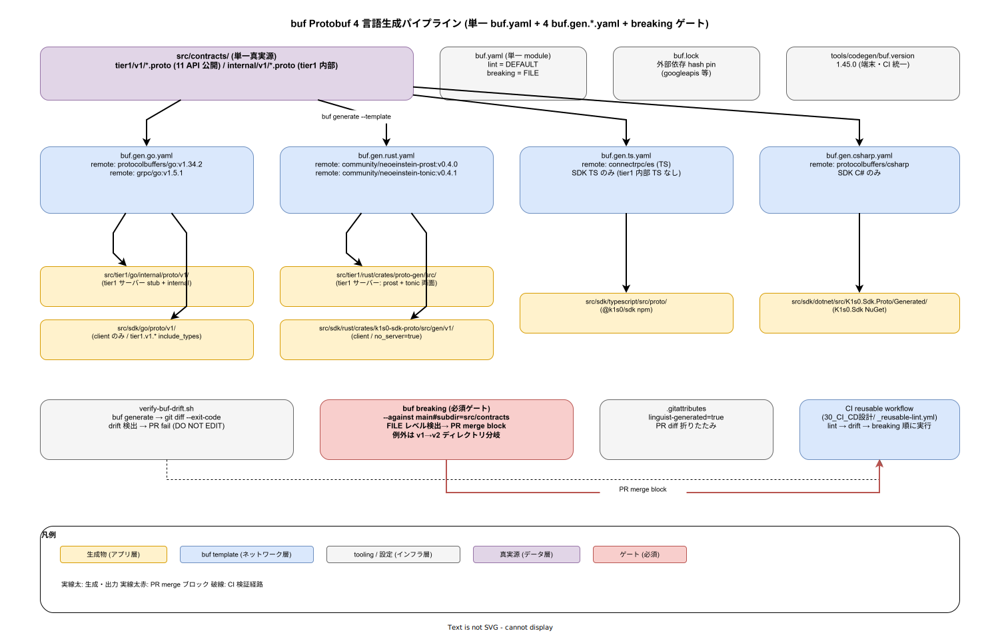

# 01. buf Protobuf 生成パイプライン

本ファイルは k1s0 の Protobuf → 4 言語 SDK + tier1 サーバースタブの生成パイプラインを確定する。ADR-TIER1-002（Protobuf gRPC 統一）と ADR-DIR-001（contracts 昇格）の帰結として、tier1 公開 11 API と tier1 内部 gRPC は `src/contracts/` を単一真実源とし、buf（`buf.build`）をコード生成・lint・breaking check の 3 機能を束ねる唯一の CLI として採用する。本ファイルでは `buf.yaml` / `buf.gen.yaml` の配置・生成先の物理パス・`buf breaking` 運用・buf CLI バージョン固定を具体的に規定する。



`00_ディレクトリ設計/20_tier1レイアウト/02_contracts配置.md` は `src/contracts/` 内部構造と package 命名規約を確定済で、`00_方針/01_コード生成原則.md` は 7 軸の原則を固定済である。本ファイルはその中間層、つまり「buf をどう呼び、どこに出力し、どの CI ゲートに組み込むか」を実装フェーズ確定版として固定する。

## buf を選んだ理由の再確認

Protobuf 生成ツールとしては `protoc` + 複数 plugin を直接呼ぶ方式、`buf` を使う方式、`bazel + rules_proto` を使う方式の 3 経路がある。ADR-TIER1-002 で buf を選んだ理由は以下 3 点に集約される。

- **lint / breaking / generate の統合**: `protoc` 単独だと lint は `protolint` / breaking は `buf breaking` / generate は `protoc-gen-*` を個別導入する必要があるが、buf は 1 バイナリで 3 機能を提供する
- **BSR（Buf Schema Registry）への移行経路**: Phase 1b で `googleapis` 等の外部 proto 依存を管理する際に buf.lock / deps の仕組みが既に用意されている
- **remote plugin の再現性**: `remote: buf.build/protocolbuffers/go` 等の remote plugin 指定で生成器バージョンが buf.lock に pin される。開発者端末に protoc-gen-* を個別インストールする必要が無い

本ファイルはこの採用判断の上で、物理的な buf 呼び出し経路を固定する。

## buf 設定ファイル配置

`src/contracts/` 直下に以下を配置する。`buf.yaml` は単一（`02_contracts配置.md` で確定した単一 module 方針）、`buf.gen.yaml` は **生成言語ごとに 4 ファイル** に分離する。

| 配置 path | 役割 |
|---|---|
| `src/contracts/buf.yaml` | buf module 宣言 + lint / breaking 設定（単一 module）|
| `src/contracts/buf.lock` | 外部 proto 依存（googleapis 等）の hash lock |
| `src/contracts/buf.gen.go.yaml` | Go 言語向け生成設定（tier1 サーバー + SDK Go）|
| `src/contracts/buf.gen.rust.yaml` | Rust 言語向け生成設定（tier1 サーバー + SDK Rust）|
| `src/contracts/buf.gen.ts.yaml` | TypeScript 向け生成設定（SDK TS のみ）|
| `src/contracts/buf.gen.csharp.yaml` | C# 向け生成設定（SDK C# のみ）|

4 言語を単一 `buf.gen.yaml` にまとめる選択肢もあるが、分離する理由は 3 つ。第一に、言語ごとに生成 plugin のバージョン更新頻度が異なる（TS の `connectrpc/es` と Go の `protocolbuffers/go` は独立に更新される）ため、ファイル単位で更新 PR を分けたほうがレビューが通しやすい。第二に、選択ビルド（IMP-BUILD-POL-004）で「Rust 開発者の PR では Go / TS / C# の生成を呼ばない」運用を実現するために、`buf generate --template buf.gen.rust.yaml` と指定できる必要がある。第三に、Phase 1b で BFF 側の OpenAPI 生成を追加した際、同じ分離原則で `buf.gen.openapi.yaml` を増やす一貫性を維持できる。

## 生成先の物理パス

生成物は commit する（IMP-CODEGEN-POL-004、IMP-BUILD-POL-007）。生成先は以下で固定する。各言語で「サーバー用」と「SDK 用」を別ディレクトリに分離し、package 境界を物理配置で明示する。

| 言語 | tier1 サーバー生成先 | SDK 生成先 |
|---|---|---|
| Go | `src/tier1/go/internal/proto/v1/` | `src/sdk/go/proto/v1/` |
| Rust | `src/tier1/rust/crates/proto-gen/src/` | `src/sdk/rust/crates/k1s0-sdk-proto/src/gen/v1/` |
| TypeScript | （なし。tier1 内部に TS は無い）| `src/sdk/typescript/src/proto/` |
| C# | （なし。tier1 内部に C# は無い）| `src/sdk/dotnet/src/K1s0.Sdk.Proto/Generated/` |

Go だけ tier1 サーバー生成と SDK 生成の両方が存在するのは、tier1 Go Pod（state / secret / workflow ファサード）が gRPC サーバーを実装し、SDK Go が同 API のクライアントスタブを提供するため。Rust も同様に tier1 自作 Pod（decision / audit / pii）がサーバーを持つ。TS / C# は tier1 内部で使われないため SDK のみ。

tier1 公開 11 API と tier1 内部 gRPC の分離は `02_contracts配置.md` で package 命名（`k1s0.tier1.v1` / `k1s0.tier1.internal.v1`）により確定済である。buf.gen.\* の `include_types` で SDK 向け生成時に internal package を除外し、サーバー向け生成時には両方を含める制御を行う。SDK 利用者が internal 契約を誤って参照するリスクを構造的に排除する。

## `buf.gen.go.yaml` の推奨サンプル

```yaml
# src/contracts/buf.gen.go.yaml
version: v2
managed:
  enabled: true
  override:
    - file_option: go_package_prefix
      value: github.com/k1s0/k1s0/src/tier1/go/internal/proto
plugins:
  # tier1 サーバー向け（tier1 + internal 両方）
  - remote: buf.build/protocolbuffers/go:v1.34.2
    out: ../tier1/go/internal/proto
    opt: paths=source_relative
  - remote: buf.build/grpc/go:v1.5.1
    out: ../tier1/go/internal/proto
    opt: paths=source_relative,require_unimplemented_servers=true
  # SDK 向け（tier1 公開のみ）
  - remote: buf.build/protocolbuffers/go:v1.34.2
    out: ../sdk/go/proto
    opt: paths=source_relative
    include_types:
      - k1s0.tier1.v1.*
  - remote: buf.build/grpc/go:v1.5.1
    out: ../sdk/go/proto
    opt: paths=source_relative
    include_types:
      - k1s0.tier1.v1.*
inputs:
  - directory: .
```

`require_unimplemented_servers=true` は tier1 Go サーバーに対して未実装 RPC の panic を強制し、契約追加時のサーバー未更新を build time に検出する。SDK Go 側では無効（クライアントには不要）。

## `buf.gen.rust.yaml` の推奨サンプル

```yaml
# src/contracts/buf.gen.rust.yaml
version: v2
plugins:
  # tier1 サーバー向け（prost + tonic）
  - remote: buf.build/community/neoeinstein-prost:v0.4.0
    out: ../tier1/rust/crates/proto-gen/src
  - remote: buf.build/community/neoeinstein-tonic:v0.4.1
    out: ../tier1/rust/crates/proto-gen/src
    opt:
      - compile_well_known_types
      - no_server=false
      - no_client=false
  # SDK 向け（クライアントのみ、internal 除外）
  - remote: buf.build/community/neoeinstein-prost:v0.4.0
    out: ../sdk/rust/crates/k1s0-sdk-proto/src/gen/v1
    include_types:
      - k1s0.tier1.v1.*
  - remote: buf.build/community/neoeinstein-tonic:v0.4.1
    out: ../sdk/rust/crates/k1s0-sdk-proto/src/gen/v1
    opt:
      - no_server=true
    include_types:
      - k1s0.tier1.v1.*
inputs:
  - directory: .
```

Rust は `neoeinstein-prost` / `neoeinstein-tonic` のコミュニティ plugin を使う。`buf.build/community/` namespace は BSR 経由で hash pin される。SDK 側は `no_server=true` でサーバースタブを出力せず、バイナリサイズを削る。

## `buf breaking` の必須ゲート化

IMP-CODEGEN-POL-003（buf breaking 必須）の具体実装は以下。GitHub Actions の reusable workflow（`30_CI_CD設計/10_reusable_workflow/`）で、`src/contracts/**.proto` が変更された PR に限り以下を実行する。

```bash
# reusable workflow 内の buf-breaking ジョブ
cd src/contracts
buf breaking --against "https://github.com/k1s0/k1s0.git#branch=main,subdir=src/contracts"
```

`buf.yaml` の `breaking.use` は `FILE` レベルとし、フィールド削除・番号再利用・型変更を検出する。違反は PR merge をブロック。例外（意図的な破壊変更）は v1 → v2 ディレクトリ分岐（`src/contracts/tier1/v2/`）で対応し、v1 は最低 12 か月維持（NFR-C-MNT-003 準拠）。ADR-TIER1-002 の追補に根拠を記録する。

```yaml
# src/contracts/buf.yaml（breaking 設定抜粋）
breaking:
  use:
    - FILE
  ignore_unstable_packages: false
```

`ignore` / `ignore_unstable_packages` の採用は ADR 必須とし、PR で単発で無効化することを禁じる。これにより「テストの都合で breaking を一時無効化」する運用漏れを防ぐ。

## 生成 drift 検出

CI の lint 段で、PR の生成物と `buf generate` の再生成結果が一致することを検証する。以下のスクリプトで drift 検出を自動化する。

```bash
# tools/codegen/verify-buf-drift.sh
set -eu

cd src/contracts

# 全言語について buf generate を実行
for tmpl in buf.gen.go.yaml buf.gen.rust.yaml buf.gen.ts.yaml buf.gen.csharp.yaml; do
    buf generate --template "$tmpl"
done

# 生成後の diff を検出（0 でなければ drift あり）
cd "$GITHUB_WORKSPACE"
if ! git diff --exit-code -- \
    'src/tier1/go/internal/proto/' \
    'src/tier1/rust/crates/proto-gen/src/' \
    'src/sdk/go/proto/' \
    'src/sdk/rust/crates/k1s0-sdk-proto/src/gen/' \
    'src/sdk/typescript/src/proto/' \
    'src/sdk/dotnet/src/K1s0.Sdk.Proto/Generated/'; then
    echo "ERROR: Generated code drift detected"
    exit 1
fi
```

drift がある PR は「開発者が `.proto` を変更したが `buf generate` を忘れた」または「手修正が生成物に混入した」のいずれかであり、どちらも IMP-CODEGEN-POL-004（DO NOT EDIT）違反として拒否する。

## 生成物ヘッダと linguist-generated

生成物は全言語で `// Code generated by protoc. DO NOT EDIT.` ヘッダを含む。Go / Rust / TS は `//` コメント、C# は `//` コメントで統一される（`protocolbuffers/csharp` plugin のデフォルト動作）。

加えて `.gitattributes` で linguist-generated を宣言し、GitHub の PR diff で生成物を折りたたみ表示する。

```
# .gitattributes（抜粋）
src/tier1/go/internal/proto/**/*.pb.go               linguist-generated=true
src/tier1/rust/crates/proto-gen/src/**/*.rs          linguist-generated=true
src/sdk/go/proto/**/*.pb.go                          linguist-generated=true
src/sdk/rust/crates/k1s0-sdk-proto/src/gen/**/*.rs   linguist-generated=true
src/sdk/typescript/src/proto/**/*.ts                 linguist-generated=true
src/sdk/dotnet/src/K1s0.Sdk.Proto/Generated/**/*.cs  linguist-generated=true
```

## buf CLI バージョン固定

buf CLI 自体のバージョン不整合は「開発者端末と CI で生成結果が異なる」事故を招く。`tools/codegen/buf.version` に固定バージョン文字列を置き、全環境で同じ buf を使う。

```
# tools/codegen/buf.version
1.45.0
```

開発者端末のインストールは `tools/codegen/install-buf.sh` で `BUF_VERSION=$(cat tools/codegen/buf.version)` を読んで該当バイナリを取得する。Dev Container（`tools/devcontainer/profiles/`）の各プロファイルでも同スクリプトを ENTRYPOINT で呼ぶ。CI の reusable workflow でも同じバージョン文字列を使う。

buf バージョン更新 PR は `tools/codegen/buf.version` のみ変更する単独 PR とし、生成物変化を同 PR で commit。レビュー時に buf の release note を PR 本文に転記し、互換性影響を評価する。

## cone 整合

生成物は commit するため cone に含める必要がある。

- `tier1-go-dev` cone: `src/contracts/` + `src/tier1/go/internal/proto/` を含む
- `tier1-rust-dev` cone: `src/contracts/` + `src/tier1/rust/crates/proto-gen/` を含む
- `sdk-dev` cone: `src/contracts/` + 4 言語 SDK の生成物すべてを含む
- `tier2-dev` / `tier3-*` cone: SDK 経由で間接依存のため、生成物は `sdk-dev` cone 経由で届く

ADR-DIR-003（スパースチェックアウト cone mode）との整合は PR レビュー時に確認する。

## 対応 IMP-CODEGEN ID

- `IMP-CODEGEN-BUF-010` : 単一 `buf.yaml` module + 言語別 `buf.gen.*.yaml` 4 分割
- `IMP-CODEGEN-BUF-011` : tier1 サーバーと SDK の生成先物理パス分離
- `IMP-CODEGEN-BUF-012` : `include_types` による internal package の SDK 除外
- `IMP-CODEGEN-BUF-013` : `buf breaking` FILE レベルの必須ゲート
- `IMP-CODEGEN-BUF-014` : 生成 drift 検出スクリプトによる DO NOT EDIT 強制
- `IMP-CODEGEN-BUF-015` : `tools/codegen/buf.version` による CLI バージョン固定
- `IMP-CODEGEN-BUF-016` : v1 → v2 ディレクトリ分岐による breaking 変更経路
- `IMP-CODEGEN-BUF-017` : `.gitattributes` の linguist-generated 宣言

## 対応 ADR / DS-SW-COMP / NFR

- ADR-TIER1-002（Protobuf gRPC 統一）/ ADR-DIR-001（contracts 昇格）/ ADR-DIR-003（スパースチェックアウト cone mode）
- DS-SW-COMP-122（SDK 生成）/ 130（契約配置）
- NFR-H-INT-001（署名付きアーティファクト）/ NFR-C-MNT-003（API 互換方針）/ NFR-C-MGMT-001（設定 Git 管理）
