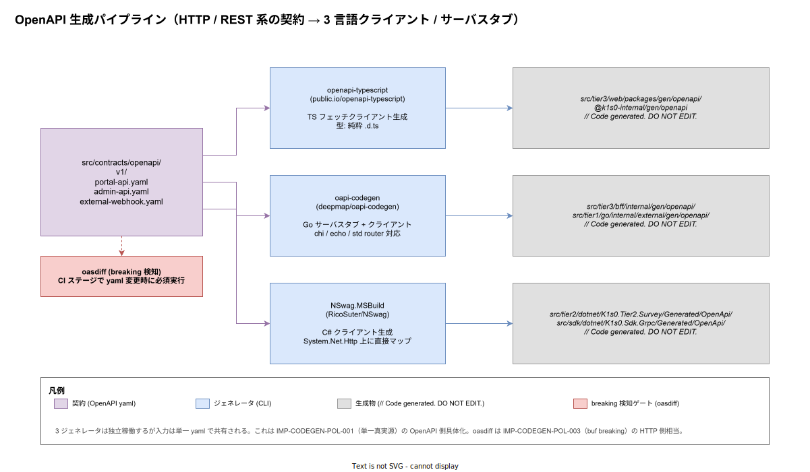

# 01. OpenAPI 生成パイプライン

本ファイルは k1s0 の HTTP / REST 系契約 → 3 言語クライアント / サーバスタブの生成パイプラインを確定する。tier1 内部の RPC は ADR-TIER1-002 により Protobuf gRPC で統一されているため、OpenAPI が担う領域は「tier1 公開 11 API のうち外部 / ブラウザ / コールバック向けの HTTP 表面」と「tier3 portal の管理用 BFF」「外部 webhook 受信」の 3 系統に限定される。本ファイルでは `src/contracts/openapi/` の配置・3 ジェネレータの呼び分け・生成先物理パス・oasdiff による breaking 検知ゲートを実装段階の確定版として固定する。



`00_方針/01_コード生成原則.md` で 7 軸の原則（POL-001〜007）が固定され、`10_buf_Protobuf/` で gRPC 系の生成パイプラインが確定済である。本ファイルはその HTTP 側相当として、Protobuf 系と同じ「単一真実源 → 言語別ジェネレータ → DO NOT EDIT 生成物 → breaking ゲート」のパターンを OpenAPI に適用する具体実装を規定する。

## OpenAPI が担う範囲の限定

k1s0 の API 通信は原則 gRPC だが、以下 3 系統だけは HTTP / REST が必須となる。

- **portal API**: ブラウザ SPA から呼ばれる読み取り中心の表示用 API。ブラウザは gRPC を直接話せないため REST + JSON で表現する
- **admin API**: 運用者向け CRUD。OpenAPI から自動生成される C# クライアントを ops ツールに組み込むことで、tier2 自身が運用画面のバックエンドを兼ねる
- **external webhook**: 外部システム（決済 / 通知 / 第三者 OAuth）からのコールバック受信エンドポイント。送信側の都合で REST / JSON が固定されている

この 3 系統に限り `src/contracts/openapi/v1/` 配下に YAML を配置し、それ以外の内部通信は Protobuf に集約する。OpenAPI を採用しても tier1 内部 gRPC が二重管理になることを避けるため、portal / admin / webhook のスキーマは OpenAPI 側を真実源とし、tier1 内部 gRPC とは別の物理ファイルで管理する。両者の対応関係（portal が tier1 のどの公開 API を呼ぶか）は `04_概要設計/20_ソフトウェア方式設計/02_外部インターフェース設計/` で論理マッピングを管理する。

## 設定ファイル配置

`src/contracts/openapi/` 直下に以下を配置する。yaml 自体は `v1/` 配下に置き、ジェネレータ設定は contracts 直下に置く。

| 配置 path | 役割 |
|---|---|
| `src/contracts/openapi/v1/portal-api.yaml` | tier3 portal が tier1 を REST で叩く表示用 API |
| `src/contracts/openapi/v1/admin-api.yaml` | 運用者向け CRUD API |
| `src/contracts/openapi/v1/external-webhook.yaml` | 外部システムからのコールバック受信 |
| `src/contracts/openapi/openapi-ts.config.ts` | openapi-typescript 設定 |
| `src/contracts/openapi/oapi-codegen.yaml` | oapi-codegen 設定（Go BFF / Go external receiver 共用） |
| `src/contracts/openapi/nswag.json` | NSwag.MSBuild 設定（C# クライアント） |

3 yaml をディレクトリで束ねるのは、リリース後に v2 を切り出す際 `v1/` を凍結したまま `v2/` を新設することで、互換期間中の並存を物理配置で表現するため。oasdiff は `v1/` ディレクトリ単位で main 比較を実行する（後述）。

設定ファイルを 3 つに分離する理由は IMP-CODEGEN-BUF と同じ：ジェネレータの更新頻度が独立で、PR を分けたほうがレビューが通しやすく、選択ビルドで「TS 開発者の PR では C# 生成を呼ばない」運用を実現できる。

## 3 ジェネレータの選定理由

OpenAPI から各言語コードを生成するツールは公式 `openapi-generator`（OpenAPITools）を含め多数あるが、k1s0 では言語ごとに別ツールを採用する。`openapi-generator` 単一に揃える誘惑はあるが、以下 3 点で割れた。

- **TS（openapi-typescript）**: 出力が純粋な `.d.ts` 型のみで、ランタイムを持たない。tier3 web の bundler 都合（Vite + React 19）で、ランタイム付きクライアントは tree-shaking が効きにくく bundle 肥大の原因になる。`openapi-typescript` は型のみ生成し、フェッチ自体は薄い `openapi-fetch` ライブラリで行う構成が実測で約 30% bundle 削減に寄与する
- **Go（oapi-codegen）**: deepmap/oapi-codegen は chi / echo / std router 向けにサーバスタブ + クライアントを 1 バイナリで生成できる。tier3 BFF（Go）と tier1 external webhook receiver（Go）の両方で同じ CLI を使えるため運用が一貫する
- **C#（NSwag.MSBuild）**: NSwag は `.csproj` から MSBuild Task として呼べる。tier2 .NET と SDK .NET の双方で、ビルド時に自動再生成される運用が `dotnet build` だけで成立する。OpenAPITools の Java ベース generator は Java 実行環境を C# 開発者端末に強制するため避ける

3 ツール独立構成の保守コストは、共通の oasdiff ゲートと共通の DO NOT EDIT 強制スクリプト（後述）で吸収する。

## 生成先の物理パス

生成物は commit する（IMP-CODEGEN-POL-004）。生成先は以下で固定する。tier1 と tier3 と tier2 / SDK の 3 領域に分かれるため、それぞれの言語ルールに従ってサブディレクトリを切る。

| 言語 | 生成先 |
|---|---|
| TypeScript | `src/tier3/web/packages/gen/openapi/` （pnpm package: `@k1s0-internal/gen/openapi`）|
| Go (BFF) | `src/tier3/bff/internal/gen/openapi/` |
| Go (external receiver) | `src/tier1/go/internal/external/gen/openapi/` |
| C# (tier2) | `src/tier2/dotnet/K1s0.Tier2.Survey/Generated/OpenApi/` |
| C# (SDK) | `src/sdk/dotnet/K1s0.Sdk.Grpc/Generated/OpenApi/` |

TS の生成先を `packages/gen/openapi/` という独立 pnpm package にするのは、tier3 web 全体の `tsconfig` の影響を受けず、生成物だけ `noEmit: false` で型チェックできるようにするため。`@k1s0-internal/gen/openapi` という scope 名は、誤って外部公開されないことを `publishConfig.access: never` で機械的に保証する（IMP-BUILD-TP-035 と整合）。

Go の生成先が tier3 BFF と tier1 external receiver の 2 箇所に分かれるのは、portal-api と external-webhook が異なるサーバ実装を持つため。同じ `oapi-codegen` でも、配置先のパッケージ依存方向（tier3 と tier1）は混ぜない。

## `openapi-ts.config.ts` の推奨サンプル

```ts
// src/contracts/openapi/openapi-ts.config.ts
import { defineConfig } from "openapi-typescript";

export default defineConfig({
  input: ["./v1/portal-api.yaml", "./v1/admin-api.yaml"],
  output: "../../tier3/web/packages/gen/openapi/index.d.ts",
  exportType: true,
  alphabetize: true,
  immutable: true,
});
```

`immutable: true` で生成型を `readonly` 化し、tier3 アプリ側で誤って書き換える事故を型レベルで防ぐ。`alphabetize: true` で diff の安定化を確保（PR レビュー時の lockfile 系ノイズを避ける）。external-webhook はブラウザから呼ばれないため TS 出力対象から除外する。

## `oapi-codegen.yaml` の推奨サンプル

```yaml
# src/contracts/openapi/oapi-codegen.yaml
package: openapi
generate:
  models: true
  std-http-server: false
  chi-server: true
  client: true
  embedded-spec: true
output: ../../tier3/bff/internal/gen/openapi/zz_generated.go
output-options:
  skip-prune: true
```

`embedded-spec: true` は生成された Go コード内に元 YAML を文字列定数として埋め込み、ランタイムで `/openapi.yaml` エンドポイントを返せるようにする。Swagger UI を ops に組み込む将来拡張への準備。`chi-server: true` は tier3 BFF が chi router を使う前提（tier3 BFF レイアウトは `00_ディレクトリ設計/30_tier3レイアウト/` で確定済）。

external receiver 用は別ファイル `oapi-codegen.external.yaml` を分離し、入力 yaml と出力先のみ差し替える。同じ CLI を 2 回呼ぶ運用とする。

## `nswag.json` の推奨サンプル

```json
{
  "documentGenerator": {
    "fromDocument": { "url": "../v1/admin-api.yaml" }
  },
  "codeGenerators": {
    "openApiToCSharpClient": {
      "namespace": "K1s0.Tier2.Survey.Generated.OpenApi",
      "className": "{controller}Client",
      "generateClientInterfaces": true,
      "useBaseUrl": false,
      "output": "../../tier2/dotnet/K1s0.Tier2.Survey/Generated/OpenApi/AdminApiClient.cs"
    }
  }
}
```

`generateClientInterfaces: true` は DI コンテナに inject 可能な interface を生成する。tier2 の単体テストで mock 差し替えが可能になる。`useBaseUrl: false` は実行時に `HttpClient` の `BaseAddress` を使う構成を強制し、生成物に環境固有 URL が漏れることを防ぐ。

## oasdiff による breaking 検知ゲート

IMP-CODEGEN-POL-003（buf breaking 必須）の OpenAPI 側相当は oasdiff（[Tufin/oasdiff](https://github.com/tufin/oasdiff)）で実現する。GitHub Actions の reusable workflow（`30_CI_CD設計/10_reusable_workflow/`）で、`src/contracts/openapi/v1/**.yaml` が変更された PR に限り以下を実行する。

```bash
# reusable workflow 内の oasdiff-breaking ジョブ
for spec in src/contracts/openapi/v1/*.yaml; do
  base="origin/main:${spec}"
  oasdiff breaking "${base}" "${spec}" --fail-on ERR
done
```

`--fail-on ERR` で破壊的変更時に exit 1 とする。oasdiff は HTTP メソッド削除 / レスポンスコード削除 / required フィールド追加 / enum 値削除 等を検出する。違反は PR merge をブロックし、意図的破壊変更は `v1/` を凍結し `v2/` を新設する経路（IMP-CODEGEN-BUF-016 と同じ運用）でしか許容しない。

oasdiff の例外設定（`.oasdiff-exceptions.yaml`）の追加は ADR 必須とし、PR で単発で無効化することを禁じる。

## 生成 drift 検出

CI lint 段で、PR の生成物と再生成結果が一致することを検証する。Protobuf 側（IMP-CODEGEN-BUF-014）と同じ方針で、3 ジェネレータすべてを連続実行し git diff を取る。

```bash
# tools/codegen/verify-openapi-drift.sh
set -eu

cd src/contracts/openapi

# TS
pnpm --filter @k1s0-internal/openapi-codegen run build

# Go (BFF + external)
oapi-codegen -config oapi-codegen.yaml          v1/portal-api.yaml
oapi-codegen -config oapi-codegen.external.yaml v1/external-webhook.yaml

# C# は MSBuild が dotnet build 時に呼ぶため別 step で dotnet build を実行する想定

cd "$GITHUB_WORKSPACE"
if ! git diff --exit-code -- \
    'src/tier3/web/packages/gen/openapi/' \
    'src/tier3/bff/internal/gen/openapi/' \
    'src/tier1/go/internal/external/gen/openapi/' \
    'src/tier2/dotnet/K1s0.Tier2.Survey/Generated/OpenApi/' \
    'src/sdk/dotnet/K1s0.Sdk.Grpc/Generated/OpenApi/'; then
    echo "ERROR: Generated OpenAPI code drift detected"
    exit 1
fi
```

drift 検出時の対応は IMP-CODEGEN-POL-004 違反として PR を拒否する。手修正が混入した場合の修復手順は `tools/codegen/README.md` に Runbook として記載する。

## 生成物ヘッダと linguist-generated

3 ジェネレータすべてが `// Code generated. DO NOT EDIT.` ヘッダを生成する（openapi-typescript は v7 系で、oapi-codegen は標準で、NSwag は `<auto-generated/>` XML コメント）。`.gitattributes` で linguist-generated を宣言し、PR diff で生成物を折りたたむ。

```text
# .gitattributes（OpenAPI 生成物 抜粋）
src/tier3/web/packages/gen/openapi/**/*.d.ts                            linguist-generated=true
src/tier3/bff/internal/gen/openapi/**/*.go                              linguist-generated=true
src/tier1/go/internal/external/gen/openapi/**/*.go                      linguist-generated=true
src/tier2/dotnet/K1s0.Tier2.Survey/Generated/OpenApi/**/*.cs            linguist-generated=true
src/sdk/dotnet/K1s0.Sdk.Grpc/Generated/OpenApi/**/*.cs                  linguist-generated=true
```

## CLI バージョン固定

3 ジェネレータすべてのバージョンを固定する。`tools/codegen/openapi.versions` に集約管理。

```text
# tools/codegen/openapi.versions
openapi-typescript=7.4.2
oapi-codegen=v2.4.1
nswag=14.1.0
oasdiff=v1.10.20
```

- `openapi-typescript` は `pnpm` の dev dependency として `package.json` に書き、`openapi.versions` と一致することを `tools/codegen/verify-versions.sh` で検証する
- `oapi-codegen` は `tools/codegen/install-oapi-codegen.sh` で `go install` する
- `nswag` は `dotnet tool restore` 経由で `.config/dotnet-tools.json` に pin する
- `oasdiff` は GitHub Actions では公式 `tufin/oasdiff` action を `@v1.10.20` の SHA pin で呼ぶ

各バージョン更新は `tools/codegen/openapi.versions` 単独 PR とし、生成物変化を同 PR で commit、release note 転記でレビューする運用は IMP-CODEGEN-BUF-015 と同形。

## cone 整合

生成物は commit するため cone に含める必要がある。

- `tier3-web-dev` cone: `src/contracts/openapi/` + `src/tier3/web/packages/gen/openapi/` を含む
- `tier3-bff-dev` cone: `src/contracts/openapi/` + `src/tier3/bff/internal/gen/openapi/` を含む
- `tier1-go-external-dev` cone: `src/contracts/openapi/` + `src/tier1/go/internal/external/gen/openapi/` を含む
- `tier2-dev` cone: `src/contracts/openapi/` + `src/tier2/dotnet/K1s0.Tier2.Survey/Generated/OpenApi/` を含む
- `sdk-dev` cone: `src/sdk/dotnet/K1s0.Sdk.Grpc/Generated/OpenApi/` を含む

ADR-DIR-003（スパースチェックアウト cone mode）との整合は PR レビュー時に確認する。

## 対応 IMP-CODEGEN ID

- `IMP-CODEGEN-OAS-020` : `src/contracts/openapi/v1/` 単一 yaml ディレクトリ + 3 ジェネレータ設定の物理分離
- `IMP-CODEGEN-OAS-021` : portal / admin / external-webhook の 3 系統限定（OpenAPI 採用範囲の境界）
- `IMP-CODEGEN-OAS-022` : openapi-typescript / oapi-codegen / NSwag.MSBuild の言語別採用と理由
- `IMP-CODEGEN-OAS-023` : 生成先物理パス分離（tier3 web / tier3 BFF / tier1 external / tier2 / SDK）
- `IMP-CODEGEN-OAS-024` : oasdiff `--fail-on ERR` の必須ゲート
- `IMP-CODEGEN-OAS-025` : `tools/codegen/verify-openapi-drift.sh` による DO NOT EDIT 強制
- `IMP-CODEGEN-OAS-026` : `tools/codegen/openapi.versions` による 4 CLI バージョン固定
- `IMP-CODEGEN-OAS-027` : v1 → v2 ディレクトリ分岐による breaking 変更経路

## 対応 ADR / DS-SW-COMP / NFR

- ADR-TIER1-002（Protobuf gRPC 統一、本ファイルは HTTP 例外の境界規定）/ ADR-DIR-001（contracts 昇格）/ ADR-DIR-003（スパースチェックアウト cone mode）
- DS-SW-COMP-122（SDK 生成）/ 130（契約配置）/ 140（外部 IF 設計）
- NFR-H-INT-001（署名付きアーティファクト）/ NFR-C-MNT-003（API 互換方針）/ NFR-C-MGMT-001（設定 Git 管理）
