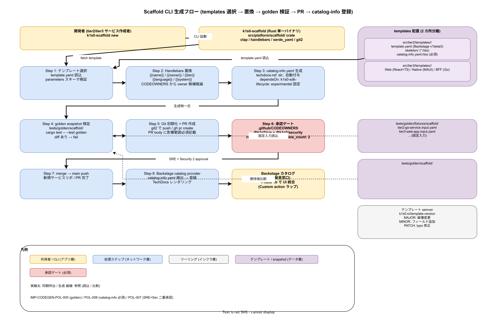

# 01. Scaffold CLI 設計

本ファイルは k1s0 における tier2 / tier3 の新規サービス雛形展開を担う Scaffold CLI の設計を確定する。ADR-BS-001（Backstage 採用）により、新規サービス発見性は Backstage カタログが単一窓口となる。Scaffold CLI はその入口として、Backstage Software Template 互換の出力を生成し、`catalog-info.yaml` を自動同梱してカタログ登録を機械化する役割を持つ。本ファイルでは CLI 実装言語・テンプレート配置・承認ゲート・golden snapshot・Backstage 統合を物理配置レベルで規定する。



`00_方針/01_コード生成原則.md` の IMP-CODEGEN-POL-005（golden snapshot）/ IMP-CODEGEN-POL-006（catalog-info.yaml 必須）/ IMP-CODEGEN-POL-007（SRE + Security 二重承認）は本ファイルの上位原則。本ファイルはその原則を CLI 実装と運用フローに落とす。

## Scaffold CLI の実装言語

Scaffold CLI は **Rust で実装** し、`src/platform/scaffold/` crate として配置する。ADR-TIER1-001（Go + Rust ハイブリッド）で確定した自作領域は Rust であり、platform CLI は tier1 自作領域に連なる「社内向け開発者ツール」の位置付け。実装言語選定の根拠は 3 点。

Go 選択肢もあり得るが、Scaffold CLI は tier2 / tier3 の全言語（Go / Rust / TS / C#）のテンプレートを展開する横断ツールであり、どの言語のサービス開発者でも変更したくないよう、自作領域 Rust に寄せる（Rust 経験者のみが触る）。Rust で書くことで `cargo build --release` で単一静的バイナリが得られ、開発者端末への配布が容易。Rust エコシステムは `clap` / `handlebars` / `serde_yaml` / `git2` が成熟しており、テンプレートエンジン + YAML 操作 + Git 初期化を単一バイナリで完結できる。

CLI の物理配置は `src/platform/scaffold/` crate、workspace は `src/platform/Cargo.toml`（リリース時点 追加予定、`10_Rust_Cargo_workspace/01_Rust_Cargo_workspace.md` で言及）。配布バイナリ名は `k1s0-scaffold`、GitHub Releases で multi-arch（linux-x64 / linux-arm64 / darwin-arm64 / windows-x64）を配る。

## テンプレート定義の配置

Backstage Software Template の互換性を保つため、テンプレート定義は Backstage 流の `template.yaml` を root に持つ構成とする。物理配置は 2 カ所に分離。

| テンプレート種別 | path | 用途 |
|---|---|---|
| tier2 サービス雛形 | `src/tier2/templates/<template-name>/` | tier2 Go / tier2 C# の新規ドメインサービス |
| tier3 アプリ雛形 | `src/tier3/templates/<template-name>/` | tier3 Web（React + TS）/ Native（.NET MAUI）/ BFF（Go） |

各テンプレート配下は以下構成。

```
src/tier2/templates/go-service/
├── template.yaml               # Backstage Software Template メタデータ
├── skeleton/                   # Handlebars テンプレート本体
│   ├── {{name}}/
│   │   ├── go.mod.hbs
│   │   ├── cmd/main.go.hbs
│   │   ├── internal/service.go.hbs
│   │   └── ...
│   └── catalog-info.yaml.hbs   # 必須（IMP-CODEGEN-POL-006）
└── README.md                   # テンプレート利用方法
```

テンプレートエンジンは **Handlebars**（Rust crate `handlebars`）を採用する。Jinja2 相当の表現力を持ちつつ、Rust 実装で安定していて、Backstage も Nunjucks / Handlebars 系の記法を採用しているため「Backstage Template 互換」を目指す本 CLI と親和性が高い。テンプレート変数は `{{name}}` / `{{owner}}` / `{{tier}}` / `{{language}}` / `{{system}}` の 5 つを最小セットとし、テンプレートごとに独自変数を `template.yaml` の `parameters` で宣言する。

## `template.yaml` の仕様

Backstage Software Template の `v1beta3` 準拠。最小構成は以下。

```yaml
# src/tier2/templates/go-service/template.yaml
apiVersion: scaffolder.backstage.io/v1beta3
kind: Template
metadata:
  name: tier2-go-service
  title: Tier2 Go Service
  description: tier2 ドメイン共通業務ロジックを提供する Go サービスの雛形
  tags: [go, tier2, k1s0]
spec:
  owner: k1s0/platform-team
  type: service
  parameters:
    - title: 基本情報
      required: [name, owner, system]
      properties:
        name:
          title: サービス名
          type: string
          pattern: "^[a-z][a-z0-9-]*$"
        owner:
          title: 所有チーム
          type: string
        system:
          title: 所属サブシステム
          type: string
  steps:
    - id: fetch
      name: Fetch skeleton
      action: fetch:template
      input:
        url: ./skeleton
        values:
          name: ${{ parameters.name }}
          owner: ${{ parameters.owner }}
          system: ${{ parameters.system }}
    - id: publish
      name: Publish to Git
      action: publish:github
```

`k1s0-scaffold` CLI はこの `template.yaml` を読み、Backstage の scaffolder と同じ semantic で動作する。Backstage Software Template を直接使わず自前 CLI を用意する理由は、CLI 単体でも（Backstage 未導入環境でも）テンプレート展開が可能であること、および `tests/golden/` の snapshot 検証をローカルで実行できることの 2 点にある。

## `catalog-info.yaml` の自動生成

IMP-CODEGEN-POL-006 により `catalog-info.yaml` は全テンプレートで必須。Scaffold CLI は以下のフィールドを自動埋め込みする。

```yaml
# 生成される catalog-info.yaml（例）
apiVersion: backstage.io/v1alpha1
kind: Component
metadata:
  name: {{name}}                      # パラメータから
  description: {{description}}
  annotations:
    backstage.io/techdocs-ref: dir:.  # 自動付与
    github.com/project-slug: k1s0/k1s0
    k1s0.io/tier: {{tier}}            # テンプレート種別から決定
    k1s0.io/language: {{language}}
spec:
  owner: {{owner}}                    # CODEOWNERS と一致する team 名
  type: service                       # テンプレートの spec.type を継承
  lifecycle: experimental             # 新規作成時は experimental 固定
  system: {{system}}
  dependsOn:
    - component:default/k1s0-sdk-{{language}}   # SDK 依存を自動付与
```

`spec.owner` は CLI 実行時に `.github/CODEOWNERS` を解析して候補を提示するが、最終決定はパラメータ入力値を優先する。`spec.dependsOn` は tier2 なら SDK 依存を自動付与、tier3 なら SDK + BFF 依存を自動付与する。依存自動推論のロジックは `src/platform/scaffold/src/catalog_info.rs` に実装し、tier 関係の変更時にここを更新する。

`backstage.io/techdocs-ref: dir:.` の自動付与は、新規サービスが TechDocs（`docs/` サブディレクトリ内の Markdown）をカタログから即時参照できる状態を保証する。Backstage 側で techdocs をレンダリングする mkdocs.yml も同時生成するかは リリース時点 で決定（本 リリース時点 では techdocs-ref のみ付与し、docs 内容はサービス開発者が後から書く）。

## 承認ゲート: `.github/CODEOWNERS` 連動

IMP-CODEGEN-POL-007（SRE + Security 二重承認）の具体実装は `.github/CODEOWNERS` で。テンプレート変更 PR に対して SRE（B）と Security（D）の両チーム approval を branch protection で必須化する。

```
# .github/CODEOWNERS（抜粋）
/src/platform/scaffold/                @k1s0/sre @k1s0/security
/src/tier2/templates/                  @k1s0/sre @k1s0/security
/src/tier3/templates/                  @k1s0/sre @k1s0/security
/tests/golden/scaffold/                @k1s0/sre @k1s0/security
/tools/codegen/scaffold/               @k1s0/sre @k1s0/security
```

branch protection では `required_status_checks` に golden snapshot diff / テンプレート lint を、`required_approving_review_count: 2` と team 必須で SRE + Security を指定する。PR 作成者が SRE または Security の所属メンバーであっても、所属外チームの approval が必須（self-approval は無効）。

変更時の PR body に「なぜこの変更が必要か」「影響範囲（既存サービス再生成の有無）」「移行計画」の 3 点を必須記載項目とし、PR template（`.github/PULL_REQUEST_TEMPLATE/scaffold.md`）で強制する。

## golden snapshot の仕様

IMP-CODEGEN-POL-005 の具体実装。テンプレートごとに固定入力セットを用意し、`k1s0-scaffold` の生成結果を `tests/golden/scaffold/<template-name>/` 配下に snapshot 保存する。CI で snapshot と diff 比較し、意図しない変化を検出する。

```
tests/golden/
├── fixtures/
│   └── scaffold/
│       ├── tier2-go-service.input.yaml      # 固定入力パラメータ
│       ├── tier2-dotnet-service.input.yaml
│       ├── tier3-web-app.input.yaml
│       └── ...
└── scaffold/
    ├── tier2-go-service/                    # 生成結果 snapshot
    │   ├── example-svc/
    │   │   ├── go.mod
    │   │   ├── cmd/main.go
    │   │   ├── catalog-info.yaml
    │   │   └── ...
    └── tier2-dotnet-service/
        └── ...
```

CI では `cargo test --package k1s0-scaffold -- --test golden` で snapshot 比較を実行。差分があれば `assertion failed` で停止する。snapshot 更新は環境変数で明示承認する運用。

```bash
# snapshot 更新（意図的な変更時のみ）
UPDATE_GOLDEN=1 cargo test --package k1s0-scaffold -- --test golden
```

`UPDATE_GOLDEN=1` を CI では絶対に設定しない。開発者がローカルで更新し、diff を同 PR に含めて SRE + Security のレビューを受ける。snapshot 変更が膨大になる場合は、テンプレート変更の影響範囲が広いことを示唆するため、PR を分割するよう促す運用コメントを PR template に含める。

## テンプレートバージョニング

テンプレートは semver で管理する。`src/tier2/templates/<template-name>/template.yaml` の `metadata.annotations.k1s0.io/template-version` にバージョン文字列を置く。

- MAJOR: 生成される catalog-info.yaml のスキーマ破壊変更、または既存サービス再生成で破壊変更が発生
- MINOR: 新規フィールド追加、既存サービス再生成で非破壊
- PATCH: typo 修正、コメント変更等

リリース時点 で `catalog-info.yaml` スキーマを **v1 固定**（`apiVersion: backstage.io/v1alpha1`）し、Backstage 側のスキーマ更新に追従するかは リリース時点 で判断。v1 のうちは MAJOR 変更を原則避け、必要な場合は全社告知 + 移行期間 3 か月を経て実施する。

## Backstage との統合経路

リリース時点 時点では Scaffold CLI は Backstage から独立したスタンドアロン CLI として動作する。開発者は `k1s0-scaffold new tier2-go-service --name example-svc --owner k1s0/payment` を端末で実行し、生成結果を Git push する。Backstage カタログは push された `catalog-info.yaml` を自動検出して登録する（Backstage の catalog provider 設定、リリース時点 の `85_Identity設計/` 範疇）。

リリース時点 で Backstage Software Template として `k1s0-scaffold` をラップし、Backstage UI からのテンプレート実行を可能にする。UI 統合は以下の順で進める。

1. `src/tier2/templates/` 配下の `template.yaml` を Backstage の catalog provider が発見
2. Backstage UI で「Create」ボタンから起動
3. Backstage scaffolder が `fetch:template` アクションで skeleton を取得
4. `k1s0-scaffold` CLI が裏で呼ばれて生成実行（Backstage の custom action として組み込む）
5. `publish:github` で新規リポジトリ作成 + push

この UI 統合は ADR-DEV-001（リリース時点 で起票予定）で詳細化する。

## ディレクトリ配置まとめ

| path | 役割 |
|---|---|
| `src/platform/scaffold/` | Scaffold CLI（Rust crate）|
| `src/tier2/templates/` | tier2 サービス雛形（Go / C#）|
| `src/tier3/templates/` | tier3 アプリ雛形（Web / Native / BFF）|
| `tests/golden/fixtures/scaffold/` | golden snapshot の固定入力 |
| `tests/golden/scaffold/` | golden snapshot の期待出力 |
| `tools/codegen/scaffold/` | snapshot 更新スクリプト等の補助ツール |
| `.github/CODEOWNERS` | SRE + Security 二重承認の path 指定 |
| `.github/PULL_REQUEST_TEMPLATE/scaffold.md` | PR 本文テンプレート |

## 対応 IMP-CODEGEN ID

- `IMP-CODEGEN-SCF-030` : Rust 実装の Scaffold CLI（`src/platform/scaffold/` crate）
- `IMP-CODEGEN-SCF-031` : Backstage Software Template 互換の `template.yaml` 採用
- `IMP-CODEGEN-SCF-032` : tier2 / tier3 テンプレート配置分離（`src/tier2/templates/` / `src/tier3/templates/`）
- `IMP-CODEGEN-SCF-033` : `catalog-info.yaml` の自動生成と CODEOWNERS 連動 owner 推論
- `IMP-CODEGEN-SCF-034` : SRE + Security 二重承認の branch protection 強制
- `IMP-CODEGEN-SCF-035` : golden snapshot 検証と `UPDATE_GOLDEN=1` 承認プロセス
- `IMP-CODEGEN-SCF-036` : テンプレート semver バージョニング（`k1s0.io/template-version`）
- `IMP-CODEGEN-SCF-037` : リリース時点 の Backstage UI 統合経路（Custom action 化）

## 対応 ADR / DS-SW-COMP / NFR

- ADR-BS-001（Backstage 採用）/ ADR-DEV-001（リリース時点 起票予定、Scaffold UI 統合）/ ADR-TIER1-001（Go + Rust ハイブリッド、Rust 実装の根拠）
- DS-SW-COMP-132（platform / scaffold）
- NFR-C-SUP-001（技術的負債管理）/ NFR-C-MNT-003（API 互換方針）/ NFR-H-INT-001（署名付きアーティファクト、リリース時点 でテンプレート署名検討）
