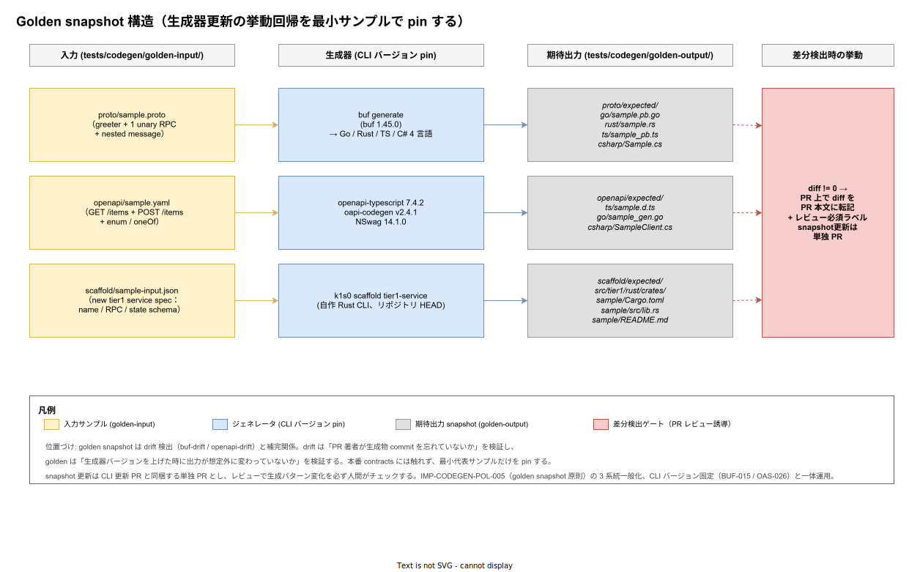

# 01. Golden snapshot

本ファイルは k1s0 のコード生成パイプライン全体に対する**生成器挙動の回帰検証**を Golden snapshot 方式で確定する。`10_buf_Protobuf/` と `20_OpenAPI/` で確定した drift 検出（IMP-CODEGEN-BUF-014 / IMP-CODEGEN-OAS-025）は「PR 著者が contracts を変えたのに生成物 commit を更新し忘れていないか」を機械的に塞ぐ仕組みだが、**生成器側のバージョンを上げた時に出力パターンが意図せず変化していないか**は別レイヤーで検証する必要がある。本ファイルではその検証層を `tests/codegen/golden-{input,output}/` に最小代表サンプルを pin する形で固定する。



`00_方針/01_コード生成原則.md` の POL-005（Scaffold 出力の golden snapshot 検証）を本ファイルでは Protobuf / OpenAPI まで一般化し、POL-004（DO NOT EDIT 強制）と組み合わせて運用する。CLI バージョンは IMP-CODEGEN-BUF-015 / IMP-CODEGEN-OAS-026 で物理的に固定済だが、CLI 自体のリリースで挙動が変わる時に「本番 contracts は変えていないのに 4 言語 SDK の 200 ファイル全部に diff が立つ」という事象が起きる。これを正面から人間レビューに乗せるための仕組みを規定する。

## drift 検出と golden snapshot の役割分担

両者を混同しないために分担を冒頭で固定する。

- **drift 検出**: contracts は固定、生成器も固定の前提で「commit 済み生成物が再生成結果と一致するか」を機械強制する。違反は PR ブロック。人間レビュー不要、機械的に red / green が決まる
- **golden snapshot**: contracts は触らず、生成器バージョンだけが動く前提で「最小代表サンプルに対する出力が変わったか」を検出する。違反は人間レビュー誘導、出力差分を PR 本文に転記して妥当性を判断する

drift だけだと、CLI 更新 PR では「contracts 不変だが生成物 200 ファイル更新」という巨大 diff の妥当性を人間が判断できない。golden snapshot は対象を最小サンプル（1 service + 1 RPC + nested message 程度）に絞ることで、人間が出力差分を直接読める粒度に保つ。

逆に golden snapshot だけだと、本番 contracts の変更時に「サンプルには影響しないが本番出力にだけ影響する」差分を見落とす。両者の併用が必要である。

## snapshot 対象の選定理由

`tests/codegen/golden-input/` に置くサンプルは以下 3 系統に絞る。それぞれ「生成パターンの代表性」を 1 〜 2 ファイルでカバーすることを優先する。

- **proto/sample.proto**: 単一 service + 1 unary RPC + nested message 1 個 + repeated field 1 個 + enum 1 個。streaming / oneof は含めない（リリース時点 で本番 contracts に streaming は無いため）
- **openapi/sample.yaml**: GET 1 件 + POST 1 件 + path parameter + query parameter + enum schema + oneOf schema 1 個。webhook 系の callback 構文は含めない（本番 webhook で必要になった時に追加する）
- **scaffold/sample-input.json**: tier1 service の雛形入力。サービス名 / 1 RPC / 1 state schema を含む最小入力

サンプルを増やすほど CLI 更新時の diff サイズも増えるため、原則として「本番 contracts に新パターン（例: streaming RPC）が出現した時点で、それを golden に追加する」逐次拡張の運用とする。最初から全パターン網羅を目指さない。

## ディレクトリ配置

```
tests/codegen/
├── golden-input/
│   ├── proto/
│   │   └── sample.proto
│   ├── openapi/
│   │   └── sample.yaml
│   └── scaffold/
│       └── sample-input.json
├── golden-output/
│   ├── proto/
│   │   ├── go/sample.pb.go
│   │   ├── rust/sample.rs
│   │   ├── ts/sample_pb.ts
│   │   └── csharp/Sample.cs
│   ├── openapi/
│   │   ├── ts/sample.d.ts
│   │   ├── go/sample_gen.go
│   │   └── csharp/SampleClient.cs
│   └── scaffold/
│       └── sample/
│           ├── Cargo.toml
│           ├── src/lib.rs
│           └── README.md
└── README.md
```

`tests/` 配下に置く理由は、`src/` 配下の本番コードと混ざらない物理境界を作るため。スパースチェックアウト（ADR-DIR-003）の `codegen-dev` cone で `src/contracts/` と `tests/codegen/` を一緒に取り出す。

`golden-input/proto/sample.proto` の package は本番 package と衝突しないよう `k1s0.codegen.golden.v1` で固定する。誤って本番 buf module に取り込まれないよう、`tests/codegen/buf.yaml` を別 module として置き本番 `src/contracts/buf.yaml` とは分離する。

## snapshot 比較スクリプト

CI で実行する snapshot 比較は以下 1 本に集約する。

```bash
# tools/codegen/run-golden-snapshot.sh
set -eu

cd tests/codegen

# 一時生成ディレクトリ
TMPOUT="$(mktemp -d)"
trap 'rm -rf "$TMPOUT"' EXIT

# Protobuf 4 言語
buf generate --template ../../tools/codegen/golden/buf.gen.golden.yaml \
    --output "$TMPOUT/proto" golden-input/proto

# OpenAPI 3 言語
mkdir -p "$TMPOUT/openapi"
pnpm exec openapi-typescript golden-input/openapi/sample.yaml \
    -o "$TMPOUT/openapi/ts/sample.d.ts"
oapi-codegen -config ../../tools/codegen/golden/oapi-codegen.golden.yaml \
    -o "$TMPOUT/openapi/go/sample_gen.go" \
    golden-input/openapi/sample.yaml
dotnet tool run nswag run ../../tools/codegen/golden/nswag.golden.json \
    /variables:OutputPath="$TMPOUT/openapi/csharp"

# Scaffold
cargo run --quiet --release --bin k1s0-scaffold -- tier1-service \
    --input golden-input/scaffold/sample-input.json \
    --output "$TMPOUT/scaffold"

# 期待出力との diff
if ! diff -ruN golden-output/ "$TMPOUT/"; then
    echo "::warning::Golden snapshot diff detected. Review the diff above."
    exit 2
fi
```

exit code は **0 = 一致 / 2 = 差分あり / 1 = ツール実行失敗** の 3 値で返す。CI 側では exit 2 を「失敗扱いだが merge ブロックではなくレビュー必須」として扱い、PR にラベル `needs-codegen-snapshot-review` を自動付与する。

drift 検出（exit 1 で blocking）と挙動が異なる点に注意。snapshot 差分は「人間が見て妥当な差分なら snapshot 更新 PR を出す」誘導であり、機械的 block ではない。

## snapshot 更新手順

CLI バージョンを上げる PR では以下の手順を踏む。

1. `tools/codegen/buf.version` または `tools/codegen/openapi.versions` を更新
2. ローカルで `tools/codegen/run-golden-snapshot.sh` を実行し exit 2 を確認
3. `tools/codegen/update-golden-snapshot.sh` で `tests/codegen/golden-output/` を再生成し commit
4. PR 本文に「変更前後の diff サマリ」「CLI release note の関連項目」「想定影響範囲」を記載
5. レビュアー 2 名以上の approval を必須（CODEOWNERS で `tests/codegen/golden-output/**` に `@k1s0/codegen-stewards` を割当）

`update-golden-snapshot.sh` の中身は `run-golden-snapshot.sh` とほぼ同じだが、最後の diff の代わりに `cp -r "$TMPOUT/." golden-output/` を実行する。スクリプト本体を分けることで「CI で誤って snapshot を上書きする」事故を物理的に防ぐ。

snapshot 更新は本番機能変更 PR と同時に行わない。本番 contracts 変更（drift 検出が走る）と CLI バージョン更新（snapshot 差分が出る）が混ざると、レビュアーが「どちらが原因の差分か」を切り分けられなくなる。

## CI 組み込み

reusable workflow（`30_CI_CD設計/10_reusable_workflow/`）に `codegen-golden-snapshot` ジョブを定義する。トリガ条件は以下の OR：

- `tools/codegen/buf.version` の変更
- `tools/codegen/openapi.versions` の変更
- `src/tier1/rust/crates/k1s0-scaffold/**` の変更（自作 Scaffold CLI のソース変更）
- `tests/codegen/golden-input/**` の変更
- 月次 schedule（毎月 1 日 00:00 UTC）：CLI 側の transitive 依存変動の早期検出

選択ビルド（IMP-BUILD-POL-004）の path-filter 第 4 段（contracts 横断）と同じパターンで、上記いずれかが trigger された時のみジョブが起動する。通常の機能 PR では skip され、CI 実行時間に影響しない。

## 生成器更新時の例外運用

CLI バージョンに依存しない「決定論的でない出力」（タイムスタンプ / Git SHA / ユーザ名）を含む生成器がある場合、snapshot 比較が常時失敗する。本パイプラインでは以下で対処する。

- **タイムスタンプ**: snapshot 比較前に `sed -E 's/Generated at [0-9T:.\-Z]+/Generated at <NORMALIZED>/g'` で正規化
- **Git SHA**: `s/git-sha: [0-9a-f]{7,40}/git-sha: <NORMALIZED>/g`
- **絶対パス**: `s|/home/runner/work/k1s0/k1s0/|/k1s0/|g`

正規化規則は `tools/codegen/golden/normalize.sh` に集約し、`run-golden-snapshot.sh` から呼ぶ。新たな非決定要素を発見した場合は `normalize.sh` への追加を ADR 化（ADR-CODEGEN-* 系列）し、PR 単位での無効化は禁じる。

## 対応 IMP-CODEGEN ID

- `IMP-CODEGEN-GLD-040` : `tests/codegen/golden-{input,output}/` の物理配置と本番 contracts からの分離
- `IMP-CODEGEN-GLD-041` : Protobuf / OpenAPI / Scaffold 3 系統の最小代表サンプル原則
- `IMP-CODEGEN-GLD-042` : `run-golden-snapshot.sh` の exit code 3 値設計（0 / 1 / 2）と CI ラベル誘導
- `IMP-CODEGEN-GLD-043` : `update-golden-snapshot.sh` の物理分離（誤上書き防止）
- `IMP-CODEGEN-GLD-044` : snapshot 更新 PR の記載要件と CODEOWNERS 必須レビュー
- `IMP-CODEGEN-GLD-045` : reusable workflow `codegen-golden-snapshot` の trigger 条件と月次 schedule
- `IMP-CODEGEN-GLD-046` : `normalize.sh` による非決定要素の正規化ポリシー
- `IMP-CODEGEN-GLD-047` : drift 検出と golden snapshot の役割分担文書化（POL-004 / POL-005 との関係、CLI バージョン固定 BUF-015 / OAS-026 との一体運用）

## 対応 ADR / DS-SW-COMP / NFR

- ADR-TIER1-002（Protobuf gRPC 統一）/ ADR-DIR-001（contracts 昇格）/ ADR-DIR-003（スパースチェックアウト cone mode）
- DS-SW-COMP-122（SDK 生成）/ 130（契約配置）
- NFR-C-MNT-003（API 互換方針）/ NFR-C-MGMT-001（設定 Git 管理）/ NFR-Q-PROD-002（CI 自動化）
