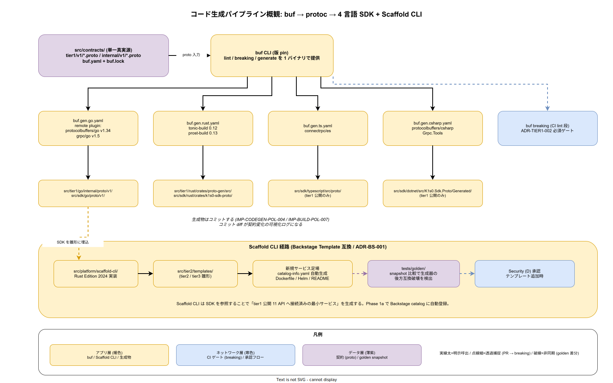

# 20. コード生成設計

本章は k1s0 の Protobuf / OpenAPI / Scaffold CLI によるコード生成パイプラインを実装段階確定版として固定する。ADR-DIR-001 で昇格した `src/contracts/` を単一真実源とし、ADR-TIER1-002 で統一した Protobuf gRPC 契約から 4 言語 SDK（Rust / Go / C# / TypeScript）および tier2 雛形を一貫した生成経路で再現可能に保つ。

## 本章の位置付け

tier1 公開 11 API と tier1 内部 gRPC は契約（Protobuf）を単一真実源とする。契約変更時に 4 言語 SDK と tier1 サーバースタブが機械的に再生成されないと、手修正ドリフトが 10 年保守で致命傷となる。本章では buf による Protobuf 生成（`buf breaking` を強制する ADR-TIER1-002）、OpenAPI 経由の外部連携層、Scaffold CLI による tier2 / tier3 雛形展開の 3 経路を統合的に規定する。

Scaffold CLI は ADR-BS-001 の Backstage Software Template 互換でテンプレートメタデータを出力し、B（SRE）と D（Security）が承認権限を持つ。ゴールデン出力は `tests/golden/` に snapshot として保持し、生成器変更時の後方互換破壊を検出する。



## OSS リリース時点での確定範囲

- リリース時点: buf での Protobuf 生成、4 言語 SDK 生成経路、Scaffold CLI の最小実装と golden snapshot
- リリース時点: OpenAPI 経由の外部連携層（BFF）
- リリース時点: Scaffold テンプレートの Backstage catalog-info.yaml 自動生成

## RACI

| 役割 | 責務 |
|---|---|
| DX（主担当 / C） | Scaffold CLI 実装、テンプレート仕様、golden snapshot |
| Platform/Build（共担当 / A） | buf / openapi 生成器のビルド統合、生成物のワークスペース配置 |
| SRE（共担当 / B） | Scaffold CLI 承認フロー、利用率計測 |
| Security（共担当 / D） | テンプレート承認ゲート、契約のバージョニング規約 |

## 節構成予定

```
20_コード生成設計/
├── README.md
├── 00_方針/                # 単一真実源の原則と生成経路
├── 10_buf_Protobuf/        # Protobuf → 4 言語 SDK + tier1 サーバー
├── 20_OpenAPI/             # BFF / 外部連携
├── 30_Scaffold_CLI/        # tier2 / tier3 雛形（Backstage Template 互換）
├── 40_Golden_snapshot/     # tests/golden/ との連携
└── 90_対応IMP-CODEGEN索引/
```

## IMP ID 予約

本章で採番する実装 ID は `IMP-CODEGEN-*`（予約範囲: IMP-CODEGEN-001 〜 IMP-CODEGEN-099）。

## 対応 ADR / 概要設計 ID / NFR

- ADR: [ADR-DIR-001](../../02_構想設計/adr/ADR-DIR-001-contracts-elevation.md)（contracts 昇格）/ [ADR-TIER1-002](../../02_構想設計/adr/ADR-TIER1-002-protobuf-grpc.md)（Protobuf gRPC）/ [ADR-TIER1-003](../../02_構想設計/adr/ADR-TIER1-003-language-opacity.md)（内部言語不可視）/ [ADR-BS-001](../../02_構想設計/adr/ADR-BS-001-backstage.md)（Backstage）
- DS-SW-COMP: DS-SW-COMP-122（SDK 生成）/ 130（契約配置）/ 132（platform / scaffold）
- NFR: NFR-H-INT-001（署名付きアーティファクト）/ NFR-C-MGMT-003（SBOM 100%）/ NFR-C-MNT-003（API 互換方針）

## 関連章

- `10_ビルド設計/` — 生成物のビルド統合
- `50_開発者体験設計/` — Scaffold CLI 運用面
- `80_サプライチェーン設計/` — テンプレート署名・SBOM
