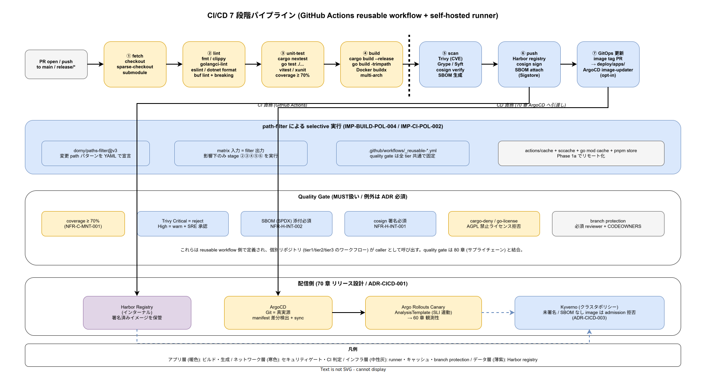

# 01. CI / CD 原則

本ファイルは k1s0 モノレポの CI（GitHub Actions self-hosted runner）と CD（Argo CD）の境界設計および運用規律について、常に参照する 7 軸の原則を定義する。workflow 追加・quality gate 改訂・Harbor 運用変更が発生した際、本原則との整合を確認することで、CI が配信を握る GitOps 逸脱と全ビルドによる CI 時間爆発を構造的に防ぐ。



## 原則が必要な理由

k1s0 の配信は ADR-CICD-001 で Argo CD、ADR-CICD-002 で Argo Rollouts、ADR-CICD-003 で Kyverno を選定済みであり、「CI は署名済イメージを Harbor に置くまで、そこから先は CD（Argo CD）」という境界が GitOps 原則の前提になっている。構想設計 `02_構想設計/04_CICDと配信/00_CICDパイプライン.md` で 7 段ステージ（fetch → lint → unit-test → build → scan → push → GitOps 更新）を確定しており、本章はこれを物理配置に落とす。

境界を曖昧にすると発生する典型的な破綻は以下である。

- CI から `kubectl apply` を直接叩く workflow が混入し、Git が真実源でなくなる
- path-filter 無しで全ビルドが走り、1 PR あたり 40 分の CI 時間を消費
- 各リポジトリが独自の quality gate を持ち、tier1 と tier2 で lint ルールがずれる
- Trivy 閾値の設定がリポジトリごとにバラけ、Critical CVE を含むイメージが本番に到達
- cosign の鍵を開発者端末に持ち出した運用となり、鍵漏洩リスクを抱える
- force push / 直接 push が許可され、branch protection の意味が無くなる

本原則は、これらの破綻を構造レベルで回避するために設けた 7 軸である。

## 原則 1: CI の責務は Harbor push までで終わる（IMP-CI-POL-001）

**CI（GitHub Actions）の責務は「署名済コンテナイメージを Harbor に push するまで」で完結する。CI から Kubernetes への直接 apply、Argo CD API 叩き、クラスタ上のワークロード変更を禁止する。**

GitOps の根本原理は「クラスタ状態は Git から決まる」であり、CI が Git を経由せずクラスタを変更すると、Argo CD が検出する drift が人為起因で増え、運用が破綻する。本原則は CI と CD の責務境界を物理的に切断する。

具体的な帰結として、以下を固定する。

- CI workflow は `kubectl` / `helm install` / `argocd` CLI / Kubernetes API 叩きを含まない
- イメージタグ更新は Argo Image Updater（または Renovate の GitOps PR）が Git にコミット
- クラスタ反映の責務は `70_リリース設計/` で Argo CD / Argo Rollouts 側に定義
- CI で `kubectl` 系 binary の使用検出があれば CI 自体を fail させる lint を入れる

CI 不可環境向けの Tekton フォールバック（構想設計選定済み）は 採用後の運用拡大時で本境界を維持したまま設計する。

## 原則 2: quality gate は reusable workflow で統制する（IMP-CI-POL-002）

**すべての PR が通過する quality gate は `tools/ci/workflows/` 配下の reusable workflow で一元定義し、各リポジトリ / ディレクトリが独自 gate を持つことを禁止する。**

リポジトリごとに独自 gate を許すと、tier1 では CVE High を拒否し tier2 では許容する、といった標準の分散が生じる。本原則は gate の単一化で「k1s0 の PR はどこも同じ品質基準を通過する」を保証する。

reusable workflow が統制する quality gate は以下を最小集合として必須化する。

- 言語別 fmt / lint（Rust: `rustfmt` + `clippy` / Go: `gofmt` + `staticcheck` / TS: `eslint` + `prettier` / C#: `dotnet format`）
- unit test（カバレッジ計測付）
- `buf lint` / `buf breaking`（契約変更時）
- `cargo-deny` / `govulncheck` / `npm audit` / `dotnet list package --vulnerable`（依存脆弱性）
- SPDX ライセンスチェック（`40_依存管理設計/` と整合）
- Trivy コンテナスキャン（原則 4）
- 生成物 diff 検証（IMP-CODEGEN-POL-002）

各リポジトリからの呼出しは `uses: k1s0/workflows/.github/workflows/quality-gate.yml@<tag>` 形式で固定バージョン参照する。

## 原則 3: 選択ビルドは path-filter で判定する（IMP-CI-POL-003）

**全ビルドを禁止する。`dorny/paths-filter` で変更影響範囲を判定し、影響下のジョブのみ起動する。契約変更時のみ全 SDK ビルドを強制する。**

本原則は IMP-BUILD-POL-004 と整合しつつ、CI 実行面での具体化を行う。path-filter 実装は reusable workflow 内で完結し、各リポジトリは filter の結果を受け取るだけとする。

path-filter が判定する軸は以下とする。

- tier 軸: tier1 / tier2 / tier3 / sdk / platform / infra / docs
- 言語軸: Rust / Go / TS / C# / YAML / md
- 契約軸: `src/contracts/**` 変更は全 SDK + tier1 サーバーを強制ビルド
- infra 軸: `infra/**` 変更は `deploy/` のレンダリング検証を強制
- docs 軸: docs のみ変更は lint のみ実行しビルドをスキップ

filter の誤判定はビルド失敗ではなく「ビルドしない結果の本番破壊」という形で顕在化する。したがって filter 定義変更は SRE レビュー必須とする（原則 7 と連動）。

## 原則 4: Harbor 門番は Trivy Critical 拒否で運用する（IMP-CI-POL-004）

**CI の scan 段で Trivy がイメージをスキャンし、CVE Critical を 1 件でも検出した場合は Harbor への push を拒否する。例外は Security チーム承認の時限的 `--allowlist` のみ。**

構想設計で確定した Harbor 門番は k1s0 のサプライチェーン境界であり、ここを緩めると下流の Kyverno admission（ADR-CICD-003）が本来担うべき「既知脆弱性のあるイメージが本番にいない」保証が実質的に無効化される。

Trivy 運用の要件は以下とする。詳細は `80_サプライチェーン設計/` で規定する。

- スキャン対象: base image + application layer（full scan）
- CVE Critical: 1 件で push 拒否
- CVE High: 72 時間以内の解消を要求、Security ダッシュボードで可視化
- CVSS スコアの update は `trivy db update` を日次実行
- allowlist 例外は最大 7 日間、PR 時に Security 承認必須

Harbor 側の replication / retention は `80_サプライチェーン設計/` で定義する。

## 原則 5: cosign 署名は CI 内で完結する（IMP-CI-POL-005）

**cosign 署名は GitHub Actions OIDC の keyless モードで実行し、署名鍵を開発者端末に持ち出すことを禁止する。**

鍵の持ち出しは紛失・漏洩のリスクと、持出者が離職した際の失効運用を必要とする。keyless 署名（Sigstore / Fulcio）は GitHub Actions の OIDC トークンから一時証明書を発行する仕組みで、鍵管理責務そのものを消滅させる。

cosign 運用の要件は以下とする。

- 署名対象: Harbor に push するすべてのコンテナイメージおよび SBOM（原則 4 と連動）
- 署名方式: `cosign sign --yes` の keyless モード（OIDC audience は GitHub Actions 固定）
- 検証側: Kyverno `verifyImages` ポリシで Admission 時に署名検証（ADR-CICD-003）
- rekor 透明性ログへの記録を必須化、rekor URL を PR 本文に自動コメント
- 鍵ベース署名（従来式）は リリース時点 では不採用

NFR-H-INT-001（署名付きアーティファクト）と NFR-H-INT-002（SBOM）はこの運用で達成する。

## 原則 6: マージは branch protection 経由のみ（IMP-CI-POL-006）

**main / release ブランチへの直接 push を禁止し、すべての変更は PR 経由とする。force push / branch 削除も禁止する。**

branch protection の構築は GitOps の根本要件である。main が壊れる可能性を個々の開発者の裁量に委ねると、採用側組織では復旧に数時間を要する障害になる。

branch protection の設定項目は以下とする。

- `main` / `release/*` への直接 push 禁止
- force push 禁止 / branch 削除禁止
- PR マージには quality gate（原則 2）全 pass を必須
- PR マージには CODEOWNERS 承認を必須
- stale review の dismiss を有効化（古いレビューを新コミットで無効化）
- 管理者もバイパスしない（`Do not allow bypassing the above settings`）

マージキュー導入は リリース時点 で再評価する（構想設計に従う）。

## 原則 7: Renovate PR は自動ビルドと patch 自動マージの対象（IMP-CI-POL-007）

**Renovate が作成する依存更新 PR は通常 PR と同じ quality gate を通過させ、かつ patch レベルの更新は quality gate 全 pass を条件に自動マージを有効化する（リリース時点 以降）。**

採用側の小規模運用では依存更新 PR を 1 件ずつ人手で merge するのは業務不能になる。本原則は自動マージの対象を「semver の patch レベル」に限定し、minor / major は人手レビューに回すことで、運用負荷と品質の均衡を取る。

自動マージの要件は以下とする。詳細は `40_依存管理設計/` と連動する。

- patch レベル自動マージ対象: プロダクション依存 / 開発依存 / GitHub Actions バージョン / Docker base image patch tag
- 自動マージ条件: quality gate 全 pass + Trivy Critical 無し + cosign 署名成功
- minor / major: 人手レビュー必須、Renovate グループ化で週次バッチ処理
- AGPL 分離検証（`40_依存管理設計/`）で分離境界を跨ぐ更新は自動マージ対象外

リリース時点で は全 Renovate PR を人手レビューとし / patch 自動マージを開く。

## 図表

```
[CI 7 段ステージ × CD 境界]
  ┌──────────── CI (GitHub Actions) ────────────┐
  │ fetch → lint → unit-test → build → scan → push │ Harbor
  └────────────────────────────────────────────────┘
                                                    │
                                                    ▼
                                          [ Argo Image Updater ]
                                                    │ PR / commit
                                                    ▼
  ┌──────────── CD (Argo CD) ───────────────────────┐
  │ Sync → Argo Rollouts → Kyverno verifyImages    │ クラスタ
  └────────────────────────────────────────────────┘
```

詳細な境界図と責務分担は [img/CI_CD境界.drawio](../img/30_CI_CD_7段階パイプライン.drawio) （drawio 編集時に svg 出力）を参照。

## 対応 IMP-CI ID

本ファイルで採番する原則レベル ID は以下とする。

- `IMP-CI-POL-001` : CI 責務は Harbor push まで
- `IMP-CI-POL-002` : quality gate は reusable workflow で統制
- `IMP-CI-POL-003` : path-filter による選択ビルド
- `IMP-CI-POL-004` : Harbor 門番の Trivy Critical 拒否
- `IMP-CI-POL-005` : cosign keyless 署名で完結
- `IMP-CI-POL-006` : branch protection 経由のマージのみ
- `IMP-CI-POL-007` : Renovate PR の自動ビルドと patch 自動マージ

## 対応 ADR / DS-SW-COMP / NFR

- ADR-CICD-001（Argo CD）/ ADR-CICD-002（Argo Rollouts）/ ADR-CICD-003（Kyverno）/ ADR-DIR-003（sparse checkout と CI 整合）
- DS-SW-COMP-135（配信系）
- NFR-C-NOP-004（ビルド所要時間）/ NFR-H-INT-001（Cosign 署名）/ NFR-H-INT-002（SBOM 添付）/ NFR-E-MON-004（Flag / Decision 変更監査）
