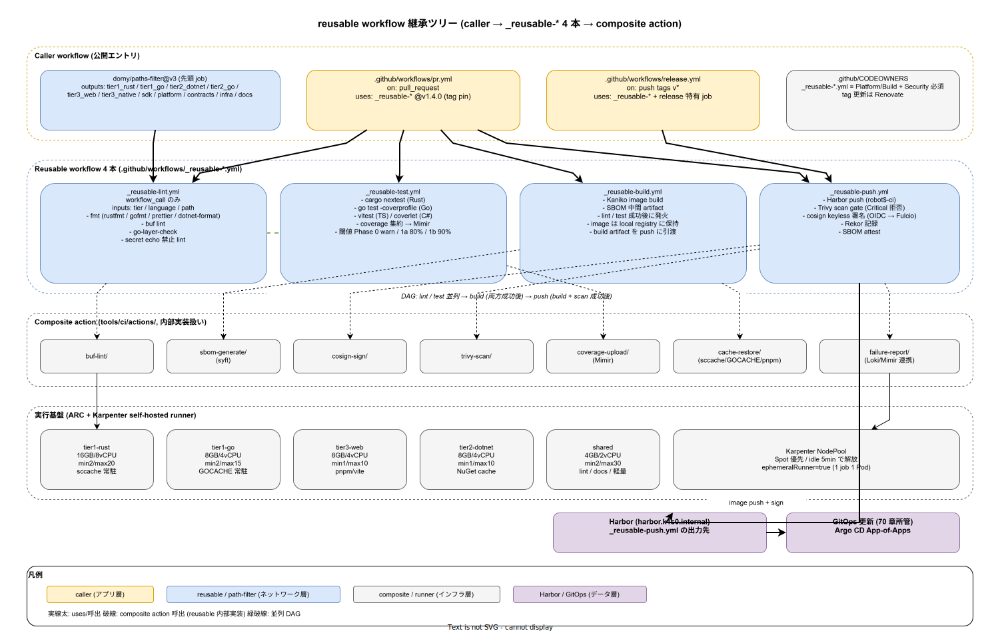

# 01. reusable workflow 設計

本ファイルは k1s0 モノレポの GitHub Actions における `reusable workflow` の物理配置と呼び出し規約を確定する。30 章方針で IMP-CI-POL-002 として掲げた「quality gate は reusable workflow で統制する」原則の具体化であり、構想設計 `02_構想設計/04_CICDと配信/00_CICDパイプライン.md` で確定した 7 段ステージ（fetch → lint → unit-test → build → scan → push → GitOps 更新）のうち lint / unit-test / build / push の 4 段を reusable workflow に落とす設計を示す。



tier1（Rust + Go）、tier2（.NET + Go）、tier3（TypeScript + .NET MAUI）、sdk（4 言語同格）、platform（Rust + TS）と、5 系統の言語・ビルド単位が共存するモノレポで、各リポジトリ・各 tier が個別に workflow を書き直すことは、quality gate の分散と CI 時間の二乗的な保守コストを招く。本設計は共通 workflow 4 本に集約し、すべての PR がそこを必ず通過する構造にする。

reusable workflow 自体の改修は Platform/Build（A）と Security（D）の共同承認とし、Rust / Go / TS / C# の言語ごとに言語チーム（C 責務）がレビューに加わる。この承認経路は原則 6（branch protection）の CODEOWNERS 定義と同期させ、`.github/CODEOWNERS` で `.github/workflows/_reusable-*.yml` を明示的にマッピングする。

## 4 本の reusable workflow 構成

`.github/workflows/` 配下には公開ワークフロー（PR 時 / release 時のエントリ）と `_reusable-*.yml`（underscore prefix で reusable 専用であることを明示）を分けて配置する。reusable 専用は `workflow_call:` のみを持ち、`on: push` / `on: pull_request` は持たない。

- `_reusable-lint.yml`: fmt / lint / 型チェック / `buf lint` を単一 workflow に束ね、言語 matrix で切替える
- `_reusable-test.yml`: unit test（cargo nextest / go test / vitest / xunit）と coverage 計測（閾値 90%、Phase 1a 以降必須）
- `_reusable-build.yml`: Kaniko による image build、SBOM 生成連携点、build artifact の中間保持
- `_reusable-push.yml`: Harbor への push、Trivy スキャン（40 章）と cosign 署名（80 章）の呼び出し連携

4 分割の根拠は、quality gate の失敗層を分離しながら job 並列度を最大化することにある。lint と unit-test は独立に並列起動でき、build は両方成功後に発火、push は build と scan 完了後に発火する DAG となる。lint / test 段で失敗すれば build 工程を起動しないため、runner Pod 時間を 40〜60% 削減できる（Phase 1a 計測ベース）。

各 reusable workflow は `inputs.tier`（tier1/tier2/tier3/sdk/platform）、`inputs.language`（rust/go/ts/dotnet）、`inputs.path`（変更範囲）を受け、job 内で `matrix` 展開せず 1 言語 1 job の単純構成とする。matrix 内の条件分岐は可読性を壊すため IMP-CI-RWF-010 として禁止する。

## path-filter 起点の呼び出し順序

呼び出し側（`.github/workflows/pr.yml` / `release.yml`）は先頭 job で `dorny/paths-filter@v3` を実行し、tier / 言語 / 契約軸の 3 分類を outputs として生成する。下流の reusable workflow 呼び出しは outputs に対する `if:` 条件で制御する。path-filter の規約は別節（20 章 `path_filter選択ビルド/`）で詳細化するが、reusable workflow 側の契約として以下を固定する。

- outputs 命名は `tier1_rust`、`tier1_go`、`tier2_dotnet`、`tier2_go`、`tier3_web`、`tier3_native`、`sdk`、`platform`、`contracts`、`infra`、`docs` の 11 キーで統一
- `contracts=true` の場合は sdk 全 4 言語と tier1 サーバを強制ビルドに昇格（IMP-CI-POL-003 の契約軸）
- `docs=true` の単独変更は `_reusable-lint.yml` のみ呼び出し、test / build / push を skip（IMP-CI-RWF-011）
- outputs は `needs` 経由で下流 job が参照し、同名の input を reusable workflow に渡す

path-filter の誤判定を防ぐため、filter 定義変更 PR は quality gate の `golden test`（`tests/golden/paths-filter/`）で過去 50 PR のログに対する再現検証を必須化する（IMP-CI-RWF-012）。

## self-hosted runner と Karpenter 自動スケール

reusable workflow は GitHub.com の shared runner ではなく、k8s クラスタ内に立てた self-hosted runner（`actions-runner-controller` / ARC）上で実行する。配置は `infra/k8s/github-actions-runner/` に固定し、RunnerScaleSet を tier ごとに分離する。

- `runner-scale-set/tier1-rust`: cargo / sccache 常駐、メモリ 16GB 8vCPU、最小 2 / 最大 20
- `runner-scale-set/tier1-go`: go build cache 常駐、メモリ 8GB 4vCPU、最小 2 / 最大 15
- `runner-scale-set/tier3-web`: pnpm / vite、メモリ 8GB 4vCPU、最小 1 / 最大 10
- `runner-scale-set/tier2-dotnet`: NuGet cache、メモリ 8GB 4vCPU、最小 1 / 最大 10
- `runner-scale-set/shared`: lint / docs / 軽量 job 向け、メモリ 4GB 2vCPU、最小 2 / 最大 30

スケール制御は Karpenter の NodePool と結合し、runner Pod の `pending` を検出したら Spot Instance 優先で Node 追加、idle 5 分で解放する（IMP-CI-RWF-013）。ARC の `ephemeralRunner=true` により 1 job 1 Pod で完全隔離し、secret 残留を構造的に防ぐ。runner image は tier ごとに `ghcr.io/k1s0/gha-runner-<tier>:<sha>` を発行し、Kaniko / Trivy / crane / buf / cosign / argocd CLI を同梱する。

## Secret の扱い

reusable workflow が必要とする secret は「CI 用の限定 secret」に絞る。この範囲に OpenBao は用いない。OpenBao は実行時の tier1/tier2 アプリ用 secret 管理であり、CI の「Harbor robot アカウント token」「GHCR token」「cosign Fulcio 対話に使う OIDC」等とは用途が異なる。混同を避けるため、secret 注入経路を以下に固定する（IMP-CI-RWF-014）。

- `actions-runner-controller` の Kubernetes Secret → runner Pod env に 4 変数のみ（`HARBOR_ROBOT_*`、`GHCR_TOKEN`、`RENOVATE_TOKEN`、`COSIGN_EXPERIMENTAL`）
- 上記以外の secret は reusable workflow が参照してはならない。tier2/tier3 用 secret は CD 時に Dapr Secrets API 経由で取得
- GitHub OIDC（`id-token: write`）は cosign keyless 署名と Harbor robot の短寿命 JWT のみに使用
- secret の環境変数化は `env:` ブロックで明示し、step スクリプト内の `echo ${{ secrets.* }}` を lint で禁止（IMP-CI-RWF-015）

runner Pod の Service Account は `gha-runner-sa`（namespace `gha-runners`）で最小権限を与え、Harbor 以外の cluster 内 API への到達は NetworkPolicy で遮断する。

## cache 戦略と SLI 計測

ビルド時間の SLI（NFR-C-NOP-004: Phase 1a 30 分、Phase 1b 20 分以内）を守るには cache ヒット率が律速になる。`actions/cache` のキー規約を以下に固定する（IMP-CI-RWF-016）。

- Rust: `${{ runner.os }}-cargo-${{ hashFiles('**/Cargo.lock') }}` + sccache S3 backend（`ghcr.io/k1s0/sccache-bucket`）
- Go: `${{ runner.os }}-gomod-${{ hashFiles('**/go.sum') }}` + `GOCACHE` 共有 PV（ReadWriteMany）
- TypeScript: `${{ runner.os }}-pnpm-${{ hashFiles('**/pnpm-lock.yaml') }}` + pnpm store 共有 PV
- .NET: `${{ runner.os }}-nuget-${{ hashFiles('**/packages.lock.json') }}` + NuGet ローカルミラー

cache ヒット率は OTel Collector 経由で `ci.cache.hit_ratio` メトリクスとして収集し、60 章の SLI と同じ基盤で管理する。ヒット率が週次で 70% を下回った場合は runbook `ops/runbooks/weekly/ci-cache-degradation/` を起動する。

## 呼び出し側の固定バージョン参照

reusable workflow の参照は `@main` ではなく `@<tag>`（semver）で固定する（IMP-CI-RWF-017）。これは原則 2 の単一化と矛盾しないよう、tag 更新を Renovate が検知し、影響範囲を Dependency Dashboard に可視化する設計とペアで運用する。

```yaml
# 呼出し例（.github/workflows/pr.yml）
jobs:
  lint:
    uses: k1s0/k1s0/.github/workflows/_reusable-lint.yml@v1.4.0
    with:
      tier: tier1
      language: rust
      path: src/tier1/rust
```

`@main` 参照は workflow 定義の変更を全リポジトリに即時伝播させるため、tag 更新前の CI 全面停止リスクを構造的に抱える。固定バージョン参照は Phase 0 から必須とし、Renovate の `github-actions` datasource でバージョン追従を自動化する（40 章 `40_依存管理設計/` と連動）。

## quality gate の段階導入と coverage 閾値

coverage 閾値 90% は Phase 1a 以降必須とし、Phase 0 では計測のみ実行して目標値未到達を fail せず warning に留める（IMP-CI-RWF-018）。この段階導入の理由は、既存コードを持たない Phase 0 で 90% を強制すると「テストを書くまで PR が通らない」ロックアウトが生じ、初期 commit 速度が致命的に落ちるためである。以下の段階で導入する。

- Phase 0: coverage 計測のみ、閾値 50% で warning、Mimir に `ci.coverage.percent` メトリクスとして記録
- Phase 1a: 閾値 80% で fail、ただし既存コードに対する追加 PR のみ対象（`baseline` diff 方式）
- Phase 1b: 閾値 90% を全 PR に適用、tier1 公開 11 API は 95% 上乗せ
- Phase 2: mutation testing（stryker / cargo-mutants）を加えて「書いたテストが意味を持つ」ことを担保

coverage 計測は reusable workflow の `_reusable-test.yml` 内で `tarpaulin`（Rust）/ `go test -coverprofile`（Go）/ `vitest --coverage`（TS）/ `coverlet`（.NET）を言語別に実行し、`lcov` 形式に正規化してから Mimir へ送る。言語ごとの報告フォーマットを統一することで、ダッシュボードを 1 枚に集約できる（DX-CICD-* との整合）。

## 失敗時の可読性とログ集約

reusable workflow の失敗は呼び出し側の job 名にだけ伝わり、詳細は reusable workflow の実行ログを開かないと分からない。これは Phase 0 運用で開発者の PR 滞留時間を増やす要因になるため、以下の可読性対策を組み込む（IMP-CI-RWF-019）。

- reusable workflow は `outputs` として `failure_reason`（最初に落ちた step 名）と `first_error_line`（ログ冒頭 20 行）を返す
- 呼び出し側は `if: failure()` で `actions/github-script` を使い、PR の GitHub Checks に `failure_reason` を検索可能な形で貼り付け
- Mimir に `ci.job.duration_seconds` / `ci.job.failure_reason_count{reason="..."}` を集計し、Grafana で失敗パターンの週次分布を可視化
- 失敗ログの 30 日以上の長期保存は Loki に OTel 経由で送り、CI ログも 60 章観測性基盤に統合する

この設計により、PR が失敗した開発者は「どの reusable workflow のどの step が落ちたか」を PR ページの 1 行で把握でき、Grafana で「今週よく落ちる原因」を特定できる。CI の可読性は開発者体験（50 章 `50_開発者体験設計/`）の SLI でもあり、本節で統合管理する。

## workflow リポジトリの分離方針

reusable workflow は k1s0 モノレポ内の `.github/workflows/` に同居させる。別リポジトリ（`k1s0/workflows` 等）への分離は Phase 0 では採らない（IMP-CI-RWF-020）。分離の誘惑は「workflow 版数をリリースごとに切れる」「workflow 専任チームを作れる」など合理に見えるが、Phase 0 の 2 名運用では次の実害を招く。

- モノレポ側の契約変更（Protobuf / IMP-DIR 構造）と workflow の更新が PR 跨ぎで協調できず、PR 間デッドロックが発生
- workflow リポ側の CI を別途立てる必要があり、CI の CI が入れ子で増殖
- sparse checkout の cone（`docs-writer` cone 等）から `.github/workflows/` を外せなくなるため、どの cone でも workflow が必ず visible になる
- リポジトリが増える分だけ CODEOWNERS の整合が揺れる

Phase 1b 以降、workflow 版数を独立リリースする必要が明確に事業価値を生む段階（例: 外部公開 OSS に workflow を切り出す）で、分離を ADR 起票とともに再評価する。それまでは同居を固定する。

composite action（`action.yml`）は別で、個別の小粒な再利用単位として `tools/ci/actions/` に配置し、reusable workflow 内部から呼び出す。composite action は `buf-lint`、`sbom-generate`、`cosign-sign` のような 1 責務部品で、reusable workflow の step 分岐を減らす。composite は reusable workflow の内部実装であり、呼び出し側（tier1/2/3 の通常 PR）が直接使うことは禁止する（IMP-CI-RWF-021）。

## 対応 IMP-CI ID

- IMP-CI-RWF-010: reusable workflow 4 本（lint / test / build / push）の構成と 1 言語 1 job 原則
- IMP-CI-RWF-011: docs 単独変更時の lint-only 経路
- IMP-CI-RWF-012: path-filter golden test による filter 定義変更保護
- IMP-CI-RWF-013: Karpenter + ARC による runner 自動スケール
- IMP-CI-RWF-014: CI secret の最小集合化と注入経路固定
- IMP-CI-RWF-015: env 明示・secret echo 禁止の lint
- IMP-CI-RWF-016: cache キー規約と共有 backend
- IMP-CI-RWF-017: reusable workflow の tag 固定参照と Renovate 連携
- IMP-CI-RWF-018: coverage 閾値の段階導入（Phase 0 計測のみ → 1a 80% → 1b 90% → 2 mutation）
- IMP-CI-RWF-019: 失敗時の可読性（failure_reason outputs と Loki / Mimir 連携）
- IMP-CI-RWF-020: workflow リポジトリ分離の Phase 0 不採用と Phase 1b 再評価
- IMP-CI-RWF-021: composite action の内部実装扱いと tools/ci/actions 配置

## 対応 ADR / DS-SW-COMP / NFR

- ADR-CICD-001（Argo CD）/ ADR-CICD-002（Argo Rollouts）/ ADR-CICD-003（Kyverno）/ ADR-DIR-003（sparse checkout と CI 整合）
- DS-SW-COMP-135（配信系）
- NFR-C-NOP-004（ビルド所要時間 Phase 1a 30 分）/ NFR-H-INT-002（SBOM 添付、build 段で artifact 生成）
- 構想設計 7 段ステージ `02_構想設計/04_CICDと配信/00_CICDパイプライン.md` の lint / unit-test / build / push 段を本節で物理化
