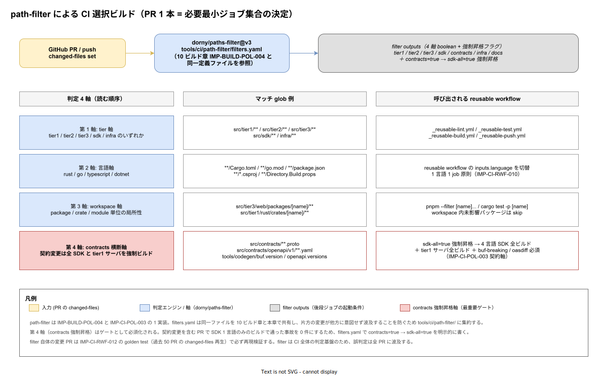

# 01. path-filter による CI 選択ビルド

本ファイルは GitHub Actions 上の CI ジョブを「変更影響範囲のみ」に絞り込む選択ビルドの判定機構を実装段階の確定版として固定する。tier1 / tier2 / tier3 / SDK / contracts / infra / docs の 7 領域 × 4 言語の組合せに対して全ビルドを毎 PR で回すと CI 時間が 3 倍に膨れ上がり、NFR-C-NOP-004（リリース時点 30 分 / 採用初期 20 分以内）を直ちに割る。本ファイルでは `dorny/paths-filter@v3` を判定エンジンとして 4 軸（tier / 言語 / workspace / contracts 横断）の判定ルールを規定し、reusable workflow（IMP-CI-RWF-010）の起動条件と一体運用する。



10 ビルド章 [`50_選択ビルド判定/01_選択ビルド判定.md`](../../10_ビルド設計/50_選択ビルド判定/01_選択ビルド判定.md) で path-filter の 4 段判定原則は確定済（IMP-BUILD-PF-050〜057）。本ファイルはその CI 側具体化として、reusable workflow の起動条件・filter outputs の伝搬経路・filter 自体の golden test 運用を規定する。`tools/ci/path-filter/filters.yaml` は両章で共有する単一定義ファイルとし、片方の変更が他方に意図せず波及することを防ぐ。

## なぜ「全ビルド」ではダメか

愚直な全ビルド（matrix 全 4 言語 × 全 5 tier = 20 job 並列）は、ビルド時間が短くても以下 3 つの実害を生む。

- **runner 占有による他 PR の滞留**: 単一 PR が 20 job を並列起動し、Karpenter が Spot Instance を確保する間に後続 PR が pending 化する。merge 速度が PR 数の 2 乗で悪化する
- **キャッシュミスの伝染**: 影響無いはずの workspace まで cargo / pnpm / nuget restore が走り、依存ロックファイルの hash 計算で実質的な処理時間を消費する
- **失敗の責任所在の曖昧化**: 関係ない workspace の flaky test で PR が落ちると、PR 著者は「自分のコード変更とは無関係」と判断するまでにログ全体を確認する必要がある。これは IMP-CI-RWF-019（失敗時可読性）の文脈とも矛盾する

path-filter による選択ビルドは「PR 著者が触ったコードのみ責任を持つ」という認知を CI 上に投影する。これはレビュー速度と CI 時間の両方に効く。

## dorny/paths-filter の選定

GitHub Actions の path フィルタリング手段は次の 3 経路がある。本章では `dorny/paths-filter@v3` を採用する。

- **on.push.paths / on.pull_request.paths（GitHub 標準）**: workflow ファイル先頭の YAML だけで宣言的に書ける。ただし 1 workflow = 1 path filter で、複数のジョブで異なるフィルタを使い分けることが不可能。reusable workflow を呼び分ける現行設計と相性が悪い
- **dorny/paths-filter（採用）**: 1 step として動作し、複数の filter 定義に対する boolean を outputs として返す。後段ジョブの `if: needs.filter.outputs.tier1 == 'true'` で起動条件を書ける。filter 定義は別ファイル（`tools/ci/path-filter/filters.yaml`）に分離可能で、編集・golden test と相性が良い
- **自作 bash + git diff**: フル制御だが、PR base ブランチの取得・rebase 後のファイル一覧取得・marketplace action 互換性などを自前で組む必要があり、エッジケースで詰まる

`@v3` の major 固定は IMP-CI-RWF-017（reusable workflow tag 固定参照）と同方針で、Renovate が detect する SHA 経由で更新する。

## filter 定義ファイルの配置

`tools/ci/path-filter/filters.yaml` を単一真実源とする。10 ビルド章の path-filter 判定（IMP-BUILD-PF-050〜057）と CI 章の reusable workflow 起動条件は同じ定義を参照する。

```yaml
# tools/ci/path-filter/filters.yaml（抜粋）
tier1:
  - 'src/tier1/**'
tier2:
  - 'src/tier2/**'
tier3:
  - 'src/tier3/**'
sdk:
  - 'src/sdk/**'
infra:
  - 'infra/**'
  - 'deploy/**'
docs:
  - 'docs/**'
contracts:
  - 'src/contracts/**'
  - 'tools/codegen/buf.version'
  - 'tools/codegen/openapi.versions'
# 強制昇格: contracts 変更で sdk-all を true 化する
sdk-all:
  - 'src/contracts/**'
  - 'src/sdk/**'
  - 'tools/codegen/buf.version'
  - 'tools/codegen/openapi.versions'
```

filters.yaml を `tools/ci/path-filter/` に置く理由は、`.github/workflows/` 配下に置くと dependabot / Renovate が誤って actions update PR の対象に含めるため。`tools/` 配下なら無関係。スパースチェックアウト（ADR-DIR-003）の `ci-dev` cone に含まれるよう cone 定義に追加する（IMP-DIR-CONE-* 参照）。

## 判定 4 軸の運用

第 1 軸（tier 軸）は影響を受ける tier のみ後段に伝える。第 2 軸（言語軸）は reusable workflow の `inputs.language` を切替える。第 3 軸（workspace 軸）は workspace 内の局所性で `pnpm --filter [name]...` のような細粒化に使う。第 4 軸（contracts 横断軸）は契約変更を全 SDK と tier1 サーバの強制昇格に使う。

第 1 〜 3 軸は性能最適化、**第 4 軸はゲート**である。性能最適化軸は filter が誤判定しても CI が「過剰に走る」だけで安全側に倒れるが、第 4 軸を誤判定すると「契約変更で SDK 4 言語のうち 1 言語しかビルドしない」事故が起きる。第 4 軸は安全側に振り切るため、`contracts=true` であれば必ず `sdk-all=true` も同時に true 化する。filters.yaml で両者を独立に書かず、`sdk-all` の glob に `src/contracts/**` を必ず含めることでこれを物理的に保証する。

## reusable workflow の起動条件

呼び出し側 workflow（`.github/workflows/ci.yml`）から filter outputs を受け、後段の reusable workflow を条件付きで起動する。

```yaml
# .github/workflows/ci.yml（抜粋）
jobs:
  paths:
    runs-on: ubuntu-latest
    outputs:
      tier1: ${{ steps.filter.outputs.tier1 }}
      tier2: ${{ steps.filter.outputs.tier2 }}
      tier3: ${{ steps.filter.outputs.tier3 }}
      sdk-all: ${{ steps.filter.outputs.sdk-all }}
      contracts: ${{ steps.filter.outputs.contracts }}
      docs: ${{ steps.filter.outputs.docs }}
    steps:
      - uses: actions/checkout@v4
      - id: filter
        uses: dorny/paths-filter@v3
        with:
          filters: tools/ci/path-filter/filters.yaml

  build-tier1:
    needs: paths
    if: needs.paths.outputs.tier1 == 'true' || needs.paths.outputs.sdk-all == 'true'
    uses: ./.github/workflows/_reusable-build.yml
    with:
      tier: tier1

  buf-breaking:
    needs: paths
    if: needs.paths.outputs.contracts == 'true'
    uses: ./.github/workflows/_reusable-buf-breaking.yml
```

`if` 条件で `tier1 == 'true'` だけでなく `sdk-all == 'true'` も含めるのは、契約変更で tier1 サーバ全ビルドを強制するため。これは IMP-CI-POL-003（契約軸）の物理化。

`docs == 'true'` のみが true（他がすべて false）の場合は `_reusable-lint.yml` のみ起動し、test / build / push を skip する（IMP-CI-RWF-011）。docs 単独 PR で 30 分 CI を待たせない。

## filter 自体の変更保護

filter は CI 全体の判定基盤で、誤判定は全 PR に波及する。`tools/ci/path-filter/filters.yaml` の変更 PR は以下の golden test を必須化する（IMP-CI-RWF-012 と整合）。

```bash
# tools/ci/path-filter/run-golden-test.sh
set -eu

# 過去 50 PR の changed-files set を再生し filter 出力が回帰していないか確認
for sample in tests/ci/path-filter-golden/*.json; do
    expected="${sample%.json}.expected.json"
    actual="$(jq -c '.files' "$sample" | docker run --rm -i \
        -v "$PWD/tools/ci/path-filter/filters.yaml:/f.yaml" \
        ghcr.io/dorny/paths-filter-cli:v3 --filters /f.yaml --files-stdin)"
    if ! diff <(jq -S . <<<"$actual") <(jq -S . "$expected"); then
        echo "ERROR: filter regression on $sample"
        exit 1
    fi
done
```

`tests/ci/path-filter-golden/` には過去 50 PR から代表 20 件を選び `<pr-id>.json`（changed-files の入力）と `<pr-id>.expected.json`（期待 outputs）を pin する。filter 変更時は両ファイルを同時更新する PR を出し、レビューで意図変化を人間が確認する。

新規 tier や新規 contracts 配下を追加する設計判断（例: `src/sdk/python/` 追加）には、ここでの golden test 更新を必須としてレビュアーに見せる。

## キャッシュキーへの伝搬

選択ビルドで起動した job は、`actions/cache` のキー設計（IMP-CI-RWF-016）で「呼び出された tier / 言語」をキー要素に含める。これにより、`tier1-rust-dev` の build キャッシュと `tier3-typescript-dev` の build キャッシュが同居するシナリオで衝突しない。

```yaml
# _reusable-build.yml 内のキャッシュキー例
key: ${{ runner.os }}-${{ inputs.tier }}-${{ inputs.language }}-${{ hashFiles('**/Cargo.lock', '**/go.sum', '**/pnpm-lock.yaml', '**/packages.lock.json') }}
```

選択ビルドにより「実際にはビルドしない workspace」のロックファイル hash 計算は走らないため、キャッシュキー計算自体も短縮される。

## 失敗判定と必須チェック

GitHub branch protection（IMP-CI-POL-006、後述 50 章で詳細化）で「必須通過 status check」を指定する場合、選択ビルドで skip された job が `required` になっていると merge できない事故が起きる。本章では以下の運用に固定する。

- **必須 status check は集約 job のみ**: `ci-overall` という最終 job を 1 本だけ必須化し、これは `needs: [build-tier1, build-tier2, build-tier3, build-sdk, lint, test]` を持つが `if: always()` で起動し、各前段の `result` を `success || skipped` で許容する
- **選択ビルドで skip された job は緑判定**: `result == 'skipped'` を `success` と同等に扱う。これは「path-filter で実行不要と判定された」という設計判断の表明であり、実行されなかった = 失敗ではない

集約 job の実装は `tools/ci/jobs/ci-overall.sh` で 1 本化する。後段で 50_branch_protection 章が必須 status check として `ci-overall` のみを指定する。

## cone 整合

filter 定義ファイル `tools/ci/path-filter/filters.yaml` は CI 関連 cone（`ci-dev` 役割）に含める。10 ビルド章でも同じファイルを参照するため、`tier1-go-dev` / `tier1-rust-dev` などの開発 cone でも `tools/ci/path-filter/` を読み取り可能とする（書き込みは ci-dev のみ）。

## 対応 IMP-CI ID

- `IMP-CI-PF-030` : `dorny/paths-filter@v3` の採用と `@v3` major 固定
- `IMP-CI-PF-031` : `tools/ci/path-filter/filters.yaml` の単一真実源化（10 ビルド章と本章で共有）
- `IMP-CI-PF-032` : 4 軸（tier / 言語 / workspace / contracts 横断）の判定構造
- `IMP-CI-PF-033` : `contracts=true → sdk-all=true` 強制昇格の物理化
- `IMP-CI-PF-034` : `_reusable-*.yml` への filter outputs 伝搬と起動条件
- `IMP-CI-PF-035` : `tools/ci/path-filter/run-golden-test.sh` による filter 変更保護
- `IMP-CI-PF-036` : 集約 job `ci-overall` 1 本のみを必須 status check とする運用
- `IMP-CI-PF-037` : キャッシュキーへの tier / 言語伝搬による衝突回避

## 対応 ADR / DS-SW-COMP / NFR

- ADR-CICD-001（ArgoCD）/ ADR-DIR-003（スパースチェックアウト cone mode、filters.yaml の cone 配置）
- DS-SW-COMP-135（配信系インフラ：Harbor / ArgoCD / Backstage / Scaffold の起動条件統制）
- NFR-C-NOP-004（ビルド所要時間：リリース時点 30 分 / 採用初期 20 分以内）/ NFR-C-MGMT-001（設定 Git 管理：filter 定義の commit 必須）
