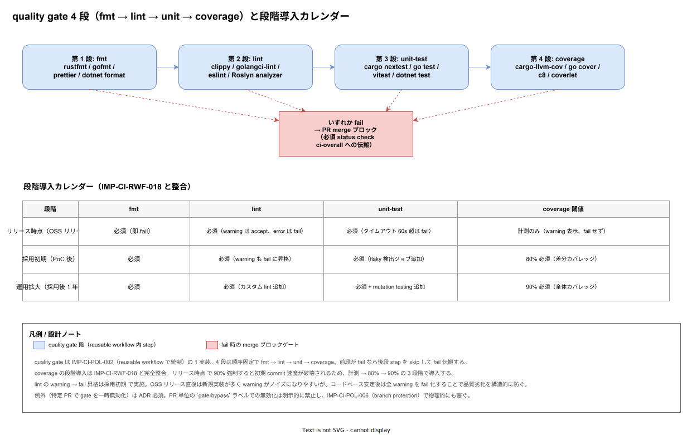

# 01. quality gate（fmt / lint / unit-test / coverage）

本ファイルは PR が merge されるまでに通過すべき 4 段の品質ゲートを実装段階の確定版として固定する。fmt / lint / unit-test / coverage はそれぞれ別の責務を持ち、段階失敗時に「どこで止まったか」が PR 著者に即座に伝わることが重要である。本ファイルでは 4 ゲートの順序・閾値・段階導入カレンダー（リリース時点 / 採用初期 / 運用拡大）を規定し、reusable workflow（IMP-CI-RWF-010〜021）から呼び出される共通契約として確定させる。

20 path-filter 章 [`20_path_filter選択ビルド/01_path_filter選択ビルド.md`](../20_path_filter選択ビルド/01_path_filter選択ビルド.md) で「集約 job `ci-overall` を 1 本だけ必須化する」運用を確定させた。本章はその `ci-overall` の前段で実行される 4 ゲートの内訳を定義する。各ゲートは reusable workflow の独立 step として実装し、前段失敗時に後段を起動しない短絡評価で運用する。

## なぜ 4 ゲートを分けるのか

「1 つの make check で全てを回す」運用は CI ログが肥大化し、PR 著者が「fmt エラー / lint warning / test fail / coverage 不足」のどれで落ちたかを判別するのに丸ごと再読する必要が出る。本章では 4 ゲートを独立 job に分離し、GitHub Actions UI 上で各 job の緑赤が個別表示される構造に固定する。

- **fmt（フォーマッタ）**: 機械的に修正可能。CI で `--check` モードで失敗させ、PR 著者が `cargo fmt` / `gofmt` / `prettier` を手元で再実行するだけで解決する設計
- **lint（静的解析）**: 機械修正不可な部分を含むが、判定ルールは pin 済み（後述）。設計判断が絡むため自動修正させず人間に委ねる
- **unit-test（単体テスト）**: ビジネスロジックの正当性検証。失敗時のログがそのままバグレポートとして使える
- **coverage（カバレッジ）**: 統計情報の保証。閾値割れで段階的に失敗させる

順序は依存関係に従い「fmt → lint → unit-test → coverage」で固定する。fmt 違反のままでは lint の AST パーサが意図しない箇所で警告を出すため、必ず fmt 通過後に lint を回す。

## fmt（フォーマッタ）

各言語の標準フォーマッタを `--check` モードで起動し、差分があれば失敗させる。CI では自動修正をかけない。これは「PR が緑である」と「ローカルで `cargo fmt` を打てば緑になる」を等価に保つためで、PR 上の自動修正コミットがレビューを汚すことを避ける。

| 言語 | コマンド | pin 経路 |
|------|----------|----------|
| Rust | `cargo fmt --all -- --check` | `rust-toolchain.toml`（Edition 2024） |
| Go | `gofmt -l -d $(go list -f '{{.Dir}}' ./...)` | `go.mod` の go directive |
| TypeScript | `pnpm prettier --check .` | `package.json` の devDependencies SHA 固定 |
| C# | `dotnet format --verify-no-changes` | `global.json` の SDK 固定 |

PR 著者には failed log の冒頭に「`cargo fmt --all` を実行して再 push してください」のような次アクションを 1 行で出す。これは IMP-CI-RWF-019（失敗時可読性）の本実装。

## lint（静的解析）

lint は警告レベルを「全て error 化」して運用する。warning ツリーを許容すると数 PR で噪音が累積し、本物の警告が埋もれる。

| 言語 | リンター | 起動オプション |
|------|----------|----------------|
| Rust | `cargo clippy` | `--all-targets --all-features -- -D warnings` |
| Go | `golangci-lint run` | `--timeout 5m`（config: `.golangci.yml` 共通） |
| TypeScript | `pnpm eslint .` | `--max-warnings 0` |
| C# | `dotnet build /p:TreatWarningsAsErrors=true` | csproj で `<TreatWarningsAsErrors>true</TreatWarningsAsErrors>` |

`.golangci.yml` などのリンター設定は `tools/lint/` 配下に集約し、tier 別の独自ルールを許さない。これは「同じコードが tier1 では通り tier2 では落ちる」状態を物理的に発生させないため。

リンタールール変更は ADR で起票することを必須とする（軽微な exclude 追加でもレビュー必須）。lint は実質的に「コードレビュー基準を機械化したもの」であり、ルール変更は方針変更だからである。

## unit-test（単体テスト）

`tier1` Rust は `cargo nextest run`、`tier1` Go ファサードは `go test ./... -race`、`tier3` TypeScript は `pnpm vitest run`、`tier3` C# は `dotnet test --no-build` を起動する。`-race` を Go のみで指定するのは Rust が borrow checker でデータ競合を静的に防ぐため CI で動的検出する必要がないため、TypeScript / C# は単一スレッドで動くサービスが多いため。

unit-test は「外部依存をモックし、ロジック単体で動く」ことを定義として固定する。Postgres / Kafka / Dapr など外部依存に触れるテストは別カテゴリ（integration-test）として `tests/` 配下に置き、別 reusable workflow（後段の運用観測 章で定義予定）で起動する。本ゲートで integration-test を含めない理由は、CI 時間が NFR-C-NOP-004（リリース時点 30 分以内）を超えるリスクと、外部依存の flaky 失敗で PR が落ちる事故を避けるため。

## coverage（カバレッジ）

カバレッジは「測定する」「閾値で失敗させる」の 2 段階に分け、段階導入カレンダーで運用拡大に同期する。

| 段階 | 期間目安 | fmt | lint | unit-test | coverage |
|------|----------|-----|------|-----------|----------|
| リリース時点（OSS 公開） | 〜採用 0 件 | error | error | error | 計測のみ（閾値 0%） |
| 採用初期 | PoC 採用 1 〜 数件 | error | error | error | 80% で error |
| 運用拡大 | 採用後 1 年〜 | error | error | error | 90% で error |

リリース時点で 80% を強制しないのは、初期 commit のテスト網羅が現実的に低く、強制すると OSS 公開直後に「カバレッジ違反で全 PR が落ちる」状態になるため。計測のみ運用で baseline を可視化し、PoC 採用が始まった時点で `tools/coverage/threshold.yaml` の数値を 80 に上げる。閾値変更は ADR 起票を必須とし、緩める変更（例: 80→70）はさらに上長承認を必須化する（threshold は「下げない」原則）。

カバレッジ計測ツールは Rust=`cargo-llvm-cov`、Go=`go test -coverprofile`、TypeScript=`vitest --coverage`、C#=`dotnet test /p:CollectCoverage=true` を採用する。報告フォーマットは Cobertura XML に統一し、Codecov 等の外部 SaaS には現時点で送信しない（IMP-CI-POL-001 ベンダーロック警戒）。

## 失敗ゲートの伝搬

各ゲート failed 時の挙動を以下に固定する。

- **fmt 失敗**: 後段（lint / test / coverage）を全て skip する。`needs.fmt.result == 'success'` を `if` に書く
- **lint 失敗**: 後段（test / coverage）を全て skip する
- **unit-test 失敗**: coverage を skip する。テスト失敗は「動いていない」状態でカバレッジ統計に意味がない
- **coverage 失敗**: 単独で error 化。前段が全て緑である状態のみで coverage を評価できる

`ci-overall`（IMP-CI-PF-036）は `needs: [fmt, lint, unit-test, coverage]` を持ち、`if: always()` で起動するが内部で「skip された前段は failed と同等扱い（fmt 失敗起因の skip は除く）」を判定する。詳細実装は `tools/ci/jobs/ci-overall.sh` で 1 本化する。

## 計測値の蓄積

カバレッジ実績値・lint warning 件数・unit-test 実行時間は `tools/ci/metrics/` 配下に保存し、Backstage の TechInsights ファクト（後段 95_DXメトリクス 章）に流す。CI 時間と品質値の経年推移を可視化することで、リリース時点 → 採用初期 → 運用拡大の段階移行判断を「主観の勘」ではなく「実績データ」で行えるようにする。

## キャッシュ戦略

各ゲートで使う toolchain（cargo / go / pnpm / dotnet）と依存（registry index / module cache）は actions/cache でキャッシュする。キャッシュキーは IMP-CI-RWF-016 で定義済の構造（`os-tier-language-hash(lockfile)`）に従う。本章のゲートは「キャッシュなし状態でも動く」ことを保証し、キャッシュ miss 時の長時間化（ベースで 2〜3 倍）が NFR-C-NOP-004 を割らない設計とする。

`tools/lint/` `tools/coverage/threshold.yaml` などの設定ファイルが PR で変更された場合は、当該 PR でキャッシュキーを必ず変える（hash に含める）。設定変更が古いキャッシュで隠蔽されることを防ぐ。

## 言語追加時の運用

新言語（例: Python SDK 追加）が `src/sdk/python/` に追加される場合、本章の 4 ゲートに対応する Python 用エントリ（`ruff format --check` / `ruff check` / `pytest` / `coverage`）を追加し、ADR で言語採用を起票する。これは ADR-TIER1-001（言語政策）の延長判断であり、勝手追加は不可。

## 対応 IMP-CI ID

- `IMP-CI-QG-060` : 4 ゲート（fmt / lint / unit-test / coverage）の順序固定
- `IMP-CI-QG-061` : fmt は `--check` モード固定で自動修正禁止
- `IMP-CI-QG-062` : lint は warning 全て error 化（`-D warnings` / `--max-warnings 0`）
- `IMP-CI-QG-063` : `tools/lint/` 配下の単一真実源化（tier 別独自ルール禁止）
- `IMP-CI-QG-064` : unit-test は外部依存モック必須（integration-test は別 workflow）
- `IMP-CI-QG-065` : カバレッジ段階導入（リリース時点 計測のみ → 採用初期 80% → 運用拡大 90%）
- `IMP-CI-QG-066` : Cobertura XML 統一とベンダー SaaS 非送信
- `IMP-CI-QG-067` : 各ゲート failed 時の後段 skip 伝搬構造

## 対応 ADR / DS-SW-COMP / NFR

- ADR-TIER1-001（Go + Rust ハイブリッド） — 4 言語ゲートの言語別 toolchain 定義
- ADR-CICD-001（ArgoCD / GitHub Actions） — quality gate を GitHub Actions 上で運用する前提
- DS-SW-COMP-135（CI/CD 配信系） — Backstage TechInsights への metrics 送信契約
- NFR-C-NOP-004（CI 時間：リリース時点 30 分 / 採用初期 20 分以内） — 4 ゲートの並列実行で達成
- NFR-C-MNT-003（保守性：lint / coverage 閾値の機械化）
- NFR-C-QLT-002（品質：カバレッジ段階導入）
