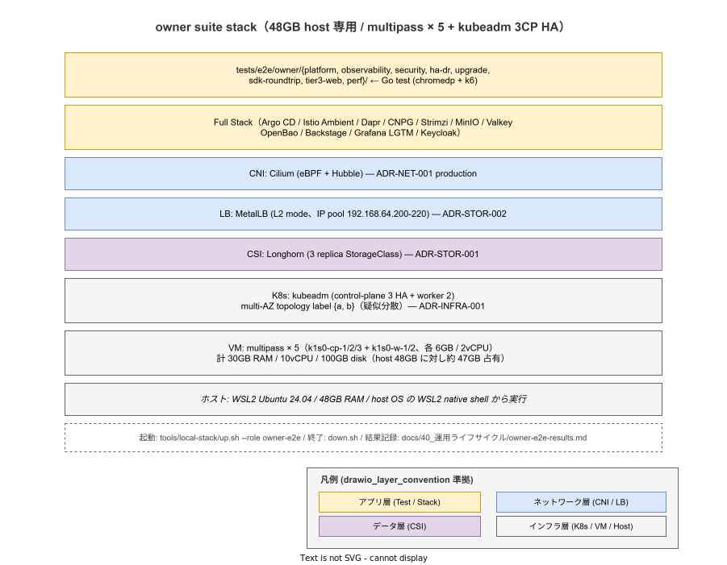

# 01. owner suite 環境契約

本ファイルは ADR-TEST-008 で確定した owner suite の実行環境を実装段階の正典として固定する。owner suite は 48GB host 専用で、本番設計（ADR-INFRA-001 / ADR-NET-001 / ADR-STOR-001 / 002）を multipass 上の kubeadm cluster で再現する。本書は VM 構成・K8s install 手順・CNI/CSI/LB の選定・フルスタック起動経路・リソース予算を ID として採番する。

## 本ファイルの位置付け

owner suite の本番再現スタックは、利用者向けの kind 経路（`20_user_suite/01_環境契約.md`）と物理的に異なる。multipass で立ち上げた 5 VM 上に kubeadm を install し、Cilium / Longhorn / MetalLB の本番設計を直接投影することで、kind では取れない fidelity（CSI replication / LB / eBPF / multi-AZ topology）を機械検証する。本ファイルは ADR-INFRA-001 / ADR-NET-001 / ADR-STOR-001 / 002 の本番設計をそのまま owner-e2e role の構成に落とし込む。

## VM 構成（multipass × 5）

owner suite は multipass で 5 VM を起動する。control-plane 3 + worker 2 の HA 構成で、本番 cluster（ADR-INFRA-001 の 3CP HA + Cluster API）を最小再現する。



| VM | 役割 | RAM | vCPU | disk | 備考 |
|---|---|---|---|---|---|
| `k1s0-cp-1` | control-plane (init) | 6GB | 2 | 20GB | kubeadm init を実行する 1 台 |
| `k1s0-cp-2` | control-plane (join) | 6GB | 2 | 20GB | kubeadm join --control-plane |
| `k1s0-cp-3` | control-plane (join) | 6GB | 2 | 20GB | kubeadm join --control-plane |
| `k1s0-w-1` | worker (zone-a) | 6GB | 2 | 20GB | `topology.kubernetes.io/zone=a` |
| `k1s0-w-2` | worker (zone-b) | 6GB | 2 | 20GB | `topology.kubernetes.io/zone=b` |

リソース合計は VM 5 × 6GB = 30GB / 5 × 2vCPU = 10vCPU / 5 × 20GB = 100GB disk。48GB host で残 18GB を host OS（6GB）+ dev tools（6GB）+ multipass 動作余裕（6GB）に充てる。HA 検証時の Pod 一時増加で 30GB を超過するリスクがあるため、Runbook（RB-TEST-OWNER-E2E-FULL）で dmesg 監視を必須化する。

worker 2 台に異なる zone label を付けることで、topology spread / pod anti-affinity の検証を `topology.kubernetes.io/zone={a,b}` の 2 zone 構成で機械検証可能にする。実 AZ ではなく label 上の疑似 multi-AZ だが、k1s0 側の zone topology 挙動は検証範囲に含められる。3 zone（zone-c）まで広げるには worker 3 台目が必要で 36GB を超え host RAM を圧迫するため、リリース時点では 2 zone とする。

## K8s install 手順（kubeadm）

各 VM に kubeadm / kubelet / kubectl を install し、`k1s0-cp-1` で `kubeadm init` 後、残 4 VM が `kubeadm join` する。手順は ADR-INFRA-001 の本番運用を完全踏襲し、本番 cluster の構築手順とコマンドレベルで一致させる。

```text
1. 全 VM: containerd + kubeadm/kubelet/kubectl install (pkgs.k8s.io 公式 repo)
2. k1s0-cp-1: kubeadm init --pod-network-cidr=10.244.0.0/16 --upload-certs
3. k1s0-cp-2/3: kubeadm join --control-plane (k1s0-cp-1 で発行した join token + cert key)
4. k1s0-w-1/2: kubeadm join (worker token)
5. k1s0-cp-1: Cilium install (eBPF + Hubble)
6. k1s0-cp-1: Longhorn install (3 replica StorageClass)
7. k1s0-cp-1: MetalLB install (L2 mode、pool 192.168.64.200-220)
8. k1s0-cp-1: フルスタック install (Argo CD / Istio Ambient / Dapr / CNPG / Strimzi / MinIO / Valkey / OpenBao / Backstage / Grafana LGTM / Keycloak)
```

実装は `tools/local-stack/up.sh --role owner-e2e` でラップする。各 step は独立 shell function に分離し、失敗時に当該 step だけ再試行できる構造を採る。K8s install 手順の本体仕様は ADR-INFRA-001 の本番運用 Runbook（`ops/runbooks/RB-INFRA-001-kubeadm-bootstrap.md`、採用初期で整備）と共通化する。

## CNI / CSI / LB の選定

owner suite の CNI / CSI / LB は本番設計の決定をそのまま投影する。kind 既定（Calico / local-path-provisioner / extraPortMappings）とは構成が異なる。

| 要素 | 採用 | 出典 ADR | kind 既定との差 |
|---|---|---|---|
| CNI | Cilium（eBPF + Hubble） | ADR-NET-001（production = Cilium） | kind は Calico iptables、Cilium eBPF / NetworkPolicy 強制 / mTLS / Hubble 観測性が検証範囲に入る |
| CSI | Longhorn（3 replica StorageClass） | ADR-STOR-001 | kind は local-path-provisioner、Longhorn replication / snapshot / backup が検証範囲に入る |
| LB | MetalLB（L2 mode、IP pool 192.168.64.200-220） | ADR-STOR-002 | kind は extraPortMappings の port forward、MetalLB L2 announce / failover が検証範囲に入る |

各 OSS のバージョンは `tools/local-stack/versions.env` に固定し、`up.sh --role owner-e2e` がこの version で install する。version 更新は `tools/local-stack/versions.env` の編集 + 影響評価（過去の owner full PASS が壊れないか）を 1 PR で行う。

## フルスタック構成

フルスタックは Argo CD / Istio Ambient / Dapr / CNPG / Strimzi / MinIO / Valkey / OpenBao / Backstage / Grafana LGTM / Keycloak の 11 components で、ADR-POL-002（local-stack を構成 SoT に統一）の SoT として `tools/local-stack/` 配下の Helm chart / manifest を流用する。owner-e2e role と既存 role（dev / strict）でフルスタックの内容を同一化することで、開発時の dev cluster と owner full の cluster の挙動差を最小化する。

各 component の install 順序は依存関係から決定する。Cilium / Longhorn / MetalLB（infra layer）→ Argo CD（GitOps engine）→ Istio Ambient（service mesh）→ Dapr / CNPG / Strimzi / MinIO / Valkey / OpenBao（platform）→ Backstage / Grafana LGTM / Keycloak（user-facing）の 4 階層。各階層内は並列 install で起動時間を短縮する。

## リソース予算

owner full の所要時間は実走で約 1 時間 45 分を想定する。内訳:

- multipass × 5 起動: 約 5 分（並列）
- kubeadm init + join × 4: 約 10 分
- CNI / CSI / LB install + Ready 待機: 約 10 分
- フルスタック install + Ready 待機: 約 15 分
- e2e test 全件実行（8 部位）: 約 60 分
- cleanup（multipass delete）: 約 5 分

48GB host のピーク使用量は約 47GB（VM 30 + フルスタック稼働 12 + host 5）で上限ぎりぎりとなる。HA 検証中の Pod 一時増加（観測性 5 検証 / k6 perf 注入時）で 48GB を超過する可能性があり、Runbook で dmesg 監視 + swap 設定を必須化する。

## IMP ID

| ID | 内容 | 配置 |
|---|---|---|
| IMP-CI-E2E-002 | owner suite 環境契約（multipass × 5 + kubeadm + Cilium + Longhorn + MetalLB + フルスタック） | 本ファイル |

## 対応 ADR / 関連設計

- ADR-TEST-008（e2e owner / user 二分構造）— 環境契約の起源
- ADR-INFRA-001（kubeadm + Cluster API）— 3CP HA 構成の根拠
- ADR-NET-001（CNI 選定: production = Cilium）
- ADR-STOR-001（Longhorn）/ ADR-STOR-002（MetalLB）
- ADR-POL-002（local-stack を構成 SoT に統一）— `--role owner-e2e` の SoT 拡張
- `tools/local-stack/up.sh --role owner-e2e` — 実装本体
- `ops/runbooks/RB-TEST-OWNER-E2E-FULL.md`（採用初期で新設）— 実走手順 + dmesg 監視
- `02_ディレクトリ構造.md`（同章）— 本環境上で動く tests/e2e/owner/ の配置
