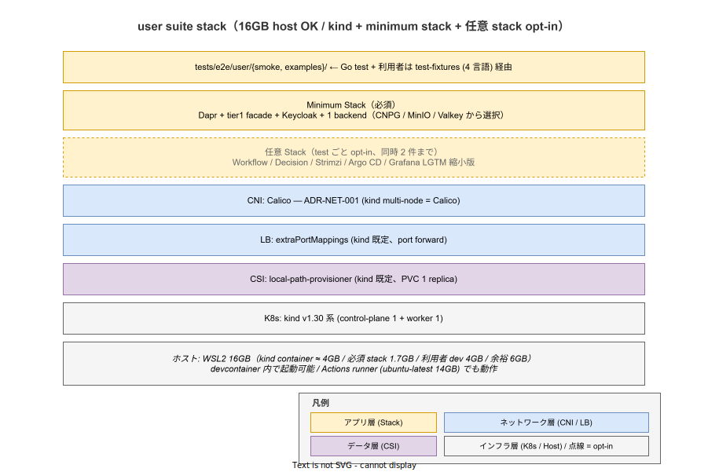

# 01. user suite 環境契約

本ファイルは ADR-TEST-008 で確定した user suite の実行環境を実装段階の正典として固定する。user suite は 16GB host を最小要件とし、kind cluster + minimum stack（Dapr + tier1 facade + Keycloak + 1 backend）で k1s0 install の最小成立形を起動する。本書は kind 構成・必須 stack・任意 stack の opt-in 規約・リソース予算を ID として採番する。

## 本ファイルの位置付け

user suite は利用者（k1s0 でアプリを開発する開発者）の host RAM 16GB で動作する必要がある。Grafana LGTM / Argo CD / Istio Ambient / Backstage 等のフルスタックを起動すると 16GB を超えるため、必須 stack を最小化し、test ごとに必要な追加 stack を opt-in で起動する設計を採る。これにより smoke test は 5 分以内 / 16GB 内で完走し、利用者が PR の場で 1 度走らせて確認できる DX を確立する。

## kind 構成

user suite の K8s は kind を採用する（ADR-NET-001 の「kind multi-node = Calico」と整合）。

| 要素 | 採用 | 根拠 |
|---|---|---|
| K8s | kind v1.30 系（control-plane 1 + worker 1） | 16GB 制約に収まる最小構成、kubectl 互換性 |
| CNI | Calico v3.27 系 | ADR-NET-001（kind multi-node = Calico） |
| CSI | local-path-provisioner（kind デフォルト、PVC 1 replica） | 16GB 制約、replication 検証は owner suite |
| LB | extraPortMappings（kind デフォルト、port forward 経由） | 16GB 制約、L2 announce 検証は owner suite |
| 起動経路 | `tools/e2e/user/up.sh`（専用スクリプト、helm values / manifests は `tools/local-stack/install/` を再利用）| ADR-TEST-008 + ADR-POL-002 |

CP 1 + W 1 の 2 node 構成は kind の最小推奨で、起動時間は約 60 秒。devcontainer 内で起動可能で、host OS の WSL2 native shell を要求しない。owner suite との明確な差別化点。

kind の version は `tools/local-stack/versions.env` で固定する（owner suite の versions.env と共有）。kind 自体の version は本番設計ではないが、user suite の動作保証ラインとして固定する。

## 必須 stack（minimum）

user suite で必ず起動する stack は以下の 4 component。これらは k1s0 SDK が動く最小成立形で、tier1 facade の State / Audit / PubSub の最頻 RPC を覆える。

| Component | 役割 | RAM 目安 |
|---|---|---|
| Dapr | sidecar runtime / state / pubsub / secret abstractions | 約 256MB（dapr-sidecar-injector + dapr-operator + dapr-placement + dapr-sentry） |
| tier1 facade | State / Audit / PubSub の Go ファサード（ADR-TIER1-002 の Protobuf gRPC） | 約 128MB |
| Keycloak | OIDC 認証 provider（tier3 web の認証経路、tier2 の auth middleware の前提） | 約 768MB（embedded H2 DB） |
| backend（test ごと選択） | CNPG（Postgres）または MinIO（S3 互換）または Valkey（Redis 互換）から 1 つ選択 | 約 256〜512MB |

合計 RAM 約 1.4〜1.7GB。kind cluster 自体（containerd + node 2）が約 2GB なので、cluster 全体で約 3.5GB。利用者の自アプリ dev（4GB）+ host OS（6GB）+ kind（3.5GB）+ 余裕（2.5GB）で 16GB に収まる。

## 任意 stack（opt-in）

minimum 以外の stack は、test ごとに必要に応じて opt-in で追加起動する。task ごとに `tools/e2e/user/up.sh --add <component>` で起動する（`--add` flag は user 専用 script の引数で、cone profile の `--role` とは別空間）。

| Component | 用途 | 追加 RAM |
|---|---|---|
| Workflow（Temporal） | tests/e2e/user/examples/workflow_demo_test.go 等で使用 | 約 512MB |
| Decision（ZEN Engine） | tests/e2e/user/examples/decision_demo_test.go 等で使用 | 約 64MB |
| Strimzi（Kafka） | tier1 PubSub の Kafka backend を直接検証する場合 | 約 1GB |
| Argo CD | tier3 web の GitOps 経路を検証する場合 | 約 512MB |
| Grafana LGTM 縮小版 | metric / log / trace の最小確認（観測性 5 検証は owner 専用、user では存在のみ確認） | 約 1GB |

複数の任意 stack を同時起動すると 16GB を超えるリスクがあるため、test ごとに同時起動は **2 component まで** に制限する。3 つ以上の stack が必要な test は owner suite に置く（責務境界の判定は `00_方針/01_owner_user_責務分界.md` の判定基準による）。

## リソース予算

user smoke / full の所要時間とリソース内訳は以下。

| 経路 | 起動範囲 | 所要時間 | RAM ピーク |
|---|---|---|---|
| smoke | minimum stack のみ + smoke test 1〜3 件 | 約 3〜5 分（cluster 起動 60 秒 + install 60 秒 + test 60〜180 秒） | 約 4GB |
| full | minimum stack + 任意 stack（test ごと）+ examples + smoke test 全件 | 約 30〜45 分 | 約 8GB |

PR 5 分予算（ADR-TEST-001）に smoke が収まる設計で、PR 経由の機械検証で利用者の SDK 採用ハードルを下げる。

## CI 環境（Actions runner）との整合

GitHub Actions runner は ubuntu-latest（4 vCPU / 16GB RAM / 14GB disk）を使う。user suite の minimum stack は 16GB に収まるため、Actions runner で動作可能（owner suite との明確な差別化）。

Actions runner 上での kind 起動は host network mode で行い、`kind get kubeconfig` で取得した kubeconfig を CI step 間で共有する。`KIND_CLUSTER_NAME=k1s0-user-e2e` で名前を固定し、複数 PR が同 runner で並走する場合の cluster 名衝突を防ぐ。

## IMP ID

| ID | 内容 | 配置 |
|---|---|---|
| IMP-CI-E2E-003 | user suite 環境契約（kind + minimum stack + 任意 stack opt-in） | 本ファイル |

## 対応 ADR / 関連設計

- ADR-TEST-008（e2e owner / user 二分構造）— 環境契約の起源
- ADR-NET-001（kind multi-node = Calico）— CNI 選定根拠
- ADR-POL-002（local-stack を構成 SoT に統一）— `tools/local-stack/install/` の helm values / manifests を `tools/e2e/user/up.sh` が install helper として再利用
- ADR-TEST-010（test-fixtures SDK 同梱）— 利用者が本環境を import 1 行で起動する経路
- `tools/e2e/user/up.sh` — 実装本体（orchestration、`tools/local-stack/install/` を helper として呼ぶ）
- `02_ディレクトリ構造.md`（同章）— 本環境上で動く tests/e2e/user/ の配置
- `04_CI戦略.md`（同章）— Actions runner 上での起動経路
