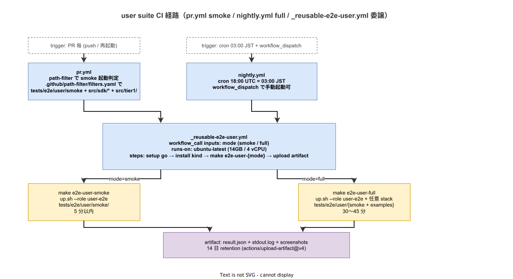

# 04. user suite CI 戦略

本ファイルは ADR-TEST-008 で確定した user suite の CI workflow 構造を実装段階の正典として固定する。`pr.yml` の path-filter 起動 / `nightly.yml` の cron 起動 / `_reusable-e2e-user.yml` の reusable workflow 化 / artifact 保管・通知経路を ID として採番する。

## 本ファイルの位置付け

ADR-TEST-008 で user suite を CI 機械検証経路に乗せることを確定した。本ファイルでは pr.yml / nightly.yml / `_reusable-e2e-user.yml` の役割分担、path-filter 連動、failure 時の通知 / artifact 経路を実装規約として固定する。owner suite が CI 不可で release tag ゲート（ADR-TEST-011）で代替保証する経路と物理的に分離する。



## CI workflow の責務分担

| Workflow | 起動 | 実行内容 | 所要時間予算 |
|---|---|---|---|
| `pr.yml` | PR 毎（push / 再起動） | path-filter で `tests/e2e/user/smoke/` 影響時のみ smoke 実行 | 5 分以内（ADR-TEST-001） |
| `nightly.yml` | cron 03:00 JST + workflow_dispatch | `_reusable-e2e-user.yml` を呼んで full 実行 + ADR-TEST-003 の `_reusable-conformance.yml` 連動 | 30〜45 分（user full）+ 60〜120 分（conformance、月次のみ） |
| `_reusable-e2e-user.yml` | `workflow_call` | inputs（mode = smoke / full、role）に応じた kind 起動 + go test | 5 分（smoke）/ 30〜45 分（full） |

`_reusable-e2e-user.yml` を介することで、pr.yml / nightly.yml / 採用初期の追加 workflow が同一の起動経路を共有する。ADR-CICD-001 の reusable workflow 原則（IMP-CI-RWF-010）と整合する。

## `_reusable-e2e-user.yml` の構造

```yaml
name: _reusable-e2e-user

on:
  workflow_call:
    inputs:
      mode:
        description: "smoke or full"
        required: true
        type: string
      role:
        description: "tools/local-stack/up.sh の --role"
        required: false
        type: string
        default: "user-e2e"
      timeout_minutes:
        required: false
        type: number
        default: 60

permissions:
  contents: read

jobs:
  e2e-user:
    runs-on: ubuntu-latest
    timeout-minutes: ${{ inputs.timeout_minutes }}
    steps:
      - uses: actions/checkout@v4
      - name: setup go
        uses: actions/setup-go@v5
        with:
          go-version-file: tests/e2e/user/go.mod
          cache-dependency-path: tests/e2e/user/go.sum

      - name: install kind
        run: |
          curl -Lo kind https://kind.sigs.k8s.io/dl/v0.23.0/kind-linux-amd64
          chmod +x kind && sudo mv kind /usr/local/bin/

      - name: run e2e
        run: |
          if [ "${{ inputs.mode }}" = "smoke" ]; then
            make e2e-user-smoke
          else
            make e2e-user-full
          fi

      - name: collect artifacts
        if: always()
        uses: actions/upload-artifact@v4
        with:
          name: user-e2e-${{ inputs.mode }}-${{ github.run_id }}
          path: |
            tests/.user-e2e/**
            artifacts/user-e2e/**
          retention-days: 14
```

`make e2e-user-{smoke,full}` を直接呼ぶことで、local 実行と CI 実行で同 shell path を通る（ADR-POL-002 の SoT 原則）。

## pr.yml への統合

PR 毎に user smoke を実行する path-filter 連動は以下。`tests/e2e/user/smoke/` または `src/sdk/<lang>/test-fixtures/` または `src/tier1/` 配下が変更された PR で smoke が起動する。

```yaml
# pr.yml の jobs に追加
e2e-user-smoke:
  needs: [path-filter, lint, unit-test]
  if: needs.path-filter.outputs.user-e2e-smoke == 'true'
  uses: ./.github/workflows/_reusable-e2e-user.yml
  with:
    mode: smoke
    timeout_minutes: 10
```

`path-filter.outputs.user-e2e-smoke` は `.github/path-filter/filters.yaml` で定義する（IMP-CI-PF-031）。filter ルール:

```yaml
# .github/path-filter/filters.yaml
user-e2e-smoke:
  - 'tests/e2e/user/smoke/**'
  - 'src/sdk/go/k1s0/test-fixtures/**'
  - 'src/sdk/rust/test-fixtures/**'
  - 'src/sdk/dotnet/K1s0.Sdk.TestFixtures/**'
  - 'src/sdk/typescript/packages/test-fixtures/**'
  - 'src/tier1/**'
  - 'tools/local-stack/up.sh'
  - 'tools/local-stack/versions.env'
```

PR で smoke を skip する経路（`@skip-smoke` label）は採用初期で必要に応じて整備する。リリース時点では path-filter 連動のみで smoke 実行 / 不実行を判定する。

## nightly.yml への統合

nightly cron で user full + 月次 conformance を実行する構造。

```yaml
# nightly.yml
name: nightly

on:
  schedule:
    - cron: "0 18 * * *"  # 03:00 JST
  workflow_dispatch:
    inputs:
      mode:
        description: "user e2e mode (smoke / full)"
        required: false
        type: string
        default: "full"

permissions:
  contents: read

jobs:
  e2e-user:
    uses: ./.github/workflows/_reusable-e2e-user.yml
    with:
      mode: ${{ inputs.mode || 'full' }}
      timeout_minutes: 60

  conformance:
    # 月次 cron は ADR-TEST-003 の conformance.yml が担うため、
    # nightly.yml では呼ばない（重複実行を避ける）。
    # 将来的に nightly でも conformance subset を走らせる経路は採用初期で検討。
    if: false
    uses: ./.github/workflows/_reusable-conformance.yml
```

## 失敗時の artifact / 通知

CI 失敗時の artifact は `actions/upload-artifact@v4` で 14 日保管。content は go test の result.json + stdout.log + 失敗 Pod の kubectl logs + screenshots（tier3-web 検証時の Playwright 取得分、利用者側 fixtures の責務）。

通知は GitHub の workflow notification（PR コメント / commit status）で行い、SRE / 起案者に Slack 通知する経路は採用初期で `_reusable-notify.yml` 統合時に整備する。リリース時点では GitHub の workflow status のみ。

## 採用初期での拡張

リリース時点では pr.yml smoke + nightly.yml full の 2 経路のみ。採用初期で以下の拡張を整備する。

- `weekly.yml` への user e2e + `@security` tag 統合（OWASP ZAP / DAST 連携の基盤、ADR-TEST-007）
- `_reusable-notify.yml` で Slack / Discord 通知（SRE が PR レビュー外で fail を検出できる経路）
- merge queue 統合（path-filter 連動を merge queue 単位で再評価する経路）
- nightly での conformance subset 連動

## IMP ID

| ID | 内容 | 配置 |
|---|---|---|
| IMP-CI-E2E-009 | _reusable-e2e-user.yml 構造 | 本ファイル |
| IMP-CI-E2E-010 | pr.yml + nightly.yml への統合経路 | 本ファイル |

## 対応 ADR / 関連設計

- ADR-TEST-008（e2e owner / user 二分構造）— CI 経路の起源
- ADR-TEST-001（Test Pyramid）— PR 5 分予算 / nightly 30 分予算の根拠
- ADR-TEST-007（テスト属性タグ + 実行フェーズ分離）— @security tag の採用初期統合
- ADR-CICD-001（Argo CD GitOps）— release tag 連動の前提
- IMP-CI-PF-031（path-filter 単一真実源）— filters.yaml の整合
- IMP-CI-RWF-010（reusable workflow）— `_reusable-e2e-user.yml` の系列
- `03_Makefile_target.md`（同章）— make e2e-user-{smoke,full} の本体
