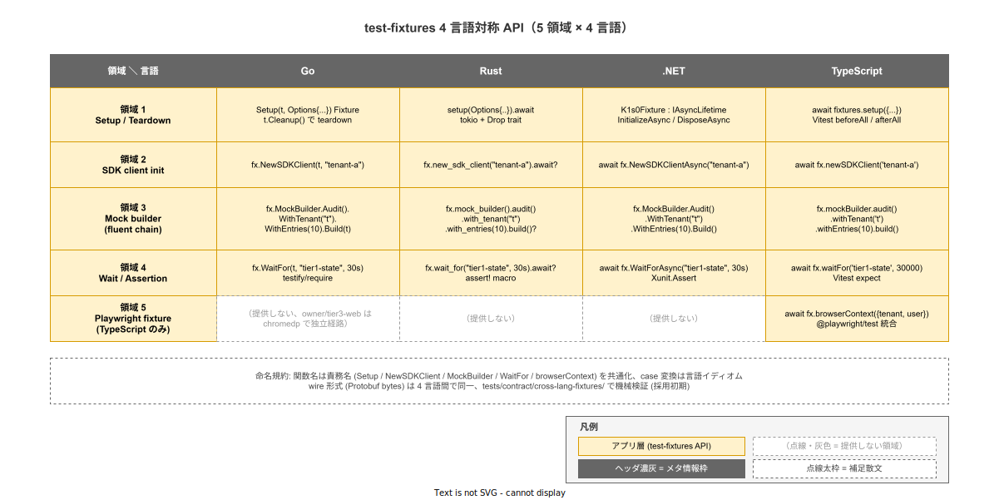

# 01. 4 言語対称 API（test-fixtures）

本ファイルは ADR-TEST-010 で確定した test-fixtures の 4 言語対称 API を実装段階の正典として固定する。Go / Rust / .NET / TypeScript の 4 言語で **同じ責務を覆う API** を提供する設計を、関数命名・引数・戻り値の対称化規約として採番する。

## 本ファイルの位置付け

ADR-TEST-010 で test-fixtures を 4 言語 SDK と同梱することを確定したが、各言語のイディオムが異なる中で **何をもって「対称」とみなすか** が未確定だった。本ファイルでは 5 領域（Setup + Teardown / SDK client init / Mock builder / Wait + Assertion helper / Playwright fixture）の各領域で、関数 / 型の命名と責務を 4 言語対称化する規約を固定する。これにより採用組織の SDK 利用者が「どの言語でも同じ DX で test を書ける」体験を確保する。



## 5 領域の対称規約

### 領域 1: Setup / Teardown

kind cluster 起動 + k1s0 minimum stack install + cleanup。各言語の test framework の lifecycle hook に integrate する。

| 言語 | API 形 | lifecycle hook |
|---|---|---|
| Go | `Setup(t, Options{...}) Fixture` / `fx.Teardown()` | t.Cleanup |
| Rust | `setup(Options{...}).await -> Fixture` / `fx.teardown().await` | tokio test + Drop trait |
| .NET | `K1s0Fixture : IAsyncLifetime` の InitializeAsync / DisposeAsync | xUnit IAsyncLifetime |
| TypeScript | `await fixtures.setup({...})` / `await fixtures.teardown()` | Vitest beforeAll / afterAll |

`Options` の field は 4 言語で同一名（KindNodes / Stack / AddOns / Tenant / Namespace）。型名は言語イディオムに従い PascalCase（Go / .NET / TS）または snake_case（Rust）に正規化する。

### 領域 2: SDK client init

fixture から取得した SDK client は、tier1 facade を呼ぶための認証済 client。tenant context と JWT を fixture が inject する。

| 言語 | API 形 |
|---|---|
| Go | `client := fx.NewSDKClient(t, "tenant-a")` |
| Rust | `let client = fx.new_sdk_client("tenant-a").await?` |
| .NET | `var client = await fx.NewSDKClientAsync("tenant-a")` |
| TypeScript | `const client = await fx.newSDKClient('tenant-a')` |

戻り値は各言語の SDK client 型（既存 `src/sdk/<lang>/k1s0` の client）。fixture は独自 client 型を返さない（SDK 本体の客 API を変えないため）。

### 領域 3: Mock builder（fluent API）

12 service 各 RPC の mock data builder を fluent chain で提供する。生成される data は **言語間で同一の wire 形式**（Protobuf）に揃える。

| 言語 | API 形 |
|---|---|
| Go | `audit := fx.MockBuilder.Audit().WithTenant("test").WithEntries(10).Build(t)` |
| Rust | `let audit = fx.mock_builder().audit().with_tenant("test").with_entries(10).build()?` |
| .NET | `var audit = fx.MockBuilder.Audit().WithTenant("test").WithEntries(10).Build();` |
| TypeScript | `const audit = fx.mockBuilder.audit().withTenant('test').withEntries(10).build();` |

12 service（State / Audit / PubSub / Workflow / Decision / Pii / Feature / Telemetry / Log / Binding / Secret / Invoke）はリリース時点で 3 service 先行（State / Audit / PubSub）、採用初期で +3、運用拡大時で 12 完備（`03_mock_builder段階展開.md` で詳細）。

cross-language の wire 形式整合は `tests/contract/cross-lang-fixtures/` で機械検証する経路を採用初期で整備する（採用初期の課題、リリース時点では skeleton）。

### 領域 4: Wait / Assertion helper

readiness 確認 / metric 値到達待機 / log 出現待機などの helper。言語ごとの assertion library と統合する。

| 言語 | API 形 | assertion library |
|---|---|---|
| Go | `fx.WaitFor(t, "tier1-state", 30*time.Second)` | `testify/require` |
| Rust | `fx.wait_for("tier1-state", Duration::from_secs(30)).await?` | `assert!` macro |
| .NET | `await fx.WaitForAsync("tier1-state", TimeSpan.FromSeconds(30))` | `Xunit.Assert` |
| TypeScript | `await fx.waitFor('tier1-state', 30_000)` | Vitest `expect` |

failure 時のエラーメッセージは 4 言語で共通フォーマット: `[k1s0-test-fixtures] WaitFor "<resource>" timeout after Ns`。これにより 4 言語の test 失敗 log を共通の grep パタンで集計できる。

### 領域 5: Playwright fixture（TypeScript のみ）

tier3 web frontend を Playwright で test する利用者向け。Keycloak OIDC handshake を fixture が肩代わりし、認証済 `BrowserContext` を返す。

```typescript
import { fixtures } from '@k1s0/sdk-test-fixtures';
import { test } from '@playwright/test';

test('tier3-web tenant onboarding', async () => {
  const fx = await fixtures.setup({ stack: 'minimum', addOns: ['workflow'] });
  const browserContext = await fx.browserContext({ tenant: 'tenant-a', user: 'alice' });
  const page = await browserContext.newPage();
  await page.goto('https://k1s0-tier3-web.localhost/dashboard');
  // 利用者の test code
  await fx.teardown();
});
```

owner suite の `tests/e2e/owner/tier3-web/`（Go + chromedp）は本 fixture を使わず独立経路（ADR-TEST-008 §7、ADR-TEST-010 §3 領域 5）。owner と user で同 flow を 2 言語で書く責任分担は ADR-TEST-008 で確定済。

## 命名規約の対称化ルール

| 項目 | 規約 |
|---|---|
| 関数名 | 領域 1〜5 の責務名（Setup / NewSDKClient / MockBuilder / WaitFor / browserContext）を共通化、case 変換は言語イディオム |
| 引数の field 名 | 4 言語で同一（KindNodes, Stack, AddOns, Tenant, Namespace 等） |
| 戻り値の型 | 既存 SDK 型を返す場合は SDK 型を踏襲、fixture 固有型は `Fixture` を 4 言語共通化 |
| エラー型 | 言語イディオム（Go: error、Rust: Result, .NET: Exception, TS: Promise reject）、失敗メッセージ format は共通 |
| 非同期性 | Rust / .NET / TS は async / await、Go は sync（goroutine は内部実装）|

「同じ責務」を「同じ命名」で表現することで、利用者が複数言語で書く時の認知負荷を下げる。

## 4 言語の依存範囲

各言語 fixtures が pull する依存:

| 言語 | 主要依存 |
|---|---|
| Go | `sigs.k8s.io/kind`、`github.com/testcontainers/testcontainers-go`、`github.com/stretchr/testify` |
| Rust | `kind` shell wrap（kind binary を spawn）、`tokio`、`reqwest`（k8s API） |
| .NET | `Testcontainers`（C#）、`Xunit.Abstractions`、`Microsoft.Extensions.Configuration` |
| TypeScript | `testcontainers`（npm）、`@playwright/test`（peerDependency）、`vitest`（peerDependency）|

これらの依存は test target でのみ pull される設計（Go: build tag、Rust: feature、.NET: 別 csproj、TS: 別 package）。SDK 本体の依存 graph には混入しない（ADR-TEST-010 §選択肢 A デメリットの mitigation）。

## API 対称性の維持工数

4 言語で対称な API を維持する工数は、SDK 本体の 4 言語対称性運用と同じ枠で吸収する（ADR-TIER1-001 既存運用）。SDK 本体の API 変更時に test-fixtures も同 PR で 4 言語同時更新するプロセスを採用初期で確立する。

API 対称性の機械検証は採用初期で `tools/qualify/fixture-api-conformance.sh`（新設候補）として整備する。各言語の fixtures が同じ関数名 / 引数 field を export していることを golden file で検証する経路。リリース時点では人手レビューに頼る。

## IMP ID

| ID | 内容 | 配置 |
|---|---|---|
| IMP-CI-E2E-011 | 4 言語 fixtures 対称 API（5 領域 × 4 言語）の命名・引数・戻り値規約 | 本ファイル |

## 対応 ADR / 関連設計

- ADR-TEST-010（test-fixtures 4 言語 SDK 同梱）— 本ファイルの起源
- ADR-TIER1-001（4 言語ハイブリッド）— 4 言語対称性の運用前提
- ADR-TEST-008（e2e owner / user 二分）— Playwright fixture の責務境界
- `02_versioning.md`（同章）— SDK と test-fixtures の version 同期規約
- `03_mock_builder段階展開.md`（同章）— 12 service mock builder の段階拡張
- `src/sdk/{go,rust,dotnet,typescript}/` — SDK 本体（fixtures は同 module / 同 version）
