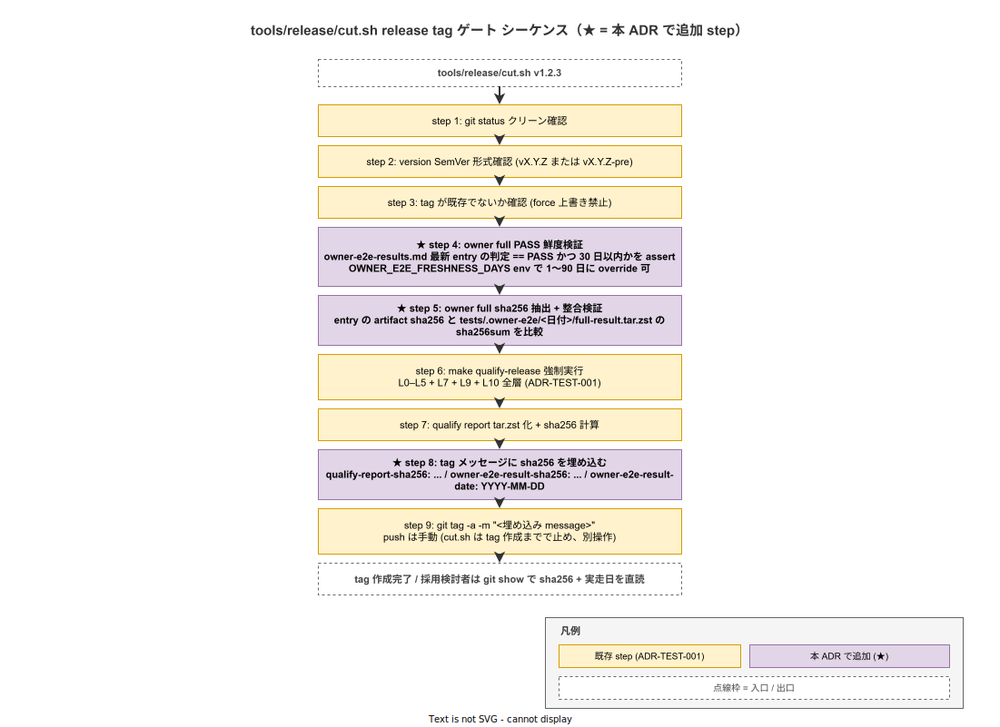

# 01. tools/release/cut.sh の release tag ゲート拡張

本ファイルは ADR-TEST-011 で確定した `tools/release/cut.sh` の改訂仕様を実装段階の正典として固定する。release tag を切る時に owner full e2e の最新 PASS 証跡を必須検証する 2 step（PASS 鮮度検証 + sha256 抽出）と、tag メッセージへの埋め込み形式を ID として採番する。

## 本ファイルの位置付け

ADR-TEST-011 で「release tag = owner full PASS が物理的に紐付く」設計を確定した。本ファイルでは cut.sh の既存処理（ADR-TEST-001 の qualify-release 強制）に owner full PASS 検証を組み込む処理順、`OWNER_E2E_FRESHNESS_DAYS` env による閾値 override、tag メッセージのフォーマット、`--dry-run` 時の挙動を実装規約として固定する。



## cut.sh の改訂後処理順

cut.sh は以下の 9 step で release tag を切る。★ 印が本 ADR で追加する step。

```text
1. git status クリーン確認
2. version SemVer 形式確認
3. tag 既存確認
★ 4. owner full PASS 鮮度検証
★ 5. owner full sha256 抽出
6. make qualify-release 強制実行（既存）
7. qualify report tar.zst 化（既存）
★ 8. tag メッセージに owner full sha256 + qualify report sha256 を埋め込む
9. git tag -a <version> -m "<埋め込み message>"
```

step 4-5 の追加で release tag 切る瞬間に owner full PASS 鮮度が物理的に検証される。step 6 以降は既存実装を踏襲し、本 ADR は step 4-5 + step 8 の改訂のみを担う。

## Step 4: owner full PASS 鮮度検証

`docs/40_運用ライフサイクル/owner-e2e-results.md` の最新 PASS entry を読み、以下を検証する。

```text
読み取り対象: owner-e2e-results.md の最新 ### YYYY-MM-DD entry

検証項目:
1. entry が存在するか（fail: "owner-e2e-results.md に PASS entry がない"）
2. entry の判定 == "PASS" か（fail: "owner full が完全 PASS でない"）
3. entry の日付が現在から N 日以内か（fail: "owner full PASS が古い、再実走必須"）
4. entry に全部位 PASS の記載があるか（fail: "部位 X が PASS でない"）
5. entry に artifact sha256 フィールドが存在するか（fail: "artifact sha256 記載なし"）
```

N（鮮度閾値）の初期値は 30 日。`OWNER_E2E_FRESHNESS_DAYS` env で 1〜90 の範囲で override 可能（範囲外は exit 2）。30 日を選択した根拠は (1) ADR-TEST-008 の不定期実走方針（cron なし）と整合 (2) 月次 release を仮想すると release ごとに 1 回 owner full が走る (3) 31 日超の古い PASS は本番再現性の信頼を失う、の 3 点。

```bash
# cut.sh の step 4 概略
verify_owner_e2e_freshness() {
  local results_md="docs/40_運用ライフサイクル/owner-e2e-results.md"
  local freshness_days="${OWNER_E2E_FRESHNESS_DAYS:-30}"
  
  # 最新 ### YYYY-MM-DD entry を抽出
  local latest_entry_date=$(grep -m1 "^### " "$results_md" | sed 's/^### //')
  
  # 日付差を計算
  local days_diff=$(( ($(date +%s) - $(date -d "$latest_entry_date" +%s)) / 86400 ))
  if [ "$days_diff" -gt "$freshness_days" ]; then
    echo "[error] owner full PASS が ${days_diff} 日前。${freshness_days} 日以内の再実走必須" >&2
    return 1
  fi
  
  # entry の判定 PASS 確認
  if ! grep -A 20 "^### $latest_entry_date" "$results_md" | grep -q "判定: PASS"; then
    echo "[error] owner full 最新 entry が完全 PASS でない" >&2
    return 1
  fi
}
```

実装は `tools/release/cut.sh` 内の shell function として追加し、step 4 で呼び出す。

## Step 5: owner full sha256 抽出 + 整合検証

owner-e2e-results.md の最新 PASS entry に記載された artifact sha256 を抽出し、`tests/.owner-e2e/<YYYY-MM-DD>/full-result.tar.zst` の sha256sum と一致することを検証する。

```bash
extract_and_verify_owner_e2e_sha256() {
  local results_md="docs/40_運用ライフサイクル/owner-e2e-results.md"
  local latest_entry_date=$(grep -m1 "^### " "$results_md" | sed 's/^### //')
  
  # entry から sha256 を抽出
  local recorded_sha256=$(grep -A 20 "^### $latest_entry_date" "$results_md" \
    | grep "^- artifact sha256:" \
    | head -1 \
    | sed 's/^- artifact sha256: //')
  
  if [ -z "$recorded_sha256" ]; then
    echo "[error] owner-e2e-results.md の最新 entry に artifact sha256 記載なし" >&2
    return 1
  fi
  
  # artifact 存在確認
  local artifact_path="tests/.owner-e2e/$latest_entry_date/full-result.tar.zst"
  if [ ! -f "$artifact_path" ]; then
    echo "[error] artifact $artifact_path が存在しない" >&2
    return 1
  fi
  
  # sha256sum 整合確認
  local actual_sha256=$(sha256sum "$artifact_path" | cut -d' ' -f1)
  if [ "$recorded_sha256" != "$actual_sha256" ]; then
    echo "[error] artifact sha256 不整合: 記録=$recorded_sha256 / 実=$actual_sha256" >&2
    return 1
  fi
  
  # 抽出した sha256 を返す（step 8 で使用）
  echo "$recorded_sha256"
}
```

artifact 存在確認 + sha256 整合確認の 2 段階で「結果記録だけ更新して artifact を捏造」を防ぐ。完全な誤魔化し耐性は GPG sign（採用後の運用拡大時で Z 案として追加検討）まで実装しないが、リリース時点では本 2 段階で実用的な耐性を持つ。

## Step 8: tag メッセージへの埋め込み

cut.sh は git tag メッセージに以下のフォーマットで sha256 を埋め込む。

```text
release v1.2.3

qualify-report-sha256: e1c4f2a8b9d3...
owner-e2e-result-sha256: 7a3f9c5e1b2d...
owner-e2e-result-date: 2026-05-15
qualify-mode: full
```

各フィールドは `key: value` 形式で、tag 取得側（採用検討者 / 採用組織 / CI）が `git show <tag>` または `git tag -v <tag>` で簡単に parse できる。tag 公開後、採用組織が「この release は owner full の最新 PASS をどの日付・どの sha256 で検証したか」を tag メッセージから直読できる。

`--dry-run` flag が指定された場合、cut.sh は step 4-5 を skip し、tag メッセージに `qualify-mode: dry-run` を埋め込む。dry-run tag は production tag として扱われない（GitHub release notes で警告表示）。

## エラー時の対応

step 4-5 で fail した場合、cut.sh は exit 1 で release tag 切り中断する。utilizer が以下の 3 経路で対応する。

| エラー | 対応 |
|---|---|
| "owner-e2e-results.md に PASS entry がない" | owner full を実走、PASS 結果を md に記録 |
| "owner full PASS が古い、再実走必須" | owner full を再実走（現在の 30 日以内 entry を作成） |
| "artifact sha256 不整合" | artifact が改ざん / 削除された可能性、再実走 + sha256 再計算 |
| "artifact が存在しない" | git LFS から artifact を pull、または再実走 |

各エラーで cut.sh は具体的な対応手順を STDERR に出力する（`Runbook RB-TEST-OWNER-E2E-FULL.md` の参照リンクを含む）。

## 既存 cut.sh との後方互換

本 ADR の改訂は cut.sh の既存呼び出し形式（`tools/release/cut.sh v1.2.3`）を変えない。step 4-5 は既存処理に追加されるだけで、利用者の使い方は変わらない。

ただし step 4-5 が新規 fail 経路になるため、過去 release を切る経路で使っていた script や CI は本改訂以降「owner full PASS 必須」が新規制約となる。これは ADR-TEST-011 の決定通りで、過去経路の互換は保たれない。

## IMP ID

| ID | 内容 | 配置 |
|---|---|---|
| IMP-CI-E2E-014 | cut.sh の release tag ゲート拡張（step 4-5 + tag メッセージ埋め込み） | 本ファイル |

## 対応 ADR / 関連設計

- ADR-TEST-011（release tag ゲート代替保証）— 本ファイルの起源
- ADR-TEST-008（owner full CI 不可）— 代替保証の必要根拠
- ADR-TEST-001（qualify-release 強制）— 既存 cut.sh の起源
- `02_artifact_保管.md`（同章）— artifact 保管経路
- `03_owner_e2e_results_template.md`（同章）— md entry のフィールド規約
- `tools/release/cut.sh` — 実装本体
