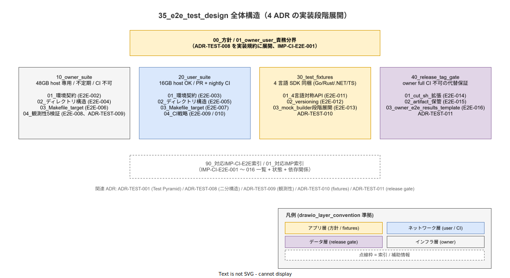

# 35. e2e テスト設計

本章は k1s0 の e2e テストを実装段階の正典として固定する。構想設計 ADR-TEST-008（e2e owner / user 二分構造）/ ADR-TEST-009（観測性 E2E 5 検証 owner only）/ ADR-TEST-010（test-fixtures 4 言語 SDK 同梱）/ ADR-TEST-011（release tag ゲート代替保証）の 4 本で確定した決定を、ディレクトリ配置・Makefile target・CI workflow・SDK 同梱規約・release tag ゲート機構に落とし込む。

## 本章の位置付け

e2e テストは Test Pyramid（ADR-TEST-001）の最上位層で、tier1→2→3 の業務フロー貫通を機械検証する責務を持つ。同時に「OSS 完成度を検証するオーナー視点」と「自分のアプリが k1s0 で動くかを確認する利用者視点」は要求する fidelity と host RAM が質的に異なるため、本章では `tests/e2e/owner/`（48GB host 専用、本番再現フルスタック、CI 不可）と `tests/e2e/user/`（16GB host OK、kind + minimum stack、PR + nightly CI 可）の 2 系統に物理分離した実装規約を確定する。

owner 側の本番再現スタック（multipass × 5 + kubeadm 3CP HA + Cilium + Longhorn + MetalLB + フルスタック）は GitHub Actions runner で動作不能（nested virtualization 不可）であり、CI 機械検証の射程外となる。代替保証は `tools/release/cut.sh` の release tag ゲート（ADR-TEST-011）で行い、release tag を切る決定的瞬間に owner full PASS sha256 を物理的に紐付ける。本章 §40 でこの機構を実装規約として展開する。

利用者側は k1s0 SDK を採用する開発者の DX を破壊しないため、4 言語 SDK（Go / Rust / .NET / TypeScript）と同 module / 同 version で `test-fixtures` を同梱する設計を採用する（ADR-TEST-010）。本章 §30 でこの 4 言語対称 API を実装規約として確定する。



## 節構成

```text
35_e2e_test_design/
├── README.md                                  ← 本ファイル（章索引）
├── 00_方針/
│   └── 01_owner_user_責務分界.md              ← ADR-TEST-008 を実装規約に展開
├── 10_owner_suite/
│   ├── 01_環境契約.md                         ← multipass / kubeadm / Cilium / Longhorn / MetalLB / フルスタック
│   ├── 02_ディレクトリ構造.md                 ← tests/e2e/owner/ 8 部位 + go.mod
│   ├── 03_Makefile_target.md                  ← make e2e-owner-* 8 target
│   └── 04_観測性5検証.md                      ← ADR-TEST-009 の 5 検証実装規約
├── 20_user_suite/
│   ├── 01_環境契約.md                         ← kind + minimum stack
│   ├── 02_ディレクトリ構造.md                 ← tests/e2e/user/ + go.mod
│   ├── 03_Makefile_target.md                  ← make e2e-user-{smoke, full}
│   └── 04_CI戦略.md                           ← _reusable-e2e-user.yml + pr.yml + nightly.yml
├── 30_test_fixtures/
│   ├── 01_4言語対称API.md                     ← ADR-TEST-010 の 5 領域 API を 4 言語別に展開
│   ├── 02_versioning.md                       ← SDK と同 module / 同 version の運用規約
│   └── 03_mock_builder段階展開.md             ← 3 → 6 → 12 service の段階展開規約
├── 40_release_tag_gate/
│   ├── 01_cut_sh_拡張.md                      ← ADR-TEST-011 の cut.sh 改訂仕様
│   ├── 02_artifact_保管.md                    ← tests/.owner-e2e/ の git LFS 12 ヶ月管理
│   └── 03_owner_e2e_results_template.md       ← owner-e2e-results.md の entry template
├── 90_対応IMP-CI-E2E索引/
│   └── 01_対応IMP索引.md                      ← IMP-CI-E2E-001〜* 一覧
└── img/                                        ← drawio + svg
```

各節は 300 行未満を維持し、超過時は番号付きサブファイルに分割する（`docs-design-spec` 規約）。

## IMP ID 予約

本章で採番する実装 ID は **IMP-CI-E2E-\***（予約範囲: IMP-CI-E2E-001 〜 IMP-CI-E2E-099）。新規 ID は `90_対応IMP-CI-E2E索引/01_対応IMP索引.md` に集約し、欠番を避けて連番採番する。

## 対応 ADR / 概要設計 ID / NFR

- ADR:
  - [ADR-TEST-001](../../../02_構想設計/adr/ADR-TEST-001-test-pyramid-and-testcontainers.md)（Test Pyramid + testcontainers）— 本章は L4 の実装規約を担う
  - [ADR-TEST-008](../../../02_構想設計/adr/ADR-TEST-008-e2e-owner-user-bisection.md)（owner / user 二分構造）— 本章 §00 / 10 / 20 の起源
  - [ADR-TEST-009](../../../02_構想設計/adr/ADR-TEST-009-observability-e2e-five-checks-owner-only.md)（観測性 E2E 5 検証）— 本章 §10/04 の起源
  - [ADR-TEST-010](../../../02_構想設計/adr/ADR-TEST-010-test-fixtures-sdk-bundled.md)（test-fixtures SDK 同梱）— 本章 §30 の起源
  - [ADR-TEST-011](../../../02_構想設計/adr/ADR-TEST-011-release-tag-gate-as-owner-e2e-alternative.md)（release tag ゲート代替保証）— 本章 §40 の起源
  - [ADR-INFRA-001](../../../02_構想設計/adr/ADR-INFRA-001-kubeadm-cluster-api.md)（kubeadm + Cluster API）— owner 環境の本番再現基盤
  - [ADR-NET-001](../../../02_構想設計/adr/ADR-NET-001-cni-selection.md)（CNI 選定）— owner = Cilium / user = Calico の根拠
  - [ADR-POL-002](../../../02_構想設計/adr/ADR-POL-002-local-stack-single-source-of-truth.md)（local-stack を構成 SoT に統一）— `--role` 引数経路の SoT 拡張
- DS-SW-COMP: DS-SW-COMP-135（CI/CD 配信系）/ DS-DEVX-TEST-006（Playwright）/ DS-DEVX-TEST-007（k6）
- NFR: NFR-A-CONT-001（HA / RTO）/ NFR-B-PERF-001〜007（SLI 定義、観測性 5 検証経由）/ NFR-C-NOP-001〜003（Runbook 連動）/ NFR-E-RSK-002（ペネトレーション、@security tag 経路）/ DX-TEST-001〜008（テスト戦略）

## RACI

| 役割 | 責務 |
|---|---|
| Platform/Build（主担当 / A） | tools/local-stack/up.sh の `--role` 拡張、Makefile target、reusable workflow、cut.sh 改訂 |
| SRE（共担当 / B） | owner full の不定期実走、owner-e2e-results.md の更新、artifact 保管 |
| DX（共担当 / C） | test-fixtures 4 言語 API 対称性、Golden Path examples の test 追記 |
| Security（共担当 / D） | @security tag のテスト整備、release tag ゲートの artifact 検証 |

## 関連章

- [`../../00_ディレクトリ設計/70_共通資産/02_tests配置.md`](../../00_ディレクトリ設計/70_共通資産/02_tests配置.md) — tests/ 配下全体の配置正典、本章は tests/e2e/ を担う
- [`../30_quality_gate/02_test_layer_responsibility.md`](../30_quality_gate/02_test_layer_responsibility.md) — L4 / L5 責務分界、本章は L4 の実装詳細
- [`../10_reusable_workflow/01_reusable_workflow設計.md`](../10_reusable_workflow/01_reusable_workflow設計.md) — `_reusable-e2e-user.yml` を本章 §20/04 で展開
- [`../60_ローカル開発ツール/`](../60_ローカル開発ツール/) — `tools/local-stack/up.sh --role` の本体実装
- [`../../70_リリース設計/`](../../70_リリース設計/) — `tools/release/cut.sh` の本体実装、本章 §40 で改訂仕様を展開
- [`../../40_SDK設計/`](../../40_SDK設計/) — 4 言語 SDK の配置、本章 §30 で test-fixtures 同梱規約を展開
