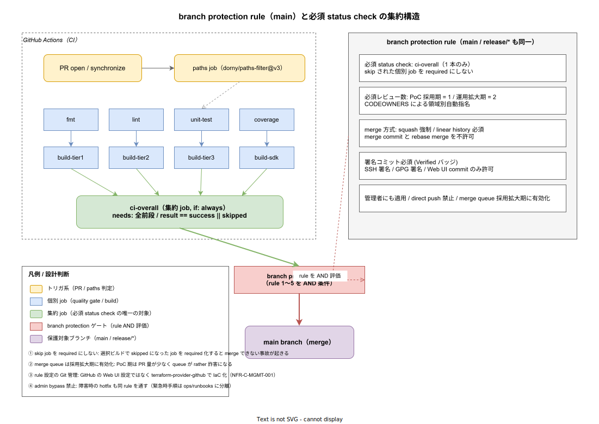

# 01. branch protection rule（main / release/*）

本ファイルは GitHub の branch protection rule を実装段階の確定版として固定する。CI 上で 4 段の quality gate（IMP-CI-QG-060〜067）と path-filter 選択ビルド（IMP-CI-PF-030〜037）を整えても、PR が main / release ブランチに merge される最終ゲートが緩いと、品質基盤を回避した変更が本番に届く。本ファイルでは「必須 status check」「必須レビュー」「merge 方式」「署名コミット」「管理者にも適用」の 5 つの rule を定義し、これらが AND 条件で評価される構造を確定する。



20 path-filter 章で「集約 job `ci-overall` 1 本のみを必須 status check とする」運用を確定させ、30 quality_gate 章で「`ci-overall` の前段で 4 ゲートを並列実行する」を確定させた。本章はその上流確定を受けて、GitHub 側 branch protection rule の具体的な設定値と Git 管理（terraform-provider-github）方式を規定する。

## なぜ「集約 job 1 本」を必須 status check にするのか

GitHub branch protection の「Required status checks」リストに個別 job 名（例: `build-tier1`、`unit-test-rust`）を直接登録すると、選択ビルド（IMP-CI-PF-032）で skip された job が `required` のまま「実行されていない」状態になり、PR 著者は永遠に merge できない。これは典型的な「要求とゲートの不整合」事故で、過去の OSS プロジェクトでも頻繁に発生する。

本章では `ci-overall` 1 本のみを必須化し、`ci-overall` の内部で「skip された前段は success と同等扱い（fmt 失敗起因の連鎖 skip は除く）」を判定する責務を集約する。これにより、選択ビルドの拡張（新 tier / 新言語追加）で `required` リストを毎回 GitHub 設定で更新する運用が消え、PR 設定を Git 管理（IaC）するだけで完結する。

集約 job の判定ロジックは `tools/ci/jobs/ci-overall.sh` で 1 本化し、テストケースを `tests/ci/ci-overall/` に置く（path-filter golden test と同等扱い）。

## 5 つの rule

branch protection rule は 5 種を main と `release/*` の両方に同一適用する。

### rule 1: 必須 status check

- **対象**: `ci-overall` 1 本のみ
- **strict mode**: 有効化（PR ブランチが main の最新 commit を含む状態でのみ merge 可）
- **意図**: skip 個別 job を required にしないことで、選択ビルド設計と整合する。strict mode 有効化は「main に新 commit が入った時、その commit 上で再度 CI を回さない限り merge できない」を保証し、merge 後の壊れた main を防ぐ

### rule 2: 必須レビュー数

- **PoC 採用期**: 1 名
- **運用拡大期**: 2 名（うち 1 名は CODEOWNERS）
- **dismiss stale review**: PR 更新で再レビュー必須
- **意図**: 1 名は OSS 公開時の現実的な運営人数。採用拡大時は組織側でレビュー文化が成熟する想定で 2 名に上げる。閾値変更は ADR 起票必須

`.github/CODEOWNERS` で領域別に自動指名する。`src/tier1/` → @platform-build, `src/contracts/` → @api-design, `infra/` → @sre などの担当を明記する。

### rule 3: merge 方式

- **squash merge のみ許可**: merge commit / rebase merge は無効化
- **linear history**: 必須
- **意図**: PR 単位の論理 commit 1 個に集約し、`git log main` から「機能・修正の単位」を 1 行で読み取れる状態を保つ。これは IMP-DOC-RTRACE（要件→PR→commit のトレース）が成立する前提

squash 時の commit message テンプレートは `.github/pull_request_template.md` に基づき、`{type}({scope}): {summary} (#{pr-number})` 形式で固定する（後段 95_DXメトリクス 章で集計対象）。

### rule 4: 署名コミット

- **Verified バッジ**: 必須
- **許可形式**: SSH 署名 / GPG 署名 / GitHub Web UI 上の commit
- **意図**: ADR-DEVEX-* 系列で「contributor identity の物理保証」を要件化済（`85_Identity設計/` で詳細化）。署名なし commit は CI 段階で `git verify-commit` 失敗で reject

contributor 向けの SSH 署名セットアップは `docs/05_実装/85_Identity設計/` 配下に runbook を配置（後段で執筆）。OSS 公開直後の障壁を下げるため、Web UI からの commit / suggestion accept は許容する。

### rule 5: 管理者にも適用 / direct push 禁止

- **Include administrators**: 有効化
- **direct push to main**: 全 contributor 禁止（管理者含む）
- **意図**: 管理者 bypass を許すと「緊急 hotfix」を理由に rule を回避する文化が根付き、品質基盤が形骸化する。緊急時手順は `ops/runbooks/incident-hotfix.md`（後段執筆）に分離し、必ず PR 経由で fast-track する手順とする

`merge queue` は採用拡大期に有効化する。PoC 期は 1 日数 PR 程度で queue が「実装の rather 詐害」になるため。採用拡大時に PR 量が `> 50/day` を超えた段階で有効化を ADR 起票して切り替える。

## terraform-provider-github での Git 管理

branch protection rule は GitHub Web UI で手動設定すると変更履歴が残らず、いつ・誰が・何を変えたかが不明になる。本章では `infra/github/` に terraform 構成を置き、`terraform-provider-github` で rule を IaC 化する（NFR-C-MGMT-001）。

```hcl
# infra/github/branch_protection.tf（抜粋）
resource "github_branch_protection" "main" {
  repository_id = github_repository.k1s0.node_id
  pattern       = "main"

  required_status_checks {
    strict   = true
    contexts = ["ci-overall"]
  }

  required_pull_request_reviews {
    dismiss_stale_reviews           = true
    require_code_owner_reviews      = true
    required_approving_review_count = var.review_count_main # 1 (PoC) → 2 (拡大期)
  }

  required_linear_history = true
  require_signed_commits  = true
  enforce_admins          = true
  allows_deletions        = false
  allows_force_pushes     = false

  required_conversation_resolution = true
}

resource "github_branch_protection" "release" {
  repository_id = github_repository.k1s0.node_id
  pattern       = "release/*"
  # main と同一設定
  ...
}
```

`var.review_count_main` のような変数は `terraform.tfvars` で環境（PoC / 採用拡大）に応じて切替え、変更時は ADR で承認を経る。terraform 自体の apply は `tools/ci/jobs/tf-apply.sh` を経て CI 上で実行し、PR レビュー前に plan 差分を表示する。

## merge queue（採用拡大期）

採用拡大時に PR 量が増加した時点で merge queue を有効化する。merge queue は「並列 merge 候補をキュー化し、各候補で CI を順次走らせて緑なら merge する」機構で、`ci-overall` を「キュー上の commit でも実行する」設定が必要になる。

```hcl
# 採用拡大期に追加
resource "github_branch_protection" "main" {
  ...
  required_status_checks {
    strict   = true
    contexts = ["ci-overall"]
  }
  # merge queue 有効化
  required_status_checks {
    strict        = false  # queue 中は strict 不要（queue が main 同期を担う）
    contexts      = ["ci-overall"]
  }
}
```

merge queue の有効化は GitHub 機能上「個別 status check が queue 内 commit で実行される」ため、`ci-overall` 設計が「queue commit でも動く（main の最新を含まない状態でも判定できる）」を満たす必要がある。本章の集約 job 1 本構造はこれを満たす。

## status check の名前変更耐性

GitHub の必須 status check は「context name の文字列一致」で判定する。`ci-overall` を将来 `ci-final-gate` に rename するような変更は、merge 不可状態を招く。本章では以下の運用に固定する。

- **集約 job 名は不変**: `ci-overall` を rename する PR は禁止。どうしても変える必要が出たら、新名 job を追加して両者並行で動かし、両者が `ci-overall` の必須リストに入った段階で旧名を外す 3 段 PR で対応する
- **terraform plan で diff を可視化**: `contexts = ["ci-overall"]` の変更は terraform plan で必ず可視化されるため、見逃し防止になる

## release/* ブランチの扱い

`release/v1.x` のようなリリースブランチは main と同一の rule を適用する。これは hotfix 経路でも品質基盤を通すためで、リリース済バージョンへの patch を main 経由でない PR で当てるシナリオ（cherry-pick PR）でも 5 rule が必ず効く。

リリースブランチ作成自体は `tools/release/cut-release-branch.sh`（後段 70_リリース設計 章）が担い、作成時に terraform-provider-github の動的 import で rule を即時適用する。

## 例外運用とその限界

5 rule の例外を 1 つでも認めると、品質基盤全体が形骸化する。本章では **例外を一切認めない**。緊急時の hotfix も以下の手順で 5 rule を全て通す。

- branch を `hotfix/{issue-id}` で切り、PR を fast-track（reviewer に slack で個別依頼）
- ci-overall を緑にする（quality gate / build / test を skip しない）
- レビュー 1 名（PoC 期）で merge

ci-overall を緑化する CI 時間（採用初期 20 分）が許容できないインシデントの場合は、別途用意する `ops/runbooks/incident-rollback.md`（後段執筆）でロールバック手順を記述し、ロールバック自体は本章の rule を通る PR で行う。

## 対応 IMP-CI ID

- `IMP-CI-BP-070` : 必須 status check は `ci-overall` 1 本のみ（個別 job 不可）
- `IMP-CI-BP-071` : strict mode 有効化（main 最新 commit を含む状態でのみ merge）
- `IMP-CI-BP-072` : 必須レビュー数（PoC 1 / 拡大期 2）と CODEOWNERS 自動指名
- `IMP-CI-BP-073` : squash merge 強制 / linear history 必須
- `IMP-CI-BP-074` : 署名コミット必須（SSH / GPG / Web UI）
- `IMP-CI-BP-075` : 管理者にも適用 / direct push 禁止 / merge queue は採用拡大期
- `IMP-CI-BP-076` : terraform-provider-github による rule の Git 管理（IaC 化）
- `IMP-CI-BP-077` : `release/*` ブランチに main と同一 rule を適用

## 対応 ADR / DS-SW-COMP / NFR

- ADR-CICD-001（Argo CD 採用 / GitHub Actions 前提）
- ADR-DIR-003（スパースチェックアウト / `infra/github/` の cone 配置）
- DS-SW-COMP-135（CI/CD 配信系 / ガバナンス層）
- NFR-C-MGMT-001（設定 Git 管理：rule の IaC 化）
- NFR-C-NOP-004（ビルド時間：必須 status check 集約による merge 遅延の最小化）
- NFR-H-INT-001（Cosign 署名連携 / 署名コミット必須）
- NFR-E-MON-004（Flag/Decision 変更監査：rule 変更も terraform 履歴で監査可能）
