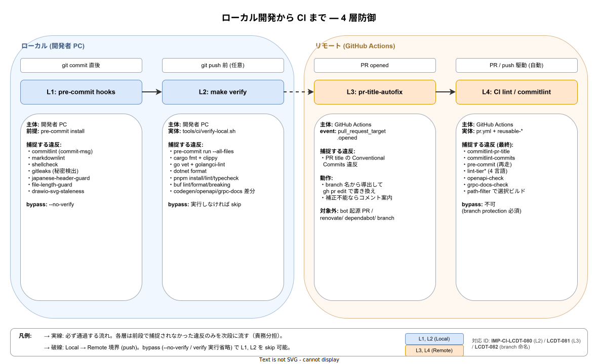

# ローカル検査と PR メタデータ自動補正設計（IMP-CI-LCDT-080〜082）

本章は、CI に到達する前に開発者の手元で違反を検出し、PR 作成時には title を Conventional Commits 形式に自動補正する「多層防御」を規定する。過去に PR #838 では 8 ジョブが同時に fail し、復旧のたびに force push と再 CI を要する状況が発生した。CI は最後の砦として残しつつ、**コスト・時間・心理的負荷の最も低い段階で違反を捕捉する**ことを設計目標とする。本章を読めば、新規参加者が「commit する前に何が走るか」「push する前に何を確認すべきか」「PR を立てた瞬間に何が自動で起きるか」を独立して理解できる。

## 1. 本章の位置付け

本章は CI/CD 設計の中で、**runner 上ではなく開発者ローカルおよび GitHub PR 作成時点**で走る検査・補正を扱う。runner 上で動く reusable workflow（[`10_reusable_workflow`](../10_reusable_workflow/01_reusable_workflow設計.md)）、4 段品質ゲート（[`30_quality_gate`](../30_quality_gate/01_quality_gate.md)）、branch protection（[`50_branch_protection`](../50_branch_protection/01_branch_protection.md)）が「失敗を見逃さない」役割を担うのに対し、本章は「失敗を CI に持ち込まない」予防側を担う。両者を組み合わせて、CI/CD 原則（[`00_方針/01_CI_CD原則.md`](../00_方針/01_CI_CD原則.md)）の「fail-fast」と「無駄な runner 時間を生まない」の双方を満たす。

## 2. 解決する問題

PR 単位で観測された失敗パターンを 3 系統に分類すると、それぞれを最も安く捕捉できる場所は本来異なる。にもかかわらず、ローカル側の整備が薄かった結果、すべてが CI で初検出されていた。

| 失敗系統 | 例 | 最適捕捉点 | 旧状態の問題 |
|----------|----|------------|-------------|
| コミットメッセージ違反 | type prefix 欠落、subject の case 違反 | commit-msg hook | `pre-commit install` 未実行で素通り |
| 静的解析違反 | go vet / dotnet format / pnpm install の失敗 | push 前の orchestrator | ローカル一括実行手段が無く、言語ごとに人手で叩く必要 |
| 生成物未更新 | OpenAPI / gRPC docs の差分 | push 前の orchestrator | `make codegen` の実行忘れが CI で初発覚 |

旧状態では PR 作成のたびに最後の段（CI）で全件まとめて検出され、修正→push→CI→修正のサイクルを 3〜5 回繰り返す事象が常態化していた。本章の仕組みは、**この 3 系統それぞれに専用のローカル捕捉点**を設けることで、CI 到達時には残るのが 1〜2 件のレアケースのみとなる状態を目指す。

## 3. 多層防御の全体構造

防御は時系列で 4 層に分かれる。図中の各層は **責務が異なる**（同じ違反種別を二重に検出するのではなく、捕捉できなかった違反だけが次層に流れる）。最下流の CI 層は branch protection の必須 status check として最終ゲートを担う。



各層の責務と捕捉対象は以下のとおり。

| 層 | 実行タイミング | 実行主体 | 主な捕捉対象 | バイパス可否 |
|----|----------------|----------|--------------|--------------|
| L1: pre-commit hooks | `git commit` 時 | 開発者 PC | commit-msg / 改行 / lint 軽量 | `--no-verify` で可能 |
| L2: make verify | `git push` 前（任意） | 開発者 PC | 全言語 lint / 生成物差分 / pre-commit 全件 | 実行しなければ skip |
| L3: pr-title-autofix | PR open 時 | GitHub Actions | PR title の Conventional Commits 違反 | bot / 不明 branch 名は自動補正対象外 |
| L4: CI lint / commitlint / openapi-check | PR 駆動 + push 駆動 | GitHub Actions | 上 3 層が捕捉できなかった残り全部 | branch protection で必須化、bypass 不可 |

L1 と L2 はあくまで**任意の予防策**であり、強制力は持たない。これは「ローカル環境を破壊しない」「即時 commit を許す」を優先するためで、強制ゲートはあくまで L4 が担う。L3 だけは GitHub 側で動くため強制力を持つが、書き込み権限を最小化し PR コードの checkout を行わない安全設計（後述）で副作用を抑える。

## 4. 第 1 層: コミット時の pre-commit hooks

`git commit` を契機に [`pre-commit`](https://pre-commit.com/) フレームワークが走り、commit を物理的にブロックすることで違反を捕捉する。設定は [`.pre-commit-config.yaml`](../../../../.pre-commit-config.yaml) を正典とする。導入は `pip install pre-commit && pre-commit install` の 2 コマンドで完了し、`default_install_hook_types: [pre-commit, commit-msg, pre-push]` の設定により 3 種すべての hook stage が同時に有効化される。

主要な hook を整理すると以下の通り。

| stage | hook 群 | 役割 |
|-------|---------|------|
| pre-commit | trailing-whitespace / end-of-file-fixer / check-yaml / check-json / markdownlint-cli2 / shellcheck / japanese-header-guard / file-length-guard / link-check / drawio-svg-staleness | 構文・スタイル・規約の物理ブロック |
| commit-msg | commitlint | Conventional Commits 形式の検証（type / scope / subject-case / 72 文字） |
| pre-push | （現状未割当） | 将来 `make verify-quick` を任意で接続する余地 |

pre-commit の弱点は **`pre-commit install` を行わないと一切走らない**ことにある。新規参加者がこの 1 コマンドを忘れると、commit-msg 違反が L4 まで素通りする。これを補完するため、CI 側の [`_reusable-precommit.yml`](../../../../.github/workflows/_reusable-precommit.yml) が `pre-commit run --all-files` を再実行し、ローカル skip を許さない二重防御としている（IMP-CI-008）。

## 5. 第 2 層: push 前の `make verify` / `make verify-quick`

L1 が「commit 単位の軽量検査」なのに対し、L2 は「**push 単位の重量検査**」を担う。reusable workflow が CI で走らせる検査一式と等価なものをローカルで一括実行する orchestrator を [`tools/ci/verify-local.sh`](../../../../tools/ci/verify-local.sh) として持ち、Makefile 経由で呼び出す。

target は 2 種ある。

| target | 対象 | 用途 |
|--------|------|------|
| `make verify` | 全 tier / 全言語 | 大型変更後の最終ゲート（push 前） |
| `make verify-quick` | `origin/main` との差分スコープのみ | 小規模イテレーション中の高速確認 |

`verify-quick` は `git diff --name-only origin/main...HEAD` で変更ファイルを取り、拡張子と path から「rust / go / dotnet / node / proto / docs / codegen」7 スコープのいずれが影響するかを判定する。`src/contracts/` 変更時は path-filter ([`tools/ci/path-filter.yaml`](../../../../tools/ci/path-filter.yaml)) と同じく**全 SDK と tier1 を波及対象**にする規約を共有する。

orchestrator の設計上の特徴は以下 3 点。

- **toolchain 未導入は SKIP として扱い fail させない**。Rust だけ、Go だけ等の役別 sparse-checkout 環境で `make verify` を素直に実行できる（IMP-DEV-DC 系列の役別 DevContainer と整合）。
- **`K1S0_VERIFY_SKIP=rust,go,...` で個別 skip 可能**。toolchain は入っているが意図的に飛ばしたい時のエスケープハッチ。
- **Rust workspace member の二重実行を回避**。祖先方向に Cargo.toml を辿り、workspace 配下の member crate は親 workspace から一括 fmt/clippy で扱う。`examples/` 配下の単独 crate（workspace 親を持たない）も自動で拾う。

実装詳細・全 step 一覧・終了コードは `tools/ci/verify-local.sh` の冒頭コメントを正典とし、本書では論理レベルにとどめる。

## 6. 第 3 層: PR open 時の title 自動補正

L1 と L2 は開発者の自発的実行に依存する。L3 はそれらをすべて skip された場合の最後のローカル系防御として、**PR を open した瞬間に GitHub Actions 側で title を補正する**。実装は [`.github/workflows/pr-title-autofix.yml`](../../../../.github/workflows/pr-title-autofix.yml)。

判定と補正のロジックは次の順で動く。

1. PR title が Conventional Commits 形式（`<type>(<scope>)?!?: <subject>`）に合致するか正規表現で確認。合致すれば no-op。
2. 合致しない場合、branch 名から `<type>/<scope>/<subject>` または `<type>/<subject>` パターンを抽出。
3. 抽出できれば `<type>(<scope>): <subject>` 形式に組み立てて `gh pr edit` で書き換え、補正した旨をコメントで残す。
4. 抽出できない（branch 名が type prefix を持たない、あるいは scope が enum 外）なら、**title は触らずに**形式案内コメントだけ残し、commitlint job の判断に委ねる。

scope の妥当性は [`commitlint.config.js`](../../../../commitlint.config.js) の `scope-enum` と一致する場合のみ採用する。enum 外の文字列を branch に含めても自動補正は scope を捨てて `<type>: <subject>` に fallback する。これは「不正な scope を生成して別 CI を落とす」事故の予防策である。

安全側の設計として、以下を厳守する。

- `pull_request_target.opened` のみで発火させ、`edited` / `synchronize` では再発火しない。これにより**自動補正→commitlint 再実行→補正→...のループ**を起こさず、ユーザの手動編集も上書きしない。
- bot 起源 PR (`github.event.pull_request.user.type == 'Bot'`) と `renovate/` `dependabot/` 命名 branch は対象外。これら依存更新ツールは独自規則で title を生成するため、自動補正が不正な scope を作る危険がある。
- `pull_request_target` の書き込み権限を持つが、PR ブランチのコードは一切 checkout しない。これにより fork PR からのコード実行リスクをゼロにしている（GitHub のセキュリティガイダンス準拠）。

## 7. branch 命名規約（自動補正の前提）

L3 の自動補正は **branch 名を入力源**にする。すなわち、branch 名が規約に従っている時のみ title が自動で完成する。規約は次のとおり。

```text
<type>/<scope>/<subject>     例: feat/tools/add-verify-target
<type>/<subject>             例: fix/openapi-stale-detection
```

- `<type>` は [`commitlint.config.js`](../../../../commitlint.config.js) の `type-enum`（feat / fix / docs / style / refactor / perf / test / build / ci / chore / revert）と完全一致。
- `<scope>` は同 `scope-enum`（contracts / sdk-{dotnet,go,rust,typescript} / tier1-{go,rust} / tier2 / tier3-{web,native,bff,legacy} / platform / infra / deploy / ops / tools / docs / tests / security / deps / release）と一致する場合のみ採用。
- `<subject>` はハイフン区切りの英小文字を推奨。自動補正時は `-` を空白に置換して subject 化する。
- 上記パターンに合致しない branch 名（例: `remake`、`my-experiment`）は自動補正の対象外。L3 はコメントで案内のみ残し、L4 の commitlint で title 違反として落ちる。

この規約は**強制ではない**（branch 命名を強制するワークフロー / ルールセットは導入していない）。守れば自動補正の恩恵を受けられる、というインセンティブ設計とする。

## 8. 第 4 層: CI 側の最終ゲート

L1〜L3 が捕捉できなかった違反は、最終的に [`.github/workflows/pr.yml`](../../../../.github/workflows/pr.yml) と reusable workflow 群が検出する。本章の責務範囲外（既存の [`30_quality_gate`](../30_quality_gate/01_quality_gate.md) と [`50_branch_protection`](../50_branch_protection/01_branch_protection.md) を参照）だが、L1〜L3 との関係を整理する観点で 1 段だけ要約する。

| CI ジョブ | L1〜L3 のいずれが捕捉すべきか | CI で再検証する理由 |
|-----------|-------------------------------|---------------------|
| commitlint-pr-title | L3 が PR title を補正 | 補正対象外 branch 名 / 不正 type の最終確認 |
| commitlint-commits | L1 (commit-msg hook) | hook skip / 直接 push の検出 |
| pre-commit | L1 (pre-commit hook) | hook skip / 直接 push の検出 |
| lint-tier* / openapi-check | L2 (`make verify`) | `make verify` 未実行・SKIP 環境の最終確認 |

CI を「最後の砦」として残すのは、**ローカル環境の差異 / 故意の bypass / 新規参加者の未設定**いずれの理由でも上層の防御が機能しなかった場合に必ず止めるためである。L1〜L3 が機能していれば CI は素通りで終わるのが理想形。

## 9. 制約・既知の限界

| 制約 | 影響 | 緩和策 |
|------|------|--------|
| L1〜L2 は開発者の自発的実行に依存 | hook 未インストール時は完全 skip | 新規参加 onboarding で `pre-commit install` を必須化（IMP-DEV-ONB 系列で扱う） |
| L3 は `opened` のみで発火 | PR 作成後の title 手動編集はチェックされない | edited 検出は loop 防止のため意図的に外している。手動編集の妥当性は L4 commitlint-pr-title で担保 |
| L3 は branch 名から導出するため、命名規約違反 PR は補正不能 | コメント案内のみ、L4 で fail | 規約違反者に責任を残す設計（自動推測で誤った type を付けない方が安全） |
| commitlint の `subject-case` ルールが日本語 subject と相性が悪い | mixed-case 日本語 subject で稀に false positive | PR #839 で観測。`subject-case` を warning 化する是非は別途 [`commitlint.config.js`](../../../../commitlint.config.js) の改訂で扱う |

## 10. 対応 IMP-CI ID

- **IMP-CI-LCDT-080**: ローカル検査 orchestrator（`make verify` / `verify-quick` / `tools/ci/verify-local.sh`）
- **IMP-CI-LCDT-081**: PR title 自動補正 workflow（`.github/workflows/pr-title-autofix.yml`）
- **IMP-CI-LCDT-082**: branch 命名規約（自動補正の入力源、`<type>/<scope>/<subject>` 形式）

採番表は [`90_対応IMP-CI索引/01_対応IMP-CI索引.md`](../90_対応IMP-CI索引/01_対応IMP-CI索引.md) に登録。LCDT 接頭辞は本章で新規開設した（番号レンジ 080〜089）。

## 11. 対応 ADR / 関連設計

- **CI/CD 原則**: [`00_方針/01_CI_CD原則.md`](../00_方針/01_CI_CD原則.md)（fail-fast / runner 時間最小化が本章の動機）
- **品質ゲート**: [`30_quality_gate/01_quality_gate.md`](../30_quality_gate/01_quality_gate.md)（L4 側の正典）
- **Branch protection**: [`50_branch_protection/01_branch_protection.md`](../50_branch_protection/01_branch_protection.md)（L4 の必須 status check 規定）
- **Reusable workflow**: [`10_reusable_workflow/01_reusable_workflow設計.md`](../10_reusable_workflow/01_reusable_workflow設計.md)（CI 側で本章の検査と等価ロジックを動かす実装）
- **Path filter**: [`20_path_filter選択ビルド/`](../20_path_filter選択ビルド/)（`make verify-quick` のスコープ判定が本仕様を共有）
- **コミットメッセージ規約**: [`commitlint.config.js`](../../../../commitlint.config.js)（type / scope の正典、L1 と L3 の双方が参照）
