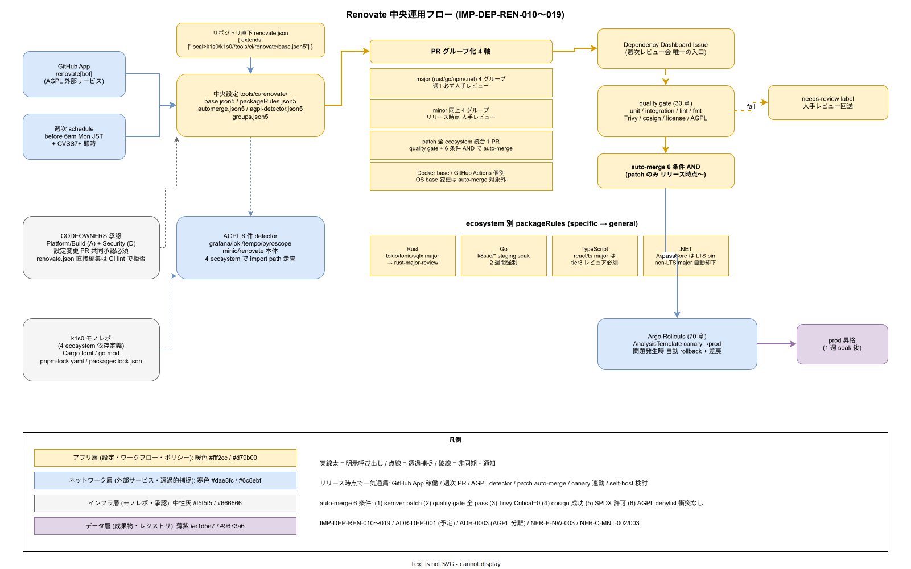

# 01. Renovate 中央運用設計

本ファイルは k1s0 モノレポにおける Renovate の物理配置・設定の一元化・PR グループ化・自動マージ条件を実装段階確定版として示す。40 章方針の IMP-DEP-POL-001（依存更新は Renovate 経由のみ）と IMP-DEP-POL-006（自動マージは patch レベルのみ）を、`tools/ci/renovate/` 配下の一元設定と GitHub App 運用、および 30 章 quality gate との連動で具体化する。ADR-DEP-001（Renovate 中心運用、本章初版策定時に起票予定）で正式化する運用形態を本節で固定する。



依存更新を開発者の手元に委ねる運用は、採用側組織では即日破綻する。各開発者が `cargo update` や `go get -u` を好きな時期に実行すれば、同じ Cargo.toml でも build 結果が散らばり、「私の端末では通る」が常態化する。逆に Renovate を導入しても設定が各サブディレクトリに散らばれば、どの PR が何を更新しているかの俯瞰が失われ、週次レビューで判断できなくなる。本節は「Renovate 設定は `tools/ci/renovate/` に一元化し、モノレポ全体を 1 インスタンスが見る」構造を確定する。

崩れると、AGPL ライブラリが Rust 依存に紛れ込んでも Renovate の AGPL detector が気付かず、NFR-E-NW-003 の分離境界が沈黙のうちに崩壊する。patch 自動マージが minor 誤検出で major 破壊を起こし、tier1 公開 API の互換性（NFR-C-MNT-003）が壊れる。こうした事故は本節の設定一元化と PR グループ化で構造的に防ぐ。

## OSS リリース時点での確定範囲

- リリース時点: GitHub App 経由で Renovate 稼働、週次 PR グループ化、手動マージ必須、AGPL 6 件の import path detector 稼働
- リリース時点: patch レベル自動マージ開始、Dependency Dashboard 稼働、週次レビュー会定着
- リリース時点: minor グループ PR の Argo Rollouts カナリア連動、Renovate self-host 検討（現行は GitHub App）

## Renovate 設定の物理配置

Renovate 設定は `tools/ci/renovate/` に集約する（IMP-DEP-REN-010）。`renovate.json` をリポジトリ直下に置く一般的な配置ではなく、サブディレクトリ配置を選ぶ理由は、モノレポ直下の設定ファイル数を増やさず「CI/依存管理関連は `tools/ci/` 配下に寄せる」方針（ADR-DIR-001）と整合させるためである。リポジトリ直下の `renovate.json` は `{ "extends": ["local>k1s0/k1s0//tools/ci/renovate/base.json5"] }` のプレストのみを置き、実質設定は `base.json5` 以下に委譲する。

- `tools/ci/renovate/base.json5` : 全体共通設定（PR 頻度 / labels / assignee / timezone=Asia/Tokyo）
- `tools/ci/renovate/packageRules.json5` : ecosystem 別 rule（Rust / Go / TS / .NET / Docker / GitHub Actions）
- `tools/ci/renovate/automerge.json5` : patch 自動マージ条件（リリース時点 以降有効化）
- `tools/ci/renovate/agpl-detector.json5` : AGPL 6 件の package name denylist（Grafana / Loki / Tempo / Pyroscope / MinIO / Renovate 本体）
- `tools/ci/renovate/groups.json5` : PR グループ化定義（後述）

設定変更は CODEOWNERS で Platform/Build（A）+ Security（D）の共同承認必須とする（IMP-DEP-REN-011）。人手で `renovate.json` を直接編集した PR は CI lint で拒否し、一元設定以外の設定ファイルの存在を検出した場合も fail する。

## GitHub App と実行頻度

リリース時点 は GitHub App `renovate[bot]` を採用し、self-host しない（IMP-DEP-REN-012）。self-host 案も検討したが、採用側の小規模運用で Renovate 自身の運用保守（DB / Redis / scheduler）を背負う余力はなく、リリース時点 までは GitHub App 依存で進める。AGPL ライセンスの Renovate 本体は GitHub App 経由で外部サービスとして利用するため、ADR-0003 の「別プロセス / 別ネットワーク境界で運用」条件を満たしており、自社コードへの AGPL 汚染は発生しない。

実行頻度は `schedule: ["before 6am on monday"]`（日本時間）を base 設定とする。毎日実行では PR 量が過大で、月次では rebase コスト過多となる。月曜早朝実行 → 日中レビュー → 火曜マージの週次サイクルを 採用側の小規模運用の現実的な吸収帯とする。セキュリティアラート経路（Dependabot 相当）は即時扱いで、CVE が CVSS 7.0 以上の依存は `schedule` を無視して即 PR を上げる `vulnerabilityAlerts` 設定を有効化する（IMP-DEP-REN-013）。

## PR グループ化と Dependency Dashboard

Renovate は何もしないと依存 1 件につき 1 PR を作り、週 50 件を超える PR 洪水が発生する。これを吸収するため PR グループ化を 4 軸で定義する（IMP-DEP-REN-014）。

- **エコシステム別 major**: `go-modules-major` / `rust-major` / `npm-major` / `nuget-major` の 4 グループ、週 1 PR、必ず人手レビュー
- **エコシステム別 minor**: 同様に 4 グループ、週 1 PR、人手レビュー（リリース時点）
- **patch 統合**: 全 ecosystem 横断で 1 PR、リリース時点 以降 quality gate 全 pass で自動マージ
- **Docker / Actions**: base image tag と GitHub Actions version を個別グループ、OS ベース変更は自動マージ対象外

Dependency Dashboard（`dependencyDashboard: true`）を有効化し、open PR 状況 + 保留中の更新候補を 1 つの GitHub Issue に集約する（IMP-DEP-REN-015）。週次レビュー会はこの Dashboard Issue を唯一の入口とし、個別 PR を追いかけない運用規律を敷く。Issue には「この更新が止まっている理由」を Bot が自動記入するため、10 年後の後任者も「なぜ pin されていたか」を追跡可能となる。

## 自動マージ条件と quality gate 連動

自動マージは リリース時点 から patch レベルに限定して解禁する（IMP-DEP-REN-016）。30 章 `_reusable-quality-gate.yml` の全 check pass を必須条件とし、以下 6 条件を AND で満たす PR のみ bot 自身が merge する。

- semver 判定で `^1.2.3` の patch 部分のみ更新（minor / major は除外）
- 30 章 quality gate（unit / integration / lint / fmt）全 pass
- Trivy イメージスキャンで Critical 0、High は既存の数以下
- cosign 署名ステップ成功（80 章連携）
- `cargo-deny` / `go-licenses` / `license-checker` / `nuget-license` で SPDX 許可ライセンス
- AGPL detector が denylist との衝突を検出しない

条件のうち 1 つでも failing の場合は自動マージせず、Renovate が PR に `status: needs-review` label を付けて人手レビューに回送する。自動マージされた PR は 1 週間後に Argo Rollouts の AnalysisTemplate でカナリア成功を確認してから prod 昇格する経路とし、問題発生時は自動 rollback + Renovate PR 差し戻しが発火する（70 章連動）。

## AGPL 6 件の import path 検知

AGPL detector は Renovate の `packageRules` で package 名 denylist を維持するだけでは不十分で、tier1 / tier2 / tier3 コードから実際に `import` / `use` されていないかの静的解析を CI ステップとして追加する（IMP-DEP-REN-017）。`grafana/*` / `grafana/loki` / `grafana/tempo` / `grafana/pyroscope` / `minio/minio` / `renovatebot/renovate` の 6 パッケージ（および依存推移）を `tools/ci/agpl-check/` の scanner で検出し、1 件でも import された PR を CI で fail させる。

- Rust: `cargo tree` で dep graph を生成し package 名で grep
- Go: `go list -m all` で dep 列挙、module path で検査
- TypeScript: `pnpm list -r` で全 workspace の依存をフラット化して検査
- .NET: `dotnet list package --include-transitive` で推移依存込みで検査

4 ecosystem のいずれかで AGPL 6 件との衝突を検出すると CI は Security へ label 通知し、PR は自動クローズされる。例外適用（新規 AGPL OSS を分離境界内で採用する）には ADR-0003 改訂を必須条件とする。

## `tools/ci/renovate/base.json5` の主要設定

ベース設定ファイルの主要項目を以下に示す（全文は実ファイル参照、IMP-DEP-REN-018）。

```json5
{
  extends: ["config:recommended", ":dependencyDashboard", ":gitSignOff"],
  timezone: "Asia/Tokyo",
  schedule: ["before 6am on monday"],
  labels: ["dependencies", "renovate"],
  assignees: ["@k1s0/platform-team"],
  reviewers: ["@k1s0/platform-team"],
  prHourlyLimit: 4,
  prConcurrentLimit: 15,
  rangeStrategy: "bump",
  dependencyDashboard: true,
  dependencyDashboardTitle: "Renovate Dependency Dashboard",
  vulnerabilityAlerts: { enabled: true, schedule: ["at any time"] }
}
```

`rangeStrategy: "bump"` を選ぶ理由は、Cargo.toml / go.mod の caret/tilde 範囲指定を実版まで引き上げて lockfile と整合させるためである。`widen` だと範囲だけ広がり lockfile が既存版に固定され、実質更新されない状態が発生する。

## ecosystem 別 packageRules

`packageRules.json5` に ecosystem 別の個別ルールを集約する（IMP-DEP-REN-019）。ecosystem が混在するモノレポでは rule の順序が結果に影響するため、上から specific → general の順に並べる。

- Rust: `tokio` / `tonic` / `sqlx` などは major 更新時に必ず `labels: rust-major-review` を付与し、ZEN Engine / rdkafka など 採用側組織の固有依存は個別レビュアを指定
- Go: `k8s.io/*` / `google.golang.org/grpc` は staging soak 2 週間強制、`cloud.google.com/*` は現在不採用のため deny
- TypeScript: `react` / `typescript` major は tier3 Web チームレビュア必須、`@types/*` は patch 自動マージ候補
- .NET: `Microsoft.AspNetCore.*` は LTS 版 pin、non-LTS major 更新は自動却下
- Docker: base image の digest pin、tag 指定は `alpine:3.X` / `debian:bookworm-slim` のみ許可
- GitHub Actions: `actions/*` と `slsa-framework/*` は major 更新後に 80 章 Kyverno verifyImages 再検証

## 受け入れ基準

採用初期 完了時点で以下を満たすことを本節の受け入れ基準とする。

- `tools/ci/renovate/` 配下に設定一元化、リポジトリ直下に実質設定ファイルが存在しない
- Renovate GitHub App が週次実行、PR グループ化 4 軸で生成
- Dependency Dashboard Issue が 1 個存在し、週次レビュー会の唯一の入口になっている
- AGPL 6 件 detector が全 ecosystem で稼働し、CI fail で 1 件でも import 侵入を拒否
- リリース時点 以降、patch 自動マージが quality gate + 6 条件 AND で稼働
- Renovate 設定変更 PR が Platform/Build + Security 共同承認で merge されている
- `packageRules.json5` が ecosystem 別 rule で分離され、specific → general の順序が維持

## RACI

| 役割 | 責務 |
|---|---|
| Platform/Build（主担当 / A） | Renovate 設定の一元化、GitHub App 導入、PR グループ化定義 |
| Security（共担当 / D） | AGPL detector 維持、ライセンス rule 承認、自動マージ条件レビュー |
| SRE（共担当 / B） | 自動マージ後の稼働影響監視、Argo Rollouts 連動検証 |
| DX（I） | 週次レビュー会の Dashboard Issue 運用 |

## 対応 IMP-DEP-REN ID

| ID | 主題 | 適用段階 |
|---|---|---|
| IMP-DEP-REN-010 | Renovate 設定を `tools/ci/renovate/` に一元化 | 0 |
| IMP-DEP-REN-011 | 設定変更 PR は Platform/Build + Security 共同承認 | 0 |
| IMP-DEP-REN-012 | リリース時点 は GitHub App 採用、self-host は 運用蓄積後判断 | 0 |
| IMP-DEP-REN-013 | 週次 schedule + CVSS 7.0 以上の即時例外 | 0 |
| IMP-DEP-REN-014 | PR グループ化 4 軸（major / minor / patch / Docker・Actions） | 0 / 1a |
| IMP-DEP-REN-015 | Dependency Dashboard Issue を週次レビュー唯一の入口とする | 0 |
| IMP-DEP-REN-016 | patch 自動マージを quality gate + 6 条件 AND で稼働 | 採用初期 |
| IMP-DEP-REN-017 | AGPL 6 件の import path 静的検知を 4 ecosystem で実装 | 0 |
| IMP-DEP-REN-018 | `base.json5` の共通設定（schedule / rangeStrategy / Dashboard） | 0 |
| IMP-DEP-REN-019 | ecosystem 別 packageRules で specific → general の順序固定 | 0 |

## 対応 ADR / DS-SW-COMP / NFR

- ADR-DEP-001（Renovate 中心運用、本章初版策定時に起票予定）/ [ADR-0003](../../../02_構想設計/adr/ADR-0003-agpl-isolation-architecture.md)（AGPL 分離）
- DS-SW-COMP-129 / 130（tier1 Rust / 契約配置）/ DS-SW-COMP-135（配信系）
- NFR-C-MNT-002（OSS バージョン追従）/ NFR-C-MNT-003（API 互換方針）/ NFR-E-NW-003（AGPL 分離）/ NFR-E-AV-002（SBOM と依存追跡）

## 関連章

- `20_SBOM差分監視/` — Renovate 更新時の SBOM diff 検知
- `30_ライセンス判定/` — SPDX ルールと cargo-deny / go-licenses の詳細
- `../30_CI_CD設計/` — quality gate reusable workflow と自動マージ連動
- `../70_リリース設計/` — Argo Rollouts による自動 rollback 連動
