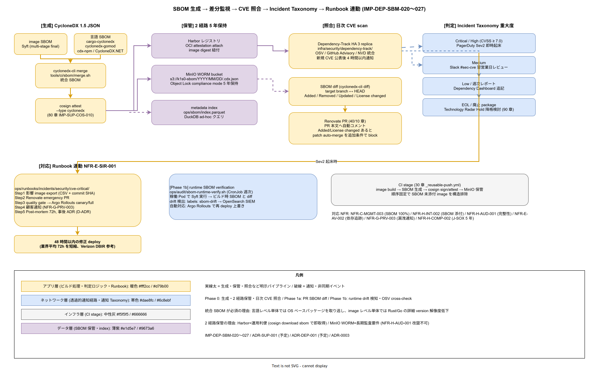

# 01. SBOM 差分監視設計

本ファイルは k1s0 モノレポにおける CycloneDX SBOM の生成・保管・差分監視の物理配置と運用規約を確定する。40 章方針の IMP-DEP-POL-007（SBOM 全アーティファクト添付）を、Syft による生成、Dependency-Track での照合、MinIO WORM bucket への 5 年保管、Renovate PR 生成時の SBOM diff 自動コメントの 4 経路でつなぐ実装として示す。ADR-SUP-001（SLSA L2→L3、80 章初版策定時に起票予定）および 80 章 `10_cosign署名/01_cosign_keyless署名.md`（IMP-SUP-COS-010 で SBOM も署名対象）と同期する。



SBOM を生成するだけでは「依存の写真」を撮っているに過ぎない。価値が立ち上がるのは「新しい CVE が公表された瞬間に、過去の SBOM 全件を機械的に突合して影響アーティファクトを 60 秒以内に列挙する」という照合経路が動いた時である。Log4Shell 型の広域脆弱性では、影響確定までの時間が事業の毀損速度を決める。2 名運用で数十サービスを抱える JTC では、Dependency-Track による日次照合と PR 時点での diff 可視化が、人手調査を構造的に不要にする唯一の現実解となる。

崩れると、新規 CVE 公表時に「どの image に入ったか」を追う能力が消え、tier1 / tier2 / tier3 を横断した影響評価が数日単位に膨らむ。NFR-C-MGMT-003（SBOM 生成率 100%）の数値が達成されていても、差分監視が無ければ数値自体が無意味となる。

## Phase 確定範囲

- Phase 0: Syft によるコンテナ image SBOM 生成、cosign attach、MinIO WORM 保管、Dependency-Track 日次照合
- Phase 1a: Renovate PR への SBOM diff 自動コメント、新規依存の追加 / 削除 / version 変動を PR 本文に可視化
- Phase 1b: SBOM delta の SIEM 連動（不審な依存追加の検知）、OSV データベースとの cross-check

## SBOM 生成ツールと対象

SBOM は CycloneDX 1.5 JSON 形式で統一する（IMP-DEP-SBM-020）。SPDX 形式との二択ではあるが、CycloneDX は OWASP 由来で脆弱性管理との親和性が高く、Dependency-Track がネイティブ対応する。生成ツールは対象ごとに以下で固定する。

- **コンテナ image**: Syft（`syft <image> -o cyclonedx-json`）、multi-stage build の final stage を対象とし、base image の OS パッケージも含めて網羅
- **Rust crate**: `cargo-cyclonedx`（tier1 Rust / SDK Rust 双方）、workspace 単位で生成
- **Go module**: `cyclonedx-gomod mod`、`go.sum` から pin 済みバージョンを読み取り
- **TypeScript**: `@cyclonedx/cyclonedx-npm`、`pnpm-lock.yaml` を入力に生成
- **.NET**: `CycloneDX.NET` CLI、`packages.lock.json` を入力

1 つの image に対して「image レベル SBOM（Syft）」と「言語レベル SBOM（cargo-cyclonedx 他）」の 2 種類を生成し、`tools/ci/sbom/merge.sh` で `cyclonedx-cli merge` して統合する（IMP-DEP-SBM-021）。言語レベル単体では OS ベースパッケージを取り逃し、image レベル単体では Rust / Go の詳細 version が解像度低下するため、統合が必須となる。

## 保管とライフサイクル

SBOM は 2 経路で保管する（IMP-DEP-SBM-022）。第一経路は Harbor レジストリへの OCI artifact 添付で、cosign attest により image digest と紐付けて署名される。第二経路は MinIO WORM bucket（`ops/sbom/archive/`）への Parquet / JSON 両形式保管で、5 年間の改竄不可保持を提供する。両経路を並走する理由は、Harbor が運用上の利便性（`cosign download sbom` で即取得）を提供する一方、長期監査要件（NFR-H-AUD-001 の監査ログ完整性）は WORM bucket のみが満たすためである。

- Harbor: image digest の attestation として attach、retention は image 自体と連動（prod は削除しない）
- MinIO WORM bucket: `s3://k1s0-sbom/YYYY/MM/DD/<image-digest>.cdx.json`、Object Lock compliance mode、保持 5 年
- metadata index: `ops/sbom/index.parquet` に image digest / 生成時刻 / commit SHA / workflow run ID を記録、DuckDB で ad-hoc クエリ

5 年保持は J-SOX（NFR-H-COMP-002）およびコンプライアンス関連の NFR-H-COMP-004 の監査証跡要件に由来する。

## Dependency-Track による日次照合

Dependency-Track（OWASP）を `infra/security/dependency-track/` に HA 3 replica で deploy し、Harbor に push された全 SBOM を自動取り込みして日次で CVE 照合する（IMP-DEP-SBM-023）。Dependency-Track は OSV / GitHub Advisory Database / NVD の 3 ソースを統合し、新規 CVE 公表 4 時間以内に影響 project（k1s0 の各 image）を通知する構造を持つ。

通知経路は以下で固定する。

- Critical / High: PagerDuty 即時起床（Sev2 相当、60 章 Incident Taxonomy 参照）
- Medium: Slack `#sec-cve` への通知、翌営業日レビュー
- Low: 週次レポートに集約、Dependency Dashboard Issue に追記
- EOL / 廃止 package: 月次レポート、Technology Radar（90 章 `30_Technology_Radar/`）で Hold 降格判定

照合対象は prod / staging deploy 済みの image のみに限定せず、過去 1 年以内に push された全 image を走査する（incident 発生時の retroactive 影響評価のため）。

## Renovate PR との SBOM diff 連動

Renovate が生成する依存更新 PR の本文に SBOM diff を自動挿入する（IMP-DEP-SBM-024）。`tools/ci/sbom/diff.sh` が PR の target branch と HEAD の SBOM を `cyclonedx-cli diff` で比較し、以下 4 カテゴリのサマリを PR コメントに投稿する。

- **Added**: 新規追加された依存（名前 + version + SPDX license）
- **Removed**: 削除された依存
- **Updated**: version 変更のみ（旧 → 新）
- **License changed**: 既存依存のライセンスが変わったケース（フォーク扱い変更など稀だが重要）

特に **Added** カテゴリは推移依存として新規 OSS が紛れ込む経路であり、SPDX license が許可リストに無い場合は PR を `needs-security-review` label で block する。Renovate の patch 自動マージ（10 節 IMP-DEP-REN-016）は、SBOM diff が Added 0 件・License changed 0 件の場合のみ通過する追加条件を課す。

## SBOM delta の SIEM / 監視連動（Phase 1b）

Phase 1b では prod cluster で稼働する image の SBOM を定期取得し、ビルド時 SBOM との delta を検知する（IMP-DEP-SBM-025）。想定シナリオは「runtime で `curl | sh` 的に追加インストールされた依存」「base image の自動更新で OS パッケージが差し替わった」ケースで、ビルド時 SBOM では捉えられない変化を検出する。

- **実行頻度**: 週次、`ops/audit/sbom-runtime-verify.sh` を CronJob で起動
- **取得方法**: 稼働中 Pod に sidecar 不使用で exec し Syft を実行、結果を ops/sbom/runtime/ に保存
- **差分判定**: ビルド時 SBOM と一致しない場合 `labels: sbom-drift` 付きで SIEM（OpenSearch）に送信
- **自動対応**: drift 検出時は Argo Rollouts で該当 Deployment を再 deploy（ビルド時イメージで上書き）

この runtime verification は immutable infrastructure の前提を監視層で補強する最終防衛線である。

## 脆弱性が検出された時の Playbook

Dependency-Track が Critical CVE を検出した時の対応手順を `ops/runbooks/incidents/security/cve-critical/` に配置する（IMP-DEP-SBM-026）。Runbook は NFR-E-SIR-001 の Runbook 15 本のうち 1 本として登録し、以下の流れを固定する。

- Step 1: Dependency-Track から影響 image 一覧を export（CSV）、commit SHA と紐付け
- Step 2: 修正済み version を確認、Renovate で emergency PR を `schedule` 無視で起動
- Step 3: quality gate 通過後、70 章 Argo Rollouts で canary deploy → full deploy
- Step 4: 影響顧客への通知（NFR-G-PRV-003 の漏洩通知義務と連動）
- Step 5: Post-mortem を 72 時間以内に作成、90 章 `20_ADR_プロセス/` で事後 ADR 起票

48 時間以内の修正 deploy を目標とし、業界平均の 72 時間（Verizon DBIR 2024 参考値）を短縮する。

## 生成タイミングと CI stage 統合

SBOM 生成は 30 章 `_reusable-push.yml` の image build 直後、cosign 署名の直前に差し込む（IMP-DEP-SBM-027 の補強）。順序を固定する理由は、cosign attest の attestation 対象として SBOM を渡すため、署名より前に SBOM が存在する必要があるためである。

```yaml
# _reusable-push.yml 抜粋
- name: Build and push image
  id: push
  run: |
    docker buildx build --push --tag ${{ inputs.image }}:${{ github.sha }} .
- name: Generate SBOM (Syft)
  run: |
    syft ${{ inputs.image }}:${{ github.sha }} -o cyclonedx-json=sbom.cdx.json
- name: Generate language-level SBOM and merge
  run: |
    tools/ci/sbom/generate-language.sh
    cyclonedx-cli merge --input-files sbom.cdx.json lang.cdx.json --output-file merged.cdx.json
- name: Sign and attest
  env:
    COSIGN_EXPERIMENTAL: "1"
  run: |
    cosign sign --yes ${{ inputs.image }}@${{ steps.push.outputs.digest }}
    cosign attest --yes --predicate merged.cdx.json --type cyclonedx \
      ${{ inputs.image }}@${{ steps.push.outputs.digest }}
- name: Upload SBOM to MinIO WORM
  run: |
    aws s3 cp merged.cdx.json s3://k1s0-sbom/$(date +%Y/%m/%d)/${{ steps.push.outputs.digest }}.cdx.json
```

この stage 統合により「ビルド済だが SBOM 未生成の image」が Harbor に残る状態を構造的に排除する。

## 受け入れ基準

- 全 image / SDK パッケージに対して CycloneDX 1.5 SBOM が生成され、Harbor attestation + MinIO WORM に 2 系統保管
- Dependency-Track が日次で CVE 照合を実行、Critical / High は 4 時間以内に通知
- Renovate PR 全件に SBOM diff コメントが自動投稿
- CVE Runbook による 48 時間以内の修正 deploy が演習で成立
- NFR-C-MGMT-003（SBOM 生成率 100%）と NFR-H-INT-002（SBOM 添付）が監査で達成確認できる

## RACI

| 役割 | 責務 |
|---|---|
| Security（主担当 / D） | Dependency-Track 運用、CVE 照合、Critical 対応判断 |
| Platform/Build（共担当 / A） | Syft 統合、SBOM 生成パイプライン維持、MinIO WORM 設定 |
| SRE（共担当 / B） | runtime SBOM verification、drift 検知 Runbook |
| DX（I） | PR SBOM diff UX の改善、Dashboard 可視化 |

## 対応 IMP-DEP-SBM ID

| ID | 主題 | Phase |
|---|---|---|
| IMP-DEP-SBM-020 | CycloneDX 1.5 JSON 形式で統一、ecosystem 別生成ツール固定 | 0 |
| IMP-DEP-SBM-021 | image レベル + 言語レベル SBOM の merge 統合 | 0 |
| IMP-DEP-SBM-022 | Harbor attestation + MinIO WORM の 2 経路保管、5 年保持 | 0 |
| IMP-DEP-SBM-023 | Dependency-Track HA 3 replica、日次 CVE 照合 | 0 |
| IMP-DEP-SBM-024 | Renovate PR への SBOM diff 自動コメント | 1a |
| IMP-DEP-SBM-025 | runtime SBOM verification と drift 検知 | 1b |
| IMP-DEP-SBM-026 | Critical CVE Runbook と 48 時間以内修正 deploy 目標 | 0 / 1a |
| IMP-DEP-SBM-027 | metadata index（Parquet + DuckDB）による監査用 ad-hoc クエリ | 1a |

## 対応 ADR / DS-SW-COMP / NFR

- ADR-DEP-001（Renovate 中心運用、本章初版策定時に起票予定）/ ADR-SUP-001（SLSA L2→L3、80 章初版策定時に起票予定）/ [ADR-0003](../../../02_構想設計/adr/ADR-0003-agpl-isolation-architecture.md)（AGPL 分離）
- DS-SW-COMP-135（配信系）/ DS-SW-COMP-141（多層防御統括）
- NFR-C-MGMT-003（SBOM 生成率 100%）/ NFR-H-INT-002（SBOM 添付）/ NFR-H-AUD-001（監査ログ完整性）/ NFR-E-AV-002（SBOM と依存関係追跡）/ NFR-G-PRV-003（個人情報漏えい通知）

## 関連章

- `10_Renovate中央運用/` — PR SBOM diff コメントの起点
- `30_ライセンス判定/` — SBOM 内の SPDX license 判定と cargo-deny 連動
- `../80_サプライチェーン設計/10_cosign署名/` — SBOM 自体への cosign 署名と attestation
- `../60_観測性設計/` — Dependency-Track メトリクスの Mimir 取り込み
