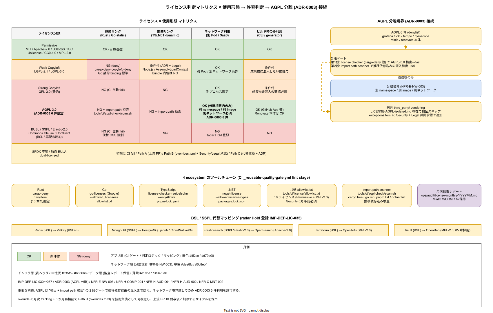

# 01. ライセンス判定設計

本ファイルは k1s0 モノレポにおける外部依存の SPDX ライセンス判定と CI ゲートを実装フェーズ確定版として確定する。40 章方針の IMP-DEP-POL-004（SPDX 明示 / BUSL / SSPL 自動拒否）および IMP-DEP-POL-005（AGPL 6 件の分離境界恒常検証）を、4 ecosystem（Rust / Go / TypeScript / .NET）の各ツール設定と CI workflow、および ADR 承認フローで実装する。ADR-0003（AGPL 分離アーキテクチャ）と連動し、非互換ライセンスの混入を構造的に拒否する設計である。

ライセンス判定を PR merge 時に人手で行う運用は、2 名体制の JTC では即座に破綻する。「このライブラリのライセンスは何か」を都度 google で調べる運用は、1 件の見落としが商用配布全体を法務リスクに晒す。本節は「全依存は必ず SPDX 識別子で宣言される / CI が許可リストに照合する / リスト外は自動拒否」という 3 条件で人間の判断を排除する構造を固定する。

崩れると、BUSL-1.1（Redis / HashiCorp Vault ライクな再配布制約）や SSPL-1.0（MongoDB / Elastic ライクなネットワーク再配布制約）が紛れ込み、k1s0 の商用 SaaS 化パスが法務レビューで止まる。AGPL 3.0 が tier1 Rust に import されれば、自社コードまで改変版開示義務を負う。こうした事故の起点は常に「誰かが 1 件だけ例外で通した」であり、人手判断を排除する構造以外に防御線はない。

## Phase 確定範囲

- Phase 0: 4 ecosystem の license checker を CI に組込、許可 / 条件付き / 拒否の 3 分類でゲート、AGPL 6 件の import path check
- Phase 1a: 条件付きライセンス（LGPL / MPL-2.0）の動的リンク検証、非 SPDX ライセンスの ADR 承認プロセス
- Phase 1b: 依存グラフのライセンス可視化（Dependency-Track の license feature 拡張）、SBOM の license field 監査

## 許可 / 条件付き / 拒否の 3 分類

SPDX License List からの分類を 3 区分で固定する（IMP-DEP-LIC-030）。判定は「再配布時に新たな義務が発生するか」「改変時にソース開示義務が広がるか」の 2 軸で行う。

- **許可（自動通過）**: `MIT` / `Apache-2.0` / `Apache-2.0 WITH LLVM-exception` / `BSD-2-Clause` / `BSD-3-Clause` / `BSD-0-Clause` / `ISC` / `Unlicense` / `CC0-1.0` / `MPL-2.0`（静的リンクも可）
- **条件付き（ADR 承認で許可）**: `LGPL-2.1` / `LGPL-3.0`（動的リンクのみ、tier 境界内完結）、`AGPL-3.0`（ADR-0003 の分離 6 件のみ）、`CC-BY-*`（ドキュメント素材のみ、コードは不可）
- **拒否（CI 自動 fail）**: `BUSL-1.1` / `SSPL-1.0` / `Commons Clause` / `Elastic-2.0` / `Confluent Community License` / `GPL-3.0`（静的リンク）/ その他 SPDX 不明ライセンス

`MPL-2.0` を許可側に入れる判断は、ファイル単位の copyleft で k1s0 の tier 境界内に影響が留まることによる（Firefox / Rust の `cc` crate で慣例的に採用）。逆に `LGPL` は動的リンク条件があるため、Rust や Go のような static binding を常用する ecosystem では実質的に条件付きとなる。

## 4 ecosystem のツールチェーン

各 ecosystem の license checker を CI `_reusable-quality-gate.yml` の lint stage で走らせる（IMP-DEP-LIC-031）。ツールは独立の設定ファイルを持つため、許可リストの同期を `tools/ci/license/` 配下の共通 JSON で一元管理する。

- **Rust**: `cargo-deny` の `[licenses]` セクション（10 章 `01_Rust_Cargo_workspace.md` で既設定）、`deny.toml` を `tools/ci/license/deny-common.toml` から継承
- **Go**: `go-licenses`（Google 製）、`go-licenses check ./... --allowed_licenses=$(cat tools/ci/license/allowlist.txt)` でゲート
- **TypeScript**: `license-checker-rseidelsohn`、`license-checker --onlyAllow="MIT;Apache-2.0;..."` でゲート、`pnpm-lock.yaml` 由来の全依存を走査
- **.NET**: `nuget-license` CLI、`nuget-license -i solution.sln --allowed-license-types tools/ci/license/allowlist.txt` でゲート

共通 `allowlist.txt` は 10 ライセンス（許可区分）の SPDX 識別子のみを列挙し、ecosystem 別の差分は各ツールの設定で調整する。許可リスト変更は Security（D）承認必須で、ADR-0003 改訂が必要な場合はそちらを先行する。

## AGPL 6 件の分離境界ゲート

ADR-0003 の分離対象 6 件（Grafana / Loki / Tempo / Pyroscope / MinIO / Renovate 本体）は、ライセンスが AGPL-3.0 のため上記「条件付き」に該当する。ただし分離境界内（別 namespace / 別 image / 別ネットワーク）でしか使わないため、自社 crate / module / package から import されてはならない（IMP-DEP-LIC-032）。

判定は 2 段で行う。第一段は license checker による AGPL-3.0 検出で、マッチしたら CI fail。第二段は 10 節 IMP-DEP-REN-017 の import path scanner で、denylist パッケージ名が dep graph に存在すれば fail（推移依存経由の混入を防ぐ）。両方を通過した PR のみ merge 可能とする。

- 第一段（ライセンス検出）: `cargo-deny deny = ["AGPL-3.0"]` / `go-licenses` / `license-checker` / `nuget-license` で共通拒否
- 第二段（import path 検出）: `tools/ci/agpl-check/scan.sh` で dep graph を走査、6 package 名と衝突で fail
- 例外: `third_party/` 配下に vendoring された AGPL OSS は分離境界内として扱い、`LICENSE-AGPL-isolated.md` の存在で検証スキップ

例外設定は `tools/ci/license/exceptions.toml` に列挙し、Security + Legal の共同承認必須で追加可能とする。例外追加時は ADR-0003 の付録に記録を残す。

## 非 SPDX ライセンスの ADR 承認プロセス

SPDX License List に無いライセンス（独自 EULA / dual-licensed / 未知ライセンス）を持つ依存は CI fail する（IMP-DEP-LIC-033）。解決するには以下の経路を取る。

- Path A: 上流に SPDX 識別子付与を PR で依頼、採用されれば再検出で通過
- Path B: k1s0 側で `tools/ci/license/overrides.toml` に SPDX を手動宣言、Security + Legal 承認必須
- Path C: 依存を置換（代替 OSS / 自作実装）、ADR 起票で判断記録

Path B は 2 名運用の現実的逃げ道だが、override 件数を `ops/audit/license-overrides-count.json` で月次 tracking し、10 件を超えたら Technology Radar（90 章）で依存戦略見直しの議論起点とする。override は 6 か月ごとに再検証し、上流で SPDX 付与されていれば削除する運用規律を IMP-DEP-LIC-034 として固定する。

## BSL / SSPL 時代の代替 OSS マッピング

Redis / MongoDB / Elasticsearch / HashiCorp Terraform など、BSL / SSPL 転換した OSS は k1s0 で採用禁止とする。代替 OSS を `docs/02_構想設計/radar/alternatives.md` に列挙し、Technology Radar の Hold 区分（90 章 `30_Technology_Radar/`）に登録する（IMP-DEP-LIC-035）。

- Redis（BSL）→ Valkey（BSD-3-Clause、Linux Foundation fork）
- MongoDB（SSPL）→ PostgreSQL + jsonb、または CloudNativePG
- Elasticsearch（SSPL / Elastic-2.0）→ OpenSearch（Apache-2.0）
- HashiCorp Terraform（BSL）→ OpenTofu（MPL-2.0、Linux Foundation fork）
- HashiCorp Vault（BSL）→ OpenBao（MPL-2.0、Linux Foundation fork、85 章採用）

これらの代替採用判断は Phase 0 時点で確定済（構想設計で選定）であり、将来の BSL / SSPL 化に備えて Renovate のプリセットで「上流が BSL 転換した際の alert」を設定する。転換検知時は Radar 更新 + ADR 起票を 1 週間以内に完了するサイクルを定める。

## ライセンス監査レポート

月次で `ops/audit/license-monthly-YYYYMM.md` を自動生成する（IMP-DEP-LIC-036）。全 image の SBOM から license field を集計し、以下のサマリを監査証跡として保全する。

- 全依存件数（ecosystem 別 / ライセンス区分別）
- 新規追加依存のライセンス分布
- override 適用件数とその根拠
- AGPL 6 件の分離境界維持状況（import scanner 結果）
- 拒否ライセンス検出件数（通常 0 件が期待値、0 以外の場合はインシデント扱い）

レポートは MinIO WORM bucket に 7 年保管し、外部監査（NFR-H-AUD-002）に対応する。JTC 顧客の取引先監査で license compliance を問われた際、本レポート群が一次証跡となる。

## 条件付きライセンスの動的リンク検証

LGPL-2.1 / LGPL-3.0 は「動的リンクのみ許容」という条件付きライセンスで、静的リンクされた場合は GPL 相当の copyleft が自社コードに伝搬する。Rust / Go はデフォルトで静的リンクするため、LGPL 依存は実質禁止となる。TypeScript / .NET は動的リンク可能な文脈があるため、`tools/ci/license/linkage-check.sh` で静的 / 動的判定を CI で実行する（IMP-DEP-LIC-037 の補強運用）。

- Rust: `cargo-deny` の `copyleft = "deny"` を LGPL に適用し、静的リンク前提で deny
- Go: 静的 binding が標準のため LGPL 依存を一律 deny、例外は ADR 必須
- TypeScript: Node.js / browser 実行時の動的リンクを許容、bundle 内包は deny
- .NET: AssemblyLoadContext 経由の動的ロードのみ許容、ILLink 経由の静的結合は deny

動的リンク判定は自動化が難しい領域で、最終判断は Legal（C）承認を必要とする。Legal 判断の結果は `tools/ci/license/linkage-decisions.md` に commit し、10 年保守期間の再検証に備える。

## 受け入れ基準

- 4 ecosystem すべてで license checker が CI ゲートとして稼働し、拒否ライセンス 1 件で PR が merge 不可
- 許可リスト 10 ライセンス + 条件付き 3 ライセンスの分類が `tools/ci/license/allowlist.txt` 他に commit され、CODEOWNERS 承認で保護
- AGPL 6 件の import path scanner が 4 ecosystem で稼働、denylist 衝突で自動 fail
- 非 SPDX override が `tools/ci/license/overrides.toml` に記録され、月次監査レポートで件数可視化
- 月次ライセンス監査レポートが MinIO WORM bucket に保管され、7 年保持
- 条件付きライセンス（LGPL 系）の動的 / 静的リンク判定が ecosystem 別スクリプトで稼働し、Legal 承認記録が `linkage-decisions.md` に commit されている
- Technology Radar の Hold 区分と `alternatives.md` の代替マッピングが整合、BSL / SSPL 転換監視が Renovate プリセットで稼働
- 拒否ライセンス検出時のインシデント対応 Runbook が `ops/runbooks/incidents/security/license-violation/` に配置され、Sev2 相当で 24 時間以内対応

## RACI

| 役割 | 責務 |
|---|---|
| Security（主担当 / D） | 許可リスト維持、override 承認、AGPL 分離境界監視、月次監査 |
| Platform/Build（共担当 / A） | ツール統合、CI 組込、allowlist 共通化 |
| Legal（共担当 / C） | 非 SPDX / dual-licensed 判定、外部監査対応 |
| SRE（I） | 拒否検出時のインシデント処理、Runbook 連動 |

## 対応 IMP-DEP-LIC ID

| ID | 主題 | Phase |
|---|---|---|
| IMP-DEP-LIC-030 | 許可 / 条件付き / 拒否の 3 分類固定 | 0 |
| IMP-DEP-LIC-031 | 4 ecosystem 別ツールチェーンと共通 allowlist | 0 |
| IMP-DEP-LIC-032 | AGPL 6 件のライセンス検出 + import path 検出の 2 段ゲート | 0 |
| IMP-DEP-LIC-033 | 非 SPDX ライセンスの ADR 承認プロセス（Path A / B / C） | 0 / 1a |
| IMP-DEP-LIC-034 | override の 6 か月再検証と月次 tracking | 1a |
| IMP-DEP-LIC-035 | BSL / SSPL 転換 OSS の代替マッピングと Radar Hold 登録 | 0 |
| IMP-DEP-LIC-036 | 月次ライセンス監査レポート自動生成、MinIO WORM 7 年保管 | 0 / 1a |
| IMP-DEP-LIC-037 | 拒否ライセンス検出時のインシデント扱い（Sev2 相当） | 1a |

## 対応 ADR / DS-SW-COMP / NFR

- [ADR-0003](../../../02_構想設計/adr/ADR-0003-agpl-isolation-architecture.md)（AGPL 分離）/ ADR-DEP-001（Renovate 中心運用、本章初版策定時に起票予定）
- DS-SW-COMP-129 / 130（tier1 Rust / 契約配置）/ DS-SW-COMP-141（多層防御統括）
- NFR-E-NW-003（AGPL 分離 / ライセンス遵守）/ NFR-H-COMP-004（業界ガイドライン整合）/ NFR-H-AUD-001（監査ログ完整性）/ NFR-H-AUD-002（外部監査対応）/ NFR-C-MNT-002（OSS バージョン追従）

## 関連章

- `10_Renovate中央運用/` — PR 時のライセンスチェック連動と AGPL detector
- `20_SBOM差分監視/` — SBOM の license field からの監査レポート生成
- `../90_ガバナンス設計/20_ADR_プロセス/` — 非 SPDX override の ADR 承認
- `../90_ガバナンス設計/30_Technology_Radar/` — BSL / SSPL 転換時の Hold 登録
