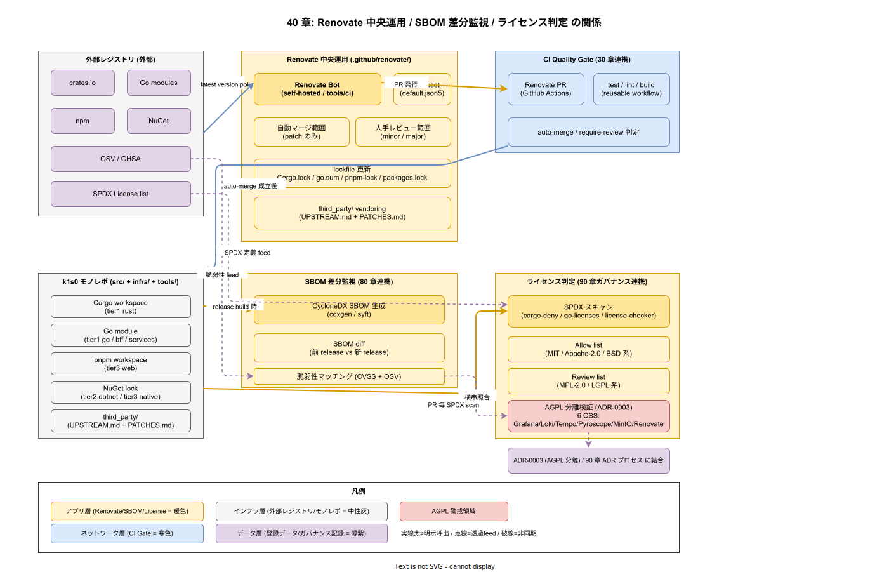

# 40. 依存管理設計

本章は k1s0 の外部依存（crates.io / Go modules / npm / NuGet / サードパーティ vendoring）をどう取り込み、どう更新し、どう監査するかを実装段階確定版として固定する。構想設計で選定された Renovate を軸に、lockfile 運用・`third_party/` vendoring・ライセンス監査を統合的に規定する。ADR-0003（AGPL 分離アーキテクチャ）と連動し、AGPL OSS 6 件（Grafana / Loki / Tempo / Pyroscope / MinIO / Renovate）は依存グラフ上で分離が維持されていることを恒常的に検証する。

## 本章の位置付け

採用側組織では、日々発生する依存更新 PR を人手で 1 件ずつレビューすると業務が破綻する。したがって「自動マージ可能な範囲」と「人手レビュー必須の範囲」を明確に線引きし、前者を Renovate + quality gate で吸収、後者だけに人手を集中させる運用を確定する。

サードパーティ OSS フォーク（`third_party/` vendoring）は、上流がパッチ受領しないが修正必須となった場合に限り採用する。vendoring 時は `UPSTREAM.md`（上流 URL・コミット SHA）と `PATCHES.md`（当プロジェクト独自パッチの一覧と根拠）を必須とし、リリース時点 時点で上流復帰可否を再評価する。



## OSS リリース時点での確定範囲

- リリース時点: Renovate 設定、lockfile 運用、`third_party/UPSTREAM.md` + `PATCHES.md` 必須化、ライセンス監査（SPDX）、AGPL 分離検証
- リリース時点: 自動マージ範囲の拡張（patch レベルのみ）、SBOM 差分監視（80 章連携）
- リリース時点: 依存グラフの可視化（脆弱性経路）

## RACI

| 役割 | 責務 |
|---|---|
| Platform/Build（主担当 / A） | Renovate 設定、lockfile 方針、vendoring レイアウト |
| Security（共担当 / D） | ライセンス監査、脆弱性通知連携、自動マージ判定、AGPL 分離維持 |
| SRE（共担当 / B） | 依存更新の稼働影響計測 |

## 節構成予定

```
40_依存管理設計/
├── README.md
├── 00_方針/                # Renovate 中心運用と vendoring の条件
├── 10_Renovate設定/
├── 20_lockfile運用/        # Cargo.lock / go.sum / pnpm-lock / packages.lock
├── 30_vendoring規約/       # UPSTREAM.md + PATCHES.md
├── 40_ライセンス監査/      # SPDX / AGPL 分離検証
└── 90_対応IMP-DEP索引/
```

## IMP ID 予約

本章で採番する実装 ID は `IMP-DEP-*`（予約範囲: IMP-DEP-001 〜 IMP-DEP-099）。

## 対応 ADR / 概要設計 ID / NFR

- ADR: [ADR-0003](../../02_構想設計/adr/ADR-0003-agpl-isolation-architecture.md)（AGPL 分離）/ 本章初版策定時に ADR-DEP-001（Renovate 中心運用）を起票予定
- DS-SW-COMP: DS-SW-COMP-129 / 130（tier1 Rust / 契約配置）
- NFR: NFR-E-NW-003（AGPL 分離）/ NFR-H-INT-002（SBOM 添付）/ NFR-C-MGMT-003（SBOM 100%）/ NFR-C-MNT-002（OSS バージョン追従）

## 関連章

- `80_サプライチェーン設計/` — 依存の SBOM と署名検証
- `90_ガバナンス設計/` — ライセンス判定と ADR プロセス
