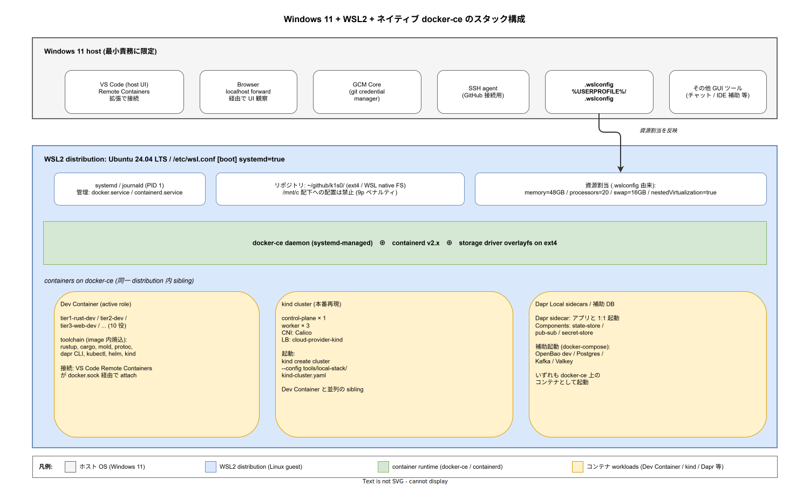

# 01. Windows 11 + WSL2 + ネイティブ docker-ce 環境構成

本ファイルは k1s0 の標準ローカル開発環境を Windows 11 + WSL2 + ネイティブ docker-ce で確定し、ホスト OS（Windows）とゲスト OS（WSL2 distribution）の責務分界、リソース割当の一元管理、Dev Container / kind / Dapr Local との結合点を物理配置レベルで規定する。Docker ランタイム選定の意思決定は [ADR-DEV-002](../../../02_構想設計/adr/ADR-DEV-002-windows-wsl2-docker-runtime.md) で確定済みであり、本ファイルはその実装段階の物理化を担う。

## 1. 背景と目的

ADR-DEV-001（Paved Road）と [`10_DevContainer_10役/01_DevContainer_10役設計.md`](../10_DevContainer_10役/01_DevContainer_10役設計.md) は Dev Container の 10 役別プロファイルと、kind / k3d + Dapr Local による本番再現（IMP-DEV-POL-006）を確定している。一方で**それらが乗るホスト OS と Docker ランタイム**については、当該設計書 119 行目で「Windows / macOS は Docker Desktop または Rancher Desktop、Linux はネイティブ Docker Engine」と一行で概括されたままだった。Windows + WSL2 が k1s0 開発者の主流環境である現状で、ホスト Docker ランタイムが揺れると、Dev Container の起動性能・kind の階層数・ライセンス遵守の 3 軸で組織横断の摩擦が発生する。

本ファイルは ADR-DEV-002 の決定（WSL ネイティブ docker-ce 採用）を物理配置に落とし込み、開発者が clone から first commit に到達するまでの経路（time-to-first-commit SLI、IMP-DEV-POL-004）を Windows 11 + WSL2 ホストで具体的に固定する。Dev Container 内 toolchain・kind 構成・Dapr Components の配置は本章の対象外であり、それぞれ [`10_DevContainer_10役/`](../10_DevContainer_10役/)・[`20_Golden_Path_examples/`](../20_Golden_Path_examples/)・上位設計 ADR で扱う。

## 2. 全体構造

ホスト Windows・WSL2 distribution・docker-ce daemon・コンテナ workloads の 4 層スタックで構成する。Windows 側は最小責務（git credential / SSH agent / Browser / VS Code host UI / `.wslconfig`）に限定し、開発本体は WSL2 内 ext4 上で完結する。docker-ce は WSL2 distribution の systemd で管理され、その上に Dev Container・kind ノード・Dapr Local sidecars が sibling として並ぶ。Docker Desktop が採用していた中間 distribution（`docker-desktop`）を経由しないため、kind 起動時の VM 階層が 1 層減り、bind mount のクロス distro 9p hop が発生しない。



## 3. 構成要素の詳細

### 3.1 Windows host 側に残す責務（IMP-DEV-ENV-064）

Windows 側の責務は次の 5 種類に限定する。これ以上の機能を Windows 側に残すと、開発者ごとに環境差が広がり、Paved Road の入口で迷いが発生する。

- **VS Code host UI**: ウィンドウ描画と Remote Containers / Dev Containers 拡張の起動点。toolchain は Windows 側に持たない。
- **Browser**: WSL2 内サービスを `localhost forwarding`（`.wslconfig` の `localhostForwarding=true`）経由で観察するためのみ使用する。
- **GCM Core (Git Credential Manager Core)**: GitHub への HTTPS push 時の credential 管理。WSL2 から `git-credential-manager` を呼び出す経路で動作する。
- **SSH agent**: `ssh-agent`（Windows OpenSSH 同梱）または `1Password` 等の SSH 鍵管理ツール。WSL2 からは `npiperelay` 経由で参照する。
- **`.wslconfig`**: `%USERPROFILE%\.wslconfig` に置く。WSL2 全体のリソース割当の単一真実源（IMP-DEV-ENV-062）。

それ以外の toolchain（rustup / go / kubectl / helm / kind CLI / dapr CLI / protoc / mold 等）は Windows 側に直接インストールせず、WSL2 distribution か Dev Container image に集約する。Windows 側に重複インストールすると、PATH の優先順位事故と「どの実体が動いているか」の調査時間がオンボーディングを浸食する。

### 3.2 WSL2 distribution 標準（IMP-DEV-ENV-060）

WSL2 distribution は **Ubuntu 24.04 LTS** を標準とする。`/etc/wsl.conf` で systemd を有効化し、`wsl --shutdown` 後の再起動で systemd Stable サポート（Microsoft 2022-09 公式リリース）下に入る。

```ini
# /etc/wsl.conf
[boot]
systemd=true

[user]
default=<開発者ユーザー名>
```

distribution の選定根拠は (1) Microsoft Store 経由配布で update 経路が確立、(2) Ubuntu LTS の docker-ce サポートが apt 経由で確実、(3) 24.04 LTS の sustaining が 2029 年まで保証されているためリリース時点〜運用拡大期を跨いで安定。代替候補（Debian / Fedora）も技術的には可だが、Docker 公式リポジトリの Ubuntu 系優先・Microsoft Store 公式配布・k1s0 既存の OSS スタック（CloudNativePG / Argo CD 等）の Ubuntu 上検証実績の 3 軸で Ubuntu 24.04 LTS が現時点の最良である。

### 3.3 docker-ce + systemd（IMP-DEV-ENV-061）

docker-ce は Docker 公式 apt リポジトリ（`https://download.docker.com/linux/ubuntu`）から導入する。distribution 同梱の `docker.io` は採用しない（Buildx / compose v2 の同梱と最新化遅延の都合）。導入後は `systemctl enable --now docker` で起動し、distribution 起動時に daemon が自動立ち上がる構成とする。

- パッケージ: `docker-ce` / `docker-ce-cli` / `containerd.io` / `docker-buildx-plugin` / `docker-compose-plugin`
- group: 開発者ユーザーを `docker` グループに追加し、`sudo` なし運用を可能にする
- log: `journalctl -u docker` で daemon log を Linux 標準手順で取得
- storage driver: 既定 `overlayfs` をそのまま使用（ext4 上、Docker 25 以降の overlayfs snapshotter）。`/var/lib/docker` は WSL2 distribution rootfs に配置され、容量監視は distribution 内 `df -h` で観察可能。なお Docker 24 以前を踏むと既定が `overlay2` 表記になるが内部実装上は同等で、設計判断に影響しない
- daemon 設定: 必要が生じるまで `/etc/docker/daemon.json` を空（既定）に保つ。DNS 問題が観察された段階で `"dns": ["1.1.1.1", "8.8.8.8"]` 追加を検討
- 確認時点バージョン（参考、リリース時点 2026-04-26 セットアップ実績）: docker-ce 29.4.1 / docker-buildx 0.33.0 / docker-compose 5.1.3 / containerd 2.2.3 / iptables backend は `iptables-nft` 既定（Ubuntu 24.04 LTS 標準）

具体的なインストール手順は [`docs/40_運用ライフサイクル/`](../../../40_運用ライフサイクル/)（Runbook 配置予定）を参照。本ファイルは方針と物理配置の確定までを担い、コマンド列挙は Runbook に委譲する。

### 3.4 `.wslconfig` 一元化（IMP-DEV-ENV-062）

`%USERPROFILE%\.wslconfig` の `[wsl2]` セクションが WSL2 全体のリソース割当を決める。Docker daemon 側の `--cpus` / `--memory` で二重管理を行わない。標準的な開発端末（Core i7-14700F + 64GB RAM クラス）での推奨値を以下に固定する。

| キー | 推奨値 | 根拠 |
|---|---|---|
| `memory` | `48GB`（host 64GB の 75%） | Rust の cargo build と rust-analyzer + kind 3 ノード + Dev Container 同時起動の最大値を吸収しつつ、Windows 側ブラウザ / IDE host に 16GB を残す |
| `processors` | `20`（host 28 スレッド中） | tier1 Rust の並列ビルドと kind の Pod 同時起動を許容しつつ、Windows 側 GUI に 8 スレッドを残す |
| `swap` | `16GB` | cargo / linker / LSP の一時的なメモリ膨張を吸収する保険（OOM 回避） |
| `nestedVirtualization` | `true` | kind / k3d の起動と一部の VM ベースツールに必須 |
| `localhostForwarding` | `true` | Windows ブラウザから WSL2 サービス（kind の `kubectl port-forward` 等）への直接接続 |
| `vmIdleTimeout` | `-1` | バックグラウンドジョブ（CI 監視、ログ tailing）の維持 |
| `guiApplications` | `true` | drawio 等の WSLg 経由 Linux GUI アプリ起動 |

ホスト RAM が 32GB の端末では `memory=24GB` / `processors=8` / `swap=8GB` を起点に再評価する。32GB 未満の端末は本 Paved Road の対象外とする（time-to-first-commit SLI 4 時間目標が達成困難になるため、組織 IT に端末交換を依頼する経路で対応）。

### 3.5 Dev Container / kind / Dapr Local の同 distribution 配置（IMP-DEV-ENV-063）

Dev Container・kind ノード・Dapr Local sidecars は**同一の WSL2 distribution 内**で docker-ce daemon の上に sibling として並ぶ。これにより以下が成立する。

- **Dev Container ↔ kind**: `kubectl` から kind API Server への接続が同一 distribution 内ループバック経由で完結する。Docker Desktop 経路の「利用者 distro → docker-desktop distro → kind コンテナ」の 3 hop が発生しない。
- **Dev Container ↔ Dapr sidecar**: tier1 アプリの Dapr CLI 起動がローカル sidecar に対して同一 docker network 内で接続でき、HTTP / gRPC port が単純に解決される。
- **kind ↔ Dapr sidecar**: kind 内 Pod が外部 Dapr sidecar を必要とするケース（CI 検証用）で、`extraPortMappings` 経由の接続が単純化する。

Dev Container は VS Code Remote Containers / Dev Containers 拡張が WSL2 内 `docker.sock`（既定: `/var/run/docker.sock`）に接続する経路で起動する。Windows 側 VS Code から `wsl --distribution Ubuntu` 経由で WSL2 内 docker daemon を見るため、distribution 切替の事故を避けるためにも Docker Desktop は同時起動しない。

### 3.6 リポジトリ配置原則（IMP-DEV-ENV-065）

開発リポジトリは **WSL2 distribution の ext4 上**（`/home/<user>/...`）に clone する。`/mnt/c/...`（Windows ファイルシステムの 9p 経由 mount）への配置を禁止する理由は、

- **9p ペナルティ**: `/mnt/c` 経由の bind mount は WSL2 ext4 比で 5〜30 倍遅い場面が観測されている（cargo build / rust-analyzer の inotify watch / Go モジュール解決の各シナリオ）
- **ファイル属性の差異**: `/mnt/c` は Windows NTFS の権限・改行コード変換が介在し、`core.filemode` や `core.autocrlf` の制御が複雑化
- **Docker bind mount との二重 9p**: docker-ce が `/mnt/c` 配下のディレクトリを bind mount すると、WSL2 → docker-ce → コンテナの 3 層で 9p 経由が積み重なり、I/O 性能が壊滅する

CI / Runbook で `/mnt/c` 配下のリポジトリを検出する仕組み（postCreate スクリプトでの警告）は将来の Phase 2 で導入する。リリース時点では README とオンボーディング動線で「ext4 内 clone」を明示するに留める。

## 4. ホスト・ゲスト責務分界

Windows と WSL2 の責務分界を明文化することで、「これはどっちで動いている？」の調査コストを構造的に消す。

- **Windows host が持つ責務**: GUI 提示（VS Code ウィンドウ / Browser / drawio host）、credential 管理（GCM Core / SSH agent）、リソース割当ファイル（`.wslconfig`）、Windows 固有のシステム設定（電源プラン / WSL2 自身の起動）。
- **WSL2 distribution が持つ責務**: docker-ce daemon、`/var/lib/docker` 配下のコンテナ image / volume、リポジトリ実体、git CLI、CLI toolchain（distribution に直接入れる最小限: git / curl / make / build-essential）。
- **Dev Container image が持つ責務**: 役割別 toolchain（rustup / go / mold / protoc / dapr CLI / kubectl / helm / kind CLI / pnpm 等）、VS Code 拡張、role-specific lint / formatter 設定。
- **kind ノードが持つ責務**: Kubernetes control-plane / kubelet、CNI、ローカル本番再現の Pod 群（Argo CD / cert-manager / SPIRE / Dapr operator 等を本番相当で配置）。

二重実装の禁止: 同じ機能を Windows / WSL2 / Dev Container の複数階層に持たせない。例えば Rust toolchain は Dev Container image にのみ焼き、WSL2 distribution に rustup を入れない。これは Paved Road の「正しい道一本化」（IMP-DEV-POL-001）をホスト構成層で貫徹するためで、Dev Container を使わない緊急保守の局面（image build 自体が壊れた場合）には distribution に最小限の Rust を後付けする例外運用を [`docs/40_運用ライフサイクル/`](../../../40_運用ライフサイクル/) Runbook で扱う。

## 5. 設計判断の根拠

本ファイルの物理配置は以下の上流意思決定に従う。設計の WHY を確認したい場合は ADR を直接参照する。

- [ADR-DEV-002](../../../02_構想設計/adr/ADR-DEV-002-windows-wsl2-docker-runtime.md): Windows + WSL2 で WSL ネイティブ docker-ce を採用する根拠（4 系統の選択肢比較 + ライセンス / VM 階層 / I/O / 互換性の 4 軸決定）
- [ADR-DEV-001](../../../02_構想設計/adr/ADR-DEV-001-paved-road.md): Paved Road の正しい道一本化原則。本ファイルはホスト構成層でこの原則を実装する
- [ADR-DIR-003](../../../02_構想設計/adr/ADR-DIR-003-sparse-checkout-cone-mode.md): 10 役 cone 定義。Dev Container との 1:1 対応の前提
- IMP-DEV-POL-006: ローカル開発は kind/k3d + Dapr Local で本番再現する原則（[`../00_方針/01_開発者体験原則.md`](../00_方針/01_開発者体験原則.md)）

## 6. トレーサビリティ

### 対応 IMP-DEV ID

本ファイルで採番する実装 ID（接頭辞 `ENV`、範囲 060-069）。

- `IMP-DEV-ENV-060`: Windows 11 + WSL2 (Ubuntu 24.04 LTS) + systemd を標準ホスト環境とする
- `IMP-DEV-ENV-061`: Docker ランタイムは WSL ネイティブ docker-ce で固定（Docker Desktop 不採用）
- `IMP-DEV-ENV-062`: `.wslconfig` による resource allocation 一元管理（memory / processors / swap / nestedVirt / localhostForwarding / vmIdleTimeout / guiApplications）
- `IMP-DEV-ENV-063`: Dev Container / kind / Dapr Local sidecars を同一 WSL2 distribution 内で sibling 起動
- `IMP-DEV-ENV-064`: Windows host 側残置責務の固定（VS Code host UI / Browser / GCM Core / SSH agent / `.wslconfig` の 5 種に限定）
- `IMP-DEV-ENV-065`: リポジトリは WSL2 ext4 上に配置、`/mnt/c` 配下を禁止

### 対応 ADR / DS-SW-COMP / NFR

- ADR: [ADR-DEV-002](../../../02_構想設計/adr/ADR-DEV-002-windows-wsl2-docker-runtime.md)（本ファイル直系）/ [ADR-DEV-001](../../../02_構想設計/adr/ADR-DEV-001-paved-road.md)（思想）/ [ADR-DIR-003](../../../02_構想設計/adr/ADR-DIR-003-sparse-checkout-cone-mode.md)（10 役対応）
- DS-SW-COMP: DS-SW-COMP-132（platform / scaffold）— 間接（Dev Container 経路の前段）
- NFR: NFR-C-NOP-001（学習容易性、time-to-first-commit 短縮の前提）/ NFR-C-MGMT-001（設定 Git 管理、`.wslconfig` 配布の根拠は `tools/devcontainer/profiles/` 共有）/ NFR-E-OPR-001（運用性、distribution の export / import によるバックアップ前提）

### 関連章との境界

- [`../10_DevContainer_10役/01_DevContainer_10役設計.md`](../10_DevContainer_10役/01_DevContainer_10役設計.md): Dev Container 内 toolchain と 10 役 image。本ファイルはその起動の前段となる host 構成を扱う
- [`../00_方針/01_開発者体験原則.md`](../00_方針/01_開発者体験原則.md): IMP-DEV-POL-006（kind/k3d + Dapr Local）の物理基盤を本ファイルが提供する
- [`docs/40_運用ライフサイクル/`](../../../40_運用ライフサイクル/): docker-ce インストール手順 / WSL2 distribution の export / import Runbook（Phase 2 で配置予定）
- [`docs/05_実装/00_ディレクトリ設計/80_スパースチェックアウト運用/`](../../00_ディレクトリ設計/80_スパースチェックアウト運用/): リポジトリ clone 後の cone 設定運用

## 7. 制約と今後の課題

- **macOS / 純 Linux ホストの扱い**: 本ファイルは Windows + WSL2 のみを対象とする。macOS は VirtioFS による file sync 性能差、純 Linux は systemd を distribution が直接持つため `.wslconfig` 不要、と前提が異なる。リリース時点ではこれらホストの利用は想定されておらず、利用が発生した時点で別 ADR（ADR-DEV-003 を予約）と本章の兄弟セクション（`05_ローカル環境基盤/02_macOS環境構成.md` 等）を起こす。
- **Hyper-V 無効化端末への対応**: 組織配布端末で Hyper-V が IT ポリシーで無効化されている場合、`.wslconfig` の `nestedVirtualization=true` が効かず kind が起動できない。Phase 1 で「組織 IT への事前合意フロー」を [`50_オンボーディング/`](../50_オンボーディング/) に組み込む。
- **distribution バックアップ**: WSL2 distribution が破損した場合の復旧経路として、`wsl --export` / `wsl --import` を使った定期バックアップを Phase 2 で Runbook 化する。Docker Desktop の「アプリ再インストール」相当の単純さは無いため、補完が必要。
- **Windows ARM 端末**: ARM 版 Windows での k1s0 開発検証はリリース時点では未実施。MAUI Android emulator や Playwright Chromium の amd64 前提と重なり、対応が複雑化する見込み。Phase 3 以降で必要が生じた時点で評価する。
- **Phase 2 の Runbook 化**: 本ファイルは方針と物理配置の確定までで、コマンド列レベルの手順は意図的に省いた。`docs/40_運用ライフサイクル/` 配下に「Windows 11 + WSL2 + docker-ce セットアップ Runbook」「`.wslconfig` 調整 Runbook」「distribution バックアップ Runbook」を順次配置する。
