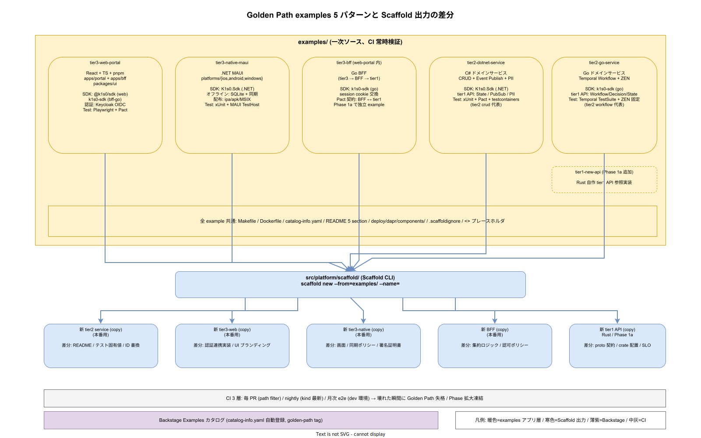

# 01. Golden Path examples

本ファイルは `examples/` 配下の Golden Path を実稼働版として配置し、Scaffold CLI のコピー元および Backstage カタログ上の「動く参照実装」として機能させるための物理配置を固定する。ADR-DEV-001 で決定した「Golden Path の一次ソースは `examples/`、docs は解説のみ」を実装レベルで確定させ、CI で常時 build / test / deploy を通す運用までを規定する。




## なぜ `examples/` を一次ソースにするのか

docs 側にコードスニペットを書き下すと、コード変更とドキュメント変更の間に必ず時間差が生まれ、数ヶ月後に必ず乖離する。ADR-DEV-001 の核心は「動くコードこそが最新の真実」であり、それを担保するために `examples/` を CI で build / test / deploy まで常時検証する「動く資産」として維持する。Scaffold CLI が `examples/` をコピーする実装になっている以上、CI が壊れていない限り Scaffold 出力も壊れない。この構造を Phase 0 から固定しておかないと、2 名フェーズで「とりあえず docs に書く」選択が積み重なって破綻する。

tier2 向け（.NET / Go）と tier3 向け（Web / Native）の 4 ケースを Phase 0 の必須セットとし、Phase 1a で BFF / Workflow / Saga / PII マスキングのパターン別に合計 8 例へ拡大する。Phase 2 以降の追加は Paved Road 全体の改訂と整合する形でのみ許容する。

## Phase 0 の必須 4 例

```
examples/
├── tier2-dotnet-service/      # C# ドメインサービス: CRUD + Event Publish + PII マスキング
├── tier2-go-service/          # Go ドメインサービス: Temporal Workflow + ZEN Engine 呼出
├── tier3-web-portal/          # React + TypeScript + BFF 経由 SDK 使用
└── tier3-native-maui/         # .NET MAUI + SDK（iOS / Android / Windows）
```

各例は単体で「clone 直後のローカル kind / k3d クラスタに `make up` 一発で立ち上がる」状態を維持する。動かない example は Scaffold のコピー元として失格であり、CI で壊れた瞬間に Phase 0 の MUST 要件違反として扱う。

### tier2-dotnet-service

C# ドメインサービスの最小実稼働版。CRUD API（Dapr State Building Block 経由）、ドメインイベント Publish（Dapr Pub/Sub、Kafka backing）、PII マスキング（tier1 PII サービス呼出）の 3 機能を統合した「一番簡単な tier2」として機能する。

- ディレクトリ: `examples/tier2-dotnet-service/{src,tests,deploy,docs,catalog-info.yaml,Dockerfile,Makefile,README.md}`
- 参照する tier1 API: State / Pub-Sub / PII の 3 つ
- SDK: `src/sdk/dotnet/K1s0.Sdk`（NuGet ローカル参照）
- ローカル起動: `make up` で `tools/local-stack/up.sh --role tier2-dev` を呼び出し、Dapr sidecar injection 済みの namespace にデプロイ
- テスト: xUnit ユニット + Pact 契約テスト（`tests/contract/`）+ testcontainers 統合

### tier2-go-service

Go ドメインサービスの最小実稼働版。Temporal ワークフロー（ADR-RULE-002）で長期業務フロー、ZEN Engine（ADR-RULE-001）でルール評価、という k1s0 の 2 大業務基盤の呼出例となる。

- ディレクトリ: `examples/tier2-go-service/{cmd,internal,deploy,docs,catalog-info.yaml,Dockerfile,Makefile,README.md}`
- 参照する tier1 API: Workflow（Temporal ラッパ）/ Decision（ZEN Engine ラッパ）/ State
- SDK: `src/sdk/go/k1s0-sdk`（`go mod replace` でローカル参照）
- ワークフロー例: 「申請受付 → 承認 → 通知」の 3 ステップで Decision を挟む典型業務フロー
- テスト: Temporal test suite + ZEN Engine の決定テーブル固定値テスト

### tier3-web-portal

React + TypeScript + pnpm workspace による Web フロント。BFF（Go）経由で tier1 を呼ぶ「tier3 → BFF → tier1」の正規経路の参照実装。ADR-TIER1-003（内部言語不可視）の tier3 側実装例でもある。

- ディレクトリ: `examples/tier3-web-portal/{apps/portal,apps/bff,packages/ui,catalog-info.yaml,Dockerfile.portal,Dockerfile.bff,Makefile,README.md}`
- SDK: `src/sdk/typescript/@k1s0/sdk`（Web フロント）/ `src/sdk/go/k1s0-sdk`（BFF）
- 認証: Keycloak OIDC（ADR-SEC-001）経由の SSO、BFF で session cookie に交換
- テスト: Playwright E2E（`tests/e2e/web/`）+ Pact 契約テスト（BFF ↔ tier1）

### tier3-native-maui

.NET MAUI によるクロスプラットフォームアプリ。iOS / Android / Windows の 3 ターゲットで動く最小版で、tier3 Native 開発者が最初にコピーする雛形として機能する。

- ディレクトリ: `examples/tier3-native-maui/{src,platforms/{ios,android,windows},catalog-info.yaml,Makefile,README.md}`
- SDK: `src/sdk/dotnet/K1s0.Sdk`（NuGet）
- オフライン対応: ローカル SQLite + 同期ロジック（tier1 State との双方向）
- 配布: CI で iOS .ipa / Android .apk / Windows MSIX を生成し、内部ストアへ push

## `catalog-info.yaml` の同梱と Backstage 連携

全 example は `catalog-info.yaml` を同梱する。これにより Backstage の「Examples」カタログに自動登録され、新規参加者は Backstage UI から実稼働例を検索できる。`catalog-info.yaml` の `metadata.tags` に `golden-path` と tier タグ（`tier2` / `tier3-web` 等）を付与し、Backstage 側で「Golden Path」コレクションとして絞り込み可能にする。

`catalog-info.yaml` の spec には以下を必須とする。Scaffold CLI がこの構造をそのまま生成するため、example 側のテンプレートが Scaffold の出力テンプレートと同一であることを CI で等価検証する。

- `spec.type: service`（tier2 / tier3-bff の場合）または `spec.type: website`（tier3-web の場合）
- `spec.owner: <team-name>`（example は `@k1s0/platform-dx` が恒久保有）
- `spec.lifecycle: experimental`（example は本番運用対象ではないことを明示）
- `spec.providesApis` / `spec.consumesApis`（Protobuf 契約への参照）
- `annotations.k1s0.io/example-of: <pattern>` （tier2-crud / tier2-workflow / tier3-web-spa / tier3-native-maui）
- `annotations.k1s0.io/release-strategy: progressive`（example も PD 対象として扱い、実運用に近い構成を維持）

## Dapr components.yaml とローカル起動

各 example は `deploy/dapr/components/` 配下に Dapr components.yaml 一式を同梱する。これにより `make up` でローカル kind / k3d に Dapr sidecar 付きでデプロイでき、本番相当の振る舞いをローカルで再現できる。

- `state-store.yaml` : state.redis（ローカルは Valkey container、本番は Valkey Sentinel）
- `pub-sub.yaml` : pubsub.kafka（ローカルは Strimzi minimal、本番は Kafka 3 broker）
- `bindings-sendgrid.yaml` : 外部メール送信のダミー実装（ローカルは MailHog に差替え）
- `secret-store.yaml` : OpenBao dev server（ローカル）/ OpenBao HA（本番）

components.yaml は env 別に分けず、値だけを Kustomize overlay（`deploy/kustomize/overlays/local` / `overlays/dev` / `overlays/prod`）で切替える。これは `70_リリース設計/10_ArgoCD_App構造/` の構成と完全に揃える。

## README テンプレート：「コピーしてリネームで動く」体験

各 example の `README.md` は次の 5 セクションを必須とする。Scaffold CLI が新規サービスを生成する際、このセクションを流用して初期 README を作る。

- **What this example demonstrates** : この example が示すパターン（tier2-crud / workflow / saga 等）と、そうでない範囲の明示
- **How to copy and rename** : `scaffold new tier2-service --from=examples/tier2-dotnet-service --name=<new-service>` のワンラインと、手動コピー時のリネーム手順
- **How to run locally** : `make up` / `make test` / `make e2e` / `make down` の 4 コマンド
- **How to deploy to dev** : PR 作成 → ArgoCD が `deploy/apps/tier2/<service>.yaml` を検出 → 自動同期 の流れ
- **Known limitations** : example が意図的に省略している部分（認可ポリシー詳細 / 国際化 / アクセシビリティ等）

「手動コピーでも動く」を維持することが重要である。Scaffold CLI が止まった状態でも、example を git clone して手で写せば動く構造にしておけば、Scaffold の障害が開発停止に直結しない。

## CI による常時検証と Phase 1a 拡大

`examples/` は壊れた瞬間に Golden Path としての価値を失う。GitHub Actions で次の 3 種類のジョブを常時稼働させ、壊れたら Phase を止める運用とする。

- **毎 PR 実行** : 変更があった example のみ `make up && make test && make down`（path-filter）
- **nightly 実行** : 全 example を kind 最新版で `make up && make e2e && make down`、結果を Backstage Scorecards に露出
- **月次 e2e 実行** : dev 環境の ArgoCD 経由で全 example をデプロイし、本番相当の Istio Ambient / Dapr / flagd 統合で動作確認。壊れた example が検出されたら Phase 1a 拡大計画を停止し、修復完了まで新規 example 追加を凍結

Phase 1a での拡大は 8 例まで許容する。追加候補は `examples/tier2-saga`（Saga パターン） / `examples/tier3-bff-graphql`（GraphQL BFF） / `examples/tier1-rust-service`（tier1 自作領域の参照実装） / `examples/pii-masking`（PII 処理の独立 example）の 4 例である。Phase 2 以降は Paved Road 全体の再整備時にのみ追加可能とする。

## Scaffold CLI との契約

Scaffold CLI（`src/platform/scaffold/`）は `examples/` をコピー元として動作するため、両者の間に「暗黙の契約」が生じる。この契約を明文化しないと、example 側の軽微な変更が Scaffold 出力を壊す事故が起きる。次の 4 点を契約として固定する。

- **プレースホルダ命名規則** : example 内で `<<service-name>>` / `<<owner-team>>` / `<<tier>>` の 3 トークンをプレースホルダとし、Scaffold CLI が置換する。他の命名規則は使わない
- **ファイル命名の可搬性** : ファイル名に `<<service-name>>` を含む場合は `_service_name_` の snake_case プレースホルダで記述し、OS のファイル名制約（Windows の `<` `>` 禁止）を回避
- **`.scaffoldignore` の同梱** : example 内で Scaffold コピー対象から除外するファイル（`docs/dev-notes.md` 等）を列挙
- **buildable-on-copy の保証** : Scaffold でコピー直後に `make test` が成功することを example の CI で検証（Scaffold 経由と手動コピー経由の両方で同じ成果物になることを確認）

契約違反は Scaffold CLI のゴールデンテスト（`tests/golden/`）で検出する。example 側の PR で契約違反が検出された場合、PR は自動ブロックされ、Scaffold CLI 側の対応と合わせた 2 リポジトリ協調 PR が必要となる。

## 対応 IMP-DEV ID

本ファイルで採番する実装 ID は以下とする。

- `IMP-DEV-GP-020` : `examples/` 配下の 4 つの Phase 0 必須 example 配置（tier2 x 2 / tier3 x 2）
- `IMP-DEV-GP-021` : `catalog-info.yaml` 同梱による Backstage Examples カタログ自動登録
- `IMP-DEV-GP-022` : Dapr components.yaml 同梱とローカル起動（`make up` 一発）
- `IMP-DEV-GP-023` : README の 5 セクション必須化（コピーしてリネームで動く手順）
- `IMP-DEV-GP-024` : PR / nightly / 月次 e2e の 3 層 CI 検証
- `IMP-DEV-GP-025` : Phase 1a で 8 例への拡大（saga / graphql-bff / tier1-rust / pii-masking）
- `IMP-DEV-GP-026` : example の所有権（`@k1s0/platform-dx` 恒久保有）と lifecycle: experimental 明示

## 対応 ADR / DS-SW-COMP / NFR

- ADR: [ADR-BS-001](../../../02_構想設計/adr/ADR-BS-001-backstage.md)（Backstage）/ [ADR-DEV-001](../../../02_構想設計/adr/ADR-DEV-001-paved-road.md)（Paved Road）/ [ADR-RULE-001](../../../02_構想設計/adr/ADR-RULE-001-zen-engine.md)（ZEN Engine）/ [ADR-RULE-002](../../../02_構想設計/adr/ADR-RULE-002-temporal.md)（Temporal）
- DS-SW-COMP: DS-SW-COMP-132（platform / scaffold）
- NFR: NFR-C-SUP-001（SRE 体制）

## 関連章との境界

- [`00_方針/01_開発者体験原則.md`](../00_方針/01_開発者体験原則.md) の IMP-DEV-POL-001（Paved Road 一本化）の物理配置を本ファイルで固定する
- [`../10_DevContainer_10役/01_DevContainer_10役設計.md`](../10_DevContainer_10役/01_DevContainer_10役設計.md) の `tools/local-stack/up.sh` が example の `make up` 実装基盤
- [`../../20_コード生成設計/`](../../20_コード生成設計/) の Scaffold CLI が example をコピー元として利用する
- [`../../70_リリース設計/10_ArgoCD_App構造/`](../../70_リリース設計/10_ArgoCD_App構造/) の ApplicationSet が example を dev 環境に配信する
