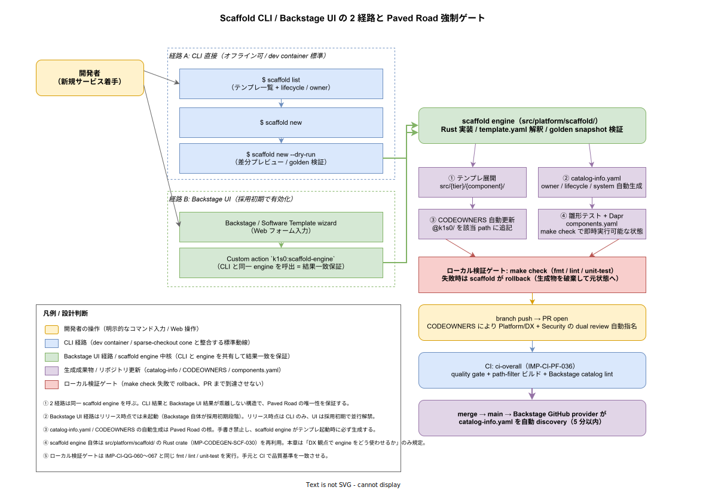

# 01. Scaffold CLI の DX 運用設計

本ファイルは k1s0 における新規サービス開発の入口を Scaffold CLI に一本化するための DX 観点の運用を実装段階の確定版として固定する。Scaffold CLI 本体（Rust 実装、テンプレート構造、golden snapshot）は [`20_コード生成設計/30_Scaffold_CLI/01_Scaffold_CLI設計.md`](../../20_コード生成設計/30_Scaffold_CLI/01_Scaffold_CLI設計.md) で確定済（IMP-CODEGEN-SCF-030〜037）。本ファイルは「開発者がそれをどう使うか / なぜ手書きを禁じるか / 2 経路（CLI と Backstage UI）の同等性をどう保証するか」を Paved Road 思想に沿って固定する。



## なぜ Scaffold 経由を強制するのか

「新規サービスを作る」という操作は、リポジトリ全体に多面的な制約を持ち込む。`src/` 配下の物理配置、`catalog-info.yaml` の Backstage 互換、`CODEOWNERS` の所有権宣言、`Dapr components.yaml` のローカル開発資材、初期テスト雛形、CI workflow の path-filter 整合、tier 境界の物理担保、SDK 依存方向の遵守。これらを手で書くと、書き手の習熟度に関わらず必ずどこかで漏れる。漏れた状態の PR が main に入ると、後から監視や運用で修正コストを払う構造になる。

Scaffold CLI は `src/contracts/` を参照しつつ、これら全ての**物理整合性**を 1 コマンドで埋める。手書きでサービスを作ること自体を禁止する理由は「開発者の能力不足」ではなく「整合性検査を機械化する責務がプラットフォームにある」からである。Paved Road 思想（IMP-DEV-POL-001 / 002）の物理化として、Scaffold 経由を「強く推奨」ではなく「必須」とする。

整合性検査は具体的には以下を含む。

- tier 境界（DIR-001 / TIER1-003）が壊れていないこと
- `catalog-info.yaml` が Backstage spec を満たすこと
- `CODEOWNERS` の path 規則が新規ディレクトリを正しくカバーすること
- 初期テスト雛形が `make check` を通せる状態（fmt / lint / unit-test 全 OK）であること
- 雛形に含まれる `Cargo.toml` / `go.mod` / `package.json` / `*.csproj` の workspace 登録が抜けていないこと

これらを毎回手で確認させる運用は人間負荷の不当な転嫁であり、Scaffold が引き受ける。

## 2 経路（CLI / Backstage UI）の同等性

Scaffold は 2 経路で起動する。

- **経路 A（CLI 直接）**: `scaffold list` / `scaffold new <template>` / `scaffold new --dry-run` の 3 サブコマンド。Dev Container `platform-cli-dev` または `tier{1,2,3}-*-dev` 役割に同梱される。**リリース時点の標準動線**
- **経路 B（Backstage UI）**: Backstage の Software Template wizard から Web フォーム経由で起動。**採用初期段階で並行解禁**（Backstage 自体が採用初期での本格稼働を想定するため）

両経路は内部で同一の `scaffold engine`（`src/platform/scaffold/` の Rust crate、IMP-CODEGEN-SCF-030）を呼ぶ。Backstage 側からは Custom action `k1s0:scaffold-engine` が engine を起動する経路で、CLI と engine の境界は同じ Rust API を共有する。これにより「CLI で生成した結果」と「Backstage UI で生成した結果」が**バイト一致**することを保証する。

両経路同等性の保証は以下の golden test で物理化する（IMP-DEV-SO-035）。

```bash
# tools/devex/scaffold-equivalence-test.sh
set -eu
TEMPLATE="tier3-react-bff"
INPUT_JSON="tests/devex/scaffold-input/$TEMPLATE.json"

# CLI 経路
mkdir -p /tmp/cli-out && cd /tmp/cli-out
scaffold new "$TEMPLATE" --input "$INPUT_JSON"

# Backstage UI 経路（custom action 直接呼出でシミュレート）
mkdir -p /tmp/bs-out && cd /tmp/bs-out
backstage-cli scaffolder:run "$TEMPLATE" --input "$INPUT_JSON"

# 結果比較（normalize 後）
diff -r <(tools/codegen/normalize.sh /tmp/cli-out) <(tools/codegen/normalize.sh /tmp/bs-out) \
  || { echo "ERROR: scaffold paths produced different output"; exit 1; }
```

CI 上で月次 schedule + Backstage / scaffold engine 変更時にこのテストを必ず回す。乖離が検出されたら custom action 側のバグとして即時修正対象とする。

## CLI サブコマンド契約

CLI は 3 サブコマンドに絞る。サブコマンド過多は学習コストを生むため、以下の形に固定する。

| サブコマンド | 動作 |
|---|---|
| `scaffold list` | テンプレ一覧を表 表示。各行に template name / description / lifecycle (experimental / production) / owner team / 必須入力数を表示 |
| `scaffold new <template>` | 対話的入力で生成。引数は最小化し、対話で `name` / `tier` / `owner-team` / `lifecycle` を聞く |
| `scaffold new <template> --dry-run --input <json>` | 入力を json で渡して**生成結果を生成せず差分のみ stdout に出す**。CI / golden test で利用 |

以下のサブコマンドは**意図的に作らない**。

- `scaffold update`: 既存サービスのテンプレ更新は別ツール（`tools/devex/migrate-template.sh`）で処理する。Scaffold は「新規生成」の責務に集中させる
- `scaffold delete`: 削除はサービスの設計上の意思決定であり、CLI で隠蔽すべきでない。`git rm` で明示的に消す

## 対話的入力の項目固定

`scaffold new <template>` の対話プロンプトは以下 4 項目に固定する。多項目化は学習コストと「なんとなく yes」を招くため、最小化する。

| 項目 | 検証 |
|---|---|
| `name` | 小文字英数 + ハイフン、3〜30 文字、`^[a-z][a-z0-9-]+$`、reserved（`api` / `health` / `metrics` / `admin`）を除外 |
| `tier` | `tier1` / `tier2` / `tier3` から択一。template 側で許容 tier を `template.yaml` に宣言済の場合はそれに絞る |
| `owner-team` | `@k1s0/<team>` 形式。template の suggested owner を default、CODEOWNERS と検証 |
| `lifecycle` | `experimental` / `production` から択一。default は `experimental`、`production` は SRE 承認待ちラベル付与 |

`name` の reserved 語は `tools/devex/scaffold-reserved-names.txt` に集約し、新規 reserved 追加は ADR 起票必須とする。これは過去にいくつかのプロジェクトで `api` というサービス名が path 衝突を引き起こした経験を踏まえた予防策である。

## 生成成果物 4 種

Scaffold は新規サービス当たり以下 4 種の成果物を必ず生成する。1 つでも欠ければ Scaffold 起動自体を失敗させる（部分生成の禁止）。

- **① テンプレ展開** (`src/{tier}/{component}/`): 雛形コード、初期テスト、`Cargo.toml` / `go.mod` / `package.json` / `*.csproj` 等。workspace 登録も自動更新
- **② `catalog-info.yaml`** (`src/{tier}/{component}/catalog-info.yaml`): Backstage Component spec。owner / lifecycle / system / providesApis（生成済の場合のみ）を埋める
- **③ `CODEOWNERS` 自動更新**: ルート `.github/CODEOWNERS` に `src/{tier}/{component}/ @k1s0/<owner-team>` 行を追記
- **④ Dapr `components.yaml`** (`src/{tier}/{component}/components/`): ローカル開発で `make up` 一発起動できる Dapr 設定（state store / pubsub / secret store の最小セット）

これら 4 種を「セット」として扱い、PR を分割せず 1 commit で push する。Scaffold 起動成功時の `git status` には必ずこの 4 種が含まれる。

## ローカル検証ゲートと rollback

生成完了後、Scaffold は自動的に `make check` を実行する（IMP-CI-QG-060〜067 と同じ fmt / lint / unit-test の組）。失敗時は **生成成果物を全て破棄して元状態に戻す**。これは「PR を作ってから CI で気付く」前段で防ぐためで、開発者の time-to-first-commit を犠牲にしないための rollback。

```bash
# scaffold engine の rollback ロジック概念
$ scaffold new tier3-react-bff
... 生成中 ...
✓ ① テンプレ展開
✓ ② catalog-info.yaml
✓ ③ CODEOWNERS 更新
✓ ④ components.yaml
→ make check 実行...
✗ unit-test 失敗（テンプレ側の依存バージョン不整合）
→ rollback: 4 成果物を破棄、元状態へ復元
ERROR: scaffold rolled back. テンプレ側の問題なので scaffold チームに報告ください
```

「テンプレ自体が壊れている」「依存解決ができない」のような Scaffold 起因の問題は、**ユーザの責任ではなく Scaffold チームの責任**として明示エラーで切り分ける。

## CODEOWNERS と PR 経路

Scaffold が `CODEOWNERS` を更新する規則は以下に固定する。

- 新規 path: `src/{tier}/{component}/ @k1s0/<owner-team>`
- 1 行追加で済まない場合（複数 owner）は、template 側で `template.yaml` に宣言した secondary owner を別行で追加
- 削除は手動（Scaffold は追加のみ行う）

PR 開時は以下 2 chain の dual review が CODEOWNERS で自動指名される（IMP-CODEGEN-SCF-034 と整合）。

- 新規追加された owner team（コード本体）
- `@k1s0/platform-dx`（Scaffold 経由かどうか / catalog-info の妥当性チェック）
- `production` lifecycle 選択時は追加で `@k1s0/sre`

## Backstage 側の自動 discovery

PR が main に merge されると、Backstage の GitHub provider が `catalog-info.yaml` を自動 discovery する（5 分以内）。手動の catalog import は不要。これは Scaffold が出力した `catalog-info.yaml` の物理位置が `src/{tier}/{component}/catalog-info.yaml` で固定されており、Backstage 側 discovery rule が `src/**/catalog-info.yaml` を glob で監視する設計のため。

discovery 失敗時（YAML が壊れている、owner team が Backstage に登録されていない 等）は Backstage の Catalog Errors ダッシュボードに表示され、`@k1s0/platform-dx` が監視する。リリース時点では Slack 通知連動はせず、ダッシュボード目視運用とする（採用初期で通知化）。

## テンプレートの発見性

`scaffold list` / Backstage UI の両方でテンプレ一覧が表示されるが、それぞれ別 metadata 経路でソートする。

- **CLI**: `template.yaml` の `metadata.tags` 順 → 新しい lifecycle が上
- **Backstage UI**: Backstage 自体の Software Template ソート（カテゴリ別）

両者で表示順が異なることを許容する。CLI は「ターミナルで 1 画面に収める」最適化、Backstage は「カテゴリ navigation」最適化、目的が違うため。重要な不変条件は「両者で同じテンプレが見える」ことのみ。

新規テンプレ追加 PR は `src/tier{2,3}/templates/<name>/template.yaml` を追加し、Scaffold + Backstage 両方で自動的に発見される（手動登録不要）。

## time-to-first-commit との関係

Scaffold 経由でサービス作成した場合の time-to-first-commit は、IMP-DEV-DC-017 で計測される。計測点は以下に固定する（本章はこの計測点の Scaffold 側起動時刻を提供する）。

- 起点: Dev Container 起動完了時刻
- 終点: 生成 PR の最初の commit が push された時刻
- 中間値: `scaffold new` 起動時刻 / 完了時刻 / `make check` 完了時刻

これにより「Scaffold の対話入力で詰まった時間」「make check で詰まった時間」を分離計測でき、ボトルネックが Scaffold 側 / 雛形側 / Dev Container 側のどこにあるかを切り分けられる。

## 対応 IMP-DEV ID

- `IMP-DEV-SO-030` : Scaffold 経由のサービス作成を必須化（手書き禁止）
- `IMP-DEV-SO-031` : 2 経路（CLI / Backstage UI）の同一 engine 共有
- `IMP-DEV-SO-032` : CLI サブコマンド 3 種固定（`list` / `new` / `new --dry-run`）
- `IMP-DEV-SO-033` : 対話入力 4 項目固定（`name` / `tier` / `owner-team` / `lifecycle`）
- `IMP-DEV-SO-034` : 4 種成果物の必須生成と部分生成禁止
- `IMP-DEV-SO-035` : CLI / Backstage UI の同一性 golden test の月次実行
- `IMP-DEV-SO-036` : 生成後 `make check` 自動実行と失敗時 rollback
- `IMP-DEV-SO-037` : Backstage 自動 discovery（手動 import 禁止）

## 対応 ADR / DS-SW-COMP / NFR

- ADR-DEV-001（Paved Road 思想） / ADR-BS-001（Backstage 採用） / ADR-CICD-001（Argo CD / GitHub Actions 前提）
- DS-SW-COMP-132（platform / scaffold） / DS-SW-COMP-135（CI/CD 配信系：Backstage / Scaffold 統制）
- NFR-C-SUP-001（SRE 体制 2→10 名拡大時の onboarding 効率） / NFR-C-NOP-001（採用側の小規模運用）
- IMP-CODEGEN-SCF-030〜037（Scaffold CLI 本体実装） / IMP-CI-QG-060〜067（make check の品質基準）
