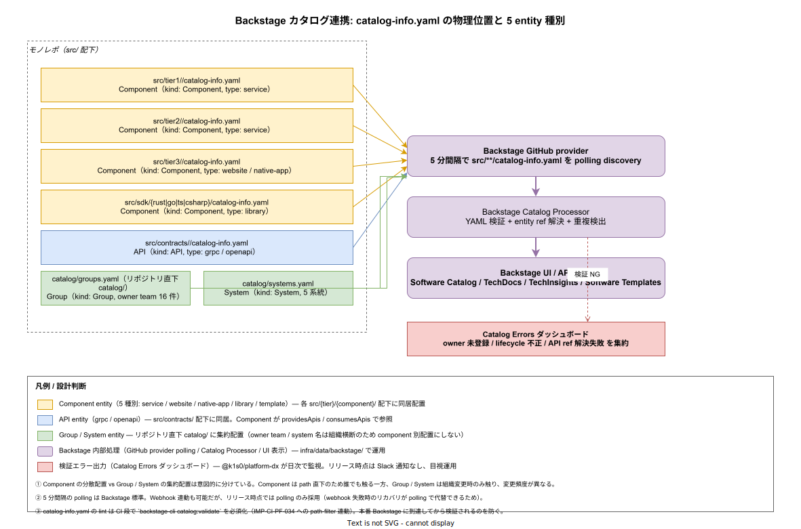

# 01. Backstage カタログ連携

本ファイルは k1s0 のサービス・API・SDK・チーム情報を Backstage Software Catalog に統合する物理連携を実装段階の確定版として固定する。catalog-info.yaml の物理位置・5 entity 種別の使い分け・GitHub provider の polling discovery・Catalog Errors の運用主体までを定義し、ADR-BS-001 の Backstage 採用を実装段階で物理化する。



## なぜ Backstage カタログを集中点にするのか

採用側で運用が拡大すると、新規参画者が「このサービスは誰が所有しているか」「どの API を消費しているか」「ドキュメントはどこか」「オンコール連絡先は」を都度 Slack で聞く運用が破綻する。Backstage は組織が育つ前から「中央 metadata 一覧」を提供し、検索 1 つで上記全ての答えを返せる状態を提供する。

k1s0 では Backstage を「ポータル」ではなく「**機械可読な metadata 真実源**」として位置付ける。Scaffold（30_Scaffold_CLI運用）は Backstage への自動登録を前提に動き、TechDocs（マークダウンの自動公開）と TechInsights（Scorecard 集計）はカタログから派生する。catalog-info.yaml の構造が崩れると Scaffold / TechDocs / TechInsights の全機能が連鎖的に壊れるため、本章では**物理位置・必須属性・検証経路**を厳格に固定する。

## entity 5 種別と物理位置

Backstage の entity モデルは多数あるが、k1s0 では以下 5 種に絞って運用する。種別過多は学習コストと typo リスクを増やすため、最小化する。

| kind | type | 物理位置 | 採番元 |
|---|---|---|---|
| `Component` | `service` | `src/tier{1,2}/<component>/catalog-info.yaml` | Scaffold が tier1 / tier2 サービス作成時に生成 |
| `Component` | `website` / `native-app` | `src/tier3/<component>/catalog-info.yaml` | Scaffold が tier3 作成時に生成 |
| `Component` | `library` | `src/sdk/{rust|go|ts|csharp}/catalog-info.yaml` | リリース時点で 4 SDK 分を手動配置（Scaffold 対象外） |
| `API` | `grpc` / `openapi` | `src/contracts/<name>/catalog-info.yaml` | buf / openapi 生成パイプライン側で同時生成 |
| `Group` / `System` | — | `catalog/groups.yaml` / `catalog/systems.yaml`（リポジトリ直下） | 組織変更時のみ手動更新 |

**Component** は path 直下に同居配置する。理由は「コンポーネントを移動すれば catalog-info.yaml も自動でついてくる」ためで、git mv 1 回でカタログ位置と物理位置が同期する。**API** は `src/contracts/` 配下に置き、複数 Component から `providesApis` / `consumesApis` で参照される。**Group / System** だけは集約配置とする。これは組織横断で参照される情報で、Component 内に分散配置すると「どの YAML を信じるか」が分裂するため。

種別を増やしたくなった場合（例: `Resource` で Postgres インスタンスを表現したい）は ADR 起票必須とする。Resource 化は monitoring との接続点を増やすトレードオフがあり、安易に増やすと運用負荷が膨れる。

## catalog-info.yaml の必須属性

Component の `catalog-info.yaml` には以下 5 属性を必須とする。Scaffold が生成し、開発者が手書きで省略することを禁じる。

```yaml
# src/tier3/portal-bff/catalog-info.yaml の例
apiVersion: backstage.io/v1alpha1
kind: Component
metadata:
  name: portal-bff
  description: Portal API の BFF layer（Token Express で trim 済み JWT を tier1 へ転送）
  annotations:
    github.com/project-slug: k1s0/k1s0
    backstage.io/techdocs-ref: dir:.
    k1s0.io/template-version: tier3-react-bff@v1.2.0
spec:
  type: website
  lifecycle: production
  owner: group:default/platform-frontend
  system: portal
  providesApis:
    - portal-bff-api
  consumesApis:
    - identity-api
    - state-api
```

| 属性 | 必須性 | 検証 |
|---|---|---|
| `metadata.name` | 必須 | `[a-z0-9-]+`、3〜63 文字、リポジトリ全体で一意 |
| `metadata.annotations.github.com/project-slug` | 必須 | `k1s0/k1s0` 固定（モノレポなので） |
| `metadata.annotations.backstage.io/techdocs-ref` | 必須 | TechDocs のソース位置。基本 `dir:.` で同階層 README を採用 |
| `metadata.annotations.k1s0.io/template-version` | 必須 | Scaffold が起動した template 名と semver、テンプレ更新時の追跡用 |
| `spec.type` | 必須 | `service` / `website` / `native-app` / `library` のいずれか |
| `spec.lifecycle` | 必須 | `experimental` / `production` のいずれか |
| `spec.owner` | 必須 | `group:default/<team>` 形式、`catalog/groups.yaml` で定義済の team のみ |
| `spec.system` | 必須 | `catalog/systems.yaml` で定義済の system のみ |
| `spec.providesApis` / `consumesApis` | 任意 | `src/contracts/` の API entity name |

`k1s0.io/template-version` annotation は k1s0 独自で、template 更新時に「どの component が古い template を使っているか」を Backstage UI で一覧表示するための鍵。template の major 更新時には `tools/devex/template-migration-report.sh` が古い annotation の component を抽出し、移行 PR の必要性を可視化する。

## Group / System の集約管理

`catalog/groups.yaml` には組織の team を、`catalog/systems.yaml` には system 単位（portal / identity / observability / supply-chain / governance の 5 系統リリース時点）を集約宣言する。

```yaml
# catalog/groups.yaml（抜粋）
apiVersion: backstage.io/v1alpha1
kind: Group
metadata:
  name: platform-build
spec:
  type: team
  profile:
    displayName: Platform / Build
    email: platform-build@k1s0.io
  parent: platform
  children: []
---
apiVersion: backstage.io/v1alpha1
kind: Group
metadata:
  name: platform-dx
spec:
  type: team
  profile:
    displayName: Platform / DX
  parent: platform
```

```yaml
# catalog/systems.yaml（抜粋）
apiVersion: backstage.io/v1alpha1
kind: System
metadata:
  name: portal
spec:
  owner: group:default/platform-frontend
  domain: domain:default/customer-facing
```

リリース時点で確定する team は 16 件、system は 5 件。これらの変更は組織変更時のみで、`@k1s0/sre` + `@k1s0/platform-dx` の dual review を CODEOWNERS で必須化する。

## GitHub provider による自動 discovery

Backstage 側に `app-config.yaml` で GitHub provider を以下構成で起動する（`infra/data/backstage/app-config.yaml`）。

```yaml
catalog:
  providers:
    github:
      providerId:
        organization: k1s0
        catalogPath: '/src/**/catalog-info.yaml'
        filters:
          branch: main
        schedule:
          frequency: { minutes: 5 }
          timeout: { minutes: 3 }
    githubOrg:
      providerId:
        target: https://github.com/k1s0
        schedule:
          frequency: { hours: 1 }
```

5 分間隔の polling は Backstage 標準。Webhook 連動も技術的には可能だが、リリース時点では polling のみ採用する。理由は「webhook の取りこぼし時に手動で reconcile を回す運用」が小規模チームでは負担になるためで、polling は 5 分以内に必ず再実行されるため自然に reconcile される。採用拡大期で Webhook を併用するかは別途 ADR 化する。

`catalog/groups.yaml` / `catalog/systems.yaml` も同じ provider が discovery する（`/src/**/` glob を `/{src,catalog}/**/` に拡張する設定が必要）。

## Catalog Processor の検証

Backstage の Catalog Processor は YAML 読込時に以下を検証する。検証 NG は Catalog Errors ダッシュボードに集約される。

- YAML schema 妥当性（Backstage Entity spec 準拠）
- entity ref 解決（`spec.owner` の group が存在するか / `consumesApis` の API が存在するか）
- entity 名重複検出（リポジトリ全体で `name` 一意）
- annotation の文字列形式（k1s0 独自 annotation を含む）

検証 NG の Component は Software Catalog UI に表示されず、TechDocs / TechInsights からも欠落する。これを「カタログから消えていることに気付くまで誰も触らない」状態にしないため、`@k1s0/platform-dx` が**日次でダッシュボードを目視確認**する運用を本章でリリース時点として固定する。Slack 通知連動は採用初期で導入する（早期に通知化すると「常時赤」状態に慣れて見過ごしを誘発するため、リリース時点では目視）。

## CI 段での pre-validation

Backstage に到達してから検証 NG が判明すると、すでに main にマージされた状態で「カタログに出ない component」が生まれる。これを防ぐため、PR の CI 段で `backstage-cli catalog:validate` を必須化する。

```yaml
# .github/workflows/_reusable-lint.yml に組込
- name: catalog-info validation
  if: needs.paths.outputs.catalog == 'true'
  run: |
    pnpm dlx @backstage/cli@$(cat tools/backstage/cli.version) \
      catalog:validate \
      --spec src/**/catalog-info.yaml \
      --spec catalog/*.yaml
```

`paths.outputs.catalog` は path-filter（IMP-CI-PF-031）で `**/catalog-info.yaml` の変更を検出。catalog 変更を含む全 PR で検証が走り、Backstage 到達前に NG を弾く。

`@backstage/cli` のバージョンは `tools/backstage/cli.version` で固定し、Renovate で追跡する（IMP-CI-RWF-017 と同方針）。Backstage 本体と CLI のバージョン乖離は entity validation の差異を生むため、本体 docker image のバージョンと cli.version は同期更新する PR を Renovate が起こす設定とする。

## TechDocs 統合

Component の `metadata.annotations.backstage.io/techdocs-ref: dir:.` annotation により、`src/{tier}/<component>/docs/` 配下の Markdown が Backstage TechDocs で自動公開される。TechDocs は MkDocs ベースで、各 component の README + `docs/` を mkdocs.yml なし（Backstage 側 default）で公開できる。

リリース時点では「README + ADR 抜粋」程度の最小構成。完全な TechDocs ナビゲーション（mkdocs.yml カスタム）は採用初期で各チームが必要に応じて追加する。

## TechInsights / Scorecards

Backstage TechInsights は entity に対するファクト（test coverage / lint warning 数 / SBOM 同梱率 / cosign 署名有無）を集計し、Scorecard 形式で表示する。リリース時点では以下 4 ファクトを実装する。

- `coverageFactRetriever`（IMP-CI-QG-066 の Cobertura XML から集計）
- `lintWarningCountFactRetriever`（IMP-CI-QG-062 の lint 結果から集計）
- `sbomPresenceFactRetriever`（80 章サプライチェーン側で生成、本章は読込のみ）
- `cosignSignatureFactRetriever`（IMP-CI-HAR-047 の Rekor 記録から確認）

これらは `infra/data/backstage/tech-insights/` 配下に factRetriever の実装と check 定義を置き、`@k1s0/platform-dx` が運用する。Scorecards 表示の閾値（例: coverage 80% 未満で赤）は `tools/backstage/scorecards.yaml` で定義し、変更は ADR 起票で。

## 障害時の挙動

Backstage 自体（`infra/data/backstage/`）が停止しても、catalog-info.yaml はリポジトリに残る。再起動後 5 分以内に discovery が再走し、状態は復元される。これは本章が「Backstage を真実源にする」のではなく「**catalog-info.yaml を真実源とし、Backstage はそれを表示する**」設計のため。Backstage DB（CloudNativePG）が壊れた場合も、catalog-info.yaml と Backstage 設定があれば再構築可能。

ただし、TechInsights のファクト履歴（時系列推移）は Backstage DB 内のため、DB 喪失で過去推移は失われる。リリース時点は許容、採用初期で MinIO バックアップに移行する（70 章リリース設計で別途規定）。

## 対応 IMP-DEV ID

- `IMP-DEV-BSN-040` : entity 5 種別固定（Component / API / Group / System）と種別追加の ADR 起票必須化
- `IMP-DEV-BSN-041` : Component の path 直下同居配置 vs Group / System の `catalog/` 集約配置の使い分け
- `IMP-DEV-BSN-042` : catalog-info.yaml の必須 5 属性と `k1s0.io/template-version` annotation
- `IMP-DEV-BSN-043` : GitHub provider 5 分 polling と webhook 不採用の判断
- `IMP-DEV-BSN-044` : CI 段の `backstage-cli catalog:validate` 必須化と pre-validation 経路
- `IMP-DEV-BSN-045` : `@backstage/cli` バージョン pin と Backstage 本体との同期更新
- `IMP-DEV-BSN-046` : Catalog Errors の `@k1s0/platform-dx` 日次目視運用（Slack 連動は採用初期）
- `IMP-DEV-BSN-047` : TechInsights 4 ファクト（coverage / lint / sbom / cosign）の実装範囲
- `IMP-DEV-BSN-048` : catalog-info.yaml を真実源とし Backstage は表示層とする復旧構造

## 対応 ADR / DS-SW-COMP / NFR

- ADR-BS-001（Backstage 採用） / ADR-CICD-001（GitHub Actions / catalog validation の CI 統合）
- DS-SW-COMP-132（platform / scaffold + Backstage） / DS-SW-COMP-135（CI/CD 配信系）
- NFR-C-NOP-002（可視性：catalog による横断 metadata 提供）
- NFR-C-MGMT-001（設定 Git 管理：catalog-info.yaml 含む全 metadata の Git 管理）
- IMP-CI-PF-031（path-filter による catalog 変更検出） / IMP-CI-RWF-017（cli.version 固定）
- IMP-CODEGEN-SCF-033（catalog-info の自動生成） / IMP-DEV-SO-034（Scaffold 生成成果物の必須要素）
