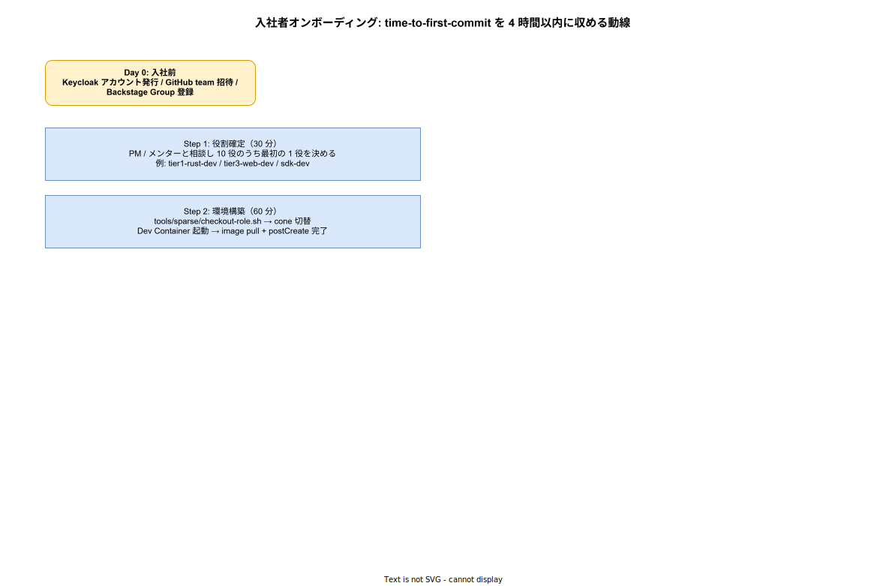

# 01. 入社者オンボーディング

本ファイルは k1s0 採用拡大期に発生する「新規参画者が初日にどこで詰まるか」を設計時点で潰し、**Day 1 4 時間以内に最初の commit を main へ merge する** 動線を実装段階の確定版として固定する。time-to-first-commit を SLI として計測することで、動線の劣化を月次で検知できるようにする。



## なぜ time-to-first-commit を SLI 化するのか

オンボーディングの良し悪しは「定性的な印象」で語られがちで、メンター個人の熱量に依存する。新規参画者が増えると、誰かには 1 日で commit させ、誰かには 1 週間かかる、という品質バラつきが顕在化する。これを設計で潰す手段として、k1s0 では Day 1 の最初の commit が main へ merge されるまでの経過時間（time-to-first-commit）を**機械可読な SLI** として計測する。

リリース時点の目標は 4 時間以内、採用拡大期で 2 時間以内。どちらも「人が頑張れば届く」境界ではなく、「動線が壊れていれば届かない」境界として設計する。SLI を満たさない事象は Backstage Scorecards に上がり、`@k1s0/platform-dx` が IMP-DEV-DC（Dev Container）/ IMP-DEV-GP（Golden Path）/ IMP-DEV-SO（Scaffold）/ IMP-DEV-BSN（Backstage 連携）のどこに帰着する詰まりかを分析する。動線の修繕は本章ではなく対応する各章へフィードバックされる。

## Day 0: 入社前の事前準備

開発者本人が触れる前に、HR / IT 部門が以下を完了させる。これらを Day 1 当日に行うと最初の 30 分が消費されるため、入社決定時点で完了するフローとする。

| 準備項目 | 担当 | 完了タイミング |
|---|---|---|
| Keycloak アカウント発行（Identity Provider） | IT 部門 | 入社前日まで |
| GitHub Organization 招待（k1s0 org） | `@k1s0/platform-dx` | 入社前日まで |
| Backstage Group 登録（`catalog/groups.yaml` への追加 PR） | メンター | 入社前々日まで（PR merge 後 polling 5 分で反映） |
| 物理 / VPN 環境（PC / 開発拠点アクセス） | HR | 入社前日まで |

`catalog/groups.yaml` への追加は組織変更扱いで `@k1s0/sre` + `@k1s0/platform-dx` の dual review が必要なため、**入社前々日までに PR を起こす**ことを徹底する。Day 1 開始時点で Backstage 上に group の member として表示されている状態を作る。

## Day 1: time-to-first-commit を 4 時間以内に収める 4 ステップ

Day 1 の SLI 計測対象期間は「Step 1 開始時刻 〜 Step 4 で起こした PR が main に merge された時刻」とする。各 step は時間予算を持ち、合計で 4 時間を超えないように設計する（移動 / 雑談 / トイレ等のバッファとして 30 分が残る想定）。

### Step 1: 役割確定（30 分）

新規参画者は採用 ID（10 役）のうち最初の 1 役を確定する。決定は PM / メンターとの 30 分会議で行い、決定基準は以下:

- 直近 3 ヶ月で最も人手が必要な役割（`@k1s0/sre` が四半期計画から判断）
- 本人のスキル背景（Rust / Go / TS / C# / その他）
- 採用時の job description との整合

10 役は `tier1-rust-dev` / `tier2-go-dev` / `tier3-web-dev` / `tier3-mobile-dev` / `sdk-dev` / `infra-platform-eng` / `platform-build-eng` / `release-cd-eng` / `release-rl-eng` / `sre-on-call`（採用拡大期で増減あり）。役割は IMP-DEV-DC-011 の Dev Container と IMP-DEV-DC-013 の sparse-checkout cone と一対一対応する。

### Step 2: 環境構築（60 分）

`tools/sparse/checkout-role.sh <role>` を実行すると、対応する cone への切替と Dev Container の起動が連鎖する。所要時間 60 分の内訳は:

- cone 切替（`<role>` 配下のみチェックアウト）: 1 分
- Dev Container image pull（amd64 / arm64 マルチアーキ、約 2 GB）: 30 〜 50 分
- postCreate script（pre-commit / mise / make seed の初回実行）: 5 〜 10 分

image pull がボトルネックのため、初日に持参 PC が回線細い場合は社内 cache mirror（IMP-DEV-DC-015）を使う案内を Step 1 終了時にメンターから出す。pull 時間が 50 分を超えた場合は cache mirror 経由に切替える運用を Day 1 の動線に組込む。

### Step 3: examples/ で Hello World（45 分）

`src/examples/` 配下に役割別の `goldenpath/<role>-hello.md` を用意し、新規参画者は 5 step を完走することで「k1s0 のローカル開発体験」を一通り体験する。例として `tier1-rust-dev-hello.md` の構造:

```markdown
# tier1-rust-dev: 5 分で動かす Hello

1. `make up` で Dapr Local + Postgres + Redis を起動
2. `cargo run -p hello-tier1` で hello サービス起動
3. `curl localhost:8080/hello` で JSON 応答確認
4. `cargo test -p hello-tier1` でテスト 1 件 pass 確認
5. `make down` で停止確認
```

5 step すべてが make 1 コマンドで完了することを Step 3 完走の定義とする。コマンドが分岐したり条件付き README を読ませたりする設計は本章で禁ずる。**5 step の手順が崩れた時点で IMP-DEV-GP-022 のメンテナンス義務違反**として扱い、メンターは即時 PR を起こす（自走前の参画者にバグ修正させない）。

### Step 4: 微小 PR 作成（30 分）

新規参画者は最初の commit として「微小 PR」を起こす。微小 PR の典型例:

- typo 修正（README / docs / コメント）
- `catalog/groups.yaml` の自分の Group entry に display name 追加
- `src/{tier}/<component>/catalog-info.yaml` の owner annotation に自分の username を追加
- `src/examples/goldenpath/` の手順説明微修正

微小 PR の意図は「最初の merge を儀式化する」ことで、機能変更ではない。CI（ci-overall）が通過することを体験し、reviewer 自動指名（CODEOWNERS）が機能することを体験し、merge できる権限が自分にあることを体験する。merge 後 5 分以内に Backstage UI の component 詳細に自分の名前が表示されることを確認して Day 1 完了。

## SLI 計測終端: time-to-first-commit

Day 1 の 4 step が完走し、Step 4 の PR が main に merge された時刻が SLI 計測の終端。Step 1 の開始時刻（Backstage Scaffold で「first-commit 計測開始」flag を立てるか、メンターが Slack の `/onboarding-start` slash command で開始 timestamp を記録）から終端までの所要時間が time-to-first-commit。

リリース時点では SLI を**計測のみ**で、目標未達でアラートは発火させない。理由は採用初期はサンプル数が少なく、4 時間目標の妥当性検証が必要なため。サンプルが 10 件を超えた段階で `@k1s0/platform-dx` が分布を分析し、4 時間目標 / 2 時間目標 / 異常閾値を Backstage Scorecards に固定する（採用初期の課題、本章では計測動線のみ確定）。

計測経路は `infra/data/backstage/tech-insights/factRetrievers/onboardingTimeFactRetriever.ts` で実装し、PR の `body` 内に `Onboarding-Start: <timestamp>` フッタが含まれる場合に SLI 計測対象とする。フッタは Scaffold が自動付与する（IMP-DEV-SO-035 の生成成果物に組込）。

## Week 1: 学習リスト（自走前の知識装着）

Day 1 完了後、Week 1 で k1s0 の思想を装着する。学習リストは役割共通で以下:

- ADR-DIR-001（contracts 昇格） / ADR-DIR-003（sparse-checkout 必須）の 2 ADR を読破
- ADR-TIER1-001（Go / Rust ハイブリッド）で言語選定の根拠を理解
- `docs/INDEX.md` の階層から `90_knowledge/` 配下を 1 周（90 分目安）

学習リストは Backstage Scorecards で Component に「onboarding-week1-completion」check として登録され、メンターが完了を承認する。承認は Backstage UI から行い、自己申告での pass は禁ずる。これは「読まなくても進める」ループで思想理解が抜けることを防ぐため。

## Week 2 〜 4: 実 task 着手と役割追加

### Week 2

Backstage で `good-first-issue` label が付いた issue から 1 件を選び、メンター 1on1 で順序を決めて着手する。同時に Scaffold で新規 component（捨てる前提の sandbox）を作成し、生成手順を実 task ではない場面で習熟する。

### Week 3 〜 4

必要に応じて別役割の cone を追加する。例として tier1-rust-dev に sdk-dev を併用するケースで `tools/sparse/list-cones.sh` で複数 cone を同時保持する運用を体験する。これは `IMP-DEV-DC-014` の sparse-checkout cone 併用前提を実地で確認する step。

## Month 1 終端: 自走判定

入社 1 ヶ月後、メンターは以下 4 軸で自走判定を行う:

| 軸 | 評価基準 | 閾値 |
|---|---|---|
| PR 量 | merge された PR 件数（微小 PR を除く） | 5 件以上 / 月 |
| レビュー受領 | review request に対する 24h 内応答率 | 80 % 以上 |
| Slack 質問 | `#k1s0-help` での質問解決ループ参加 | 質問 / 回答が両方発生していること |
| オンコール参加（任意） | shadow on-call 参加経験 | 採用拡大期で必須化 |

判定結果は HR 1on1 で共有し、未達の軸が 2 つ以上あれば追加サポートを設計する（メンター変更 / 役割変更 / training 追加）。判定は責めるためではなく、**動線を疑う**ためのトリガとして使う。連続して未達者が出る場合は Step 1〜4 のどこに詰まりがあるかをメンター集会で議論する。

## ドキュメント / 動線の自己更新サイクル

Day 1 〜 Month 1 のいずれかで詰まった事象は GitHub issue に「`onboarding-stumble`」label を付けて記録する。月次で `@k1s0/platform-dx` が label 付き issue を集計し、修繕 PR を起こす。修繕は以下に帰着する:

- Dev Container / cone 関連の詰まり → IMP-DEV-DC-* の改訂
- examples / Hello World の詰まり → IMP-DEV-GP-022 のメンテナンス
- Scaffold 出力の詰まり → IMP-DEV-SO-* の改訂
- Backstage 表示 / 検索の詰まり → IMP-DEV-BSN-* の改訂
- オンボーディング動線そのものの詰まり → IMP-DEV-ONB-* の改訂（本章）

動線の修繕は「個人の成長機会を奪う」という反論があるが、k1s0 では**動線改善は新規参画者の業務に含まれる**と位置付ける。詰まった本人が修繕 PR を起こす（メンターが伴走）ことで、本人の k1s0 理解が深まり、後続の参画者の体験が改善するという 2 重の効果を持つ。

## ローカルクラスタの SoT 運用（ADR-POL-002）

採用初期から「ローカル開発で何かを試したい時はどうやるか」が個別判断に委ねられると、`tools/local-stack/up.sh` が想定する canonical 構成から逸脱した手動 `helm install` / `kubectl apply` が堆積し、再構築のたびに「動かない / 何が違うのか分からない」という事故を生む（リリース前の P4 で実証済み: 31 helm release のうち 9 種類の構造的 drift が発覚し再構築に 1.5〜2.5 時間を要した）。本セクションは [ADR-POL-002](../../../02_構想設計/adr/ADR-POL-002-local-stack-single-source-of-truth.md) で確立した SoT 運用ルールを、新規参画者が Day 1 〜 Week 1 の段階で内面化するための行動ガイドである。

### ephemeral namespace（探索の自由は確保される）

開発者個人の探索的な `helm install` / `kubectl apply` は禁止されない。ただし対象 namespace を以下のいずれかに限定する。

- `tmp-<任意>`: 一時的な検証で、その日のうちに消すもの
- `dev-<username>-<目的>`: 数日〜数週単位の個人実験で、本人が責任をもって掃除するもの

これらの namespace は ADR-POL-002 の Kyverno policy `block-non-canonical-helm-releases` で**検査対象から除外**されており、canonical 集合外の release も自由に install できる。

```bash
# 一時実験の典型ワークフロー
NS="tmp-$(date +%s)"
kubectl create namespace "${NS}"
helm install foo bitnami/foo -n "${NS}"

# 終わったら必ず破棄
kubectl delete namespace "${NS}"
```

PR コミット前に `tmp-*` / `dev-*` namespace が cluster に残っていると CI の drift-check が fail する想定（リリース後のフェーズで実装）。再構築（`down.sh` → `up.sh`）の度にも消える。

### 新規 argocd Application を起票する手順

新しい tier1 / tier2 / tier3 サービス、または ops 系ツールを GitOps で配信したい場合は、helm install ではなく argocd Application（または ApplicationSet）として起票する。手動 helm install は drift 検知で deny されるため通らない（`--mode strict` の場合）。

1. **chart を `deploy/charts/<chart-name>/` に配置**: 既存の `tier2-go-service` / `tier3-bff` 等を雛形にする。
2. **環境別 values overlay を `deploy/kustomize/overlays/{dev,staging,prod}/<chart-name>-values.yaml` に配置**: 既存の `tier1-facade-values.yaml` を雛形にする。
3. **ApplicationSet を `deploy/apps/application-sets/<name>.yaml` に追加**: list-generator + template の標準パターンで dev/staging/prod を自動生成する。`deploy/apps/application-sets/tier1-facade.yaml` が雛形。
4. **AppProject を `deploy/apps/projects/k1s0-<tier>.yaml` に追加（既存系列で済むなら不要）**: 新 namespace を許可する場合のみ。
5. **PR 作成 → main にマージ → up.sh apply_argocd 内 bootstrap_gitea_content が gitea にコミットを push し、`apply_argocd_appsets` が ApplicationSet を kubectl apply する**: 数分で argocd UI（NodePort 30080）に Application が出現し sync 開始する。

逸脱を検知する CI は `.github/workflows/drift-check.yml` の sync-check job で、`tools/local-stack/known-releases.sh` の出力と Kyverno policy allow-list の diff を毎 PR で機械検証する。`up.sh apply_*` 関数を増やした PR では同 PR で Kyverno allow-list も更新する規律（PR テンプレに checkbox がある）を守ること。

### 詰まりの記録

ephemeral namespace の使い方や argocd Application 起票で詰まった事象は、本章末尾の `onboarding-stumble` label による記録対象に含める（`IMP-DEV-ONB-059`）。詰まりが頻発する場合、本セクションの説明粒度や Scaffold CLI の Template に問題がある可能性が高い。

## 対応 IMP-DEV ID

- `IMP-DEV-ONB-050` : time-to-first-commit を SLI 化し、Day 1 4 時間以内（採用拡大期 2 時間以内）を目標に固定
- `IMP-DEV-ONB-051` : Day 0 の HR / IT / メンター責務分担と入社前々日までの Backstage Group 登録 PR
- `IMP-DEV-ONB-052` : Day 1 4 step（役割確定 / 環境構築 / Hello World / 微小 PR）と各 step の時間予算
- `IMP-DEV-ONB-053` : Step 3 の `goldenpath/<role>-hello.md` 5 step 完走の絶対要件と崩壊時のメンター修繕義務
- `IMP-DEV-ONB-054` : 微小 PR を「最初の merge を儀式化する」設計とその範囲（typo / catalog-info / docs）
- `IMP-DEV-ONB-055` : SLI 計測経路（onboardingTimeFactRetriever / Scaffold 自動フッタ付与）と計測のみのリリース運用
- `IMP-DEV-ONB-056` : Week 1 の学習リスト（ADR-DIR-001/003 / ADR-TIER1-001 / 90_knowledge）と Scorecards 連動
- `IMP-DEV-ONB-057` : Week 2 〜 4 の実 task 着手と複数 cone 併用の段階導入
- `IMP-DEV-ONB-058` : Month 1 自走判定の 4 軸（PR 量 / レビュー受領 / Slack / オンコール）と判定後 HR 1on1
- `IMP-DEV-ONB-059` : `onboarding-stumble` label による動線詰まり記録と月次 PR による帰着先（DC / GP / SO / BSN / ONB）

## 対応 ADR / DS-SW-COMP / NFR

- ADR-DEV-001（開発者体験パッケージ） / ADR-DIR-003（sparse-checkout 必須） / ADR-TIER1-001（Go / Rust ハイブリッド）
- DS-SW-COMP-132（platform / DX 系コンポーネント）
- NFR-C-NOP-001（学習容易性：オンボーディング Day 1 4 時間以内）
- NFR-C-NOP-002（可視性：SLI による動線品質の機械可読化）
- NFR-C-MGMT-002（変更容易性：動線詰まりを月次で帰着先へフィードバック）
- IMP-DEV-DC-011 〜 015（Dev Container / cone） / IMP-DEV-GP-020 〜 026（Golden Path / examples）
- IMP-DEV-SO-030 〜 037（Scaffold / 計測フッタ自動付与） / IMP-DEV-BSN-040 〜 048（Backstage / Scorecards）
