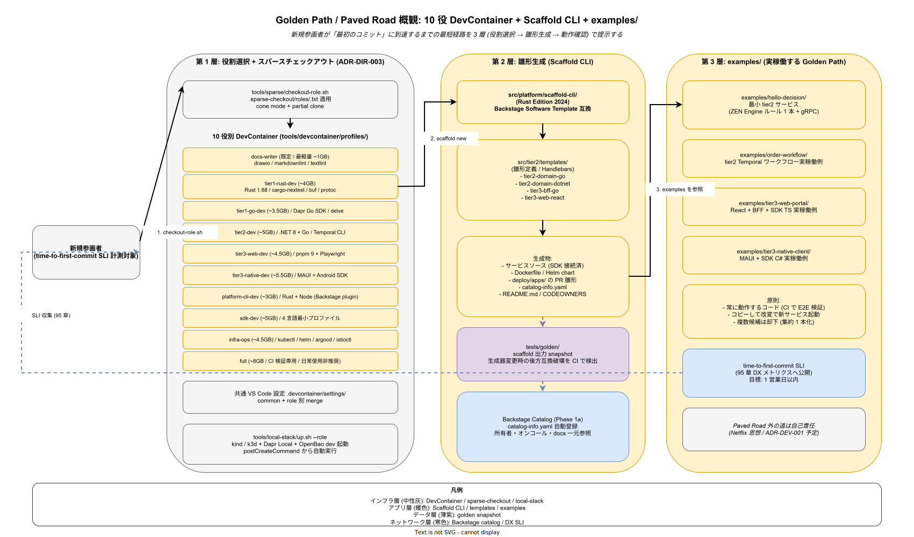

# 50. 開発者体験設計

本章は k1s0 の開発者体験（DX）を実装段階確定版として固定する。役割別 Dev Container、Golden Path（`examples/` の実稼働例）、Scaffold CLI、ADR-BS-001 で選定した Backstage カタログ連携、ADR-FM-001 で選定した flagd の開発者面を統合的に規定し、新規参画者が最初のコミットに到達するまでの時間（time-to-first-commit）を SLI として管理する。

## 本章の位置付け

2 名 → 10 名への拡大段階において、最大のボトルネックは初期立ち上げコストとなる。Netflix の Paved Road 思想に従い、正しい道を最短経路として提示し、外れた道は自己責任とする運用を採用する。`examples/` は「動作する実稼働版」を原則とし、コピーして改変することで新サービスを立ち上げられる状態を維持する。Golden Path の集約は `examples/` に一本化する（複数候補は却下）。

catalog-info.yaml は Backstage 連携の first-class 属性として扱い、Scaffold CLI が自動生成する。これにより、作成されたサービスが自動的に Backstage カタログに登場し、所有者・ドキュメント・オンコール連絡先が一元参照可能となる。`docs/03_要件定義/50_開発者体験/` の DevEx 指標（DORA Four Keys 等）との分担は、本章が実装手段の配置を担い、計測面は `95_DXメトリクス/` に委譲する。



## OSS リリース時点での確定範囲

- リリース時点: 10 役別 Dev Container、`examples/` の tier2 / tier3 実稼働版、Scaffold CLI 最小実装、time-to-first-commit SLI の計測基盤
- リリース時点: Backstage catalog-info.yaml 自動生成、IDE 設定の共有（.vscode / .idea）
- リリース時点: 入社者オンボーディングランブック

## RACI

| 役割 | 責務 |
|---|---|
| DX（主担当 / C） | Dev Container プロファイル、Golden Path 整備、Scaffold 利用率 |
| Platform/Build（共担当 / A） | Dev Container のイメージビルド・配布 |
| SRE（共担当 / B） | time-to-first-commit SLI、Backstage カタログ稼働 |
| Security（共担当 / D） | Dev Container 内のシークレット取扱い、Scaffold の承認ゲート |

## 節構成予定

```
50_開発者体験設計/
├── README.md
├── 00_方針/                # Paved Road と time-to-first-commit
├── 10_DevContainer_10役/
├── 20_Golden_Path_examples/
├── 30_Scaffold_CLI運用/
├── 40_Backstage連携/       # catalog-info.yaml
├── 50_オンボーディング/
└── 90_対応IMP-DEV索引/
```

## IMP ID 予約

本章で採番する実装 ID は `IMP-DEV-*`（予約範囲: IMP-DEV-001 〜 IMP-DEV-099）。

## 対応 ADR / 概要設計 ID / NFR

- ADR: [ADR-BS-001](../../02_構想設計/adr/ADR-BS-001-backstage.md)（Backstage）/ [ADR-FM-001](../../02_構想設計/adr/ADR-FM-001-flagd-openfeature.md)（flagd / OpenFeature）/ 本章初版策定時に ADR-DEV-001（Paved Road 思想）を起票予定
- DS-SW-COMP: DS-SW-COMP-132（platform / scaffold）
- NFR: NFR-C-SUP-001（SRE 体制）/ NFR-C-NOP-004（運用監視）/ `03_要件定義/50_開発者体験/` 章全般

## 関連章

- `20_コード生成設計/` — Scaffold CLI 本体
- `95_DXメトリクス/` — time-to-first-commit SLI の公開先
- `99_索引/` — Backstage カタログとの ID 対応
