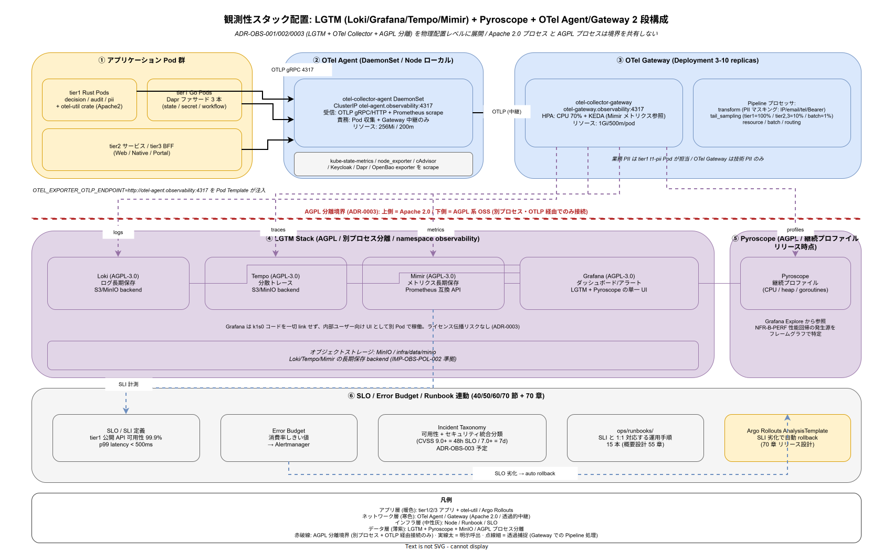

# 01. 観測性原則

本ファイルは k1s0 の観測性設計を判断する際に常に参照する 7 軸の原則を定義する。SLO/SLI の新規定義、Runbook の追加、Incident Taxonomy の改訂、OTel Collector の Pipeline 変更、LGTM Stack の構成変更など、観測性領域で発生する全ての設計判断は本原則との整合をレビューで確認する。



## 原則が必要な理由

観測性設計は「収集できるデータをとりあえず集める」運用に流れやすく、統制を失うと 採用側組織の 10 年保守段階で破綻する。放置した場合の典型的な破綻は以下として顕在化する。

- アプリから直接 Prometheus に push するコードと OTel Collector 経由のコードが混在し、ラベル規約が分岐して PromQL がサービスごとに書き分けになる
- AGPL-3.0 の Grafana / Loki / Tempo を tier1 バイナリに静的リンクし、ユーザー提供バイナリの AGPL ライセンス義務が発生して商用配布が破綻する（ADR-0003 違反）
- SLO を「可用性系の人」と「セキュリティ系の人」で別々に引き、CVSS 9.0+ の未パッチ脆弱性と SLA 99% が両方 green なのに実害が発生する盲点が生まれる
- エラーバジェットが枯渇した月にも feature リリースが続き、翌月の障害で信頼を失う
- Runbook が SLI と紐付かず、夜間オンコールが「何の SLI が燃えて起こされたか」を理解せずに対応を試みる
- DORA 4 keys（生産性側の指標）と稼働 SLI（品質側の指標）が同じダッシュボードに並び、片方の劣化を打ち消すために他方を過剰チューニングする誘惑が生まれる
- Prometheus / Grafana / Loki / Tempo を個別に SLA 保証するような「縦割り運用」が生まれ、テレメトリ統合基盤としての責務が空中分解する

本原則は、これらの破綻を「計測・評価・対応」の各層で構造的に防止する 7 軸である。Google SRE Book の用語体系を採用し、採用側組織特有のセキュリティ統合を Incident Taxonomy の統合分類として反映することが本章の核となる。

## 原則 1: 全テレメトリは OTel Collector 経由で集約する（IMP-OBS-POL-001）

**metrics / logs / traces / profiles はすべて OpenTelemetry Collector 経由で集約し、アプリから直接バックエンドへ push することを禁止する。**

ADR-OBS-002 で OTel Collector を採択した目的は、バックエンド（Prometheus / Loki / Tempo / Pyroscope）からアプリを分離し、将来のバックエンド変更や multi-tenancy 導入をアプリ側の改修なしに実現することである。アプリが Prometheus に直接 push する経路を許すと、この分離が崩れ、OTLP 標準化の利益が失われる。

- アプリ SDK は OTLP エクスポーター固定。Prometheus exporter の直接埋め込みは禁止
- OTel Collector は namespace ごとに agent（DaemonSet）を置き、集約層（Deployment）へ転送する二層構成
- ラベル・リソース属性は OTel Semantic Conventions に準拠し、独自拡張は ADR で正当化する
- サードパーティ OSS（sidecar 等）の直接 Prometheus exporter は Collector の `prometheusreceiver` で OTLP 変換して取り込む
- Collector の Pipeline 変更は ADR ではなく `infra/observability/otel/` 配下の PR レビューで管理し、Pipeline 単位でカナリアリリースする

## 原則 2: LGTM Stack は AGPL 分離を維持する（IMP-OBS-POL-002）

**Grafana / Loki / Tempo / Mimir / Pyroscope は別プロセスとして分離し、公開プロトコル（HTTP / OTLP）経由でのみ接続する。tier1 バイナリに静的リンクすることを禁止する。**

[ADR-0003](../../../02_構想設計/adr/ADR-0003-agpl-isolation-architecture.md) で確定した通り、AGPL-3.0 ライセンスのコンポーネントを tier1 バイナリにリンクすると、配布する tier1 バイナリ全体に AGPL 義務が波及する。本原則はこれを「プロセス境界＋公開プロトコル」で分離する運用として固定する。

- LGTM Stack は専用 namespace（`observability`）に隔離し、tier1 と直接プロセスを共有しない
- tier1 から LGTM への通信は OTLP / HTTP の公開プロトコルのみとし、Go / Rust のライブラリリンクは禁止
- Grafana プラグインの追加は AGPL 継承性を Security チームが審査してから許可
- 監査エビデンスとして「分離を示す Helm values と namespace 境界」を `ops/dr/agpl-isolation-evidence/` に保管する
- 分離崩れを検知した場合は Incident として扱い、観測性停止（Grafana 閲覧不可）を許容してでも分離回復を優先

## 原則 3: SLO / SLI は Google SRE Book に準拠する（IMP-OBS-POL-003）

**SLO / SLI / エラーバジェットの定義・運用は Google SRE Book の用語体系に準拠し、独自方式を禁止する。**

「可用性 99% と応答時間 p99 500ms」を独自用語で運用すると、書籍・OSS・採用候補者の知識と橋渡しができず、運用知が組織内に閉じる。本原則は SLI を「good events / total events」の比率で定義し、SLO は期間ごとのターゲット値、エラーバジェットは 100% - SLO として計算する Google SRE Book の定式をそのまま採用する。

- SLI / SLO 定義は YAML で `infra/observability/slo/` 配下に集約し、PR レビューで命名規約を揃える
- 計測窓は rolling 28 日を既定。四半期集計は別途 30/90 日の二次窓で算出
- Burn Rate Alert（fast: 1h / 5% budget、slow: 6h / 10% budget）を標準アラート構成とする
- SLI 命名は `<service>.<api>.<slo-type>`（例: `tier1.rule-eval.availability`）の 3 階層を必須

## 原則 4: Incident Taxonomy は可用性＋セキュリティを統合する（IMP-OBS-POL-004）

**Incident Taxonomy は可用性系インシデントとセキュリティ系インシデントを同一分類体系で扱い、別々の台帳で管理することを禁止する。**

可用性担当とセキュリティ担当で台帳を分けると、「どちらの SLO も green だが CVSS 9.0+ の未パッチ脆弱性が 2 週間放置された」ような盲点が生まれる。k1s0 はこれを ADR-OBS-003（本章初版策定時に起票予定）で統合分類として固定し、CVSS 連動の SLO をエラーバジェットと同じ運用にのせる。

- CVSS 9.0+ は 48 時間 SLO（業界平均 72 時間を参考に短縮）
- CVSS 7.0+ は 7 日 SLO
- 可用性系 P1 / セキュリティ系 P1 は同一の On-Call 体制でトリアージし、分類コードで集計
- 月次インシデントレビューで両系統を合算し、Error Budget の「事実上の消費」として可視化
- 分類コードは `INC-<domain>-<severity>-<seq>` の形式で採番し、可用性・セキュリティ・データ完整性を共通の名前空間で管理

## 原則 5: Error Budget は月次で確認し、100% 消費で feature 凍結する（IMP-OBS-POL-005）

**Error Budget は月次燃焼率を必ず確認し、100% を消費した月は翌月の feature リリースを凍結して復旧作業へ振る。**

エラーバジェット運用の肝は「消費しきった時に本当に feature を止める」合意である。止めない運用は単なる指標遊びであり、10 年保守の信頼残高を失う。本原則はエラーバジェット消費 100% 時の凍結を SRE + 事業責任者で事前合意として文書化し、特例は事業責任者の署名を要する形でのみ許可する。

- 凍結中は feature PR を CI で拒否する（例外は security fix / rollback / 運用 toil 削減 PR）
- 凍結解除は SLI が SLO 目標値まで回復し、回復が 2 週間以上維持された時点
- 月次レビューは SRE と事業責任者の共同主催とし、記録を `ops/runbooks/monthly/error-budget-review/` に保管
- Burn Rate が fast（1h/5% budget）を超えた時点で PagerDuty 起動、slow（6h/10% budget）は翌営業日レビュー

## 原則 6: Runbook は SLI に対応付けて維持する（IMP-OBS-POL-006）

**全ての Runbook は対応する SLI / アラート ID を明記し、SLI と紐付かない Runbook の新設を禁止する。**

`04_概要設計/55_運用ライフサイクル方式設計/` で 15 本の Runbook 目録が確定している。本原則は各 Runbook の冒頭に「対象 SLI / 対象アラート / エラーバジェット影響 / 復旧目標時間」を必ず記載し、オンコール担当が夜間起床時に「何が燃えているのか」を 30 秒で把握できる構造を維持する。

- Runbook は `ops/runbooks/incidents/<SLI-ID>/` 配下に SLI ごとに配置
- アラート定義（Prometheus Rule / Grafana Alert）には `runbook_url` アノテーションを必須
- Runbook 実行後はふりかえりを Post-mortem に追記し、Runbook 側も改訂する（CI 修正の PR と同じサイクル）
- Runbook の冒頭 30 秒で読める「TL;DR」を必須とし、詳細手順は 2 段目以降に配置

## 原則 7: DORA 4 keys は本章から分離する（IMP-OBS-POL-007）

**DORA 4 keys（Lead Time / Deploy Frequency / MTTR / Change Failure Rate）は `95_DXメトリクス/` に配置し、稼働 SLI と同一ダッシュボードに並べることを禁止する。**

DORA 4 keys は開発者生産性側の指標であり、稼働品質側の SLI とは改善アクターも対応時間スケールも異なる。同一ダッシュボードに並べると「MTTR を下げるために Change Failure Rate を犠牲にする」のような誤った最適化を誘発する。本章では DORA 4 keys を計測対象として扱わず、`95_DXメトリクス/` に委譲する。

- 本章のダッシュボードは SLO / SLI / エラーバジェット / アラート密度のみ
- DORA 4 keys のダッシュボードは `95_DXメトリクス/` が運用し、DX チームがオーナー
- 両者の接点は MTTR のみ（SRE が稼働側 MTTR を一次情報として提供し、DX 側が取り込む）
- 役員向けレポートでは両者を「稼働品質」「開発者生産性」の別章として分離し、指標の混同を避ける

## 図表

```
[観測性 7 原則の関係]
   1. OTel Collector 集約 ──> 2. LGTM AGPL 分離
                                │
                                v
   3. Google SRE 準拠 SLO/SLI ──> 5. Error Budget 月次 / 凍結
                                │
                                +──> 4. Incident Taxonomy 統合（CVSS）
                                │
                                +──> 6. Runbook ↔ SLI 紐付（15 本）
   7. DORA 4 keys は 95 章へ分離（混在禁止）
```

詳細なテレメトリ経路は [img/観測性7原則マップ.drawio](../img/60_LGTM_Pyroscope_OTel配置.drawio)（drawio 編集時に svg 出力）を参照。

## 対応 IMP-OBS ID

本ファイルで採番する原則レベル ID は以下とする。

- `IMP-OBS-POL-001` : OTel Collector 経由でのテレメトリ集約
- `IMP-OBS-POL-002` : LGTM Stack の AGPL 分離維持
- `IMP-OBS-POL-003` : Google SRE Book 準拠 SLO / SLI
- `IMP-OBS-POL-004` : Incident Taxonomy を可用性＋セキュリティ統合
- `IMP-OBS-POL-005` : Error Budget 月次確認と 100% 消費時の feature 凍結
- `IMP-OBS-POL-006` : Runbook と SLI の紐付け必須
- `IMP-OBS-POL-007` : DORA 4 keys は 95 章へ分離

## 対応 ADR / DS-SW-COMP / NFR

- ADR: [ADR-OBS-001](../../../02_構想設計/adr/ADR-OBS-001-grafana-lgtm.md)（Grafana LGTM） / [ADR-OBS-002](../../../02_構想設計/adr/ADR-OBS-002-otel-collector.md)（OTel Collector） / [ADR-0003](../../../02_構想設計/adr/ADR-0003-agpl-isolation-architecture.md)（AGPL 分離） / ADR-OBS-003（Incident Taxonomy 統合、本章初版策定時に起票予定）
- DS-SW-COMP: DS-SW-COMP-124（観測性サイドカー統合）
- NFR: NFR-A-CONT-001（SLA 99%） / NFR-I-SLO-001（内部 SLO 99.9%） / NFR-I-SLI-001（Availability SLI 定義） / NFR-B-PERF-001（p99 < 500ms） / NFR-C-NOP-001（監視スタック） / NFR-E-MON-001（特権監査）
- 概要設計: [docs/04_概要設計/55_運用ライフサイクル方式設計/](../../../04_概要設計/55_運用ライフサイクル方式設計/)（Runbook 目録 15 本）

## 関連章との境界

- [`70_リリース設計/`](../../70_リリース設計/) の AnalysisTemplate は本章の SLI を参照し、自動 rollback の判定根拠とする
- [`80_サプライチェーン設計/`](../../80_サプライチェーン設計/) の AGPL 分離原則（IMP-SUP-POL-007）と本章の IMP-OBS-POL-002 は一対一対応
- [`85_Identity設計/`](../../85_Identity設計/) の認証系 SLI は本章 SLI 命名規約に従う
- [`95_DXメトリクス/`](../../95_DXメトリクス/) は DORA 4 keys を扱い、本章の稼働 SLI と明確に分離する
